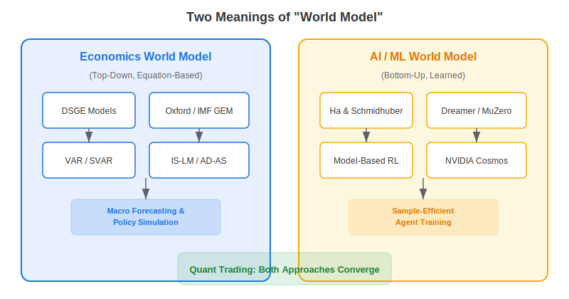
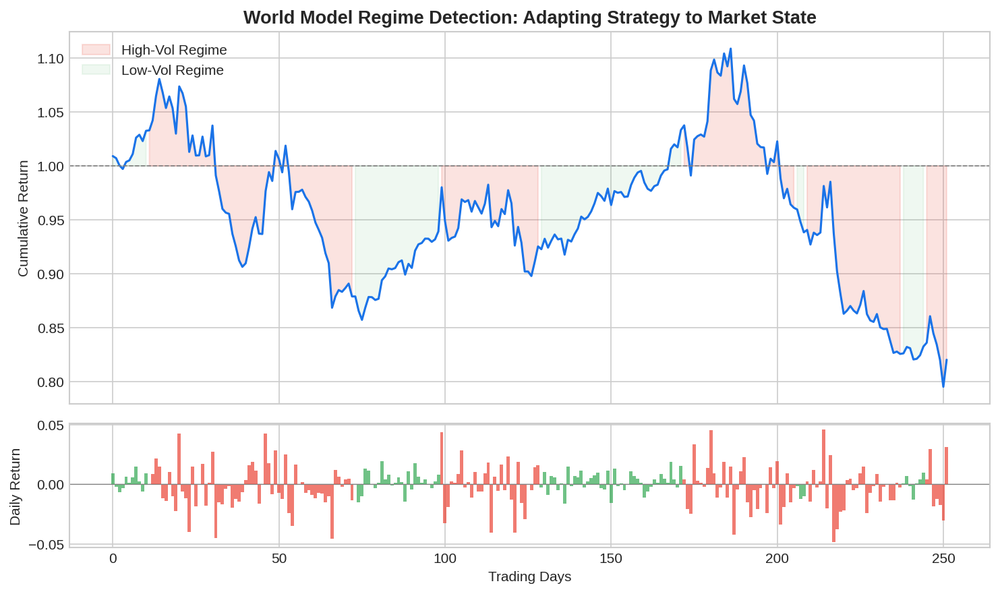

The term **world model** carries two distinct but increasingly converging meanings. In economics, a world model is a large-scale system of equations that simulates the global economy — GDP, inflation, trade flows, interest rates — to forecast outcomes and test policy scenarios. In artificial intelligence, a world model is a learned internal representation of an environment that allows an agent to predict what happens next and plan ahead. For algorithmic traders, both definitions matter: macro world models drive regime detection and factor timing, while AI world models power the next generation of model-based reinforcement learning agents.

## World Models in Economics

An economic world model is a mathematical framework that represents the interactions between countries, sectors, consumers, and governments. The goal is to capture enough causal structure to answer "what if" questions: What happens to European equities if the Fed raises rates by 100 bps? How does a commodity shock propagate through emerging markets?

The most widely used frameworks include:

- **DSGE (Dynamic Stochastic General Equilibrium)** models, used by central banks like the Fed and ECB. These derive macroeconomic dynamics from microeconomic optimization under uncertainty.
- **The IMF's Global Economy Model (GEM)**, a multi-country general equilibrium framework linking trade, capital flows, and monetary policy across dozens of economies.
- **Oxford Economics' Global Economic Model**, covering 87 countries with linked equations for trade volumes, exchange rates, and commodity prices.
- **Structural VAR models**, which use statistical relationships between macro variables to identify causal shocks.

These models share a common architecture: define agents (households, firms, governments), specify their decision rules, link them through markets, and solve for equilibrium. The [IS-LM framework](https://paperswithbacktest.com/wiki/is-lm-model-curves-characteristics-limitations) is the simplest example — two equations linking the goods market and money market.

$$Y = C(Y - T) + I(r) + G \quad \text{(IS curve)}$$
$$\frac{M}{P} = L(r, Y) \quad \text{(LM curve)}$$

Modern world models scale this idea to hundreds of equations with stochastic shocks, rational expectations, and international linkages.



## World Models in Artificial Intelligence

In AI and machine learning, a world model is fundamentally different. Rather than being hand-specified by economists, it is **learned from data**. The seminal paper by Ha and Schmidhuber (2018) formalized the idea: an agent builds an internal neural network model of its environment and uses it to "dream" — simulating possible futures without interacting with the real world.

A world model in AI is a function:

$$\hat{s}_{t+1} = f_\theta(s_t, a_t)$$

where $s_t$ is the current state, $a_t$ is the action, and $f_\theta$ is a neural network that predicts the next state $\hat{s}_{t+1}$. The agent can then **plan** by rolling out this model forward, evaluating many possible action sequences in imagination rather than through costly real-world interaction.

Key milestones in AI world models include:

| Year | Model | Contribution |
|------|-------|-------------|
| 1991 | Dyna (Sutton) | First model-based RL combining learning and planning |
| 2018 | World Models (Ha & Schmidhuber) | VAE + RNN architecture; training agents inside dreams |
| 2020 | Dreamer (Hafner et al.) | Latent-space world model achieving state-of-the-art on continuous control |
| 2020 | MuZero (DeepMind) | Learned world model that mastered Go, Chess, and Atari without knowing the rules |
| 2024 | NVIDIA Cosmos | World foundation model for physical AI and robotics |

## How Quant Traders Use World Models

For algorithmic trading, the two traditions converge. A quant trader's "world model" is any internal representation of market dynamics used to make predictions and decisions. In practice, this takes several forms:

**Macro regime detection**: Traders fit Hidden Markov Models or regime-switching models to identify whether the market is in a "risk-on" or "risk-off" state, then adjust strategy accordingly. This is essentially a simplified economic world model.

**Model-based RL for trading**: Instead of training a trading agent purely through trial and error (model-free RL), a [model-based approach](https://paperswithbacktest.com/wiki/how-are-neural-networks-used-in-quantitative-trading) learns a transition model of market dynamics and uses it to simulate thousands of trajectories for planning.

**Scenario analysis**: Portfolio managers run macro world models to stress-test positions against hypothetical shocks — oil price spikes, rate inversions, geopolitical crises.



## Python Example: Simple Regime-Based World Model

The following code fits a two-state Gaussian Hidden Markov Model to market returns — a minimal "world model" that learns latent regime dynamics:

```python
import numpy as np
from hmmlearn.hmm import GaussianHMM

# Simulate or load daily returns
np.random.seed(42)
returns = np.random.normal(0.0005, 0.012, 500)

# Fit a 2-state HMM as a simple world model
model = GaussianHMM(n_components=2, covariance_type="full", n_iter=200)
model.fit(returns.reshape(-1, 1))

# Predict regimes
regimes = model.predict(returns.reshape(-1, 1))

# Inspect learned parameters
for i in range(2):
    mu = model.means_[i][0]
    sigma = np.sqrt(model.covars_[i][0][0])
    print(f"Regime {i}: mean={mu:.5f}, vol={sigma:.5f}")

# Trading signal: go long in low-vol regime, flat in high-vol
positions = np.where(regimes == np.argmin(model.means_), 1.0, 0.0)
strategy_returns = positions[:-1] * returns[1:]
cumulative = (1 + strategy_returns).cumprod()
print(f"Cumulative return: {cumulative[-1]:.4f}")
```

## Economic vs AI World Models: Key Differences

| Dimension | Economic World Model | AI World Model |
|-----------|---------------------|----------------|
| Construction | Hand-specified equations | Learned from data |
| Scope | Global macro (GDP, rates, trade) | Task-specific environment |
| Agents | Representative households/firms | Single RL agent |
| Purpose | Policy simulation, forecasting | Planning, sample-efficient learning |
| Calibration | Econometric estimation | Gradient descent |
| Weakness | Assumptions may not hold | Model error compounds over time |

## Limitations and Risks

Both types of world models share a fundamental risk: **model misspecification**. Economic world models assume rational agents and stable structural relationships, which can break down in crises. AI world models can accumulate prediction errors over long rollouts, leading to compounding drift. In trading, acting on a flawed world model means taking positions based on a simulated reality that diverges from the actual market.

For algo traders, the practical advice is: treat world models as tools for hypothesis generation and risk management, not as oracles. Combine model outputs with robust backtesting and position-sizing discipline.

## Conclusion

A world model — whether a central bank's DSGE framework or a neural network's learned environment simulator — is an attempt to capture the causal structure of a complex system. For algo traders, understanding both traditions unlocks powerful tools: macro world models inform regime detection and factor timing, while AI world models enable [LLM trading agents](https://paperswithbacktest.com/wiki/llm-trading-agents) and model-based RL that learn strategies more efficiently. The convergence of these two paradigms is one of the most exciting frontiers in quantitative finance.

---

**Explore further on PapersWithBacktest:**
- Browse [backtested macro and regime-based strategies](https://paperswithbacktest.com/strategies) with Python code and performance metrics
- Access [clean historical market data](https://paperswithbacktest.com/datasets) for equities, crypto, and futures
- Take the [algo trading course](https://paperswithbacktest.com/course) — 60+ video lessons and notebooks
- Related wiki pages: [IS-LM Model](https://paperswithbacktest.com/wiki/is-lm-model-curves-characteristics-limitations) · [LLM Trading Agents](https://paperswithbacktest.com/wiki/llm-trading-agents) · [Neural Networks in Quantitative Trading](https://paperswithbacktest.com/wiki/how-are-neural-networks-used-in-quantitative-trading)
