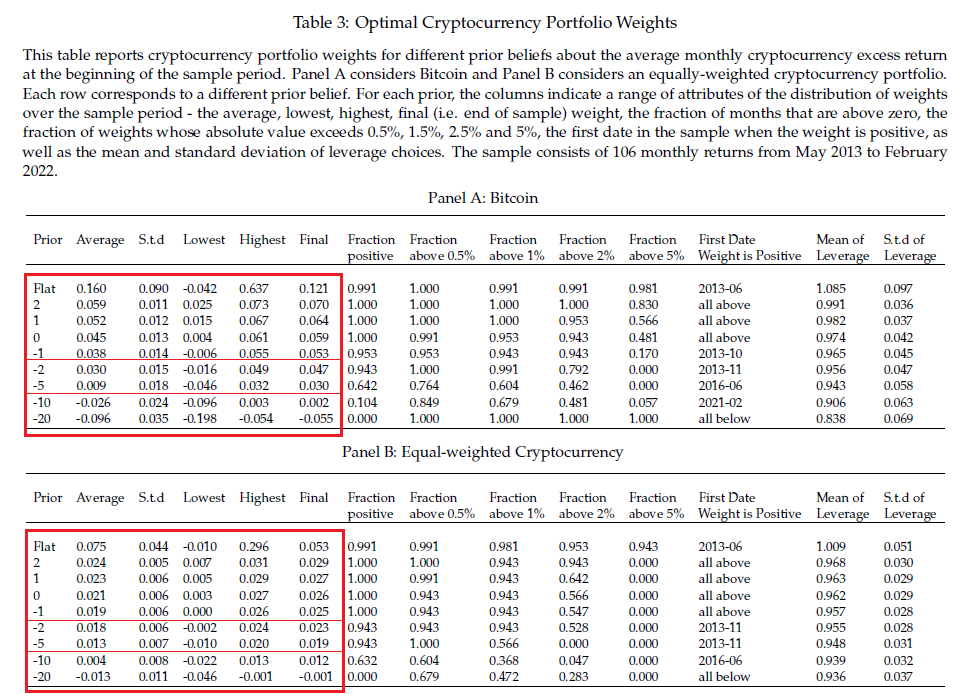

## Table of Contents

## What are cryptocurrencies and how do they work?

Cryptocurrencies are a type of digital money that you can use to buy things online. They are different from regular money because they are not controlled by banks or governments. Instead, they use a technology called blockchain, which is like a big, public record book that keeps track of all the transactions.

When you use cryptocurrencies, you send them from one digital wallet to another. Each transaction is recorded on the blockchain, so everyone can see it, but it's very hard to change or fake these records. People use special codes, called private keys, to keep their digital wallets safe. This way, only the owner of the wallet can send the cryptocurrencies to someone else.

## Why might someone consider investing in cryptocurrencies?

People might think about putting their money into cryptocurrencies because they can grow a lot in value. Some cryptocurrencies, like Bitcoin, have gone up a lot in price over time. This means if you buy some and the price goes up, you could sell it later for more money than you paid. It's like buying something cheap and selling it when it becomes popular and expensive. But, it's also risky because the prices can go down a lot too, so you could lose money.

Another reason is that some people believe cryptocurrencies are the future of money. They think that more and more people and businesses will start using them instead of regular money. If this happens, the value of cryptocurrencies could keep going up. Also, some people like that cryptocurrencies are not controlled by banks or governments. They feel it gives them more freedom over their money. But, it's important to remember that investing in cryptocurrencies is not like saving money in a bank; it's more like gambling, and you should only invest what you can afford to lose.

## What is the concept of portfolio allocation?

Portfolio allocation is about deciding how to spread your money across different types of investments. Imagine you have a pie, and you need to cut it into slices. Each slice represents a different investment, like stocks, bonds, or cryptocurrencies. The goal is to balance your pie so that if one slice doesn't do well, the others might make up for it. This way, you can reduce the risk of losing all your money if one type of investment goes bad.

When you're thinking about how to allocate your portfolio, you need to think about your goals and how much risk you're willing to take. If you're young and can wait a long time for your money to grow, you might put more of your pie into riskier investments like stocks or cryptocurrencies. But if you need your money soon or don't like taking big risks, you might choose safer investments like bonds. The key is to find a mix that feels right for you and helps you reach your financial goals.

## How does the volatility of cryptocurrencies affect investment decisions?

The ups and downs of [cryptocurrency](/wiki/cryptocurrency) prices, known as [volatility](/wiki/volatility-trading-strategies), can make investing in them a bit scary. Because their prices can change a lot in a short time, you might make a lot of money quickly, but you could also lose a lot just as fast. This means you need to be ready for big changes and think about how much risk you're okay with. If you're someone who gets nervous about losing money, the wild swings in cryptocurrency prices might make you think twice about investing in them.

Because of this volatility, people often decide to put only a small part of their money into cryptocurrencies. They might use something called portfolio allocation to spread their money across different types of investments. This way, if cryptocurrencies go down a lot, the other parts of their portfolio might stay steady or even go up, balancing things out. So, when thinking about investing in cryptocurrencies, it's important to think about how much of your money you can afford to risk and how it fits into your overall plan for your money.

## What percentage of a portfolio should be allocated to cryptocurrencies for a beginner investor?

For a beginner investor, it's smart to start small with cryptocurrencies because they can be very risky. A good rule might be to put just 1% to 5% of your total money into cryptocurrencies. This way, if the prices go down a lot, you won't lose too much of your savings. It's like dipping your toes in the water to see how it feels before jumping in.

Starting with a small amount also gives you time to learn more about how cryptocurrencies work and how they fit into your overall plan for your money. As you learn more and feel more comfortable, you might decide to put a bit more into cryptocurrencies, but always keep in mind that they are riskier than other types of investments. It's all about finding a balance that feels right for you and helps you reach your financial goals without too much stress.

## How can risk tolerance influence the allocation to cryptocurrencies?

Risk tolerance is how much risk you're okay with when you invest your money. If you have a high risk tolerance, you might be fine with the ups and downs of cryptocurrencies. You might decide to put more of your money into them, maybe up to 5% or even more of your portfolio, because you're not too worried about losing some money if the prices drop.

On the other hand, if you have a low risk tolerance, you might be scared of losing money. You'd probably want to keep your investment in cryptocurrencies very small, maybe just 1% or even less of your total money. This way, if the prices go down a lot, you won't lose too much, and you'll feel more comfortable knowing most of your money is in safer investments.

## What are the different strategies for allocating assets to cryptocurrencies?

One way to allocate assets to cryptocurrencies is the fixed percentage strategy. This means you decide on a certain percentage of your total money to put into cryptocurrencies and stick with it. For example, you might choose to always keep 3% of your money in cryptocurrencies. When their prices go up or down, you adjust your investments to keep that 3% the same. This strategy helps you stay balanced and not get too excited or scared by the ups and downs of the market.

Another strategy is dollar-cost averaging. With this approach, you put a little bit of money into cryptocurrencies regularly, no matter what the price is. For example, you might decide to invest $50 every month. This way, you buy more cryptocurrencies when the price is low and less when it's high, which can help you pay less on average over time. It's a good way to slowly build up your investment without worrying too much about the wild price swings.

Lastly, there's the tactical allocation strategy. This is more active and means you change how much money you have in cryptocurrencies based on what you think will happen in the market. If you think cryptocurrencies will go up, you might put more money into them. If you think they'll go down, you might take some money out. This strategy can be riskier because it depends a lot on your guesses about the future, but it can also be exciting if you're good at predicting market trends.

## How do market cycles and trends impact optimal cryptocurrency allocation?

Market cycles and trends can really change how much money you should put into cryptocurrencies. When the market is going up and everyone is excited about cryptocurrencies, you might want to put more money into them. This is because prices are rising, and you might make more money if you invest now. But, you have to be careful because these good times don't last forever. If you see that the market is getting too excited and prices are going up too fast, it might be a good idea to take some money out and wait for a better time to invest.

On the other hand, when the market is going down and people are scared, you might want to put less money into cryptocurrencies. Prices can drop a lot during these times, and you could lose money if you invest too much. But, if you think the market will go back up soon, you might want to keep some money in cryptocurrencies or even buy more when prices are low. This way, you can buy them cheaper and maybe make more money when the market goes back up. It's all about watching the market and trying to guess what will happen next, but remember, it's hard to predict the future, so always be careful with your money.

## What role do diversification and rebalancing play in managing a cryptocurrency investment?

Diversification is like not putting all your eggs in one basket. When you invest in cryptocurrencies, it's smart to spread your money across different types of them, like Bitcoin, Ethereum, and others. This way, if one cryptocurrency doesn't do well, the others might still be okay, and you won't lose all your money. It's a way to lower your risk and make your investment safer. By having different cryptocurrencies, you can also take advantage of different opportunities in the market, as some might go up when others go down.

Rebalancing is about keeping your investment plan on track. Over time, the value of your cryptocurrencies will change, and your portfolio might not look the way you wanted it to anymore. For example, if Bitcoin goes up a lot, it might become a bigger part of your portfolio than you planned. Rebalancing means you sell some of your Bitcoin and buy more of the other cryptocurrencies to get back to your original plan. This helps you stick to your strategy and manage risk. It's like checking your car's tires and making sure they're all at the right pressure, so your investment keeps running smoothly.

## How can advanced investors use technical and fundamental analysis to optimize their cryptocurrency allocations?

Advanced investors can use technical analysis to look at past price movements and patterns to guess where cryptocurrency prices might go next. They use charts and tools like moving averages and trend lines to see if a cryptocurrency is likely to go up or down. For example, if they see a pattern that usually means a price will go up, they might decide to put more money into that cryptocurrency. But if they see signs that the price might drop, they might sell some of their cryptocurrency or wait for a better time to buy. This helps them make smarter decisions about when to buy or sell, which can lead to better returns on their investment.

Fundamental analysis is another tool advanced investors use, but it looks at the bigger picture. They study things like how useful the cryptocurrency is, who is behind it, and what's happening in the world that might affect its value. For example, if a cryptocurrency has a strong team working on it and lots of people are starting to use it, an investor might decide to put more money into it because it seems like a good long-term bet. On the other hand, if a cryptocurrency is losing popularity or facing big problems, they might decide to put less money into it or sell what they have. By using both technical and [fundamental analysis](/wiki/fundamental-analysis), advanced investors can make more informed choices about how to allocate their money in the ever-changing world of cryptocurrencies.

## What are the tax implications of investing in cryptocurrencies and how should they affect allocation decisions?

When you invest in cryptocurrencies, you need to think about taxes. If you make money from selling your cryptocurrencies for more than you paid, you might have to pay capital gains tax. This tax can be different depending on how long you held the cryptocurrency before selling it. If you held it for less than a year, it's usually taxed at a higher rate than if you held it for more than a year. Also, if you get paid in cryptocurrencies or use them to buy things, you might have to report that as income and pay taxes on it. Knowing about these taxes can help you decide how much money to put into cryptocurrencies because you'll need to save some of your profits to pay the tax bill.

Taxes can affect how you decide to spread your money across different investments. If you think the taxes on your cryptocurrency profits will be high, you might want to put less money into them. Or, you might decide to hold onto your cryptocurrencies for more than a year to get a lower tax rate on your gains. It's also smart to keep good records of all your cryptocurrency transactions because you'll need them when you do your taxes. By thinking about taxes and how they'll affect your money, you can make better choices about how to invest in cryptocurrencies and manage your overall investment plan.

## How can institutional investors approach optimal allocation to cryptocurrencies compared to retail investors?

Institutional investors, like big banks or investment firms, have a lot more money to invest than regular people, or retail investors. Because they handle so much money, they need to be very careful about where they put it. When it comes to cryptocurrencies, they might start by putting just a small part of their money into them, maybe 1% or 2%, because cryptocurrencies can be very risky. They use a lot of research and special tools to decide which cryptocurrencies to buy and when. They also have to think about rules and laws that might affect their investments, and they need to explain their choices to the people who give them money to invest.

Retail investors, on the other hand, usually have less money to invest and might not have the same tools or research that big investors do. They might be more willing to take risks with cryptocurrencies because they can afford to lose a bit more of their money without it hurting them too much. A retail investor might decide to put a bit more of their money into cryptocurrencies, maybe up to 5%, depending on how much risk they're okay with. They can also use simpler strategies like dollar-cost averaging, where they put a little bit of money into cryptocurrencies every month, no matter what the price is. This way, they can slowly build up their investment without worrying too much about the ups and downs of the market.

## What is Bayesian Portfolio Theory and how does it relate to Crypto?

Bayesian Portfolio Theory provides a flexible framework for asset allocation by integrating prior beliefs with new data to improve investment decisions. This approach is particularly relevant in the cryptocurrency market, which is characterized by high volatility and rapidly changing conditions. 

The dynamic nature of cryptocurrencies means that traditional asset allocation methods may fall short in capturing the swift shifts in market conditions. Bayesian methods, however, offer a systematic way to incorporate both historical data and emergent market signals into the decision-making process. The core principle is to update prior beliefs based on new evidence, which allows for a more nuanced and responsive strategy.

In practical terms, Bayesian Portfolio Theory applies a probabilistic framework to evaluate investment prospects. Investors typically start with prior distributions, representing initial beliefs about expected returns and risk. As new market data becomes available, these priors are adjusted through Bayes' theorem:

$$
P(\Theta | D) = \frac{P(D | \Theta) \times P(\Theta)}{P(D)}
$$

where $P(\Theta | D)$ is the posterior probability of the parameters $\Theta$ given the data $D$, $P(D | \Theta)$ is the likelihood of observing $D$ given $\Theta$, $P(\Theta)$ is the prior probability of $\Theta$, and $P(D)$ is the probability of the data.

In the context of cryptocurrencies, this means that even if initial assessments (priors) suggest caution due to high volatility or other risks, the statistical framework can still affirm a strategic, albeit minimal, allocation if potential returns (posterior) justify it. Research underscores that assigning a non-zero allocation to cryptocurrencies can be rationalized even with conservative prior estimates due to their asymmetric return profiles and diversification benefits.

Investors are encouraged to remain adaptable, continuously updating their portfolio compositions as fresh data pours in. This adaptability is crucial in crypto markets, where new information can substantially alter the risk-return dynamics.

Updating beliefs in line with Bayesian principles ensures that portfolios are not only reactive but proactive in capturing emergent opportunities while mitigating potential losses. This adaptive alignment with market realities can enhance long-term investment outcomes, capturing benefits as market narratives and valuations evolve. In summary, Bayesian Portfolio Theory equips investors with the tools to judiciously balance risk and reward in their cryptocurrency investments, which could potentially augment overall portfolio performance.

## References & Further Reading

[1]: Corbet, S., Lucey, B., & Yarovaya, L. (2019). ["Cryptocurrencies as a Financial Asset: A Systematic Analysis"](https://www.sciencedirect.com/science/article/pii/S1057521918305271). Journal of International Financial Markets, Institutions & Money, 59, 131-153.

[2]: Bessimbinder, H. (1992). ["Systematic Risk, Hedging Pressure, and Risk Premiums in Futures Markets"](https://www.jstor.org/stable/2962144). The Review of Financial Studies, 5(4), 637-667.

[3]: ["Advances in Financial Machine Learning"](https://www.amazon.com/Advances-Financial-Machine-Learning-Marcos/dp/1119482089) by Marcos Lopez de Prado

[4]: Berge, K., & Jordà S. (2011). ["Bayesian VAR Models"](https://www.aeaweb.org/articles?id=10.1257/mac.3.2.246). National Bureau of Economic Research.

[5]: Barberis, N., & Thaler, R. (2003). ["A Survey of Behavioral Finance"](https://www.nber.org/papers/w9222). Handbook of the Economics of Finance, 1, 105-161.

[6]: ["Machine Learning for Algorithmic Trading"](https://github.com/stefan-jansen/machine-learning-for-trading) by Stefan Jansen

[7]: Markowitz, H. (1952). ["Portfolio Selection"](https://onlinelibrary.wiley.com/doi/abs/10.1111/j.1540-6261.1952.tb01525.x). The Journal of Finance, 7(1), 77-91.

[8]: ["Quantitative Trading: How to Build Your Own Algorithmic Trading Business"](https://www.amazon.com/Quantitative-Trading-Build-Algorithmic-Business/dp/0470284889) by Ernest P. Chan