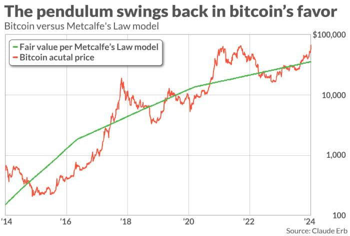

## Table of Contents

## What is Bitcoin?

Bitcoin is a type of digital money that you can use to buy things online. It was created in 2009 by someone using the name Satoshi Nakamoto. Unlike regular money, Bitcoin is not controlled by banks or governments. Instead, it uses a technology called blockchain, which is like a big, public record book that keeps track of all Bitcoin transactions.

People store their Bitcoins in digital wallets on their computers or smartphones. You can send Bitcoins to anyone in the world as long as you know their digital wallet address. To get Bitcoins, you can buy them with regular money, earn them by working, or even get them as gifts. Some people also "mine" Bitcoins, which means they use computers to solve complex math problems and are rewarded with new Bitcoins.

Bitcoin can be used to buy many things, from pizza to cars, but it's also popular as an investment. The price of Bitcoin can go up and down a lot, which makes it exciting but also risky. Some people believe Bitcoin will become more and more important in the future, while others think it's just a passing trend.

## Why is determining Bitcoin's fair value important?

Determining Bitcoin's fair value is important because it helps people understand if Bitcoin is a good investment. If you know the fair value, you can compare it to the current price. If the price is lower than the fair value, it might be a good time to buy Bitcoin. If the price is higher, it might be a good time to sell or wait. This can help people make smarter choices with their money and avoid losing a lot if the price drops suddenly.

It also helps businesses and investors plan for the future. If they have a good idea of what Bitcoin should be worth, they can make better decisions about whether to accept Bitcoin as payment or invest in it. This can affect how they run their business and how they manage their money. Knowing the fair value can make the whole market more stable and trustworthy, which is good for everyone involved.

## How is Bitcoin different from traditional currencies?

Bitcoin is different from traditional currencies like dollars or euros in several ways. First, Bitcoin is digital and exists only on the internet. You can't hold it in your hand like a coin or a bill. Traditional currencies are physical and issued by governments or central banks. Bitcoin is not controlled by any government or bank, which means it's decentralized. Traditional currencies, on the other hand, are managed by central authorities that can print more money or change interest rates.

Another big difference is how transactions are recorded. Bitcoin uses a technology called blockchain, which is like a big, public record book that everyone can see but no one can change. Every Bitcoin transaction is recorded on this blockchain, making it very secure and transparent. Traditional currencies use banks and other financial institutions to keep track of transactions, and these records are usually private. Also, sending Bitcoin to someone anywhere in the world can be quick and doesn't usually cost much, while sending traditional money internationally can take longer and be more expensive.

## What are the basic principles of valuing assets?

Valuing assets means figuring out how much something is worth. One basic principle is looking at what similar things have sold for recently. If you're trying to value a house, you might look at the prices of other houses in the same neighborhood that are similar in size and condition. This is called the market approach. Another principle is thinking about how much money the asset can make in the future. For example, if you're valuing a business, you might look at how much profit it makes each year and guess how much it will make in the future. This is called the income approach.

Another way to value assets is by looking at what it would cost to replace them. If you're valuing a car, you might think about how much it would cost to buy a new one that's the same make and model. This is called the cost approach. Each of these methods has its own strengths and weaknesses, and sometimes people use a mix of them to get a better idea of an asset's value. The key is to use the method that makes the most sense for the specific asset you're trying to value.

## What methods are commonly used to estimate Bitcoin's value?

One common method to estimate Bitcoin's value is the cost of production. This means figuring out how much it costs to "mine" a Bitcoin. Miners use powerful computers to solve complex math problems, and the cost includes electricity and hardware. If the price of Bitcoin is less than what it costs to mine it, miners might stop, which could affect the supply and, in turn, the price.

Another method is looking at how much people are willing to pay for Bitcoin, which is called market demand. If a lot of people want to buy Bitcoin and there aren't many available, the price goes up. This method is based on the idea that the value of something is what someone is willing to pay for it. It's like how the price of a popular toy goes up during the holidays because everyone wants one.

A third way is to think about Bitcoin's future potential. Some people believe Bitcoin will become more widely used and accepted in the future, which could make it more valuable. This method involves guessing how much more people will use Bitcoin and how that will affect its price. It's a bit like trying to predict the future, which can be tricky but is important for long-term investors.

## How does the cost of production model work for Bitcoin?

The cost of production model for Bitcoin looks at how much it costs to mine a single Bitcoin. Mining involves using powerful computers to solve complex math problems, and the costs include the electricity to run the computers and the price of the hardware itself. If the price of Bitcoin falls below what it costs to mine it, miners might stop mining because it's not worth it for them. This can reduce the number of new Bitcoins being made, which could make the price go up because there are fewer Bitcoins available.

This model helps people guess what Bitcoin should be worth. If the price is much higher than the cost to mine it, more people might start mining, which could increase the supply of Bitcoins and possibly lower the price. On the other hand, if the price is close to or below the cost of mining, fewer people will mine, and the supply might not grow as fast, which could help keep the price stable or even increase it. By understanding these costs, people can make better guesses about where Bitcoin's price might be headed.

## What is the stock-to-flow model and how does it apply to Bitcoin?

The stock-to-flow model is a way to guess how valuable Bitcoin might become in the future. It looks at how many Bitcoins already exist (the stock) and how many new ones are made each year (the flow). The model says that if the flow of new Bitcoins slows down, the value of each Bitcoin should go up because there are fewer new ones coming into the market. This model is often used for things like gold, where the supply grows very slowly, making it more valuable over time.

For Bitcoin, the stock-to-flow model is important because the number of new Bitcoins made each year gets cut in half every four years in an event called the "halving." This means the flow of new Bitcoins keeps getting smaller, which, according to the model, should make the value of Bitcoin go up. People who believe in this model think that Bitcoin will become more and more valuable as time goes on because of these halvings, making it a good long-term investment.

## How do market dynamics and investor sentiment affect Bitcoin's price?

Market dynamics and investor sentiment play a big role in deciding Bitcoin's price. Market dynamics are all about how many people want to buy Bitcoin and how many Bitcoins are available. If a lot of people want to buy Bitcoin and there aren't many available, the price goes up. On the other hand, if fewer people want to buy it or there are a lot of Bitcoins for sale, the price can go down. This is like how the price of toys can go up during the holidays because everyone wants them, but then go down after the holidays when people aren't buying them as much.

Investor sentiment is about how people feel about Bitcoin. If people think Bitcoin is going to be really important in the future, they might buy a lot of it, which can drive the price up. But if people start to think Bitcoin isn't a good investment or that it's too risky, they might sell their Bitcoins, which can make the price go down. This is why you often hear about Bitcoin's price going up and down a lot; it's because people's feelings about it can change quickly, and that affects how much they're willing to pay for it.

## What role do regulatory changes play in Bitcoin's valuation?

Regulatory changes can have a big impact on Bitcoin's value. When governments make new rules about how Bitcoin can be used or traded, it can change how people feel about it. If a big country says Bitcoin is okay to use and trade, more people might want to buy it, which can make the price go up. But if a country says Bitcoin is too risky or even illegal, people might sell their Bitcoins, and the price could go down. These rules can make the market for Bitcoin more stable or more unpredictable, depending on what the rules are.

For example, if a government decides to tax Bitcoin transactions, it might make people less excited about using it because it becomes more expensive. On the other hand, if a country makes it easier for businesses to accept Bitcoin, more people might start using it, which could make its value go up. Because Bitcoin is used all over the world, changes in rules from one country can affect its price everywhere. So, keeping an eye on what governments are doing with Bitcoin rules is important for understanding its value.

## How do technological advancements impact Bitcoin's fair value?

Technological advancements can change how valuable Bitcoin is by making it easier and safer to use. For example, if new technology makes it faster to send Bitcoins or makes wallets more secure, more people might want to use Bitcoin. This could make its value go up because more people are buying it. Also, if technology makes mining more efficient, it might cost less to make new Bitcoins, which could affect how much people think Bitcoin is worth.

On the other hand, if technology changes make it harder to mine Bitcoins or if there are new ways to attack the Bitcoin network, it might scare people away. If people think Bitcoin is too risky because of these changes, they might sell their Bitcoins, and the price could go down. So, keeping up with new technology is important for understanding what Bitcoin might be worth in the future.

## What are the limitations of current valuation models for Bitcoin?

Current valuation models for Bitcoin have some problems. One big problem is that Bitcoin is new and different from other things people usually value, like houses or stocks. This makes it hard to use the same methods to figure out how much Bitcoin should be worth. For example, the cost of production model looks at how much it costs to mine Bitcoin, but it doesn't think about other things that might affect the price, like what people think about Bitcoin or new rules from governments.

Another limitation is that these models can't always predict how people will feel about Bitcoin in the future. Bitcoin's price can go up and down a lot because of what people think and feel, and it's hard to guess how those feelings might change. Also, because Bitcoin is used all over the world, changes in one country can affect its price everywhere. This makes it even harder to use simple models to guess its value because there are so many different things happening at the same time.

## How might future economic scenarios influence Bitcoin's long-term value?

Future economic scenarios could really change how much Bitcoin is worth over time. If the world's economy gets shaky and people start to worry about their money in banks, they might turn to Bitcoin as a safe place to keep their savings. This is because Bitcoin isn't controlled by any government or bank, so it might seem safer if people think those institutions are in trouble. Also, if countries start using their own digital money, it might make Bitcoin more popular because people could see it as a way to keep their money away from government control.

On the other hand, if the economy stays strong and people feel good about their money in banks, they might not see the need for Bitcoin as much. If governments make strict rules about using Bitcoin, it could scare people away and make its value go down. Also, if new technology makes it easier to use other kinds of digital money, Bitcoin might not be as special anymore. So, what happens in the economy and with new rules and technology can really affect how much Bitcoin is worth in the long run.

## What is the relationship between the LPPLS Model and Market Bubbles?

The Log-Periodic Power Law Singularity (LPPLS) model is a quantitative tool used to analyze and predict the formation and collapse of financial bubbles by detecting unsustainable growth patterns. Originating from the study of critical phenomena and statistical physics, the LPPLS model helps identify the nonlinear dynamics of asset prices by using log-periodic oscillations superimposed on a power-law growth trend. 

In the context of financial markets, these log-periodic oscillations can indicate collective behavior or "herding" among investors. Herding occurs when traders follow the actions of others rather than relying on their own analysis, often leading to overvalued or undervalued markets. The LPPLS model captures these dynamics by identifying the characteristic precursors to a bubble and impending market correction.

Mathematically, the LPPLS model represents price $P(t)$ as a function of time $t$ in the form:

$$
P(t) = A + B(t_c - t)^{m} + C(t_c - t)^{m} \cos(\omega \ln(t_c - t) + \phi)
$$

where:
- $A$, $B$, $C$ are model parameters,
- $t_c$ denotes the critical time when a bubble is expected to burst,
- $m$ is the exponent characterizing the power-law growth (typically in the range $0 < m < 1$),
- $\omega$ is the angular log-frequency of the oscillations,
- $\phi$ is a phase parameter.

Applying the LPPLS model to Bitcoin involves analyzing historical price data to identify these unsustainable growth patterns. By estimating the model parameters and critical time $t_c$, traders can assess potential high-risk periods characterized by a likelihood of severe market corrections. This predictive capability provides an early warning for investors, allowing them to adjust their portfolios preemptively to mitigate potential losses.

In practice, the model's effectiveness relies on accurate parameter estimation, often achieved through nonlinear least squares fitting or other optimization techniques. Moreover, the model's application to Bitcoin benefits from the digital currency's [volatility](/wiki/volatility-trading-strategies), which exhibits pronounced bubble and correction cycles. As such, the LPPLS model is a valuable tool for algorithmic traders focused on identifying optimal entry and [exit](/wiki/exit-strategy) points by recognizing periods of heightened market instability.

## References & Further Reading

[1]: Cauwels, P., & Sornette, D. (2012). ["The 'Illusion of Control' in the Financial Crisis."](https://arxiv.org/abs/1212.2833) arXiv:1211.4774.

[2]: Wheatley, S., Sornette, D., Huber, T., Reppen, M., & Gantner, R. N. (2019). ["Are Bitcoin Bubbles Predictable? Combining a Generalized Metcalfe's Law and the LPPLS Model."](https://arxiv.org/pdf/1803.05663.pdf) Frontiers in Physics.

[3]: ["Valuing Bitcoin Using Metcalfe's Law," Wall Street Journal](https://www.francescatabor.com/articles/2021/12/11/valuing-bitcoin-and-ethereum-with-metcalfes-law).

[4]: Peterson, T. M. (2018). ["Metcalfe's Law as a Model for Bitcoin's Value."](https://papers.ssrn.com/sol3/papers.cfm?abstract_id=3078248) Journal of Institutional Economics.

[5]: Sornette, D., & Cauwels, P. (2014). ["Financial Bubbles: Mechanisms and Diagnostics."](https://arxiv.org/abs/1404.2140) Review submitted to: Handbook on Systemic Risk.

[6]: ["The Bitcoin Standard: The Decentralized Alternative to Central Banking"](https://www.amazon.com/Bitcoin-Standard-Decentralized-Alternative-Central/dp/1119473861) by Saifedean Ammous.