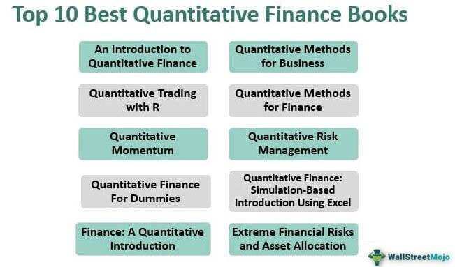

## Table of Contents

## What is a quant and what do they do at Jane Street?

A quant, short for quantitative analyst, is someone who uses math and computer skills to solve problems in finance. At Jane Street, quants work on trading strategies and risk management. They use data and models to make decisions about buying and selling financial products.

Jane Street is a trading firm that deals with a lot of different financial products. Quants at Jane Street help the company make smart choices by analyzing data and creating algorithms. They work in teams to improve how the firm trades and manages risk, making sure the company can make profits while keeping risks low.

## What kind of educational background is required to become a quant at Jane Street?

To become a quant at Jane Street, you usually need a strong background in math, computer science, or a related field. Most quants have at least a bachelor's degree, but many have master's degrees or PhDs. The important thing is to be really good at solving hard problems using math and coding.

Jane Street looks for people who can think in a logical way and are good at programming. They don't just care about what you studied, but also about how you think and solve problems. So, even if you didn't study finance, you can still become a quant if you have the right skills and can learn quickly.

## What are the typical day-to-day responsibilities of a quant at Jane Street?

A quant at Jane Street spends their day working on trading strategies and risk management. They use math and computer skills to analyze data and create models that help the company decide when to buy or sell financial products. This involves a lot of coding and testing different ideas to see what works best. They also work closely with other team members to share ideas and improve the firm's trading systems.

Another big part of their job is to keep an eye on the markets and make sure the company's risks are under control. They use the models they've created to monitor how the firm is doing and make adjustments if needed. This means they're always learning and updating their knowledge to stay on top of changes in the financial world. It's a busy job that requires a lot of focus and teamwork.

## How does Jane Street's company culture affect the work of a quant?

Jane Street's company culture is all about teamwork and learning. This means quants at Jane Street work closely with others, sharing ideas and helping each other out. They spend a lot of time discussing problems and solutions, which helps them come up with better trading strategies. The culture encourages everyone to ask questions and learn from each other, so quants are always growing their skills and knowledge.

The focus on collaboration also means that quants at Jane Street have to be good at explaining their ideas to others. They need to be able to talk about their work in a way that everyone can understand, which helps the whole team make better decisions. This kind of open and supportive environment makes the job of a quant more enjoyable and effective, as they feel supported and valued by their colleagues.

## What programming languages and tools are essential for a quant at Jane Street?

At Jane Street, quants need to know how to use certain programming languages and tools to do their job well. The main language they use is OCaml. It's a special language that helps them write code that is safe and easy to understand. Quants also need to be good at using other languages like Python, which is useful for data analysis and making quick scripts.

Besides programming languages, quants at Jane Street use different tools to help them work better. They use version control systems like Git to keep track of changes in their code. They also use Jupyter Notebooks to test ideas and share results with their team. These tools help them work together and make sure their code is always up to date and working right.

## How does a quant at Jane Street approach problem-solving and decision-making?

A quant at Jane Street approaches problem-solving by using a lot of math and computer skills. They start by breaking down big problems into smaller parts that are easier to handle. They use data to understand what's going on and then create models to test different ideas. This means they write a lot of code to see how their ideas work in real life. They also work with their team to talk about their ideas and get feedback, which helps them find the best solutions.

When it comes to decision-making, quants at Jane Street rely on the models they've built. They use these models to predict what might happen in the markets and decide when to buy or sell financial products. They always keep an eye on how well their models are working and make changes if needed. This means they're always learning and adjusting their strategies to make sure the company can make profits while keeping risks low.

## What are the most challenging aspects of being a quant at Jane Street?

One of the toughest parts of being a quant at Jane Street is dealing with the fast pace of the financial markets. Things can change quickly, and quants need to keep up. They have to be ready to update their models and strategies all the time to make sure they're still working well. This means they're always learning and trying new things, which can be hard but also exciting.

Another challenge is working with a lot of data and making sense of it. Quants need to be good at finding patterns and making predictions from huge amounts of information. It's not easy to turn all that data into useful insights, and they have to be careful to make sure their models are accurate. Plus, they need to explain their ideas clearly to their team, which can be tough when the problems are really complex.

## How does Jane Street support the professional development and career growth of its quants?

Jane Street helps its quants grow by giving them lots of chances to learn and try new things. They have training programs and workshops where quants can learn more about trading and coding. They also encourage quants to work on different projects, so they can gain experience in many areas. This helps them become better at their job and learn new skills all the time.

The company also supports quants by letting them work with smart people from different backgrounds. This means they can learn from each other and get new ideas. Jane Street also has a culture where everyone is encouraged to ask questions and share what they know. This helps quants keep learning and growing in their careers.

## What are some notable projects or contributions made by quants at Jane Street?

Quants at Jane Street have worked on many important projects that help the company trade better. One big project was creating new trading strategies using [machine learning](/wiki/machine-learning). They used a lot of data to teach computers how to make smart choices about buying and selling. This helped Jane Street make more money and manage risks better. It was a big deal because it showed how math and computers can make trading more successful.

Another cool thing quants at Jane Street did was building tools to make their work easier. They made software that helps them test their ideas quickly and see if they work. This software lets them try out many different strategies without taking big risks. It's like having a safe place to practice before playing the real game. This has made Jane Street's trading much more efficient and helped the quants do their jobs better.

## How do quants at Jane Street collaborate with other teams within the company?

Quants at Jane Street work closely with other teams to make sure everyone is on the same page. They share their ideas and findings with traders, who use this information to make decisions about buying and selling. Quants also talk a lot with the technology team, who help build the tools and systems the quants need to do their work. This teamwork helps everyone understand the big picture and work together to make the company successful.

Another important part of their collaboration is with the risk management team. Quants help this team by providing data and models that show how much risk the company is taking. They work together to make sure the company's risks are under control and that they can keep making profits. This close collaboration means that quants are always in the loop and can help the company make smart choices.

## What are the latest trends or technologies impacting the role of a quant at Jane Street?

One big trend that's changing the job of a quant at Jane Street is the use of machine learning and [artificial intelligence](/wiki/ai-artificial-intelligence). These technologies help quants make better predictions and find new trading strategies. They can look at huge amounts of data quickly and find patterns that humans might miss. This means quants can try out more ideas and make smarter choices about when to buy or sell. It's like having a super smart helper that makes their job easier and more effective.

Another important technology is cloud computing. It lets quants use powerful computers over the internet to run their models and analyze data. This means they can work faster and handle more information than before. Cloud computing also makes it easier for quants to work together with other teams, because everyone can access the same tools and data from anywhere. This helps them share ideas and make decisions more quickly, which is really important in the fast-moving world of trading.

## How does a quant at Jane Street measure and evaluate their performance and success?

A quant at Jane Street measures their performance by looking at how well their trading strategies work. They check if their models are making good predictions and helping the company make money. They also see if their strategies are keeping risks low, which is really important. They use numbers and data to see if they're doing a good job, and they always try to make their strategies better.

Another way quants evaluate their success is by getting feedback from their team. They work closely with traders and other quants, so they can learn from each other. If their ideas are helping the team make smart choices, that's a sign they're doing well. They also look at how much they're learning and growing in their job, because Jane Street wants everyone to keep getting better.

## References & Further Reading

[1]: Bergstra, J., Bardenet, R., Bengio, Y., & Kégl, B. (2011). ["Algorithms for Hyper-Parameter Optimization."](https://papers.nips.cc/paper_files/paper/2011/hash/86e8f7ab32cfd12577bc2619bc635690-Abstract.html) Advances in Neural Information Processing Systems 24.

[2]: ["Advances in Financial Machine Learning"](https://www.amazon.com/Advances-Financial-Machine-Learning-Marcos/dp/1119482089) by Marcos Lopez de Prado

[3]: ["Evidence-Based Technical Analysis: Applying the Scientific Method and Statistical Inference to Trading Signals"](https://www.wiley.com/en-gb/Evidence+Based+Technical+Analysis:+Applying+the+Scientific+Method+and+Statistical+Inference+to+Trading+Signals-p-9780470008744) by David Aronson

[4]: ["Machine Learning for Algorithmic Trading"](https://www.amazon.com/Machine-Learning-Algorithmic-Trading-intelligence/dp/9918608013) by Stefan Jansen

[5]: ["Quantitative Trading: How to Build Your Own Algorithmic Trading Business"](https://www.amazon.com/Quantitative-Trading-Build-Algorithmic-Business/dp/0470284889) by Ernest P. Chan