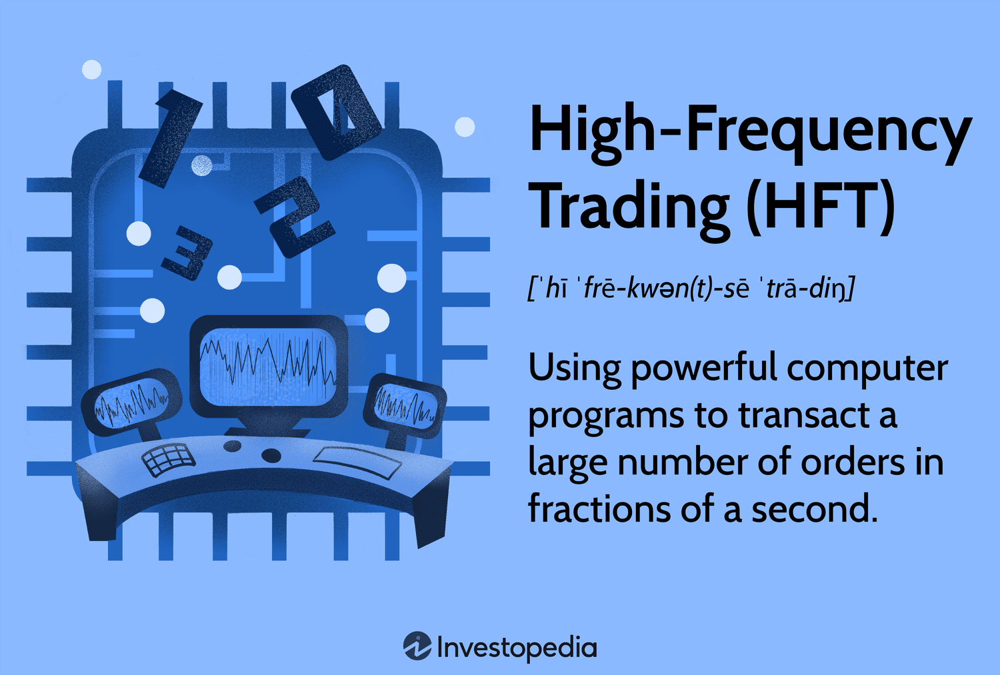

## Table of Contents

## What is multi-frequency trading?

Multi-frequency trading is a way of trading in financial markets where traders use different time frames to make decisions. Instead of just looking at short-term or long-term charts, they look at many different time frames at once. This helps them see patterns and trends that they might miss if they only looked at one time frame. By doing this, traders can make better decisions about when to buy or sell.

For example, a trader might look at a 1-minute chart, a 1-hour chart, and a daily chart all at the same time. The 1-minute chart can show quick changes, the 1-hour chart can show bigger trends, and the daily chart can show long-term movements. By combining information from all these charts, the trader can get a fuller picture of what is happening in the market. This can help them find the best times to trade and make more money.

## How does multi-frequency trading differ from traditional trading?

Multi-frequency trading is different from traditional trading because it uses many time frames at the same time. Traditional trading usually focuses on just one time frame, like looking at a daily chart or a 5-minute chart. But in multi-frequency trading, traders look at short-term, medium-term, and long-term charts all together. This helps them see more details and patterns in the market that they might miss if they only looked at one chart.

For example, a traditional trader might only look at a daily chart to decide when to buy or sell a stock. They might see a trend that lasts for a few days and make their decision based on that. But a multi-frequency trader would also look at a 1-hour chart and a 1-minute chart. By doing this, they can see quick changes and bigger trends at the same time. This can help them make better decisions and find the best times to trade.

In simple terms, multi-frequency trading gives traders a fuller picture of the market. It's like looking at a map from different heights. Traditional trading is like looking at the map from one height, while multi-frequency trading is like looking at it from many heights at once. This can help traders see more opportunities and make smarter choices.

## What are the key components of a multi-frequency trading system?

A multi-frequency trading system has a few important parts that help traders make good decisions. The first part is using different time frames. Traders look at short-term charts, like 1-minute or 5-minute charts, medium-term charts, like 1-hour or 4-hour charts, and long-term charts, like daily or weekly charts. By looking at all these time frames together, traders can see quick changes and bigger trends at the same time. This helps them understand what is happening in the market better.

The second part is using different tools and indicators on these charts. Traders might use moving averages, which show the average price over time, or the Relative Strength Index (RSI), which shows if a stock is overbought or oversold. By using these tools on different time frames, traders can find the best times to buy or sell. For example, if the short-term chart shows a quick drop but the long-term chart shows a strong upward trend, a trader might decide to buy because they think the price will go up again soon.

The third part is having a clear plan for when to enter and [exit](/wiki/exit-strategy) trades. This plan should be based on the information from all the time frames and tools. Traders need to decide what signals they will look for on each chart and how they will combine these signals to make decisions. For example, they might decide to buy when the short-term chart shows a certain pattern and the long-term chart shows a strong trend. Having a clear plan helps traders stay disciplined and make better choices.

## What types of financial instruments are typically used in multi-frequency trading?

Multi-frequency trading can be used with many different types of financial instruments. The most common ones are stocks, which are shares in a company that people can buy and sell. Traders also use [forex](/wiki/forex-system), which is trading different currencies against each other. Another popular instrument is futures, which are contracts to buy or sell something at a future date. These instruments are used because they have a lot of data available, which helps traders see patterns and trends on different time frames.

In addition to these, traders might also use options, which give the right but not the obligation to buy or sell an asset at a set price. Cryptocurrencies like Bitcoin and Ethereum are also used in multi-frequency trading because they can be very volatile, meaning their prices can change a lot in a short time. This [volatility](/wiki/volatility-trading-strategies) can create many opportunities for traders who use different time frames to make decisions. By looking at short-term, medium-term, and long-term charts, traders can find the best times to trade these instruments and make more money.

## How do traders identify different frequency levels in the market?

Traders identify different frequency levels in the market by looking at charts that show price changes over different time periods. They use short-term charts, like 1-minute or 5-minute charts, to see quick changes in the market. These charts help them spot fast trends and patterns that last for a few minutes or hours. Medium-term charts, like 1-hour or 4-hour charts, show bigger trends that last for a few hours or a day. These charts help traders see how the market is moving over a longer time. Long-term charts, like daily or weekly charts, show even bigger trends that last for days, weeks, or months. By looking at all these time frames together, traders can see the full picture of what is happening in the market.

To identify these frequency levels, traders use different tools and indicators on their charts. For example, they might use moving averages, which show the average price over time, to see if the market is trending up or down. They might also use the Relative Strength Index (RSI), which shows if a stock is overbought or oversold, to find good times to buy or sell. By using these tools on different time frames, traders can see how the market is behaving at different speeds. This helps them make better decisions about when to enter and exit trades. By combining information from short-term, medium-term, and long-term charts, traders can find the best opportunities in the market.

## What are the common strategies employed in multi-frequency trading?

In multi-frequency trading, one common strategy is called [trend following](/wiki/trend-following). Traders look at different time frames to see if there is a strong trend in the market. They might see a short-term trend on a 1-minute chart, a medium-term trend on a 1-hour chart, and a long-term trend on a daily chart. If all these time frames show the same direction, like all going up, traders might decide to buy because they think the price will keep going up. This strategy helps them catch big moves in the market and make money by following the trend.

Another strategy is called mean reversion. Traders use this strategy when they think the price of a stock or other financial instrument will go back to its average after moving away from it. They look at different time frames to see if the price is far from its average on short-term, medium-term, and long-term charts. If the price is too high on all these charts, they might decide to sell because they think it will go back down. If the price is too low, they might decide to buy because they think it will go back up. By using different time frames, traders can find the best times to trade and make money from the price moving back to its average.

A third strategy is called [breakout](/wiki/breakout-trading) trading. Traders use this strategy to find times when the price breaks out of a range it has been stuck in. They look at different time frames to see if the price is breaking out on short-term, medium-term, and long-term charts. If the price breaks out of a range on all these charts, traders might decide to buy or sell depending on the direction of the breakout. For example, if the price breaks out to the upside on all time frames, they might decide to buy because they think the price will keep going up. By using different time frames, traders can find the best times to trade breakouts and make money from big moves in the market.

## How does technology play a role in multi-frequency trading?

Technology is really important for multi-frequency trading. Traders use special software and computer programs to look at many different time frames at the same time. These programs can show charts for 1-minute, 1-hour, and daily time frames all on one screen. This makes it easy for traders to see quick changes and bigger trends together. The software also has tools like moving averages and the Relative Strength Index (RSI) that help traders find the best times to buy or sell. Without technology, it would be hard for traders to keep track of all these different time frames and make good decisions.

Another way technology helps is by making trading faster and more accurate. Traders can use algorithms, which are like sets of rules, to automatically buy or sell based on what they see on the different time frames. These algorithms can look at a lot of data very quickly and make decisions in seconds. This is much faster than a person could do it. Technology also helps traders keep track of their trades and see how well they are doing. By using technology, traders can make better decisions and find more opportunities in the market.

## What are the risks associated with multi-frequency trading?

Multi-frequency trading can be risky because it involves looking at many different time frames at once. This can make it hard for traders to decide when to buy or sell. Sometimes, the short-term chart might show one thing, but the long-term chart might show something different. This can confuse traders and make them miss good opportunities or make bad decisions. Also, because multi-frequency trading uses a lot of data and tools, there is a risk of information overload. Traders might get overwhelmed by all the charts and indicators and make mistakes.

Another risk is that multi-frequency trading can lead to overtrading. Traders might see many signals on different time frames and feel like they need to trade all the time. This can lead to more trades than they can handle, and they might end up losing money. Technology can also be a risk. If the software or algorithms used for multi-frequency trading have bugs or errors, they can make wrong decisions and cause big losses. Traders need to be careful and use technology wisely to avoid these risks.

## How can one set up a basic multi-frequency trading system?

To set up a basic multi-frequency trading system, you first need to choose the right software. Look for a trading platform that lets you see different time frames on the same screen. This could be a 1-minute chart, a 1-hour chart, and a daily chart. Once you have the software, you need to add some tools to help you make decisions. Moving averages and the Relative Strength Index (RSI) are good choices because they can show you trends and if a stock is overbought or oversold. Make sure you can see these tools on all the time frames you are using.

Next, you need to decide on your trading strategy. You might want to use trend following, where you look for the same trend on all time frames and trade in that direction. Or you might use mean reversion, where you look for times when the price is far from its average and trade expecting it to go back. Another option is breakout trading, where you look for the price to break out of a range on all time frames. Once you have your strategy, set up rules for when to enter and exit trades based on what you see on the different charts. Practice using a demo account first to get comfortable with the system before using real money.

## What advanced techniques can enhance multi-frequency trading performance?

One advanced technique to enhance multi-frequency trading performance is using [machine learning](/wiki/machine-learning) algorithms. These algorithms can look at a lot of data from different time frames and find patterns that are hard for people to see. They can learn from past trades and get better over time. By using machine learning, traders can make more accurate predictions about when to buy or sell. This can help them make more money and avoid big losses. But, it's important to keep an eye on these algorithms and make sure they are working right, because they can sometimes make mistakes.

Another technique is using advanced risk management tools. These tools can help traders set limits on how much they can lose on each trade. They can also help traders spread their money across different trades to reduce risk. By using these tools, traders can protect their money and stay in the market longer. This can give them more chances to make money. It's also a good idea to keep learning and trying new strategies. The market is always changing, so traders need to be ready to change their approach and use new techniques to stay ahead.

## How do regulatory environments affect multi-frequency trading?

Regulatory environments can have a big impact on multi-frequency trading. Different countries have different rules about what traders can and can't do. For example, some places might have strict rules about how much money traders can use to trade, or they might limit the kinds of financial instruments traders can use. These rules can make it harder for traders to use multi-frequency trading because they might not be able to trade as often or use all the tools they need. Traders need to know the rules in their country and follow them to avoid getting in trouble.

Also, regulations can change over time, which can affect how traders do multi-frequency trading. If a country makes new rules, traders might need to change their strategies to follow them. This can be hard because it might mean they can't use the same time frames or tools they used before. But, good regulations can also help protect traders and make the market fairer. By understanding and following the rules, traders can keep trading safely and legally.

## What future trends are expected in multi-frequency trading?

In the future, multi-frequency trading is expected to become even more popular as technology keeps getting better. More traders will use advanced computer programs and machine learning to look at different time frames and find the best times to trade. These programs can look at a lot of data very quickly and make smart decisions. This can help traders make more money and avoid big losses. Also, more people might start using multi-frequency trading because it can help them see more opportunities in the market.

Another trend is that regulations might change to keep up with new technology. Governments might make new rules to make sure trading is fair and safe. Traders will need to keep learning about these rules and change their strategies to follow them. But, good regulations can also help protect traders and make the market better for everyone. By staying up to date with these trends, traders can keep trading successfully and safely.

## References & Further Reading

[1]: Bergstra, J., Bardenet, R., Bengio, Y., & Kégl, B. (2011). ["Algorithms for Hyper-Parameter Optimization."](https://papers.nips.cc/paper_files/paper/2011/hash/86e8f7ab32cfd12577bc2619bc635690-Abstract.html) Advances in Neural Information Processing Systems 24.

[2]: ["Advances in Financial Machine Learning"](https://www.amazon.com/Advances-Financial-Machine-Learning-Marcos/dp/1119482089) by Marcos Lopez de Prado

[3]: ["Evidence-Based Technical Analysis: Applying the Scientific Method and Statistical Inference to Trading Signals"](https://www.wiley.com/en-gb/Evidence+Based+Technical+Analysis:+Applying+the+Scientific+Method+and+Statistical+Inference+to+Trading+Signals-p-9780470008744) by David Aronson

[4]: ["Machine Learning for Algorithmic Trading"](https://www.amazon.com/Machine-Learning-Algorithmic-Trading-intelligence/dp/9918608013) by Stefan Jansen

[5]: ["Quantitative Trading: How to Build Your Own Algorithmic Trading Business"](https://www.amazon.com/Quantitative-Trading-Build-Algorithmic-Business/dp/0470284889) by Ernest P. Chan