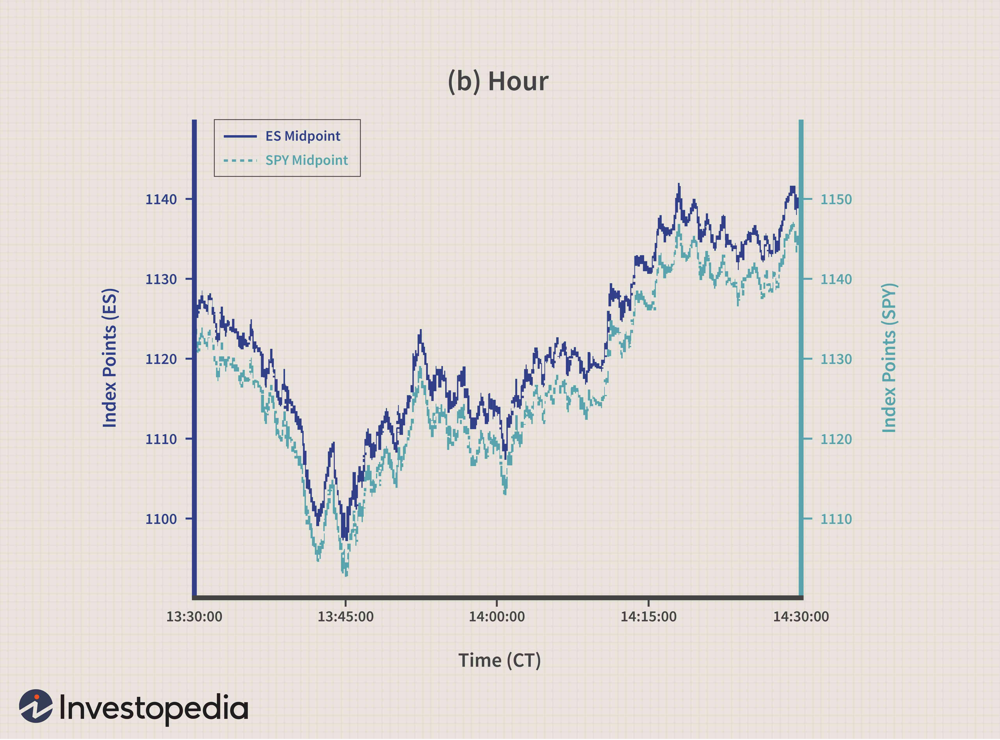

Trading in financial markets involves the buying and selling of financial instruments, such as stocks, bonds, commodities, and currencies, to achieve profit. It's a highly dynamic environment where traders analyze market trends, economic indicators, and numerous other variables to make informed decisions. In recent years, the landscape of trading has been significantly transformed by technological advancements, particularly in the form of algorithmic trading.

Algorithmic trading, or algo-trading, refers to using computer algorithms to perform trading activities. These algorithms are designed to execute trades at speeds and frequencies beyond human capability. This approach leverages complex mathematical models and formulas to make decisions on trading strategies with minimal human intervention. The primary advantage is the ability to process vast amounts of data quickly, leading to enhanced decision-making accuracy and efficiency.

In this context, multi-frequency trading emerges as a sophisticated approach combining the elements of different trading frequencies. Traditional trading can be classified into various frequency bands based on the speed and volume of trades. These include low-frequency trading (LFT), where strategies might hold positions for days or months, and high-frequency trading (HFT), characterized by executing a large number of orders at extremely fast speeds, sometimes within microseconds.

Multi-frequency trading strategically employs algorithms to operate across multiple trading frequencies simultaneously. This method aims to exploit the benefits of both LFT and HFT, offering more comprehensive market strategies. By capturing opportunities available at different timescales and market conditions, multi-frequency trading enhances the trader's adaptability and potential profitability. This integration of varying trading speeds allows traders to optimize resource allocation, manage risks more effectively, and gain competitive advantages in the financial markets.

## Table of Contents

## Understanding Trading Frequencies

Trading frequencies refer to the rate at which trades are executed in the financial markets and are typically categorized into low-frequency and high-frequency trading. Understanding these categories is crucial for grasping where multi-frequency trading fits within the broader spectrum.

**Low-Frequency Trading (LFT):**
Low-frequency trading typically involves fewer trades over a longer period. LFT strategies might execute trades from a few times a week to several times a year. This style often relies on [fundamental analysis](/wiki/fundamental-analysis), which involves evaluating the financial performance and future prospects of companies to make investment decisions. The longer holding period for assets means that LFT is less stressed by short-term market [volatility](/wiki/volatility-trading-strategies), allowing traders to focus on long-term market trends and value opportunities.

**High-Frequency Trading (HFT):**
In contrast, high-frequency trading is characterized by a high [volume](/wiki/volume-trading-strategy) of trades executed in fractions of a second. [HFT](/wiki/high-frequency-trading-strategies) strategies leverage sophisticated algorithms and advanced technology to capitalize on minute price movements. This type of trading requires significant computational power and low latency in information transmission and order execution. High-frequency traders often engage in market-making, [arbitrage](/wiki/arbitrage), and other strategies that benefit from rapid execution and tiny spreads.

**Multi-Frequency Trading:**
Multi-frequency trading integrates aspects of both low-frequency and high-frequency trading depending on market conditions, objectives, and the availability of trading opportunities. This flexibility allows traders to adjust their strategies dynamically, shifting between different trading frequencies to optimize returns and manage risk. Multi-frequency trading aims to maximize efficiency by combining the long-term insights of LFT with the speed and precision of HFT, providing a more holistic approach to exploiting market inefficiencies.

In essence, while LFT and HFT occupy distinct ends of the trading frequency spectrum, multi-frequency trading occupies a middle ground, utilizing elements of both to adaptively respond to market signals. This approach requires a combination of fundamental analysis, [algorithmic trading](/wiki/algorithmic-trading) techniques, and real-time data processing to make informed decisions across varying time horizons.

## What is Multi-Frequency Trading?

Multi-frequency trading is a sophisticated approach in the field of algorithmic trading that involves the simultaneous use of different trading frequencies to optimize trade execution and enhance profitability. Unlike traditional trading methods, which may rely on a single frequency strategy—such as low-frequency trading (LFT) or high-frequency trading (HFT)—multi-frequency trading integrates multiple frequency strategies, allowing traders to capitalize on a wider range of market opportunities.

### Definition and Basic Principles of Multi-Frequency Trading

At its core, multi-frequency trading leverages a blend of trading strategies operating at distinct time intervals. This could involve combining long-term investment strategies with short-term tactical plays, or the integration of ultra-low latency, high-frequency strategies with more conventional, low-frequency approaches. The primary aim is to exploit temporal market inefficiencies that may not be observable through a singular frequency lens.

The foundational principle of multi-frequency trading is diversification across time scales, which involves analyzing and executing trades based on various time frames. This necessitates advanced data analytics and modeling to understand and predict market dynamics effectively across different time horizons. Traders use tools like Fourier analysis or wavelet transforms to dissect market signals into components corresponding to various frequencies, enabling a comprehensive strategy that mitigates risk and maximizes potential returns.

### How Multi-Frequency Trading Differs from Other Trading Types

Multi-frequency trading stands out from traditional trading methods due to its integrated, multi-layered approach. While low-frequency trading generally focuses on long-term trends and fundamental analysis, and high-frequency trading emphasizes speed and massive volumes of trades executed in fractions of a second, multi-frequency trading seeks to optimize the advantages of both. This fusion allows traders to hedge against the limitations inherent in single-frequency strategies. 

By leveraging algorithms capable of operating at different frequencies, multi-frequency traders can dynamically adapt to market conditions, seizing opportunities that a monolithic trading approach might miss. This adaptability is crucial in markets characterized by high volatility and rapid technological changes.

### Advantages of Combining Different Trading Frequencies

The combination of diverse trading frequencies offers several advantages:

1. **Comprehensive Market Insight**: By analyzing the market at multiple frequencies, traders gain a more nuanced understanding of market trends, volatility spikes, and price movements across various time scales. This holistic view is invaluable for informed decision-making.

2. **Risk Mitigation**: Utilizing multiple frequency strategies can help in spreading risk. For instance, losses incurred from short-term volatility can potentially be offset by gains from long-term positions, leading to a more balanced portfolio performance.

3. **Increased Profit Opportunities**: Multi-frequency trading enhances the potential to capture profit across different market conditions, from short-lived arbitrage opportunities to enduring trend reversals. 

4. **Flexibility and Adaptability**: The combined approach allows for greater flexibility in trading strategies. Traders can adjust their focus in response to changing market conditions, shifting their emphasis from low-frequency to high-frequency strategies, or vice versa, as needed.

Overall, multi-frequency trading exemplifies a sophisticated and innovative trading strategy that harnesses the benefits of various trading frequencies. While complex, its strategic use of technology and analytics provides a powerful tool for maximizing returns and managing risks effectively in the evolving landscape of financial markets.

## How Multi-Frequency Trading Works

Multi-frequency trading leverages the integration of multiple trading strategies across varying time frames, utilizing advanced technologies to optimize execution and performance. Here, we outline the core components, technological frameworks, and the process behind multi-frequency trading, including how algorithms and machine learning enhance these operations.

### Core Components and Technologies

1. **Data Acquisition and Processing**: This is the foundation of multi-frequency trading. The system relies on high-quality, real-time market data to analyze trading opportunities. Data includes tick-by-tick price movements, order book depth, trade volumes, and macroeconomic indicators. Technologies employed involve high-speed data feeds and robust data storage solutions.

2. **Algorithm Development and Backtesting**: Algorithms are the engines of multi-frequency trading. These mathematical formulas and models are designed to identify trading signals at different frequencies. Backtesting against historical data is essential to validate their effectiveness and profitability. Tools like Python, R, and specialized software such as MATLAB are often used for this purpose.

3. **Trade Execution Systems**: High-performance execution systems are critical to leverage the signals generated by algorithms. These systems are designed to manage order routing, execution speed, and slippage while minimizing transaction costs. Technologies such as FIX (Financial Information Exchange) protocol and API integrations with trading platforms are commonly utilized.

4. **Risk Management Modules**: These are essential to mitigate potential losses arising from market volatility or model inaccuracies. Risk management systems monitor exposure, set stop-loss limits, and implement hedging strategies. Advanced risk models are often incorporated using machine learning techniques.

### Step-by-Step Process of Executing Multi-Frequency Trades

1. **Data Collection**: Continuously gather and process market data across various time frames.

2. **Signal Generation**: Algorithms analyze processed data to generate buy or sell signals. These signals can be based on statistical arbitrage, momentum analysis, mean reversion, or other strategies suitable for different trading frequencies.

3. **Decision Making**: The decision-making engine assesses the generated signals, considering factors such as market conditions, current holdings, and risk parameters to decide whether to execute a trade. This is where the multi-frequency aspect becomes critical, as the engine harmonizes signals from various frequencies to optimize trading performance.

4. **Order Execution**: Once a decision is made, the trade order is executed through the trading platform. The execution is optimized to reduce latency, slippage, and transaction costs.

5. **Risk Monitoring**: As trades are executed, real-time risk assessment ensures that all positions align with the predefined risk management policies.

### Role of Algorithms and Machine Learning

Algorithms lie at the core of multi-frequency trading, facilitating the rapid analysis and execution required for success. They incorporate:
- **Pattern Recognition**: Identifying potential trading opportunities by examining historical and current market patterns.
- **Predictive Modeling**: Forecasting future price movements using statistical techniques.

Machine learning enhances these capabilities by:
- **Adaptive Learning**: Continuously improving algorithmic models based on new data and evolving market conditions, enabling more accurate predictions.
- **Image and Signal Processing**: Analyzing non-traditional data forms, such as news sentiment and social media trends, which can impact market behavior.

Machine learning approaches such as [neural network](/wiki/neural-network)s, [reinforcement learning](/wiki/reinforcement-learning), and natural language processing enrich the trading system's ability to adapt and optimize across different market conditions and frequencies.

In summary, multi-frequency trading stands as a sophisticated mechanism combining advanced data analytics, algorithmic prowess, and adaptive [machine learning](/wiki/machine-learning), providing efficiency and precision in the complex landscape of financial markets.

## Benefits and Challenges of Multi-Frequency Trading

Multi-frequency trading, which involves executing trades at various time intervals, offers numerous advantages and challenges that traders must navigate. Here’s an examination of these [factor](/wiki/factor-investing)s:

### Advantages

**Efficiency**: Multi-frequency trading leverages algorithms to execute trades at optimal times across different frequencies, enhancing operational efficiency. This automated approach minimizes human error and allows for rapid decision-making, which is crucial in volatile markets.

**Accuracy**: Utilizing multiple frequencies enables traders to capture a broader spectrum of market signals. By analyzing both short-term fluctuations and long-term trends, multi-frequency trading can deliver more accurate predictions and better trading outcomes.

**Flexibility**: Combining different trading frequencies allows traders to adapt more readily to changing market conditions. This flexibility means traders aren’t locked into a singular strategy but can pivot between short-term and long-term approaches depending on the prevailing market signals.

### Challenges

**Complexity**: Implementing a multi-frequency trading strategy is inherently complex. It requires sophisticated technology—such as advanced algorithms and robust computational infrastructure—to handle the vast amount of data and execute trades efficiently.

**Risk Management**: The intricate nature of multi-frequency trading introduces significant risk management challenges. Traders must develop strategies to mitigate potential losses from rapid execution errors or adverse market movements. This might involve hedging techniques or the use of stop-loss orders to limit exposure.

**Regulatory Considerations**: Multi-frequency trading is subject to stringent regulatory frameworks designed to ensure market stability and integrity. Traders must navigate various regulations which can impact how algorithms are designed and implemented. This requires an in-depth understanding of financial laws and compliance measures.

### Real-World Applications and Case Studies

Multi-frequency trading is employed by leading financial institutions to maximize returns in diverse market conditions. For example, [hedge fund](/wiki/hedge-fund-trading-strategies)s and proprietary trading firms use multi-frequency strategies to optimize asset allocations and enhance portfolio performance.

One notable case is Hudson River Trading, a high-frequency trading firm that successfully uses multi-frequency strategies. They combine low-latency high-frequency techniques with longer-term trend analysis to balance risk and reward, allowing them to thrive in various market environments.

In conclusion, multi-frequency trading offers vast potential for enhancing trading performance through efficiency, accuracy, and flexibility. However, the complexity, risk, and regulatory challenges require sophisticated strategies and thorough understanding to ensure successful implementation.

## The Future of Multi-Frequency Trading

The future of multi-frequency trading is poised for significant transformation as the trading industry continues to evolve with technological advancements. Current trends indicate a move towards even more sophisticated trading algorithms, enhanced data analytics, and the integration of emerging technologies such as [artificial intelligence](/wiki/ai-artificial-intelligence) (AI) and quantum computing.

**1. Trends and Innovations in the Trading Industry**

One significant trend is the incorporation of machine learning and AI in trading systems. These technologies enable traders to process enormous sets of data more efficiently, providing insights that were previously inaccessible. AI-driven algorithms can dynamically adjust trading strategies based on real-time data, enhancing the precision and effectiveness of multi-frequency trading. For example, natural language processing (NLP) can be employed to analyze news feeds and social media for sentiment analysis, subsequently impacting trade decisions.

Another critical trend is the advancement of quantum computing. Quantum algorithms have the potential to solve complex problems at unprecedented speeds, which could revolutionize aspects of algorithmic trading, including multi-frequency strategies. The parallel processing capabilities of quantum computers could optimize asset allocation and risk management processes by evaluating numerous scenarios simultaneously, leading to more informed trading decisions.

**2. Potential Impact of Technology Advancements on Multi-Frequency Trading**

The integration of AI and quantum computing is expected to significantly impact multi-frequency trading by increasing trading velocity and accuracy. These technologies will allow for more refined granularity of frequency adjustments, thereby enabling multi-frequency traders to capture opportunities across multiple time frames with enhanced precision.

Blockchain is another technological advancement that could impact multi-frequency trading, particularly concerning transparency and security. The immutability and decentralized nature of blockchain can facilitate secure transactions and audit trails, reducing the risk of fraud and increasing trust in automated trading systems.

**3. How Traders Can Adapt to Future Changes**

To adapt to these changes, traders and institutions need to invest in technology and talent development. This includes building infrastructure with high-speed data processing capabilities and recruiting experts who can develop and maintain advanced algorithmic models. Staying abreast of technological advancements through continuous learning and collaboration with tech industries is crucial. 

Moreover, traders should adopt flexible trading platforms that can integrate new technologies as they emerge, ensuring their systems remain up-to-date with the latest innovations. Building partnerships with tech startups focusing on AI and data analytics could also provide traders with a competitive edge.

In conclusion, the future of multi-frequency trading lies in the seamless fusion of technology and strategic trading methodologies. As advancements continue, traders equipped with the right tools and knowledge will be best positioned to leverage these innovations, driving efficiency and profitability in trading initiatives.

## Conclusion

Multi-frequency trading represents a sophisticated approach to navigating financial markets by leveraging various trading frequencies, from low to high, to optimize trading outcomes. This strategy harnesses the strengths of different trading speeds, providing a versatile and comprehensive approach to market engagement. By integrating the precision of low-frequency trades with the rapid execution capabilities of high-frequency trades, multi-frequency trading offers enhanced efficiency, accuracy, and adaptability.

Understanding multi-frequency trading is crucial as it exemplifies the evolving landscape of financial markets, where adaptability and cutting-edge technology play pivotal roles. For traders and investors, comprehending these strategies can mean the difference between success and stagnation in fast-paced markets. As financial technologies continue to progress, staying informed and skilled in multi-frequency trading becomes increasingly important. This knowledge equips traders to better manage risks, seize opportunities, and maintain a competitive edge.

Continuous learning and engagement with trading technologies are vital as multi-frequency trading continues to evolve. Resources such as online [course](/wiki/best-algorithmic-trading-courses)s, webinars, and forums provide valuable insights and up-to-date information, helping traders stay ahead in this complex and dynamic field. Embracing new tools and strategies not only enhances one’s trading skillset but also opens up new avenues for innovation and success in the financial markets.

## FAQs

### FAQs

**What markets can multi-frequency trading be applied to?**

Multi-frequency trading can be applied across a variety of financial markets. These include equities, futures, options, [forex](/wiki/forex-system) (foreign exchange), and cryptocurrencies. Each of these markets can benefit from the diversification and adaptability offered by multi-frequency trading strategies. By operating across different frequencies—ranging from high-frequency trades that occur in microseconds to daily or weekly trades—traders can optimize their strategies to exploit various market inefficiencies and dynamic opportunities. The ability to adjust trading frequencies allows for a broader reach, enhancing the potential for profits across different market conditions and asset classes.

**Is multi-frequency trading suitable for individual investors?**

Multifrequency trading typically requires sophisticated technological infrastructure, access to high-quality data, and advanced computational resources. Therefore, it is usually more suitable for institutional investors with the necessary resources and expertise. However, individual investors may participate in multi-frequency trading by using services or platforms that offer algorithmic trading solutions and managed trading accounts. These platforms can simplify the technical complexities and provide individual investors with access to multi-frequency trading strategies without needing to build their own infrastructure. It's important for individual investors to understand the risks involved and to consider whether their investment objectives align with the strategies employed.

**How is risk managed in multi-frequency trading?**

Risk management in multi-frequency trading involves several critical components due to the complexity and speed of transactions. Key strategies include:

1. **Diversification Across Frequencies**: By employing multiple trading frequencies, risks can be spread across short-term and long-term trades. This diversification helps mitigate the impact of adverse movements in one frequency band.

2. **Advanced Algorithms and Machine Learning**: Algorithms are designed to detect and respond to volatility in real-time, often using machine learning to adapt to new market patterns and anomalies. These technologies can help manage risk by making informed decisions quickly.

3. **Backtesting and Simulation**: Rigorous backtesting and market simulations using historical data can help ensure that strategies are robust under various market conditions before they are deployed.

4. **Real-Time Monitoring and Adjustments**: Continual monitoring of trades and automated adjustments allow traders to quickly react to market changes, reducing exposure to unforeseen risks.

5. **Regulatory Compliance**: Adhering to regulatory standards and maintaining transparency in trading activities can prevent legal and compliance-related risks.

Risk management is a crucial aspect of successful multi-frequency trading, requiring a balance of technological acumen, strategic foresight, and strict controls.

## References & Further Reading

[1]: Bergstra, J., Bardenet, R., Bengio, Y., & Kégl, B. (2011). ["Algorithms for Hyper-Parameter Optimization."](https://papers.nips.cc/paper_files/paper/2011/hash/86e8f7ab32cfd12577bc2619bc635690-Abstract.html) Advances in Neural Information Processing Systems 24.

[2]: ["Advances in Financial Machine Learning"](https://www.amazon.com/Advances-Financial-Machine-Learning-Marcos/dp/1119482089) by Marcos Lopez de Prado

[3]: ["Evidence-Based Technical Analysis: Applying the Scientific Method and Statistical Inference to Trading Signals"](https://www.wiley.com/en-gb/Evidence+Based+Technical+Analysis:+Applying+the+Scientific+Method+and+Statistical+Inference+to+Trading+Signals-p-9780470008744) by David Aronson

[4]: ["Machine Learning for Algorithmic Trading"](https://www.amazon.com/Machine-Learning-Algorithmic-Trading-intelligence/dp/9918608013) by Stefan Jansen

[5]: ["Quantitative Trading: How to Build Your Own Algorithmic Trading Business"](https://www.amazon.com/Quantitative-Trading-Build-Algorithmic-Business/dp/0470284889) by Ernest P. Chan