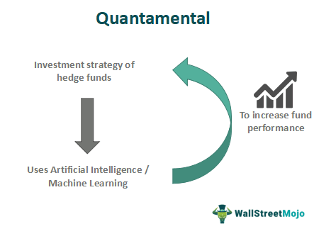

In the ever-evolving world of finance, trading strategies are constantly being reshaped by new technologies and methodologies. One such innovation is algorithmic trading, commonly referred to as algo trading, which has become a cornerstone in transforming how trades are executed. Algo trading leverages computer algorithms to automate trading processes, allowing traders to execute orders with unparalleled speed and precision.

Despite the effectiveness of algorithms, there's a growing paradigm shift towards a hybrid approach known as "quantamental." Quantamental trading marries the quantitative rigor of algorithmic strategies with the qualitative insights from fundamental analysis. As a result, this approach offers a comprehensive strategy that capitalizes on the strengths of both disciplines.

Quantitative analysis typically involves the use of mathematical models, statistical techniques, and algorithms to analyze data and identify trading opportunities. It is data-driven and focuses on patterns, trends, and statistical correlations. On the other hand, fundamental analysis evaluates economic indicators, company financials, management quality, and market conditions to assess the intrinsic value of assets. 

By blending these two methodologies, the quantamental approach aims to provide a more nuanced and robust decision-making framework. It has the potential to be a game-changer for traders, enabling them to not only improve trade execution but also gain a deeper understanding of market dynamics. This hybrid strategy enhances the decision-making process by offering a broad spectrum of data-driven insights combined with fundamental market knowledge. As a result, quantamental trading is poised to play a significant role in shaping the future trajectory of algorithmic trading.

## Table of Contents

## What is Quantamental?

Quantamental is a hybrid investment strategy that integrates both quantitative and fundamental analysis to create a comprehensive decision-making model. At the heart of quantamental investing is the idea that combining the strengths of quantitative and fundamental approaches can provide a more robust and adaptive strategy for identifying profitable trading opportunities.

Quantitative analysis forms one pillar of this approach, employing numerical methods, statistical models, and algorithms to systematically analyze large datasets. This form of analysis is adept at detecting patterns, trends, and correlations within financial markets through the use of mathematical models. Techniques such as regression analysis, time series analysis, and machine learning algorithms are commonly used to forecast price movements and execute trades effectively.

On the other hand, [fundamental analysis](/wiki/fundamental-analysis) emphasizes the scrutiny of a company's intrinsic value by evaluating financial statements, earnings reports, management effectiveness, competitive advantages, and market positions. This traditional form of analysis seeks to provide a deeper understanding of a company's long-term potential based on economic indicators and qualitative factors.

By merging these two methodologies, the quantamental approach benefits from the precision and scalability of quantitative analysis, while also incorporating the qualitative insights essential to fundamental analysis. This convergence allows investors to utilize a broader set of data inputs and insights. Consequently, quantamental strategies can adapt quickly to changing market conditions, offering an integrated framework that enhances decision-making capabilities.

Unlike pure quantitative models, which may rely strictly on past data for predictions, the quantamental approach can interpret broader economic contexts. This integration fosters the development of models that are not only data-driven but also contextually aware, thereby improving predictive accuracy. Furthermore, the hybrid nature of quantamental strategies can help mitigate the limitations inherent in relying solely on either quantitative or fundamental analysis, potentially leading to a more resilient investment framework.

## The Role of Quantamental in Algo Trading

Algo trading, or [algorithmic trading](/wiki/algorithmic-trading), employs algorithms to automate trade executions based on pre-defined rules, which can lead to high efficiency and reduced human error. By integrating quantamental strategies, algorithmic trading can be significantly enhanced, providing a sophisticated approach that incorporates both quantitative data and qualitative insights.

Quantamental strategies enrich algorithmic trading by embedding more comprehensive analyses into trading algorithms. These strategies consider a wide array of market and company-specific insights, enabling traders to make more informed decisions. The integration of quantamental analysis allows algorithms to adapt to different signals, recognizing patterns in both microeconomic situations, such as company earnings reports, and macroeconomic trends, like shifts in monetary policy. For instance, quantitatively, an algorithm could calculate a stock's [momentum](/wiki/momentum) using historical price data, while fundamentally, it might evaluate the stock's price-to-earnings ratio to assess its value.

This blended approach enhances the empirical rigor of trading models by incorporating both numerical analysis and broader economic narratives. Such a dual focus ensures that the trading systems can act on insights derived from extensive data processing while also considering vital fundamental factors like economic indicators or industry news.

The inherent advantage of integrating quantamental strategies within algorithmic trading lies in the potential for optimizing returns while effectively managing risks. Traditional algorithmic trading relies heavily on statistical models, which, although powerful, may overlook qualitative data crucial for understanding broader market contexts. By incorporating fundamental analysis, traders can cross-verify quantitative signals, filtering out noise and reducing the risk of overreliance on purely statistical models. This combination thereby lowers the potential for significant losses resulting from unforeseen fundamental shifts.

Furthermore, quantamental strategies enable a more agile response to changing market conditions. Algorithms can be programmed to adjust their parameters based on new fundamental data or economic forecasts, allowing for dynamic repositioning in swiftly evolving markets. This flexibility provides traders with a competitive edge, as they can capitalize on opportunities or mitigate risks more effectively.

In conclusion, the role of quantamental strategies in algo trading represents a significant advancement, allowing for a more nuanced trading approach that leverages both vast data insights and human judgment. By fusing quantitative precision with fundamental analysis, quantamental strategies push the boundaries of traditional algorithmic trading, thus potentially increasing returns and refining risk management.

## Benefits of Using Quantamental Strategies

Quantamental strategies offer a multifaceted approach to investment, blending quantitative and fundamental analysis to yield comprehensive insights. This hybrid strategy facilitates a more rounded and informed investment approach, inherent in its capability to synthesize vast data sets with qualitative insights. 

These strategies provide deeper market insights by integrating large-scale quantitative data with meaningful fundamental data points. For instance, while quantitative models might excel in pattern recognition and statistical anomalies, fundamental analysis contributes context, such as changes in management strategies or macroeconomic factors. This dual perspective enables investors to identify opportunities that could be overlooked by relying solely on either quantitative or fundamental approaches.

The combination of algorithmic power and human insight results in adaptive systems that potentially outperform traditional models. By incorporating [machine learning](/wiki/machine-learning) algorithms, these systems can continuously learn from new data, refining their models to optimize performance. This adaptability is crucial in financial markets, where rapid changes can render static models obsolete. The ability to assimilate both numerical data and qualitative insights endows this strategy with the flexibility to adjust to [volatility](/wiki/volatility-trading-strategies) and capture diverse investment opportunities.

Furthermore, quantamental methodologies shine in handling large data sets. Modern technology allows for the processing of enormous amounts of data, from high-frequency trading data to vast swathes of economic indicators. Quantamental strategies make use of this capability to react swiftly and accurately to market changes. They leverage advanced data analytics and algorithms to transform complex data into actionable insights, enabling traders to respond in real-time to evolving market conditions.

Another significant advantage of quantamental strategies is their contribution to risk diversification. By analyzing a wider array of factors, these strategies avoid the pitfalls of overspecialization and overfitting common to singular analysis methods. This diversification is achieved by evaluating both quantitative metrics, such as price movements and trading volumes, and qualitative factors, such as industry trends and regulatory impacts. Therefore, quantamental strategies can mitigate risks by ensuring that portfolios are not overly dependent on specific predictive models or market conditions.

In conclusion, quantamental strategies represent a formidable evolution in investment approaches, owing to their capacity to amalgamate the precision of quantitative analysis with the depth of fundamental assessment. As traders seek to navigate increasingly complex financial landscapes, these strategies offer robust tools for maximizing returns while managing risks effectively.

## Challenges and Considerations

Deploying quantamental strategies in algorithmic trading presents a number of challenges that must be carefully managed to achieve success. The integration of quantitative models, which rely heavily on numerical data and statistical techniques, with fundamental analysis, which focuses on the evaluation of company and market factors, necessitates a high level of expertise. Practitioners must be well-versed in both disciplines to create models that effectively leverage the strengths of each approach.

One major challenge is ensuring the quality and availability of data. Algorithms require vast amounts of data to function accurately, and any deficiencies in data quality can lead to erroneous outcomes. High-quality data feeds are essential for the algorithms to generate meaningful insights and execute trades effectively. This requirement can be difficult to meet, particularly when incorporating fundamental analysis, which often involves qualitative data that might not be readily available or quantifiable.

Balancing model complexity with operational simplicity is another critical consideration. Sophisticated models may capture nuances in market behavior, yet they also run the risk of overfitting—where a model learns the noise in the dataset rather than the actual signal. Overfitting reduces the model's ability to perform well on unseen data. Therefore, designers must strive for an optimal level of complexity that provides sufficient detail to inform trading decisions without being overly complicated. This often involves regular testing and validation of the algorithms to ensure robustness and adaptability.

The financial and resource costs associated with developing and maintaining these complex trading systems cannot be overlooked. Building such systems requires significant investment in both technology and human capital. It involves continuous updates and refinements to the algorithms, which demand skilled personnel capable of understanding both algorithmic trading and the nuances of quantamental strategies. This ongoing process can be resource-intensive and costly, particularly for smaller firms that may not have the same level of access to advanced technology and datasets as larger institutions.

In summary, while quantamental strategies offer substantial potential benefits in algorithmic trading, they also come with challenges that require thorough understanding and meticulous management. Balancing these considerations is crucial for traders aiming to harness the full power of quantamental approaches.

## The Future of Quantamental in Algo Trading

The future of quantamental strategies in algorithmic trading is poised for significant growth and development, driven largely by advancements in technology. The integration of machine learning and [artificial intelligence](/wiki/ai-artificial-intelligence) (AI) is expected to revolutionize quantamental approaches, enhancing their intuitiveness and efficacy. Machine learning algorithms can analyze vast datasets more efficiently than traditional methods, enabling traders to uncover patterns and insights that were previously unattainable. This capacity to process and learn from large volumes of data allows quantamental strategies to adapt rapidly to changing market conditions, thereby improving predictive accuracy and decision-making processes.

As the availability of high-quality data continues to increase, alongside exponential growth in computing power, the potential of quantamental trading systems will be further unlocked. This technological evolution supports the handling of complex and voluminous market data, thereby broadening the scope and precision of quantamental strategies. Increased data granularity and diversity can aid in creating more robust models that [factor](/wiki/factor-investing) in a wide range of variables, from macroeconomic indicators to individual company metrics.

The proliferation of quantamental strategies across different trading markets is likely to accelerate as these technologies mature. Sectors such as equities, commodities, and foreign exchange, which have traditionally been dominated by quantitative models, are beginning to see the infusion of fundamental insights into their trading algorithms. This cross-pollination aids in creating more comprehensive trading strategies that balance quantitative robustness with qualitative depth.

Ultimately, the integration of human intuition with data-driven precision stands to redefine trading paradigms, forging innovative paths in investments. By marrying the analytical capabilities of machines with human expertise, traders can develop adaptive strategies that respond dynamically to evolving market landscapes. This symbiosis not only enhances trading performance but also sets the stage for novel applications of quantamental approaches, solidifying their role in shaping the future of trading.

## Conclusion

Quantamental strategies represent a significant evolution in algorithmic trading, merging the strengths of quantitative and fundamental analysis. By synthesizing these distinct analytical methods, quantamental strategies introduce a nuanced approach to trading, efficiently blending data-driven insights with human judgment. This amalgamation allows traders to engage comprehensive datasets and sophisticated models while incorporating qualitative insights, thereby optimizing decision-making processes.

Despite the inherent complexities, the potential for enhanced returns and improved risk management with quantamental strategies is substantial. The strategic use of vast datasets combined with human expertise allows for refined risk assessment and opportunity identification, capabilities crucial for navigating volatile markets.

As technological advancements continue, quantamental strategies are anticipated to become integral to future trading paradigms. Developments in machine learning and artificial intelligence will further augment these strategies, enhancing their precision and adaptability. The expanding availability of data and increased computing power will empower these methodologies, enabling their broader adoption across various trading platforms.

Proactively embracing quantamental methodologies equips traders and firms with a competitive advantage in the algorithm-driven market landscape. By integrating sophisticated data analyses with critical human perspectives, these strategies position their adopters to effectively lead within the intensifying competition of algorithmic trading.

## References & Further Reading

[1]: Bergstra, J., Bardenet, R., Bengio, Y., & Kégl, B. (2011). ["Algorithms for Hyper-Parameter Optimization."](https://dl.acm.org/doi/10.5555/2986459.2986743) Advances in Neural Information Processing Systems 24.

[2]: ["Advances in Financial Machine Learning"](https://www.amazon.com/Advances-Financial-Machine-Learning-Marcos/dp/1119482089) by Marcos Lopez de Prado

[3]: ["Evidence-Based Technical Analysis: Applying the Scientific Method and Statistical Inference to Trading Signals"](https://www.amazon.com/Evidence-Based-Technical-Analysis-Scientific-Statistical/dp/0470008741) by David Aronson

[4]: ["Machine Learning for Algorithmic Trading"](https://github.com/stefan-jansen/machine-learning-for-trading) by Stefan Jansen

[5]: ["Quantitative Trading: How to Build Your Own Algorithmic Trading Business"](https://books.google.com/books/about/Quantitative_Trading.html?id=j70yEAAAQBAJ) by Ernest P. Chan