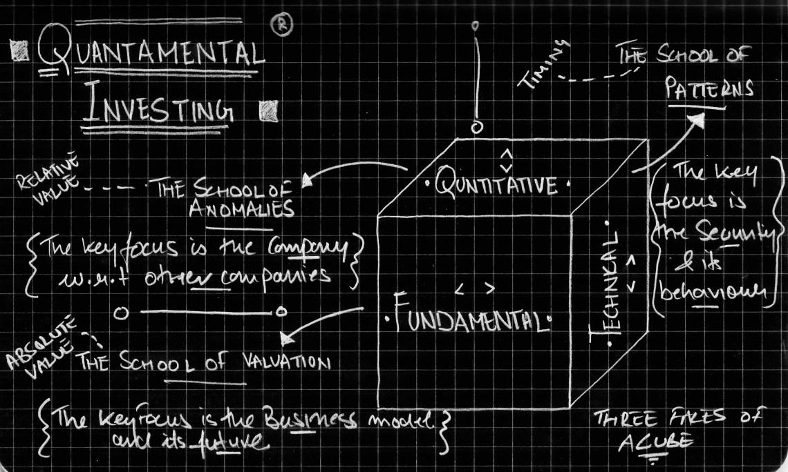

## Table of Contents

## What is the basic definition of Quantamental investing?

Quantamental investing is a way of making investment decisions that combines two different approaches: quantitative and fundamental analysis. Quantitative analysis uses math and computer models to look at lots of data and find patterns that can help predict how investments might do in the future. Fundamental analysis, on the other hand, involves looking closely at a company's financial health, its business model, and the overall economy to decide if it's a good investment.

By mixing these two methods, quantamental investing tries to get the best of both worlds. It uses the power of computers and big data to spot trends and opportunities that might be hard to see otherwise. At the same time, it keeps the human touch of fundamental analysis, which helps understand the real story behind the numbers. This approach can help investors make smarter choices by using both data-driven insights and a deep understanding of businesses and markets.

## How does Quantamental investing differ from traditional quantitative and fundamental investing?

Quantamental investing is different from traditional quantitative and fundamental investing because it mixes both methods together. Traditional quantitative investing relies a lot on numbers and computer models to make decisions. It looks at big sets of data to find patterns and make predictions about how investments will do. On the other hand, traditional fundamental investing focuses on understanding a company's financial health, its business model, and the economy. It's more about digging deep into a company's story and making decisions based on that understanding.

Quantamental investing takes the best parts of both worlds. It uses the power of computers and big data from quantitative methods to spot trends and opportunities that might be hard to see otherwise. But it also keeps the human touch of [fundamental analysis](/wiki/fundamental-analysis), which helps understand the real story behind the numbers. This mix helps investors make smarter choices by using both data-driven insights and a deep understanding of businesses and markets. So, while traditional methods stick to one approach, quantamental investing blends them to get a fuller picture.

## What are the key components of a Quantamental strategy?

A quantamental strategy has two main parts: quantitative analysis and fundamental analysis. The quantitative part uses math and computer models to look at lots of data. It helps find patterns and trends that can predict how investments might do in the future. This part is all about using numbers and technology to make smart guesses about the market.

The fundamental part is about understanding the real story behind the numbers. It involves looking closely at a company's financial health, its business model, and the overall economy. This helps investors see if a company is a good investment based on more than just numbers. By combining these two parts, a quantamental strategy tries to make the best investment decisions by using both data-driven insights and a deep understanding of businesses and markets.

## Can you explain how data is used in Quantamental investing?

In quantamental investing, data is used in a big way to help make smart investment choices. The quantitative part of quantamental investing uses lots of data and computer models to find patterns and trends. This means looking at things like stock prices, company earnings, and even social media to see what's happening in the market. By using all this data, investors can spot opportunities that might be hard to see just by looking at a company's financial reports. It's like using a big telescope to see more of the sky than you could with just your eyes.

The fundamental part of quantamental investing also uses data, but in a different way. Here, data helps investors understand the real story behind the numbers. They look at a company's financial statements, its business model, and the overall economy to see if it's a good investment. This part is more about digging deep into the data to see if the company is healthy and has a good future. By combining the big picture from quantitative data with the detailed story from fundamental data, quantamental investing helps investors make better decisions by seeing both the forest and the trees.

## What types of data are most important for Quantamental analysis?

In quantamental analysis, the most important types of data are financial data and market data. Financial data includes things like a company's earnings, balance sheets, and cash flow statements. This data helps investors understand how well a company is doing and if it's a good investment. Market data, on the other hand, includes stock prices, trading volumes, and economic indicators. This data helps investors see what's happening in the market and spot trends that could affect their investments.

Another important type of data is [alternative data](/wiki/best-alternative-data), which can include things like social media sentiment, satellite imagery, and credit card transactions. This data gives investors a different view of what's happening with a company or the market. By looking at all these different types of data together, quantamental investors can get a fuller picture of their investments. This helps them make smarter decisions by combining the big picture from market and financial data with the detailed insights from alternative data.

## How do Quantamental investors integrate machine learning and AI into their strategies?

Quantamental investors use [machine learning](/wiki/machine-learning) and AI to make their investment strategies better. They use these technologies to look at lots of data quickly and find patterns that might be hard to see otherwise. For example, machine learning can help them predict how stock prices might change by looking at past data. AI can also help by sorting through social media posts to see what people are saying about a company. This helps investors understand what's happening in the market and make smarter choices.

Machine learning and AI also help quantamental investors by making their fundamental analysis easier. These technologies can look at a company's financial reports and find important information faster than a person could. They can also help by predicting how a company might do in the future based on its past performance. By using machine learning and AI, quantamental investors can combine the power of big data with a deep understanding of businesses, making their investment decisions more informed and accurate.

## What are the advantages of using a Quantamental approach in investment decision-making?

Using a quantamental approach in investment decision-making has several big advantages. First, it combines the power of numbers and computers with a deep understanding of businesses. This means investors can use big data to spot trends and opportunities that might be hard to see otherwise. By looking at lots of data quickly, they can make predictions about how investments might do in the future. This helps them make smarter choices and find good investments that they might have missed if they only used one method.

Second, the quantamental approach keeps the human touch of fundamental analysis. This means investors don't just rely on numbers; they also look closely at a company's financial health, its business model, and the overall economy. By understanding the real story behind the numbers, they can make better decisions about whether a company is a good investment. This mix of data-driven insights and a deep understanding of businesses helps investors see both the big picture and the details, making their investment decisions more informed and accurate.

## What are the potential challenges and limitations of Quantamental investing?

One big challenge of quantamental investing is that it needs a lot of data and computer power. This can be expensive and hard to get for some investors. They need to have the right tools and technology to look at all the data and find the patterns that can help them make good investment choices. If they don't have these resources, it can be tough to use a quantamental approach effectively.

Another challenge is that even with all the data and technology, it can be hard to understand what it all means. Sometimes, the numbers and patterns can be confusing or misleading. Investors need to be careful and make sure they are looking at the right data and understanding it correctly. This means they need to have a good understanding of both the numbers and the businesses they are investing in, which can be a lot to handle.

Lastly, there's always the risk that the models and predictions made by computers might not be right. The market can change in ways that are hard to predict, and even the best models can get it wrong sometimes. This means that investors using a quantamental approach need to be ready to change their plans if things don't go as expected. It's important to keep learning and adjusting to make the best investment decisions.

## How can a beginner start implementing Quantamental techniques in their investment strategy?

For a beginner looking to start using quantamental techniques, it's important to first understand the basics of both quantitative and fundamental analysis. Start by learning how to read financial statements and understand a company's earnings, balance sheets, and cash flow. This will give you a good foundation in fundamental analysis. At the same time, try to get comfortable with basic data analysis tools like spreadsheets. You can use these to look at stock prices, trading volumes, and other market data. This will help you get a feel for the quantitative side of investing.

Once you have a basic understanding of both methods, you can start combining them. Begin by [picking](/wiki/asset-class-picking) a few companies you're interested in and look at their financial data. Use online resources or simple software to analyze this data and see if you can spot any trends or patterns. At the same time, read up on these companies to understand their business models and the overall economy. By mixing the numbers you find with the stories behind them, you can start making more informed investment decisions. Remember, it's a learning process, so take it step by step and keep practicing.

## What advanced tools and technologies are used by expert Quantamental investors?

Expert quantamental investors use advanced tools and technologies to make their investment strategies better. They use powerful computers and software to look at lots of data quickly. This includes things like machine learning and [artificial intelligence](/wiki/ai-artificial-intelligence) (AI). Machine learning helps them find patterns in the data that can predict how stock prices might change. AI can also help by sorting through social media posts to see what people are saying about a company. This gives investors a different view of what's happening in the market and helps them make smarter choices.

Another important tool is big data platforms. These platforms help investors gather and analyze huge amounts of information from different places. This can include financial data, market data, and even alternative data like satellite images or credit card transactions. By looking at all this data together, investors can get a fuller picture of their investments. They can also use advanced data visualization tools to see the data in a way that's easy to understand. This helps them spot trends and opportunities that might be hard to see otherwise.

## Can you provide examples of successful Quantamental investment strategies?

One example of a successful quantamental investment strategy is used by Renaissance Technologies. They are famous for their Medallion Fund, which has made huge profits over the years. They use a lot of math and computer models to look at data and find patterns. But they also have people who understand businesses and the economy. By mixing these two methods, they can make smart guesses about which investments will do well. This has helped them make a lot of money for their investors.

Another example is Two Sigma, a company that also uses quantamental strategies. They use machine learning and AI to look at lots of data, like stock prices and social media posts. This helps them see what's happening in the market and find good investment opportunities. But they also have experts who understand the stories behind the numbers. By combining the power of computers with a deep understanding of businesses, Two Sigma has been able to make successful investments and grow their business.

## How is the field of Quantamental investing expected to evolve in the future?

In the future, quantamental investing is expected to grow and change a lot. More and more investors will use big data, machine learning, and AI to make their investment decisions better. These technologies will help them look at even more data and find patterns that are hard to see now. This means they can make smarter guesses about which investments will do well. As these tools get better and easier to use, more people will be able to use them, not just big companies with lots of money.

At the same time, the human part of quantamental investing will still be important. Even with all the new technology, understanding the stories behind the numbers will still matter. Investors will need to keep learning about businesses and the economy to make the best choices. The mix of data-driven insights and a deep understanding of businesses will become even more powerful. This will help investors make better decisions and find good investments in a world that's always changing.

## References & Further Reading

[1]: Bergstra, J., Bardenet, R., Bengio, Y., & Kégl, B. (2011). ["Algorithms for Hyper-Parameter Optimization."](https://dl.acm.org/doi/10.5555/2986459.2986743) Advances in Neural Information Processing Systems 24.

[2]: ["Advances in Financial Machine Learning"](https://www.amazon.com/Advances-Financial-Machine-Learning-Marcos/dp/1119482089) by Marcos Lopez de Prado

[3]: ["Evidence-Based Technical Analysis: Applying the Scientific Method and Statistical Inference to Trading Signals"](https://www.amazon.com/Evidence-Based-Technical-Analysis-Scientific-Statistical/dp/0470008741) by David Aronson

[4]: ["Machine Learning for Algorithmic Trading"](https://github.com/stefan-jansen/machine-learning-for-trading) by Stefan Jansen

[5]: ["Quantitative Trading: How to Build Your Own Algorithmic Trading Business"](https://books.google.com/books/about/Quantitative_Trading.html?id=j70yEAAAQBAJ) by Ernest P. Chan