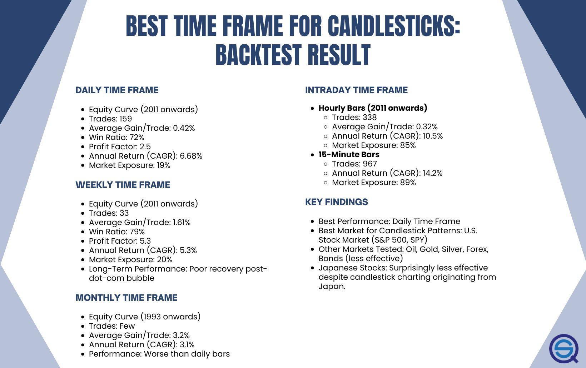

## Table of Contents

## What are candlestick charts and why are they used in trading?

Candlestick charts are a type of financial chart used to show how the price of something, like a stock or a currency, changes over time. Each "candlestick" on the chart represents the price movement of that thing during a certain period, like a day or an hour. The candlestick has a wide part, called the "body," which shows the opening and closing prices. If the body is filled or dark, it means the closing price was lower than the opening price. If it's empty or light, it means the closing price was higher than the opening price. The thin lines above and below the body, called "wicks" or "shadows," show the highest and lowest prices during that period.

People use candlestick charts in trading because they make it easy to see patterns and trends in price movements. By looking at these patterns, traders can try to guess what might happen to the price next. For example, certain patterns might suggest that the price is going to go up or down soon. This can help traders decide when to buy or sell. Candlestick charts are popular because they give a lot of information in a clear and simple way, which can help traders make better decisions.

## What is a time frame in the context of candlestick charts?

A time frame in the context of candlestick charts is the length of time that each candlestick represents. It could be a minute, an hour, a day, or even longer. When you look at a candlestick chart, each candlestick shows you what happened to the price during that specific time frame. If you choose a shorter time frame, like one minute, you'll see more candlesticks on the chart, and they'll show you quick changes in the price. If you choose a longer time frame, like one day, you'll see fewer candlesticks, and they'll show you bigger changes over time.

Traders use different time frames depending on what they're trying to do. If someone is a day trader, they might use a short time frame, like five minutes, to make quick decisions about buying and selling. On the other hand, if someone is investing for the long term, they might use a longer time frame, like a month, to see the bigger picture and make decisions that will affect their investments over a longer period. The choice of time frame can really change how you see the market and make your trading strategy.

## How does the choice of time frame affect trading decisions?

The choice of time frame can really change how a trader sees the market and makes decisions. If a trader picks a short time frame, like a few minutes, they will see a lot of quick ups and downs in the price. This can be good for day traders who want to buy and sell fast to make small profits many times a day. But, it can also be risky because the market can be very unpredictable in short periods.

On the other hand, if a trader chooses a longer time frame, like a day or a week, they will see bigger trends and patterns. This can be better for people who are investing for the long term and want to make decisions that will pay off over time. Longer time frames can help traders see the bigger picture and avoid getting too caught up in the small, quick changes that might not matter in the long run.

In the end, the time frame a trader picks depends on their goals and how much risk they are willing to take. Short time frames can lead to quick decisions and more trades, while longer time frames can lead to more thoughtful decisions and fewer trades. Both ways have their own advantages and challenges, and the best choice depends on what the trader is trying to achieve.

## What are the most common time frames used in candlestick analysis?

The most common time frames used in candlestick analysis are minutes, hours, days, and weeks. For people who trade a lot during the day, called day traders, they often use short time frames like 1 minute, 5 minutes, or 15 minutes. These short time frames help them see quick changes in the price and make fast decisions about buying and selling. They want to catch small moves in the market to make profits quickly.

For people who are investing for the long term, they usually look at longer time frames like 1 hour, 1 day, or 1 week. These longer time frames help them see bigger trends and patterns in the market. They are not worried about the small ups and downs that happen every minute or hour. Instead, they want to understand how the price is moving over days or weeks to make decisions that will pay off over time.

Some traders also use a mix of different time frames to get a better view of the market. They might look at a short time frame to decide when to buy or sell, but also check a longer time frame to make sure their decision fits with the bigger trend. This way, they can use the best of both worlds to make smarter trading choices.

## What are the advantages of using shorter time frames like 1-minute or 5-minute charts?

Using shorter time frames like 1-minute or 5-minute charts can help traders see quick changes in the price. This is good for day traders who want to buy and sell fast to make small profits many times a day. They can catch small moves in the market and make quick decisions based on what they see. This can be exciting and can lead to more chances to make money in a short time.

But, using short time frames can also be risky. The market can be very unpredictable in short periods, and prices can go up and down a lot. This means traders need to be ready to act fast and be okay with taking more risks. If they are not careful, they might make quick decisions that lead to losses instead of profits. So, while short time frames can offer more trading opportunities, they also require a lot of attention and quick thinking.

## What are the benefits of using longer time frames such as daily or weekly charts?

Using longer time frames like daily or weekly charts helps traders see the bigger picture of the market. Instead of focusing on quick ups and downs, they can see bigger trends and patterns that happen over days or weeks. This is good for people who are investing for the long term because they want to make decisions that will pay off over time. They don't worry about the small changes that happen every minute or hour. Instead, they look at how the price is moving over a longer period to understand where it might be going next.

Longer time frames can also help traders make more thoughtful decisions. When you look at a daily or weekly chart, you have more time to think about your next move. You don't need to act as fast as you would with a 1-minute or 5-minute chart. This can lead to fewer trades, but the decisions you make can be more careful and based on a better understanding of the market. This way, traders can avoid getting too caught up in the small, quick changes that might not matter in the long run.

## How can different time frames be used together in multi-time frame analysis?

Multi-time frame analysis means looking at the same thing, like a stock or a currency, using different time frames at the same time. Traders do this to get a better view of the market. They might use a short time frame, like a 5-minute chart, to see quick changes and decide when to buy or sell. But they also look at a longer time frame, like a daily chart, to make sure their decision fits with the bigger trend. This way, they can use the best of both worlds to make smarter trading choices.

For example, a trader might see a good buying opportunity on a 5-minute chart. But before they buy, they check the daily chart to see if the overall trend is going up. If it is, they feel more confident about their decision. If the daily chart shows the trend is going down, they might decide not to buy, even if the 5-minute chart looks good. By using different time frames together, traders can make decisions that are based on both short-term moves and long-term trends.

## What are the potential pitfalls of using very short time frames for trading?

Using very short time frames for trading, like 1-minute or 5-minute charts, can be risky. The market can change a lot in a short time, and prices can go up and down quickly. This means traders need to make fast decisions, and if they are not careful, they might make mistakes. They could buy or sell at the wrong time and lose money instead of making a profit. It's easy to get caught up in the excitement of quick trades, but this can lead to bad decisions if traders are not careful.

Another problem with short time frames is that they can be stressful. Traders need to watch the market all the time and be ready to act fast. This can be tiring and might make them feel rushed or anxious. If they are not good at handling stress, they might make choices based on their feelings instead of thinking clearly. So, while short time frames can offer more chances to make money, they also come with more risks and can be hard on a trader's mind and body.

## How does the time frame choice impact the accuracy of technical indicators?

The time frame you choose can change how well technical indicators work. Technical indicators are tools that help traders guess what the market might do next. When you use a short time frame, like a 1-minute chart, the indicators can change a lot and very quickly. This can make them less reliable because the market can be unpredictable in short periods. Traders might see a signal to buy or sell, but it could be a false alarm because the market can change direction fast.

On the other hand, using a longer time frame, like a daily chart, can make technical indicators more reliable. The signals from the indicators are based on bigger trends and patterns that happen over days or weeks. This means the signals are less likely to be false alarms because they are based on more stable information. Traders who use longer time frames can make more accurate decisions because the indicators are less affected by the quick ups and downs of the market.

## What strategies are best suited for different time frames?

For short time frames like 1-minute or 5-minute charts, the best strategies are ones that focus on quick trades. Day traders often use these short time frames to catch small moves in the market. They might use strategies like [scalping](/wiki/gamma-scalping), where they buy and sell very quickly to make small profits many times a day. Another strategy is [momentum](/wiki/momentum) trading, where they look for quick changes in the price and try to follow the trend for a short time. These strategies need traders to be fast and ready to act, but they can be risky because the market can change a lot in a short time.

For longer time frames like daily or weekly charts, the best strategies are ones that focus on bigger trends and patterns. Long-term investors often use these longer time frames to make decisions that will pay off over time. They might use strategies like [trend following](/wiki/trend-following), where they look at the overall direction of the market and try to buy when the trend is going up and sell when it's going down. Another strategy is position trading, where they hold onto their investments for weeks or months to take advantage of big moves in the market. These strategies need patience and a good understanding of the bigger picture, but they can be less stressful and more reliable than quick trades.

Using a mix of different time frames can also be a good strategy. Traders might use a short time frame to decide when to buy or sell, but also check a longer time frame to make sure their decision fits with the bigger trend. This way, they can use the best of both worlds to make smarter trading choices. By looking at different time frames together, traders can make decisions that are based on both short-term moves and long-term trends.

## How can traders determine the optimal time frame for their trading style and goals?

Traders can figure out the best time frame for their trading style and goals by thinking about what they want to achieve and how much risk they are okay with. If a trader wants to make quick profits and is ready to take more risks, they might choose a short time frame like 1-minute or 5-minute charts. These short time frames are good for day traders who want to buy and sell fast to catch small moves in the market. But, they need to be ready to act fast and be okay with the market changing a lot in a short time.

On the other hand, if a trader wants to invest for the long term and is looking for bigger trends, they might choose a longer time frame like daily or weekly charts. These longer time frames are good for people who want to make decisions that will pay off over time. They don't need to worry about the quick ups and downs of the market and can take their time to think about their next move. By understanding their own goals and how much risk they are willing to take, traders can pick the time frame that works best for them.

## What advanced techniques can be applied to analyze candlestick patterns across various time frames?

One advanced technique for analyzing candlestick patterns across different time frames is called multi-time frame analysis. This means looking at the same thing, like a stock or a currency, using different time frames at the same time. Traders might use a short time frame, like a 5-minute chart, to see quick changes and decide when to buy or sell. But they also look at a longer time frame, like a daily chart, to make sure their decision fits with the bigger trend. By using different time frames together, traders can make decisions that are based on both short-term moves and long-term trends. This can help them avoid false signals and make more accurate trades.

Another technique is using technical indicators in combination with candlestick patterns. Technical indicators are tools that help traders guess what the market might do next. When using different time frames, traders can apply these indicators to see how they work on short and long time frames. For example, a trader might see a bullish candlestick pattern on a 15-minute chart, but they will also check the same pattern on a daily chart to see if the overall trend supports the short-term signal. By combining candlestick patterns with technical indicators across various time frames, traders can get a more complete picture of the market and make better-informed decisions.

## References & Further Reading

[1]: ["Advances in Financial Machine Learning"](https://www.amazon.com/Advances-Financial-Machine-Learning-Marcos/dp/1119482089) by Marcos Lopez de Prado

[2]: ["Evidence-Based Technical Analysis: Applying the Scientific Method and Statistical Inference to Trading Signals"](https://www.amazon.com/Evidence-Based-Technical-Analysis-Scientific-Statistical/dp/0470008741) by David Aronson

[3]: ["Machine Learning for Algorithmic Trading"](https://github.com/stefan-jansen/machine-learning-for-trading) by Stefan Jansen

[4]: ["Quantitative Trading: How to Build Your Own Algorithmic Trading Business"](https://www.amazon.com/Quantitative-Trading-Build-Algorithmic-Business/dp/1119800064) by Ernest P. Chan

[5]: Bergstra, J., Bardenet, R., Bengio, Y., & Kégl, B. (2011). ["Algorithms for Hyper-Parameter Optimization."](https://proceedings.neurips.cc/paper/2011/file/86e8f7ab32cfd12577bc2619bc635690-Paper.pdf) Advances in Neural Information Processing Systems 24.