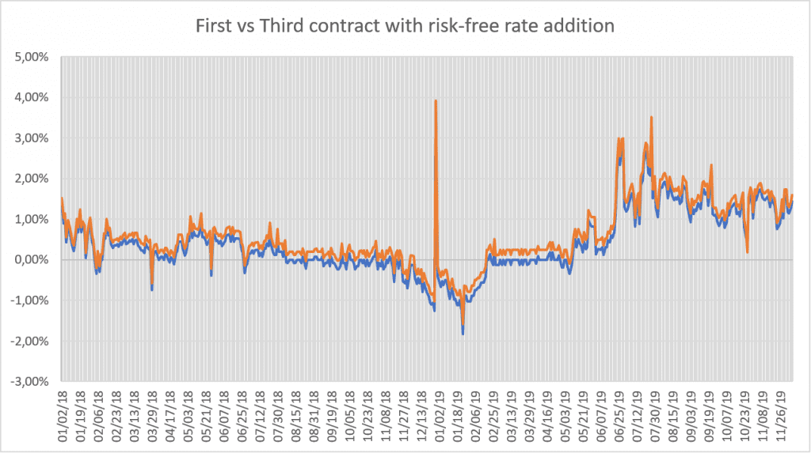

## Table of Contents

## What is the concept of a risk-free interest rate?

The risk-free interest rate is the rate of return on an investment that is considered to have no risk of financial loss. It's like the safest place you can put your money where you're sure to get it back, plus a little extra. Think of it as a baseline for other investments; if something else offers a higher return, it's because it comes with more risk.

In real life, people often use government bonds, especially those from stable governments like the U.S., to represent the risk-free rate. These bonds are seen as very safe because it's unlikely that a strong government would fail to pay back its debts. However, even these can have some tiny risks, so the true risk-free rate is more of an idea we use to help compare other investments.

## How does the risk-free interest rate apply to traditional financial systems?

In traditional financial systems, the risk-free interest rate is super important because it helps people figure out if other investments are worth it. Imagine you have some money to invest. You could put it in a super safe place like a government bond and earn the risk-free rate. But if another investment offers more money back, you might be tempted to go for that instead. The catch is, the higher return usually means higher risk. So, the risk-free rate helps you decide if the extra risk is worth the extra reward.

Banks and financial companies also use the risk-free rate when they decide how much to charge for loans or how much to pay on savings accounts. If the risk-free rate goes up, banks might raise the interest rates on loans to keep making a profit. On the flip side, if the risk-free rate drops, savings accounts might not pay as much. This rate is like a guidepost that helps everyone in the financial world make smarter choices about money.

## What is Bitcoin and how does it differ from traditional currencies?

Bitcoin is a type of digital money that people can use to buy things online. It's different from regular money because it's not controlled by any government or bank. Instead, it uses something called blockchain technology, which is like a big, public record book that keeps track of all Bitcoin transactions. People can send Bitcoin to each other directly without needing a bank in the middle, and they use special computer codes to keep everything safe and private.

Traditional currencies, like dollars or euros, are controlled by governments and banks. They can print more money or change interest rates, which affects how much the money is worth. With Bitcoin, nobody can do that because it's designed to have a limited supply. Also, traditional money is usually physical, like coins and paper, while Bitcoin only exists on the internet. This makes Bitcoin easier to use for online shopping but can make it harder to use in everyday life where people are used to using physical money.

## Can Bitcoin have a risk-free interest rate, and if so, how is it defined?

Bitcoin can't really have a risk-free [interest rate](/wiki/interest-rate-trading-strategies) like traditional currencies do. The main reason is that Bitcoin is super risky. Its value can go up and down a lot, and there's no government or bank to back it up if something goes wrong. So, when people talk about [earning](/wiki/earning-announcement) interest with Bitcoin, it's usually from things like lending it out or putting it in special savings accounts on crypto platforms. But these are not risk-free because the platforms can fail, or the value of Bitcoin can drop.

Even though we can't call any Bitcoin interest "risk-free," people still try to find ways to earn money with their Bitcoin. Some platforms offer interest rates on Bitcoin savings accounts, but these rates are based on the risks those platforms take, like lending out the Bitcoin to others. So, while you might earn interest, it's not the same as the safe, steady interest you get from a government bond. In the world of Bitcoin, there's always some level of risk involved.

## What are the factors that influence Bitcoin's risk-free interest rate?

Bitcoin doesn't really have a risk-free interest rate because it's too risky. Unlike money from a government, Bitcoin's value can change a lot. It's not backed by a bank or a country, so there's no one to help if things go wrong. When people talk about earning interest on Bitcoin, they're usually talking about lending it out or putting it in special accounts on crypto platforms. But these ways of earning interest aren't risk-free. The platforms can fail, or the value of Bitcoin can drop, which means you might lose money instead of earning interest.

Even though Bitcoin doesn't have a true risk-free interest rate, some things can affect the interest rates offered on crypto platforms. The demand for borrowing Bitcoin can push up the interest rates because more people want to borrow it. Also, the overall risk in the crypto market can change these rates. If people think Bitcoin is riskier, they might want more interest to lend it out. But remember, no matter what, these rates are never as safe as the interest you get from a government bond.

## How is the risk-free interest rate for Bitcoin calculated or estimated?

Bitcoin doesn't have a true risk-free interest rate because it's too risky. Unlike money from a government, Bitcoin's value can go up and down a lot. There's no bank or country backing it up, so if something goes wrong, there's no one to help. When people talk about earning interest on Bitcoin, they're usually talking about lending it out or putting it in special accounts on crypto platforms. But these ways of earning interest aren't risk-free. The platforms can fail, or the value of Bitcoin can drop, which means you might lose money instead of earning interest.

Even though Bitcoin doesn't have a true risk-free interest rate, people still try to estimate what kind of interest they might get. They look at things like how much people want to borrow Bitcoin, which can push up the interest rates because more people want to borrow it. They also think about how risky the whole crypto market is. If people think Bitcoin is riskier, they might want more interest to lend it out. But no matter what, these rates are never as safe as the interest you get from a government bond.

## What role do Bitcoin lending platforms play in determining its risk-free interest rate?

Bitcoin lending platforms are key in figuring out what kind of interest rates people might get on Bitcoin, but they don't create a risk-free rate. These platforms let people lend out their Bitcoin to others who want to borrow it. The interest rate they offer depends on how many people want to borrow Bitcoin and how much risk they think is involved. If lots of people want to borrow, the platform might offer higher interest rates to attract lenders. But since Bitcoin's value can change a lot and the platforms themselves can fail, there's always some risk involved.

Even though these platforms help set interest rates, they can't make Bitcoin's interest rate risk-free. The rates they offer are more like a guess based on what's happening in the crypto world at the time. If people think Bitcoin is riskier, they might want higher interest to lend it out. So, while Bitcoin lending platforms play a big role in deciding what interest rates look like, they can't give you the same kind of safe, steady interest you get from a government bond.

## How does the volatility of Bitcoin affect its risk-free interest rate?

Bitcoin is super risky because its value can change a lot, going up and down quickly. This makes it hard to talk about a risk-free interest rate for Bitcoin. A risk-free interest rate is like the safest interest you can get, usually from government bonds. But because Bitcoin's value can swing so much, it's not safe at all. If you lend out Bitcoin and its value drops, you might get back less than you started with, even if you get some interest.

The big swings in Bitcoin's value make people want more interest to lend it out. If Bitcoin is really risky, lenders will want a higher reward to take that risk. So, the interest rates on Bitcoin lending platforms go up and down with how risky people think Bitcoin is. But no matter what, these rates can't be called risk-free because Bitcoin itself is too unpredictable. So, while the [volatility](/wiki/volatility-trading-strategies) of Bitcoin affects the interest rates people might get, it keeps them far from being risk-free.

## What are the implications of Bitcoin's risk-free interest rate for investors?

For investors, the fact that Bitcoin doesn't have a risk-free interest rate means they need to be careful. Unlike money from a government, where you can get a safe, steady interest rate, Bitcoin's value can go up and down a lot. This makes it risky to lend out Bitcoin or put it in special accounts that promise to pay interest. If the value of Bitcoin drops, you might lose money even if you get some interest. So, investors need to think about this risk and decide if the chance of earning more interest is worth the chance of losing money.

Because Bitcoin is so unpredictable, the interest rates on Bitcoin lending platforms can change a lot. If people think Bitcoin is riskier, they might want more interest to lend it out. This means the rates can be higher than what you get from a government bond, but they're not safe. Investors need to keep an eye on what's happening in the crypto world and be ready for the rates to go up and down. So, while Bitcoin can offer the chance to earn more interest, it comes with a lot of risk that investors need to understand and be okay with.

## How do regulatory environments impact Bitcoin's risk-free interest rate?

Regulatory environments play a big role in how risky Bitcoin is, which affects the interest rates people might get. If a country has strict rules about cryptocurrencies, it might make people feel safer about using Bitcoin. But if the rules are unclear or change a lot, it can make Bitcoin seem riskier. This means lenders might want more interest to take that risk. So, the interest rates on Bitcoin lending platforms can go up or down based on what the government is doing.

Even though regulations can change how risky Bitcoin feels, they can't make it have a risk-free interest rate. Bitcoin is still a lot riskier than money from a government because its value can change quickly. No matter what the rules are, there's always a chance you could lose money if you lend out Bitcoin. So, while regulations can affect the interest rates people might get, they can't make those rates safe and steady like a government bond.

## What are the differences between Bitcoin's risk-free interest rate and those of other cryptocurrencies?

Bitcoin and other cryptocurrencies don't really have a risk-free interest rate because they're all pretty risky. Bitcoin's value can go up and down a lot, and it's not backed by any government or bank. This means that if you lend out Bitcoin or put it in special accounts to earn interest, you might lose money if its value drops. Other cryptocurrencies are similar, but they can be even riskier because they might not be as popular or well-known as Bitcoin. So, the interest rates you might get from lending out other cryptocurrencies can be different, but they're never safe like the interest from a government bond.

The interest rates for different cryptocurrencies can change based on how much people want to borrow them and how risky they seem. If a [cryptocurrency](/wiki/cryptocurrency) is really popular and lots of people want to borrow it, the interest rates might be higher to attract lenders. But if a cryptocurrency is new or not many people use it, it might be seen as riskier, and lenders might want even more interest to lend it out. Even though these rates can go up and down, they're always riskier than the steady, safe interest you get from a government bond.

## How might future developments in blockchain technology influence Bitcoin's risk-free interest rate?

Future developments in blockchain technology could change how risky Bitcoin is, but it won't make it have a risk-free interest rate. If new technology makes Bitcoin transactions faster and safer, people might feel more confident about using it. This could mean more people want to borrow Bitcoin, which might push up the interest rates on lending platforms. But even with better technology, Bitcoin's value can still go up and down a lot, so it will always be risky to lend it out or put it in special accounts to earn interest.

Even though better blockchain technology can't make Bitcoin's interest rate risk-free, it could help make the crypto world a bit less risky. If new tech makes it easier to track where Bitcoin is going and stops people from cheating, lenders might not want as much interest to lend it out. But no matter what, Bitcoin will never be as safe as money from a government because there's no one to back it up if things go wrong. So, while future tech can change the interest rates people might get, it can't make them safe and steady like a government bond.

## What is the influence of fiat currency risk-free rates?

The concept of a risk-free rate in traditional fiat currencies is often associated with the yield offered by government-issued securities, such as Treasury Bills in the United States. These instruments are considered virtually default-risk free due to the government's ability to tax and print money. In contrast, Bitcoin lacks similar backing, which complicates the establishment of a universally accepted risk-free rate. Nonetheless, the interaction between Bitcoin's risk-free rate approximations and the established rates for fiat currencies holds significant implications for portfolio management, especially in [algorithmic trading](/wiki/algorithmic-trading).

Algorithmic trading strategies often involve balancing the perceived risk-free rate of Bitcoin with additional holdings in conventional fiat-denominated risk-free assets. For instance, holding cash or investing in Treasury Bills can serve as a baseline for gauging portfolio performance. These fiat instruments provide predictable returns and serve as a hedge against the volatility intrinsic to Bitcoin. By incorporating fiat risk-free rates, traders can better evaluate the performance of their Bitcoin positions, adjusting for the foundational economic backdrop provided by these stable instruments.

Consider the example where $r_f$ represents the traditional risk-free rate from Treasury Bills, while $r_{bf}$ is the approximated risk-free rate for Bitcoin derived through mechanisms such as futures pricing. The net return of an algorithmic trading strategy can be analyzed by considering both these rates:

$$
R_{\text{net}} = R_{\text{portfolio}} - (\alpha \cdot r_f + \beta \cdot r_{bf})
$$

Where $\alpha$ and $\beta$ signify the portion of the portfolio allocated to fiat risk-free assets and Bitcoin, respectively. This formula illustrates how the portfolio return $R_{\text{portfolio}}$ is adjusted by the influence of both fiat and Bitcoin risk-free rates, allowing for a comprehensive assessment of portfolio performance.

In sum, the interplay between fiat currency risk-free rates and Bitcoin approximations influences decision-making in Bitcoin trading strategies. Utilizing these different risk-free rates can mitigate risks, balance portfolios, and enhance the efficiency of Bitcoin-related trading initiatives. This interplay underscores the need for further research to precisely define and navigate risk-free returns within the Bitcoin ecosystem.

## References & Further Reading

[1]: Narayanan, A., Bonneau, J., Felten, E., Miller, A., & Goldfeder, S. (2016). ["Bitcoin and Cryptocurrency Technologies: A Comprehensive Introduction"](https://press.princeton.edu/books/hardcover/9780691171692/bitcoin-and-cryptocurrency-technologies). Princeton University Press.

[2]: Lopez de Prado, M. (2018). ["Advances in Financial Machine Learning"](https://www.amazon.com/Advances-Financial-Machine-Learning-Marcos/dp/1119482089). Wiley.

[3]: Ametrano, F. M. (2016). ["Hayek Money: The Cryptocurrency Price Stability Solution."](https://papers.ssrn.com/sol3/papers.cfm?abstract_id=2425270) Ledger.

[4]: Hull, J. C. (2017). ["Options, Futures, and Other Derivatives"](https://www.amazon.com/Options-Futures-Other-Derivatives-10th/dp/013447208X). Pearson.

[5]: Antonopoulos, A. M. (2017). ["Mastering Bitcoin: Unlocking Digital Cryptocurrencies"](https://books.google.com/books/about/Mastering_Bitcoin.html?id=IXmrBQAAQBAJ). O'Reilly Media.

[6]: Gandal, N., & Halaburda, H. (2016). ["Can We Predict the Winner in a Market with Network Effects? Competition in Cryptocurrency Market."](https://papers.ssrn.com/sol3/papers.cfm?abstract_id=2832836) Games.