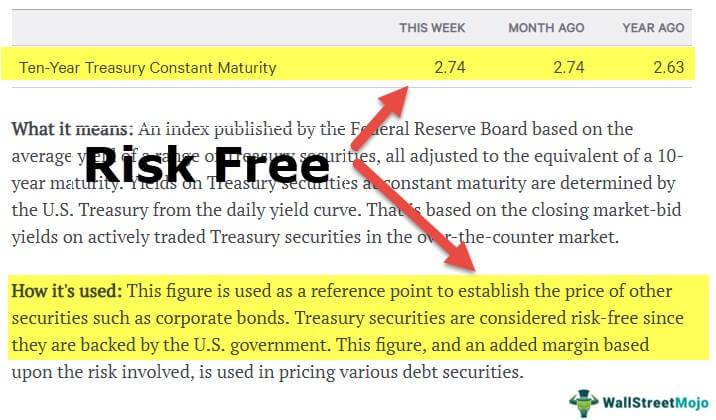

Bitcoin is a decentralized digital currency that operates without a central authority or single administrator. It was introduced in 2009 by an individual or group of individuals using the pseudonym Satoshi Nakamoto. Bitcoin leverages blockchain technology to enable peer-to-peer transactions, which has led some proponents to view it as a potential future payment method. Its decentralized nature and limited supply are often cited as strengths in the context of financial independence and as a hedge against inflation in traditional fiat currencies.

However, Bitcoin is also recognized as a speculative asset class, characterized by significant price volatility. This volatility presents both opportunities and risks for investors. On one hand, Bitcoin has demonstrated the potential for substantial returns on investment, attracting those seeking high-risk, high-reward financial opportunities. On the other hand, its volatile price swings can lead to significant financial losses, making it a risky asset for conservative investors. The decision to invest in Bitcoin, therefore, requires careful analysis of both its potential as an innovative payment system and its associated investment risks.



In traditional financial markets, a key concept is the risk-free interest rate, often represented by the return on government bonds. This rate assumes no default risk, offering investors a benchmark for evaluating the performance of various financial assets. In theory, the risk-free rate serves as a baseline, providing a minimum expected return that compensates for opportunity costs without exposure to credit risk. 

Applying the risk-free interest rate concept to Bitcoin poses significant challenges. Unlike government-backed fiat currencies, Bitcoin does not have an inherent risk-free rate due to its lack of government backing and inherent volatility. This absence complicates traditional assessments of investment strategies, particularly within algorithmic trading, where a baseline risk-free rate is pivotal for benchmarking performance and assessing risk-adjusted returns.

The goal of identifying a risk-free yield for Bitcoin within algorithmic trading involves exploring various financial instruments and markets that could approximate such a rate. While no direct analogue to government bonds exists for Bitcoin, regulated derivatives markets, such as futures contracts, may offer insights. These approximations could help investors and traders manage their strategies by providing a relative performance measure anchored in an understanding of Bitcoin's unique market dynamics.

## Table of Contents

## Understanding the Risk-Free Rate

The risk-free [interest rate](/wiki/interest-rate-trading-strategies) in traditional financial markets is conventionally associated with the return on government bonds, particularly those issued by stable and economically sound governments. These bonds are considered to have a negligible chance of default, making them a benchmark for what is deemed "risk-free." The assumption here is that government bonds are backed by the full faith and credit of the issuing country, significantly reducing the likelihood of non-repayment. Consequently, investors view these bonds as a secure storage of capital, expecting a steady yield over their duration.

Risk-free rates differ across currencies due to variations in economic conditions, fiscal policies, and monetary policies of respective countries. For instance, U.S. Treasury bills are often referenced for the risk-free rate in USD calculations. Similarly, German bunds might be used for the Euro. The divergence in these rates is reflective of differing inflation expectations, central bank policies, and issuer credit ratings. 

In the context of investment strategies, risk-free rates are pivotal. They serve as a fundamental building block in financial models like the Capital Asset Pricing Model (CAPM), where they are used to determine an expected return on an investment by factoring in market risk. The risk-free rate thus anchors the valuation of various assets and the pricing models that guide investment decisions.

In [algorithmic trading](/wiki/algorithmic-trading), which often relies on quantitative models to execute trades, the risk-free rate is instrumental in performance measurement and strategic planning. For instance, the Sharpe ratio, a popular metric, evaluates risk-adjusted returns by calculating the excess return over the risk-free rate relative to the investment’s [volatility](/wiki/volatility-trading-strategies). A higher Sharpe ratio implies better risk-adjusted performance, making the risk-free rate a critical variable in assessing and optimizing trading algorithms.

By providing a baseline for expected returns without risk, the risk-free rate allows traders and investors to compare the additional risks taken by investing in more volatile assets and to devise strategies that balance potential returns against acceptable risk levels.

## Establishing a Risk-Free Rate for Bitcoin

Bitcoin, unlike traditional fiat currencies, does not have a natural risk-free rate due to several factors, primarily its inherent volatility and lack of government backing. In traditional financial markets, the risk-free rate is often represented by the yield on government bonds, which are considered virtually free of credit risk. However, Bitcoin, being a decentralized digital asset, lacks an equivalent underlying asset or institution that can guarantee such a negligible default risk.

One potential approach to approximate a Bitcoin risk-free rate is through the use of regulated derivatives markets, such as the Chicago Mercantile Exchange (CME) futures. Futures contracts are standardized agreements to buy or sell an asset at a predetermined future date and price. In the context of Bitcoin, these contracts allow traders to speculate on or hedge against future price movements within a regulated framework, providing a modicum of stability and transparency absent in unregulated markets.

The futures market can shed light on the Bitcoin risk-free rate through its pricing mechanisms, particularly the concepts of contango and backwardation. Contango occurs when the futures price of Bitcoin is higher than the expected future spot price. This situation typically indicates that traders anticipate rising prices, often due to carrying costs such as storage or financing. In contrast, backwardation happens when the futures price is lower than the expected spot price, suggesting expectations of declining prices or a premium on immediate availability. 

These conditions in the futures market can provide insights into investor sentiment and expectations regarding Bitcoin's future performance, akin to how interest rates reflect economic forecasts and inflation expectations in fiat currency markets. By analyzing the structure and trends in Bitcoin futures prices, one can derive an implicit rate of return that investors require for holding or delaying a position in Bitcoin, serving as an approximation of a risk-free rate.

In sum, while Bitcoin does not possess a natural risk-free rate, the use of regulated derivatives markets like CME futures offers a promising avenue to estimate this financial metric. Understanding the dynamics of contango and backwardation in these markets can provide valuable insights for algorithmic trading strategies and risk management in the volatile environment of Bitcoin investment.

## Influence of Fiat Currency Risk-Free Rates

The concept of a risk-free rate in traditional fiat currencies is often associated with the yield offered by government-issued securities, such as Treasury Bills in the United States. These instruments are considered virtually default-risk free due to the government's ability to tax and print money. In contrast, Bitcoin lacks similar backing, which complicates the establishment of a universally accepted risk-free rate. Nonetheless, the interaction between Bitcoin's risk-free rate approximations and the established rates for fiat currencies holds significant implications for portfolio management, especially in algorithmic trading.

Algorithmic trading strategies often involve balancing the perceived risk-free rate of Bitcoin with additional holdings in conventional fiat-denominated risk-free assets. For instance, holding cash or investing in Treasury Bills can serve as a baseline for gauging portfolio performance. These fiat instruments provide predictable returns and serve as a hedge against the volatility intrinsic to Bitcoin. By incorporating fiat risk-free rates, traders can better evaluate the performance of their Bitcoin positions, adjusting for the foundational economic backdrop provided by these stable instruments.

Consider the example where $r_f$ represents the traditional risk-free rate from Treasury Bills, while $r_{bf}$ is the approximated risk-free rate for Bitcoin derived through mechanisms such as futures pricing. The net return of an algorithmic trading strategy can be analyzed by considering both these rates:

$$
R_{\text{net}} = R_{\text{portfolio}} - (\alpha \cdot r_f + \beta \cdot r_{bf})
$$

Where $\alpha$ and $\beta$ signify the portion of the portfolio allocated to fiat risk-free assets and Bitcoin, respectively. This formula illustrates how the portfolio return $R_{\text{portfolio}}$ is adjusted by the influence of both fiat and Bitcoin risk-free rates, allowing for a comprehensive assessment of portfolio performance.

In sum, the interplay between fiat currency risk-free rates and Bitcoin approximations influences decision-making in Bitcoin trading strategies. Utilizing these different risk-free rates can mitigate risks, balance portfolios, and enhance the efficiency of Bitcoin-related trading initiatives. This interplay underscores the need for further research to precisely define and navigate risk-free returns within the Bitcoin ecosystem.

## Alternative Methods for Bitcoin Risk-Free Rate Estimation

Bitcoin, as a decentralized digital currency, lacks a clear-cut risk-free rate, unlike traditional fiat currencies. Given its volatility and absence of governmental backing, establishing a reliable risk-free rate for Bitcoin is particularly challenging. Nevertheless, several alternative methods can be employed, relying on various exchanges and instruments, to approximate such a rate.

### Utilizing Centralized Exchanges

Centralized exchanges, like Coinbase and Binance, offer potential avenues for estimating a Bitcoin risk-free rate. These platforms facilitate spot and derivative trading, providing data on interest rates through futures contracts and perpetual swaps. By analyzing the basis—the difference between the futures price and the spot price—in these contracts across various maturities, one could infer short-term interest rates. However, fluctuations due to market sentiment and regulatory changes can introduce significant variability.

### Interest-Bearing Instruments

Another approach involves the use of interest-bearing instruments such as staking or yield farming protocols. While not risk-free, these instruments can offer insights into the baseline yield expectations in the [cryptocurrency](/wiki/cryptocurrency) ecosystem. For instance, platforms like BlockFi and Celsius Network offer interest on Bitcoin deposits, but these rates are influenced by operational strategies and market demand, not sovereign guarantees.

### Algorithmic Prediction Models

Machine learning and algorithmic models can serve as tools to forecast potential risk-free rates by analyzing historical price movements and interest rates from fiat counterparts. These models can incorporate factors like Bitcoin's historical volatility, futures basis, and macroeconomic trends. A simple example in Python could involve using the ARIMA model to predict future rates:

```python
from statsmodels.tsa.arima_model import ARIMA
# Assuming `bitcoin_rate_data` is historical Bitcoin rate data
model = ARIMA(bitcoin_rate_data, order=(5,1,0))
model_fit = model.fit(disp=0)
# Forecasting future risk-free rates
forecast = model_fit.forecast(steps=10)
```

### Challenges and Risks

Relying on less regulated exchanges and instruments for estimating a risk-free rate poses significant risks. Issues like market manipulation, security breaches, and lack of investor protection are prevalent. The absence of regulatory oversight means that the calculated rates may not withstand financial scrutiny. Variability in [liquidity](/wiki/liquidity-risk-premium) and trading [volume](/wiki/volume-trading-strategy) across different platforms can result in inconsistent rate estimates. Moreover, the speculative nature of many crypto assets introduces additional uncertainty.

In conclusion, while multiple approaches exist for approximating a Bitcoin risk-free rate, each method carries inherent challenges and risks. Using less regulated exchanges exposes investors to potential market vulnerabilities, making it crucial to approach these estimates with caution and to consider the evolving regulatory landscape.

## Risky Returns Associated with Bitcoin

Bitcoin, as a decentralized digital currency, offers myriad opportunities and risks to investors. One significant aspect of investing in Bitcoin is understanding the spectrum of potential returns, ranging from risk-free to riskier investment avenues. 

Risk-free returns, although challenging to pinpoint precisely in the Bitcoin landscape, are often theoretically linked to regulated financial instruments, such as Bitcoin futures in established markets like the CME. In contrast, riskier returns emanate from lending activities or utilizing 'crypto banks.' These platforms often present alluring interest rates, attracting investors seeking higher yields. However, these higher returns come with increased risk primarily due to the relatively nascent and unregulated nature of the cryptocurrency market.

Lending platforms and crypto banks typically offer varying interest rates based on demand, supply, and the underlying market conditions for cryptocurrencies. For instance, providers may offer annual percentage yields (APYs) that significantly exceed those of traditional banking institutions. These APYs can sometimes range from 5% to upwards of 20% or more, depending on the volatility of the crypto assets involved and the strategic interests of the lending platforms.

Despite the potential for higher returns, these platforms operate with substantial risks. The absence of a comprehensive regulatory framework contributes significantly to this risk, leaving investors vulnerable to defaults, cyber-attacks, or insolvency of the platform providers. Moreover, the valuations of cryptocurrencies like Bitcoin can be exceedingly volatile, which may further exacerbate potential losses.

To strategically leverage both risk-free and risky returns, investors may consider a diversified approach to Bitcoin investment strategies. This might involve allocating a portion of their portfolio to regulated derivatives to glean relatively stable returns while dedicating another portion to more speculative lending activities to capitalize on higher yields. Such a blend enables investors to balance their risk exposure, thus optimizing their overall return profile in the volatile cryptocurrency market.

In summary, while risk-free returns offer a semblance of stability, the allure of higher yields through riskier channels necessitates a careful assessment and strategic allocation to manage the risks inherent to Bitcoin investments effectively.

## Conclusion

The pursuit of a risk-free rate for Bitcoin underscores an emerging field of interest as investors seek to align this novel digital asset with traditional financial instruments. Drawing an analogy between Bitcoin and traditional currencies, the notion of risk-free and market returns introduces both opportunities and complexities. Bitcoin's inherent volatility and absence of governmental backing complicate its integration into established financial models. Yet, the potential to utilize regulated markets like the CME futures as an indicative framework offers a semblance of structure, essential for developing robust investment strategies.

In algorithmic trading, identifying a reliable risk-free rate is imperative for evaluating strategy performance, particularly in managing credit risk. The application of traditional financial paradigms—predominantly reliant on the stability of government bonds—for Bitcoin necessitates caution but is not without precedent. The approximation of a Bitcoin risk-free rate through regulated markets could mitigate some inherent uncertainties, providing a benchmark against which to measure riskier investment returns.

However, the ever-evolving landscape of Bitcoin suggests that the current approximations are only a precursor to further innovation. Increased regulatory clarity and financial infrastructure are crucial to establishing a more precise definition of a Bitcoin risk-free rate. As regulators, financial institutions, and market participants continue to engage with the dynamic cryptocurrency market, a deeper understanding and more precise tools will likely emerge. These developments are essential not only for the maturation of Bitcoin markets but also for their seamless integration into the broader financial ecosystem.

## References & Further Reading

[1]: Narayanan, A., Bonneau, J., Felten, E., Miller, A., & Goldfeder, S. (2016). ["Bitcoin and Cryptocurrency Technologies: A Comprehensive Introduction"](https://press.princeton.edu/books/hardcover/9780691171692/bitcoin-and-cryptocurrency-technologies). Princeton University Press.

[2]: Lopez de Prado, M. (2018). ["Advances in Financial Machine Learning"](https://www.amazon.com/Advances-Financial-Machine-Learning-Marcos/dp/1119482089). Wiley.

[3]: Ametrano, F. M. (2016). ["Hayek Money: The Cryptocurrency Price Stability Solution."](https://papers.ssrn.com/sol3/papers.cfm?abstract_id=2425270) Ledger.

[4]: Hull, J. C. (2017). ["Options, Futures, and Other Derivatives"](https://www.amazon.com/Options-Futures-Other-Derivatives-10th/dp/013447208X). Pearson.

[5]: Antonopoulos, A. M. (2017). ["Mastering Bitcoin: Unlocking Digital Cryptocurrencies"](https://books.google.com/books/about/Mastering_Bitcoin.html?id=IXmrBQAAQBAJ). O'Reilly Media.

[6]: Gandal, N., & Halaburda, H. (2016). ["Can We Predict the Winner in a Market with Network Effects? Competition in Cryptocurrency Market."](https://papers.ssrn.com/sol3/papers.cfm?abstract_id=2832836) Games.