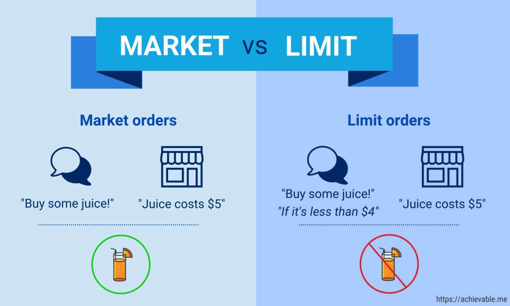

## Table of Contents

## What is a market order?

A market order is a type of order you can use when you want to buy or sell something quickly. When you place a market order, you tell the trading system to buy or sell at the best available price right away. This means your order will be filled almost instantly, but the exact price you get might be a little different from what you see on the screen at the moment you place the order.

Market orders are useful when you want to make sure your trade happens fast. For example, if you see a stock price suddenly going up and you want to buy it before it goes up even more, a market order can help you get the stock quickly. However, because the price can change quickly, you might end up paying a bit more or getting a bit less than you expected. So, it's good to use market orders when speed is more important than getting a specific price.

## What is a limit order?

A limit order is a type of order you can use when you want to buy or sell something at a specific price or better. When you place a limit order, you tell the trading system to only buy or sell at the price you set or better. For example, if you want to buy a stock, you can set a limit order to buy it at $50 or less. This means your order will only be filled if the stock price drops to $50 or lower.

Limit orders are useful when you want to control the price you pay or receive. They can help you avoid buying at a higher price or selling at a lower price than you want. However, there's a chance your order might not be filled if the stock price never reaches your limit price. So, limit orders are good when getting a specific price is more important than making sure your trade happens right away.

## How does a market order work?

A market order is a way to buy or sell something quickly. When you place a market order, you tell the trading system to do the trade at the best price available right now. This means your order will happen very fast, usually in just a few seconds. It's like saying, "I want to buy this stock now, no matter what the exact price is."

The good thing about market orders is that they are fast. If you see a stock price going up and you want to buy it before it goes up more, a market order can help you get it quickly. But, because prices can change fast, you might end up paying a little more or getting a little less than you expected. So, market orders are best when you care more about speed than getting a specific price.

## How does a limit order work?

A limit order is a way to buy or sell something at a specific price or better. When you place a limit order, you tell the trading system to only do the trade if the price reaches the number you set. For example, if you want to buy a stock, you can set a limit order to buy it at $50 or less. This means your order will only happen if the stock price drops to $50 or lower.

Limit orders are good when you want to control the price you pay or get. They help you avoid buying at a higher price or selling at a lower price than you want. But, there's a chance your order might not happen if the stock price never reaches your limit price. So, limit orders are best when getting a specific price is more important than making sure your trade happens right away.

## What are the main differences between market and limit orders?

A market order is used when you want to buy or sell something quickly. When you place a market order, you tell the trading system to do the trade at the best price available right away. This means your order will happen fast, but the exact price you get might be a little different from what you see on the screen. Market orders are good when speed is more important than getting a specific price. For example, if you see a stock price going up and you want to buy it before it goes up more, a market order can help you get it quickly.

A limit order is used when you want to buy or sell at a specific price or better. When you place a limit order, you tell the trading system to only do the trade if the price reaches the number you set. For example, if you want to buy a stock, you can set a limit order to buy it at $50 or less. This means your order will only happen if the stock price drops to $50 or lower. Limit orders are good when getting a specific price is more important than making sure your trade happens right away. But, there's a chance your order might not happen if the stock price never reaches your limit price.

## When should you use a market order?

You should use a market order when you want to buy or sell something quickly. It's like saying, "I want to do this trade now, no matter what the exact price is." Market orders are good when speed is more important than getting a specific price. For example, if you see a stock price going up and you want to buy it before it goes up more, a market order can help you get it quickly.

However, because prices can change fast, you might end up paying a little more or getting a little less than you expected. So, market orders are best when you care more about making sure your trade happens right away than about the exact price you get.

## When should you use a limit order?

You should use a limit order when you want to buy or sell something at a specific price or better. It's like saying, "I only want to do this trade if the price is right." Limit orders are good when getting a specific price is more important than making sure your trade happens right away. For example, if you want to buy a stock but only if it drops to $50 or less, a limit order can help you get that price.

However, there's a chance your order might not happen if the stock price never reaches your limit price. So, limit orders are best when you care more about the exact price you get than about making sure your trade happens quickly. They help you avoid buying at a higher price or selling at a lower price than you want.

## What are the risks associated with market orders?

When you use a market order, you might not get the exact price you see on the screen. Prices can change very fast, so by the time your order goes through, you might end up paying a little more or getting a little less than you expected. This is called "slippage." It's like if you want to buy a toy that costs $10, but by the time you get to the store, the price has gone up to $10.50.

Another risk is that if there aren't enough buyers or sellers at the moment you place your order, your trade might take a bit longer to happen. This can be a problem if you need to buy or sell something very quickly. So, while market orders are good for speed, they can sometimes lead to surprises in the price you end up with or how long it takes for your order to be filled.

## What are the risks associated with limit orders?

When you use a limit order, there's a chance your order might not get filled at all. This happens if the price never reaches the number you set. For example, if you want to buy a stock at $50 but it never drops to that price, you won't get the stock. This can be frustrating if you really want to make the trade but the market doesn't move in your favor.

Another risk is that you might miss out on a good opportunity. If the stock price quickly moves past your limit price, you could end up buying or selling at a less favorable price than if you had used a market order. For instance, if you set a limit order to sell at $60 and the stock suddenly jumps to $65, you might miss out on the higher price. So, while limit orders help you control the price, they can also mean you miss out on trades or good prices if the market moves too fast.

## How do market conditions affect the execution of market and limit orders?

Market conditions can really change how market orders work. When the market is busy and lots of people are buying and selling, a market order can go through very fast. But, if the market is moving quickly, the price you get might be different from what you saw when you placed the order. This is because the price can change in just a few seconds. If there aren't many people trading, it might take longer for your market order to be filled, and you might not get the best price because there are fewer options.

Limit orders are also affected by market conditions. In a busy market, if the price hits your limit, your order can be filled quickly. But if the market is moving very fast, the price might jump past your limit without stopping, and you might miss out on the trade. In a quiet market, it might take a long time for the price to reach your limit, and your order might not get filled at all. So, knowing how busy or quiet the market is can help you decide if a market or limit order is better for what you want to do.

## Can you explain the concept of slippage in relation to market orders?

Slippage is what happens when the price you get for a market order is different from the price you saw when you placed the order. It's like if you want to buy a toy that costs $10, but by the time you get to the store, the price has gone up to $10.50. This can happen because prices in the market can change very fast, even in just a few seconds.

Slippage is more likely to happen when the market is busy and lots of people are buying and selling. If there are big changes in the price, your market order might get filled at a price that's higher or lower than you expected. So, while market orders are good for getting your trade done quickly, you need to be ready for the price to be a little different from what you saw at first.

## How can advanced traders use limit orders to implement complex trading strategies?

Advanced traders can use limit orders to set up complex trading strategies by carefully choosing the prices at which they want to buy or sell. For example, they might use a strategy called "bracket orders," where they place a limit order to buy a stock at a lower price and also set a limit order to sell it at a higher price. This way, they can try to buy low and sell high automatically. They can also use "stop-limit orders," which combine a stop order with a limit order. This means the limit order only gets activated if the stock price reaches a certain point, helping traders manage risk by setting both entry and exit points in advance.

Another way advanced traders use limit orders is in "scalping," where they make many small trades to take advantage of small price changes. They might set multiple limit orders at different prices to buy and sell quickly, aiming to make a profit from these small moves. By using limit orders, they can control the exact prices at which they trade, which is important for this strategy. Overall, limit orders give advanced traders the flexibility to set up detailed plans that can help them manage their trades more effectively and potentially increase their chances of making a profit.

## References & Further Reading

[1]: ["Market Microstructure and Price Formation"](https://www.amazon.fr/Market-Microstructure-Confronting-Many-Viewpoints-ebook/dp/B0186MRVKA) by Jean-Philippe Bouchaud, Marc Potters, and Jozef Kokosz

[2]: Harris, Larry (2003). ["Trading and Exchanges: Market Microstructure for Practitioners."](https://www.acsu.buffalo.edu/~keechung/MGF743/Readings/Trading-Exchanges-Market-Microstructure-Practitioners%20Draft%20Copy.pdf) Oxford University Press.

[3]: Hasbrouck, Joel (2007). ["Empirical Market Microstructure: The Institutions, Economics, and Econometrics of Securities Trading."](https://www.amazon.fr/Empirical-Market-Microstructure-Institutions-Econometrics/dp/0195301641) Oxford University Press.

[4]: O'Hara, Maureen (1995). ["Market Microstructure Theory."](https://www.amazon.fr/Market-Microstructure-Theory-Maureen-%E2%80%B2Hara/dp/1557864438) Wiley-Blackwell.

[5]: ["Technical Analysis of the Financial Markets: A Comprehensive Guide to Trading Methods and Applications."](https://www.amazon.com/Technical-Analysis-Financial-Markets-Comprehensive/dp/0735200661) by John J. Murphy

[6]: ["Option Volatility and Pricing: Advanced Trading Strategies and Techniques"](https://www.amazon.com/Option-Volatility-Pricing-Strategies-Techniques/dp/0071818774) by Sheldon Natenberg