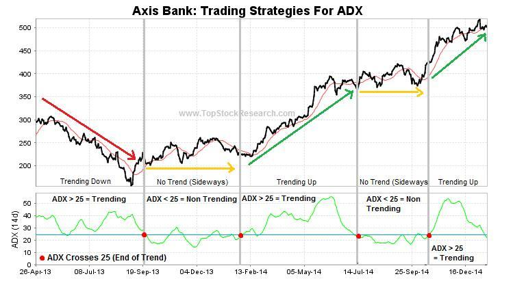

## Table of Contents

## What is momentum in trading?

Momentum in trading refers to the strength or speed of price changes in a financial asset. Traders use momentum to identify trends and make decisions about buying or selling. If a stock's price is rising quickly, it has positive momentum, and traders might buy it expecting the price to keep going up. On the other hand, if the price is falling quickly, it has negative momentum, and traders might sell it or short it, expecting the price to keep going down.

Momentum can be measured using different tools, like the Relative Strength Index (RSI) or the Moving Average Convergence Divergence (MACD). These tools help traders see if an asset is overbought or oversold, which can signal when the momentum might change direction. Understanding momentum is important because it can help traders make better decisions and potentially increase their profits. However, it's also important to remember that momentum doesn't always predict future price movements accurately, so it should be used along with other analysis methods.

## What is mean reversion in trading?

Mean reversion in trading is the idea that prices will eventually return to their average or normal levels after moving too far away. Imagine a rubber band: if you stretch it, it will snap back to its original shape. In trading, if a stock's price goes up a lot, it might come back down to what people usually expect it to be. Traders who believe in mean reversion look for times when prices are too high or too low and bet that they will go back to the middle.

To use mean reversion, traders often look at things like the average price over a certain time, called the moving average. If the current price is much higher than this average, they might think it's time to sell because the price could drop back to the average. If the price is much lower than the average, they might buy, hoping it will go back up. But, like all trading strategies, mean reversion doesn't always work, and it's important to use it carefully and with other ways of looking at the market.

## How does momentum investing work?

Momentum investing is all about following the trend. It's like seeing a train moving fast and deciding to jump on because you think it will keep going. In trading, if a stock's price is going up quickly, [momentum](/wiki/momentum) investors will buy it, hoping it will keep going up. They believe that stocks that have done well recently will keep doing well for a while longer. They look at things like how much the price has gone up over the last few weeks or months to decide which stocks to buy.

To do momentum investing, people use tools like the Relative Strength Index (RSI) or the Moving Average Convergence Divergence (MACD). These tools help them see if a stock's price is moving really fast. If it is, and the price is still going up, they might buy it. But they also have to be careful because sometimes the price can suddenly change direction. So, they need to watch the market closely and be ready to sell if the momentum starts to slow down or reverse. Momentum investing can be exciting, but it's also risky, so it's important to use it wisely and not put all your money into one stock.

## How does mean reversion investing work?

Mean reversion investing is based on the idea that prices will eventually go back to their normal levels after they move too far away. It's like watching a ball bounce: if you throw it up high, it will come back down. In trading, if a stock's price goes way up, mean reversion investors think it might come back down to what people usually expect it to be. So, they look for times when prices are too high or too low and bet that they will go back to the middle.

To use mean reversion investing, traders often look at the average price of a stock over time, called the moving average. If the current price is much higher than this average, they might sell the stock because they think it will drop back to the average. If the price is much lower than the average, they might buy the stock, hoping it will go back up. But, like all trading strategies, mean reversion doesn't always work, and it's important to be careful and use other ways of looking at the market too.

## What are the key indicators used in momentum strategies?

Momentum strategies use some key indicators to help traders see if a stock's price is moving fast. One popular indicator is the Relative Strength Index (RSI). The RSI looks at how fast a stock's price is going up or down over a certain time, usually 14 days. If the RSI is above 70, it means the stock might be moving too fast and could be overbought, which might mean the price will soon go down. If the RSI is below 30, the stock might be moving too slow and could be oversold, which might mean the price will soon go up.

Another important indicator for momentum strategies is the Moving Average Convergence Divergence (MACD). The MACD shows the difference between two moving averages of a stock's price. When the MACD line crosses above the signal line, it's a sign that the stock's momentum is getting stronger and it might be a good time to buy. When the MACD line crosses below the signal line, it's a sign that the stock's momentum is getting weaker and it might be a good time to sell. Both the RSI and MACD help traders see the speed of price changes and make decisions based on that.

## What are the key indicators used in mean reversion strategies?

Mean reversion strategies use some key indicators to help traders see if a stock's price is moving away from its normal level. One of the main indicators is the moving average. This is just the average price of a stock over a certain time, like 50 days or 200 days. If the current price of the stock is much higher than its moving average, traders might think it's time to sell because they believe the price will come back down to the average. If the price is much lower than the moving average, they might buy the stock, hoping it will go back up to the average.

Another useful indicator for mean reversion strategies is the Bollinger Bands. These are lines drawn above and below the moving average that show how much the price usually changes. When the price goes outside the upper Bollinger Band, it might be too high and could come back down. When it goes below the lower Bollinger Band, it might be too low and could go back up. Traders use these bands to see if a stock's price is moving too far away from what's normal and to make decisions about buying or selling.

## Can you provide examples of momentum stocks?

Momentum stocks are ones that have been going up a lot recently and people think they will keep going up. A good example of a momentum stock might be a tech company like Tesla. A few years ago, Tesla's stock price started going up really fast because more and more people wanted to buy their electric cars. People saw this and thought, "Wow, Tesla is doing great, let's buy their stock too!" So, they kept buying, and the price kept going up. This is what momentum investing is all about—jumping on a stock that's already moving fast and hoping it keeps going.

Another example could be a company like Netflix. A while back, Netflix was doing really well because more people were staying home and watching their shows. Their stock price started going up quickly, and people saw that and wanted to get in on the action. They thought, "Netflix is popular right now, so let's buy their stock!" And because so many people were buying, the stock kept going up. But remember, momentum stocks can also go down fast if the trend changes, so it's important to keep an eye on them.

## Can you provide examples of mean reversion stocks?

A good example of a mean reversion stock might be a big company like Coca-Cola. Sometimes, Coca-Cola's stock price goes up a lot because people are buying more of their drinks. But then, it might go back down to what people usually expect it to be. If the price goes way up, mean reversion traders might sell the stock because they think it will come back down to the average price. If the price is way down, they might buy it, hoping it will go back up to the average.

Another example could be a company like Walmart. Walmart's stock price can move around a lot, but it usually stays around a certain level over time. If the price goes too high, traders might think it's time to sell because they believe it will drop back to the middle. If the price is too low, they might buy the stock, thinking it will go back up to the normal level. Mean reversion trading is all about waiting for the right moment to buy or sell based on where the price is compared to its average.

## What are the risks associated with momentum investing?

Momentum investing can be risky because it depends a lot on the stock's price keeping its fast movement. If the price suddenly stops going up or starts going down, momentum investors can lose a lot of money. This is called a reversal, and it can happen quickly without any warning. So, if you're following the trend and the trend changes, you might be left with a stock that's not worth as much as you paid for it.

Another risk is that momentum investing can make the market more unpredictable. When a lot of people are buying the same stocks because they're going up fast, it can create a bubble. A bubble is when the price goes up a lot more than it should because everyone is buying, not because the company is doing better. If the bubble bursts, the price can drop really fast, and momentum investors can lose a lot. So, while momentum investing can be exciting and sometimes profitable, it's important to be careful and not put all your money into one stock or trend.

## What are the risks associated with mean reversion investing?

Mean reversion investing can be risky because it's based on the idea that prices will go back to normal after moving too far away. But sometimes, prices don't come back to the middle as quickly as expected, or they might not come back at all. If you buy a stock because you think it's too low and will go back up, but it keeps going down instead, you could lose money. It's like waiting for a ball to bounce back up, but it just keeps rolling away.

Another risk is that mean reversion can make you miss out on big trends. If a stock's price is going up a lot and you think it's going to come back down, you might sell it too early and miss out on even more gains. Or, if you buy a stock because you think it's too low, but it keeps going down, you might hold onto it for too long, hoping it will go back up, and lose more money. So, while mean reversion can be a good strategy, it's important to be careful and not always expect prices to go back to normal right away.

## How do market conditions affect the performance of momentum and mean reversion strategies?

Market conditions can really change how well momentum and mean reversion strategies work. When the market is going up a lot, like during a bull market, momentum strategies can do really well. That's because more people are buying stocks that are already going up, which makes them go up even more. But, if the market suddenly starts going down, like in a bear market, momentum stocks can lose a lot of value fast. So, momentum strategies can be great in good times, but they can also be risky if the market changes direction.

Mean reversion strategies can also be affected by market conditions. In a stable market, where prices don't change too much, mean reversion can work well because prices are more likely to go back to normal. But in a very up-and-down market, like during times of big news or events, prices might not go back to the middle as expected. They might keep going up or down, making mean reversion strategies less effective. So, it's important to think about what the market is doing when using these strategies.

## How can an investor combine momentum and mean reversion strategies for better portfolio management?

An investor can combine momentum and mean reversion strategies to make their portfolio stronger by using each strategy at different times. When the market is doing well and prices are going up a lot, the investor can use momentum strategies. They can buy stocks that are going up fast, hoping they will keep going up. But they need to watch the market closely and be ready to sell if the trend starts to change. This way, they can take advantage of the good times and make more money.

When the market is more stable or prices are moving a lot but not in one direction, the investor can switch to mean reversion strategies. They can look for stocks that are too high or too low compared to their normal prices and bet that they will go back to the middle. If a stock's price is way up, they might sell it, expecting it to come back down. If it's way down, they might buy it, hoping it will go back up. By using both strategies, the investor can be ready for different market conditions and make better decisions to manage their portfolio.

## What is Exploring Mean Reversion?

Mean reversion is a trading strategy that operates on the principle that asset prices will revert to their historical averages over time. This concept assumes that the market prices of securities might deviate from their fair value or historical norm but will eventually return to that mean value. Investors who employ mean reversion strategies seek to identify these deviations and capitalize on the anticipated correction.

The strategy heavily relies on identifying mispriced securities. Investors compare the current price of an asset with its historical average or intrinsic value. If the current price significantly deviates from this average, it is considered either overvalued or undervalued, and traders will bet on the price correcting itself. This prediction of price movement is based on understanding patterns in historical data and expecting them to replicate in the future.

Statistical analyses play a crucial role in mean reversion strategies. Traders often use statistical tools to determine whether an asset is currently deviating from its historical mean. One common method is calculating the z-score, which measures the number of standard deviations a data point (in this case, the current price) is from the mean:

$$
Z = \frac{(X - \mu)}{\sigma}
$$

where:
- $ Z $ is the z-score,
- $ X $ is the asset's current price,
- $ \mu $ is the mean of the asset's historical prices,
- $ \sigma $ is the standard deviation of the asset's historical prices.

A z-score far from zero indicates a significant deviation, suggesting the potential for mean reversion.

Another critical aspect is leveraging historical price data. Traders analyze past price movements to identify patterns and determine reasonable estimates of an asset's mean value. This historical analysis helps traders set entry and [exit](/wiki/exit-strategy) points for their positions. Technical indicators, such as Bollinger Bands and moving averages, are commonly used to gauge how far an asset's price has strayed from the mean and to signal potential reversion points.

Overall, mean reversion strategies require diligent analysis and a robust understanding of statistical principles and historical data to identify opportunities where asset prices are likely to revert to their mean. This strategic approach allows investors to make informed decisions and potentially profit from market inefficiencies.

## References & Further Reading

[1]: ["Advances in Financial Machine Learning"](https://www.amazon.com/Advances-Financial-Machine-Learning-Marcos/dp/1119482089) by Marcos Lopez de Prado

[2]: ["Evidence-Based Technical Analysis: Applying the Scientific Method and Statistical Inference to Trading Signals"](https://www.wiley.com/en-gb/Evidence+Based+Technical+Analysis:+Applying+the+Scientific+Method+and+Statistical+Inference+to+Trading+Signals-p-9780470008744) by David Aronson

[3]: ["Machine Learning for Algorithmic Trading"](https://www.amazon.com/Machine-Learning-Algorithmic-Trading-intelligence/dp/9918608013) by Stefan Jansen

[4]: ["Quantitative Trading: How to Build Your Own Algorithmic Trading Business"](https://www.amazon.com/Quantitative-Trading-Build-Algorithmic-Business/dp/0470284889) by Ernest P. Chan

[5]: Balvers, R., Wu, Y., & Gilliland, E. (2000). ["Mean reversion across national stock markets and parametric contrarian investment strategies."](https://www.jstor.org/stable/222521) Journal of Finance, 55(2), 745-761.

[6]: Jegadeesh, N., & Titman, S. (1993). ["Returns to Buying Winners and Selling Losers: Implications for Stock Market Efficiency."](https://www.jstor.org/stable/2328882) The Journal of Finance, 48(1), 65-91.