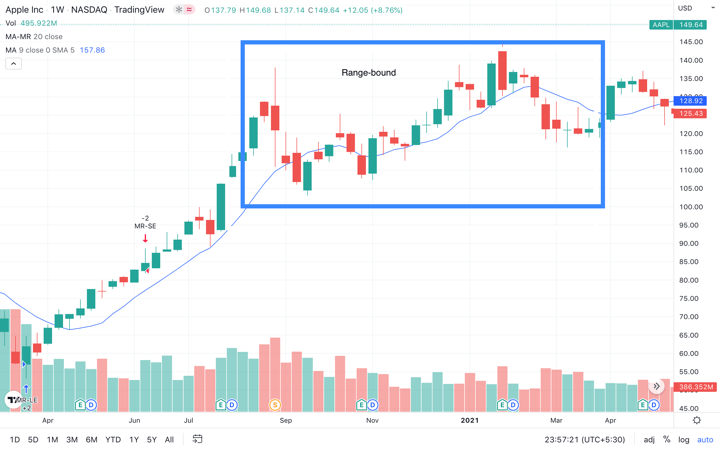

In the world of finance and investing, understanding different market strategies is crucial for successful trading and investment management. Among these strategies, momentum and mean reversion stand out as two fundamental yet opposing methods of analyzing and capitalizing on market movements.

Momentum trading revolves around the idea that securities which have performed well over a specific time frame will continue to perform strongly. This strategy leverages the persistence of asset price trends driven by investor behavior, market sentiment, and overarching economic factors. It involves identifying assets with high recent returns and anticipating that these will continue their positive trajectory, benefiting from the psychological bias wherein investors might follow a herd mentality.



Conversely, mean reversion is built on the hypothesis that asset prices will eventually revert to their historical mean or average over time. This strategy involves identifying the deviations of asset prices from their long-term average and aiming to capitalize on the anticipated corrections. By betting on the future adjustment of mispriced securities, mean reversion strategies often rely on statistical analyses and historical price data to forecast potential reversals.

By contrasting these two strategies, investors can better understand how they differ in approach and application. While momentum captures the essence of continuing trends, mean reversion focuses on the correction of deviations in asset prices. Throughout this article, both strategies will be defined in greater detail, their workings explained, and their differences clarified. By the end, readers will be equipped with a comprehensive understanding of momentum and mean reversion, enabling more informed decision-making in their investing and trading endeavors.

## Table of Contents

## Understanding Momentum

Momentum trading is a popular investment strategy that involves buying securities that have exhibited high returns over a specific period. The core idea behind this approach is straightforward: assets that perform well will likely continue to do so, driven by sustained investor interest and prevailing market trends. 

At its heart, [momentum](/wiki/momentum) trading capitalizes on the continuation of existing market trends. If a stock is on an upward trend, a momentum trader will purchase it in the hope that it will continue to rise. Conversely, they may sell or short a stock experiencing a downward trend, expecting further depreciation. 

Investor emotions play a crucial role in the success of this strategy. Markets are often swayed by sentiment, leading to scenarios where prices may rise or fall more steeply than fundamental valuation models would suggest. For instance, excessive optimism can drive prices higher as investors fear missing out, while mass pessimism can push prices lower.

Consider the following momentum model in Python:

```python
import pandas as pd

def calculate_momentum(data, period=12):
    """
    Calculate momentum for a given period.

    Parameters:
    data (pd.Series): Series of stock prices.
    period (int): Number of periods to calculate momentum over.

    Returns:
    pd.Series: Momentum values.
    """
    return data.diff(periods=period)

# Example usage
data = pd.Series([100, 102, 105, 110, 112, 115, 120, 125, 130, 135])
momentum = calculate_momentum(data)
print(momentum)
```

This code calculates a simple momentum indicator by measuring the difference in stock prices over a specified period. A positive momentum value suggests a continued upward trend, while a negative value may indicate a decline.

Market trends also significantly influence momentum trading. These trends are often identified using technical analysis tools such as moving averages, RSI (Relative Strength Index), and MACD (Moving Average Convergence Divergence). Tools like these help traders identify the direction and strength of market trends, which are essential for implementing a momentum strategy effectively.

In summary, momentum trading leverages the continuation of existing trends, driven by investor behavior and market forces. While it can lead to substantial gains during favorable market conditions, it requires a keen understanding of market psychology and technical trend indicators for effective implementation.

## Exploring Mean Reversion

Mean reversion is a trading strategy that operates on the principle that asset prices will revert to their historical averages over time. This concept assumes that the market prices of securities might deviate from their fair value or historical norm but will eventually return to that mean value. Investors who employ mean reversion strategies seek to identify these deviations and capitalize on the anticipated correction.

The strategy heavily relies on identifying mispriced securities. Investors compare the current price of an asset with its historical average or intrinsic value. If the current price significantly deviates from this average, it is considered either overvalued or undervalued, and traders will bet on the price correcting itself. This prediction of price movement is based on understanding patterns in historical data and expecting them to replicate in the future.

Statistical analyses play a crucial role in mean reversion strategies. Traders often use statistical tools to determine whether an asset is currently deviating from its historical mean. One common method is calculating the z-score, which measures the number of standard deviations a data point (in this case, the current price) is from the mean:

$$
Z = \frac{(X - \mu)}{\sigma}
$$

where:
- $ Z $ is the z-score,
- $ X $ is the asset's current price,
- $ \mu $ is the mean of the asset's historical prices,
- $ \sigma $ is the standard deviation of the asset's historical prices.

A z-score far from zero indicates a significant deviation, suggesting the potential for mean reversion.

Another critical aspect is leveraging historical price data. Traders analyze past price movements to identify patterns and determine reasonable estimates of an asset's mean value. This historical analysis helps traders set entry and [exit](/wiki/exit-strategy) points for their positions. Technical indicators, such as Bollinger Bands and moving averages, are commonly used to gauge how far an asset's price has strayed from the mean and to signal potential reversion points.

Overall, mean reversion strategies require diligent analysis and a robust understanding of statistical principles and historical data to identify opportunities where asset prices are likely to revert to their mean. This strategic approach allows investors to make informed decisions and potentially profit from market inefficiencies.

## Key Differences Between Momentum and Mean Reversion

Momentum and mean reversion strategies represent two distinct approaches to trading, each with its unique focus and methodology. Momentum trading centers on capturing ongoing market trends. It operates on the premise that securities displaying strong price movements will likely continue in the same direction. Traders utilizing this strategy aim to capitalize on accelerating price trends, often driven by [factor](/wiki/factor-investing)s like investor psychology, news events, or economic data.

In contrast, mean reversion is built on the notion that asset prices will eventually return to their long-term mean or average level. This strategy banks on the correction of prices that have deviated significantly from their historical averages. Traders here focus on identifying overbought or oversold conditions with the expectation of price retracements.

Key differences between these strategies can be understood in terms of risk management, time horizons, and psychological implications:

1. **Risk Management**: Momentum traders often face heightened volatility, as they enter positions in the direction of price acceleration, which can change abruptly. This requires stringent risk management techniques, such as stop-loss orders, to protect against adverse price movements. On the other hand, mean reversion strategies typically involve less volatile trades, but they are not without risk. If the anticipated reversion does not materialize, traders may incur substantial losses. Risk management for mean reversion often involves setting entry and exit points based on statistical thresholds.

2. **Time Horizons**: Momentum trading is generally suited for shorter time frames, ranging from days to weeks, as traders seek to ride the price momentum for as long as it persists. Mean reversion strategies, however, can span longer durations as they wait for prices to revert to their mean. This could mean holding a position for weeks or even months, depending on the historical average and current market conditions.

3. **Psychological Implications**: Momentum trading requires a mindset focused on market trends and the ability to act quickly. Traders need to be comfortable with jumping onto rapidly moving stocks and exiting just as swiftly to lock in gains or prevent losses. Mean reversion traders, conversely, may need more patience and discipline, keeping a level head as they anticipate market corrections that may take time to unfold.

Ultimately, the choice between momentum and mean reversion strategies depends on a trader's individual preferences, risk tolerance, and market outlook. Understanding the dynamics of each strategy helps traders align their approach with their investment goals and psychological comfort level.

## Practical Applications and Examples

Momentum and mean reversion strategies are fundamental tools employed by traders to exploit different market conditions. Here, we explore practical applications and examples to elucidate how these strategies are applied in real-world scenarios.

### Momentum Strategies

**Trend Following**: One of the most popular momentum strategies, trend following involves identifying and investing in stocks or other assets that are in a persistent upward or downward movement. The rationale is simple; once a trend is established, it is likely to continue. Traders often use technical indicators such as moving averages, MACD, or the Relative Strength Index (RSI) to identify trends. For instance, a crossover of the 50-day moving average above the 200-day moving average might signal a bullish trend, prompting investors to enter long positions.

**Breakouts**: Breakout trading is another momentum-based strategy that focuses on identifying key price levels (support or resistance) and entering the market when the price breaks these levels. The logic behind breakouts is that once the price moves past a significant boundary, it often accelerates in that direction due to increased trader participation. For example, if a stock breaks above a long-standing resistance line, it may continue climbing as new buyers enter the market.

### Mean Reversion Strategies

**Pairs Trading**: Often used in mean reversion, pairs trading involves selecting two historically correlated assets and trading them based on the expectation that their price relationship will revert to the mean. The strategy entails shorting the outperforming asset while going long on the underperforming one. If Asset A and Asset B have historically moved together and Asset A suddenly outperforms, a trader might short Asset A and buy Asset B, betting on the convergence of their prices.

**Statistical Arbitrage**: This involves exploiting pricing inefficiencies between related financial instruments. Traders use statistical models to identify deviations from the mean and place trades accordingly. It requires robust quantitative models to analyze historical price data and detect temporary divergences that imply potential profits. For instance, if the price of an asset deviates significantly from its historical mean as calculated by a regression model, traders might bet on a return to the norm.

### Case Studies and Historical Examples

The 1990s technology bubble is a well-documented example of momentum trading, where investors poured money into tech stocks as their prices soared, further fueling the momentum until the bubble burst. On the other hand, during the 2007-2008 financial crisis, mean reversion strategies could be observed in action when distressed asset prices gradually reverted towards fundamental values after significant initial declines.

Such cases highlight the importance of understanding market contexts when deploying these strategies. By studying historical trends and patterns, traders refine their techniques to adapt to shifting market conditions, thus optimizing their trading performance.

## Pros and Cons of Momentum and Mean Reversion

Momentum strategies are particularly advantageous in trending markets, allowing traders to capitalize on sustained price movements. These strategies thrive when there is a clear directional movement in the market, as they rely on the continuation of current trends. For example, during a bullish market phase, a momentum strategy might involve buying assets that have already shown strong upward movements, anticipating further price increases. However, these strategies may encounter challenges in volatile conditions, where frequent and unpredictable price reversals can lead to losses. A key disadvantage of momentum trading is its vulnerability to sudden market corrections, which can significantly diminish returns.

On the other hand, mean reversion strategies are designed to exploit the tendency of asset prices to revert to their historical averages. These strategies are well-suited for range-bound markets where prices fluctuate within a certain range without establishing a prolonged trend. When prices deviate significantly from their mean, mean reversion traders take positions expecting a price reversal towards the average. Although mean reversion can be effective in stable markets, it may suffer during strong trending conditions. In such cases, prices can continue departing from their historical averages for extended periods, resulting in prolonged losses for those relying on mean reversion.

Both momentum and mean reversion strategies [carry](/wiki/carry-trading) inherent risks. Momentum traders must be cautious of overpaying for assets in the heat of a trend, which can result in significant drawdowns if the trend reverses. Meanwhile, mean reversion traders need to be wary of markets that are undergoing structural changes, as relying solely on historical price levels might lead to incorrect assumptions about future price movements.

Ultimately, understanding the market environment and utilizing solid risk management techniques are critical when implementing either strategy. Careful analysis of market conditions can help traders determine when to apply momentum or mean reversion strategies to maximize returns and mitigate potential losses.

## Conclusion

In deciding between momentum and mean reversion strategies, investors need to align their choices with their personal trading style and market outlook. Each strategy requires a different approach to risk management and market analysis, which can significantly impact trading outcomes. 

Momentum trading thrives in trending markets, offering the potential for substantial gains by riding the wave of ongoing price movements. However, this strategy can expose traders to heightened risk during volatile or reversing market conditions. Therefore, momentum traders often have a higher risk tolerance and prefer short to medium-term investments where they can capitalize on strong price trends.

On the other hand, mean reversion strategies operate on the principle that prices will return to their historical norms, making them more suitable for range-bound markets. This approach can be advantageous when markets are stable, as it seeks to profit from price corrections. However, mean reversion can become challenging during sustained trends, where price deviations may not revert promptly. Consequently, traders using this strategy tend to adopt a more cautious risk approach, often utilizing statistical tools to identify mispriced assets and potential corrections.

Ultimately, a comprehensive understanding of these strategies allows traders to make informed decisions that align with their risk tolerance and the prevailing market conditions. By mastering both momentum and mean reversion frameworks, investors can strategically position themselves to navigate diverse market scenarios more effectively, thus enhancing their potential for achieving favorable financial outcomes.

## FAQs

### What type of investor is best suited for momentum strategies?

Momentum strategies appeal to investors who are comfortable with taking on higher risk for the potential of substantial gains. These investors often have a speculative outlook and are keen on trading securities that show a consistent upward or downward trend. Momentum investors typically engage in short-term to medium-term trading and prefer liquid markets where transactions can be executed easily and quickly. They are usually disciplined and well-versed in technical analysis, utilizing tools such as moving averages and momentum indicators to make timely decisions. This strategy requires an ability to tolerate [volatility](/wiki/volatility-trading-strategies) and remain calm amid market fluctuations, as the profitability of momentum trading heavily depends on precise entry and exit timing.

### How can mean reversion strategies be applied to different asset classes? 

Mean reversion strategies can be effectively applied across a variety of asset classes, such as equities, commodities, and currencies. The core principle is based on identifying assets that have deviated significantly from their historical averages, expecting them to return to those means over time. Here’s how mean reversion can be applied to different asset classes:

- **Equities**: In stock markets, mean reversion can be employed by identifying stocks that are undervalued or overvalued compared to their historical price levels or intrinsic values. Traders might look at earnings ratios, moving averages, or Bollinger Bands as indicators.

- **Commodities**: Traders may track commodities whose prices have diverged from their historical price ranges. For instance, if oil prices significantly drop below historical averages, a mean reversion approach would suggest buying, anticipating a price recovery.

- **Currencies**: Foreign exchange markets often exhibit mean reversion patterns due to the influence of economic fundamentals and interest rate differentials. Currency pairs that have moved significantly away from their mean exchange rates may be targeted for trades.

Statistical tools and [backtesting](/wiki/backtesting) are essential components for applying mean reversion successfully, ensuring that asset price movements align with historical data patterns.

### What are the common pitfalls of using momentum or mean reversion strategies?

Both momentum and mean reversion strategies carry unique risks and challenges that investors must be aware of:

- **Momentum Strategy Pitfalls**:
  - **Chasing Trends**: Investors might enter a trend too late, just before it reverses, leading to losses. This is sometimes referred to as the "herd mentality."
  - **Market Volatility**: Momentum strategies can be severely impacted by sudden market volatility, causing abrupt trend reversals.
  - **High Transaction Costs**: Frequent trading can lead to significant transaction costs, which can eat into profits.

- **Mean Reversion Strategy Pitfalls**:
  - **Misinterpreting Data**: Identifying whether a price movement is a temporary deviation or a part of a new trend can be challenging.
  - **Extended Deviations**: Markets may remain irrational longer than expected, with prices not reverting to the mean for extended periods.
  - **Lack of Liquidity**: Attempting to trade based on mean reversion in less liquid markets can result in difficulties executing trades at desired prices.

Both strategies require rigorous risk management practices to mitigate these pitfalls, such as setting stop-loss limits and diversifying investments across different instruments or asset classes.

## References & Further Reading

[1]: ["Advances in Financial Machine Learning"](https://www.amazon.com/Advances-Financial-Machine-Learning-Marcos/dp/1119482089) by Marcos Lopez de Prado

[2]: ["Evidence-Based Technical Analysis: Applying the Scientific Method and Statistical Inference to Trading Signals"](https://www.wiley.com/en-gb/Evidence+Based+Technical+Analysis:+Applying+the+Scientific+Method+and+Statistical+Inference+to+Trading+Signals-p-9780470008744) by David Aronson

[3]: ["Machine Learning for Algorithmic Trading"](https://www.amazon.com/Machine-Learning-Algorithmic-Trading-intelligence/dp/9918608013) by Stefan Jansen

[4]: ["Quantitative Trading: How to Build Your Own Algorithmic Trading Business"](https://www.amazon.com/Quantitative-Trading-Build-Algorithmic-Business/dp/0470284889) by Ernest P. Chan

[5]: Balvers, R., Wu, Y., & Gilliland, E. (2000). ["Mean reversion across national stock markets and parametric contrarian investment strategies."](https://www.jstor.org/stable/222521) Journal of Finance, 55(2), 745-761.

[6]: Jegadeesh, N., & Titman, S. (1993). ["Returns to Buying Winners and Selling Losers: Implications for Stock Market Efficiency."](https://www.jstor.org/stable/2328882) The Journal of Finance, 48(1), 65-91.