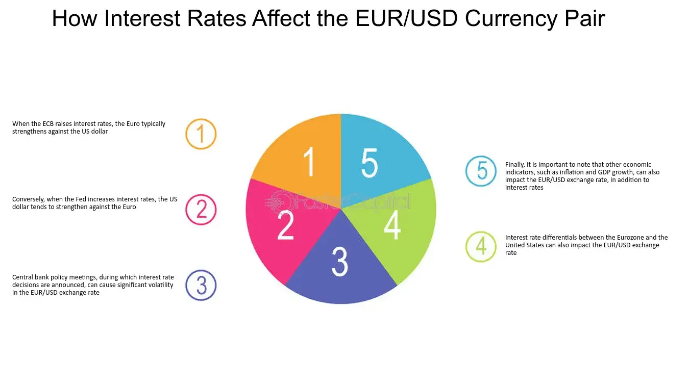

## Table of Contents

## What is a Forex pair?

A Forex pair is a combination of two different currencies that are traded against each other in the foreign exchange market. The first currency in the pair is called the base currency, and the second is known as the quote currency. For example, in the EUR/USD pair, the Euro is the base currency and the US Dollar is the quote currency. The value of the Forex pair shows how much of the quote currency is needed to buy one unit of the base currency.

Trading Forex pairs is popular because it allows people and businesses to exchange one currency for another, which is useful for international trade and travel. The exchange rate between the two currencies can change due to various factors like economic news, interest rates, and political events. Traders try to predict these changes to make profits by buying a currency pair when they think its value will go up, and selling it when they think it will go down.

## What does price movement mean in the context of Forex trading?

In Forex trading, price movement refers to how the value of a currency pair changes over time. When you see the price of a currency pair go up or down, it means that the exchange rate between the two currencies is changing. For example, if the EUR/USD pair moves from 1.1000 to 1.1050, it means you need more US dollars to buy one Euro than before.

These movements can happen for many reasons. News about a country's economy, changes in interest rates, or even political events can make a currency's value go up or down. Traders watch these price movements closely because they want to buy a currency pair when they think its price will go up, and sell it when they think it will go down. By doing this, they hope to make a profit from the difference in price.

## What are the basic factors that influence Forex pair price movements?

Several things can make the price of a Forex pair go up or down. One big thing is news about a country's economy. If a country's economy is doing well, its currency might get stronger. For example, if the US economy is growing fast, the US dollar might go up in value compared to other currencies. Another important thing is interest rates. If a country's central bank raises interest rates, it can make the country's currency more attractive to investors, which can push its value up.

Political events can also affect Forex pair prices. If there's a big election or a change in government, it can make people worried about what will happen to the country's economy. This worry can make the country's currency weaker. Also, things like natural disasters or big international agreements can change how people see a country's future, which can move currency prices. 

Traders and big banks watch all these things closely. They try to guess what will happen next and make their trading decisions based on these guesses. If lots of people think a currency will go up, they might buy it, which can actually make its price go up. On the other hand, if many think a currency will go down, they might sell it, pushing its price down. It's like a big game where everyone is trying to predict the future.

## How do economic indicators affect Forex pair prices?

Economic indicators are like reports that tell us how a country's economy is doing. These reports can make the price of a Forex pair go up or down. For example, if a report shows that more people are working and the economy is growing, the country's currency might get stronger. People might want to buy that currency because it looks like a good investment. On the other hand, if a report shows that fewer people are working or the economy is shrinking, the currency might get weaker because people might not want to invest in it.

There are many different economic indicators, but some of the most important ones are things like the unemployment rate, inflation rate, and Gross Domestic Product (GDP). If the unemployment rate goes down, it usually means more people have jobs, which is good for the economy and can make the currency stronger. If inflation goes up a lot, it can make the currency weaker because it means things are getting more expensive. And if GDP grows, it shows the economy is doing well, which can make the currency stronger. Traders watch these indicators closely to try to guess what will happen to currency prices.

## What role do interest rates play in Forex price movements?

Interest rates are really important when it comes to Forex trading. They are set by a country's central bank, and they decide how much it costs to borrow money. If a country raises its interest rates, it can make its currency more attractive to investors. That's because higher interest rates mean people can earn more by keeping their money in that country's currency. So, when interest rates go up, more people might want to buy that currency, which can make its value go up compared to other currencies.

On the other hand, if a country lowers its interest rates, it can make its currency less attractive. Lower interest rates mean people earn less by keeping their money in that currency, so they might sell it and look for better opportunities elsewhere. This can make the currency's value go down. Traders watch interest rate changes very closely because they can predict how these changes might affect currency prices and plan their trades accordingly.

## How does geopolitical stability or instability impact Forex pair price movements?

Geopolitical stability or instability can really shake up the Forex market. When a country is stable, with no big fights or problems, people feel safe to invest there. They think the country's money will keep its value, so they might buy more of it. This can make the country's currency stronger compared to others. For example, if everyone thinks a country is peaceful and its government is doing a good job, they might want to put their money there, making the currency go up in value.

But if a country is facing a lot of trouble, like wars, big protests, or changes in government, it can make people worried. They might think the country's money will lose value, so they might sell it and look for safer places to put their money. This can make the currency weaker. For instance, if there's a big election and people are not sure what will happen, they might not want to keep their money in that country's currency, which can push its value down. So, keeping an eye on what's happening around the world can help traders guess how currency prices might move.

## What is the effect of market sentiment on Forex pair prices?

Market sentiment is what traders and investors think and feel about the market. If everyone feels good about a country's economy, they might want to buy its currency, making it stronger. For example, if people think the US economy will do well, they might buy more US dollars, pushing up the value of the USD against other currencies. On the other hand, if everyone is worried about a country's economy, they might sell its currency, making it weaker. So, what people think can really move currency prices.

This sentiment can change quickly because of news or events. If there's good news, like a country's economy is growing faster than expected, people might feel more confident and buy more of that country's currency. But if there's bad news, like a big company going bankrupt or a natural disaster, people might get scared and sell the currency. Traders watch news and social media to understand how people are feeling and try to guess how these feelings might affect currency prices.

## How do central bank policies influence Forex pair price movements?

Central bank policies can have a big impact on Forex pair prices. One way they do this is by changing interest rates. If a central bank raises interest rates, it makes the country's currency more attractive because people can earn more by keeping their money in that currency. This can make the currency's value go up compared to other currencies. On the other hand, if the central bank lowers interest rates, it can make the currency less attractive because people earn less, and they might sell it, making its value go down.

Another way central bank policies affect Forex prices is through what they say and do. If a central bank talks about wanting a stronger currency, people might believe it and start buying that currency, which can make its value go up. If they talk about wanting a weaker currency, or if they start buying other countries' currencies to make their own currency weaker, people might sell it, making its value go down. So, traders watch what central banks say and do very closely because it can help them guess what will happen to currency prices.

## What technical analysis tools are used to predict Forex pair price movements?

Technical analysis is a way traders try to guess where Forex pair prices might go next by looking at past price movements. One common tool they use is called a chart. Charts show how the price of a currency pair has changed over time, and traders look for patterns in these charts. For example, they might see a pattern that looks like a head and shoulders, which some people think means the price might go down soon. Another tool is called moving averages, which smooth out price data to make it easier to see trends. If a short-term moving average crosses above a long-term one, it might mean the price will go up.

Another important tool is the Relative Strength Index (RSI), which helps traders see if a currency pair is overbought or oversold. If the RSI is above 70, it might mean the price has gone up too much and could go down soon. If it's below 30, it might mean the price has gone down too much and could go up. Traders also use support and resistance levels, which are like invisible lines on the chart where the price often stops going up or down. If the price keeps bouncing off a support level, it might mean the price will go up from there. If it keeps hitting a resistance level, it might mean the price will go down from there. By using these tools, traders try to make better guesses about where prices might go next.

## How do major economic events like elections or policy changes affect Forex pair prices?

Big economic events like elections or changes in policy can really shake up the Forex market. When there's an election, people might not know what will happen to a country's economy, so they might get worried. If they think the new government will be bad for the economy, they might sell the country's currency, making it weaker. On the other hand, if they think the new government will be good for the economy, they might buy the currency, making it stronger. So, elections can make currency prices move a lot because people are trying to guess what will happen next.

Changes in policy can also make a big difference. If a country's government decides to change its rules about taxes or spending, it can affect how people see the country's future. For example, if a government says it will spend a lot of money on new projects, people might think the economy will grow, and they might buy the country's currency, making it stronger. But if the government says it will cut spending a lot, people might worry about the economy and sell the currency, making it weaker. So, traders watch these policy changes closely to try to guess how they will affect currency prices.

## What advanced strategies can traders use to anticipate and react to Forex pair price movements?

Traders can use advanced strategies like [algorithmic trading](/wiki/algorithmic-trading) to anticipate and react to Forex pair price movements. Algorithmic trading uses computer programs to buy and sell currencies based on rules set by the trader. These rules can be based on things like technical analysis, where the program looks at past price movements to guess where prices might go next. For example, a program might be set to buy a currency pair when its price goes above a certain moving average and sell it when the price goes below another moving average. This can help traders make decisions faster and without letting their emotions get in the way.

Another advanced strategy is using sentiment analysis. This involves looking at what people are saying on social media, news websites, and other places to figure out how they feel about a country's economy and its currency. If a lot of people are saying good things about a country's economy, it might mean its currency will go up in value. Traders can use special software to read these comments and make trades based on what they find. By combining sentiment analysis with other tools like technical analysis, traders can get a better idea of where prices might go and make smarter trading decisions.

## How can algorithmic trading and machine learning be utilized to understand and predict Forex pair price movements?

Algorithmic trading uses computer programs to buy and sell currencies based on rules set by traders. These rules can be based on things like technical analysis, where the program looks at past price movements to guess where prices might go next. For example, a program might be set to buy a currency pair when its price goes above a certain moving average and sell it when the price goes below another moving average. This can help traders make decisions faster and without letting their emotions get in the way. By using algorithms, traders can analyze a lot of data quickly and find patterns that might be hard for a person to see.

Machine learning can make algorithmic trading even better by learning from past data to make smarter guesses about the future. It can look at lots of different things, like economic indicators, interest rates, and even what people are saying on social media, to figure out how these things might affect currency prices. For example, a [machine learning](/wiki/machine-learning) model might learn that when certain economic reports come out, currency prices usually move in a certain way. Traders can then use this information to make trades that are more likely to make money. By combining machine learning with algorithmic trading, traders can get a better understanding of the market and make smarter decisions about when to buy and sell currencies.

## What are the major causes of price movement in Forex pairs?

Forex price movements are influenced by a variety of [factor](/wiki/factor-investing)s that can either strengthen or weaken a currency's value compared to other currencies. Understanding the major causes of these price movements is crucial for traders and investors aiming to make informed decisions.

### Economic Indicators

Economic indicators are crucial in assessing a country's economic health and heavily impact Forex pair movements. The three most significant indicators include [interest rate](/wiki/interest-rate-trading-strategies)s, inflation, and GDP.

**1. Interest Rates:** Fluctuations in a nation's interest rates can substantially influence currency values. Higher interest rates generally offer lenders in an economy a higher return relative to other countries. Consequently, higher interest rates attract foreign capital and cause the exchange rate to rise. On the contrary, lower interest rates can weaken a currency.

$$
\text{Interest Rate Impact} \propto \frac{\text{Foreign Investment}}{\text{Local Investment}}
$$

**2. Inflation:** Inflation affects currency purchasing power and can either appreciate or depreciate its value. A country with a lower inflation rate than other countries will see an appreciation in its currency value. This is because a lower inflation rate will generally increase interest rates, thereby increasing the value of the currency.

**3. Gross Domestic Product (GDP):** A strong GDP growth indicates a healthy economy and increases confidence in a country's currency. Positive GDP growth suggests that the economy is thriving, often leading to currency appreciation as foreign investors seek to capitalize on growth opportunities.

### Political Stability and Geopolitical Events

Political stability and geopolitical events are profound external forces that drive Forex [volatility](/wiki/volatility-trading-strategies). Countries with less political turmoil and risk are more attractive to foreign investors, enhancing their currency demand. Conversely, geopolitical instability, such as wars or political unrest, often leads to a sell-off in the country's currency, thus depreciating its value.

These events can cause sudden flux in currency values due to shifts in investor confidence, impacting trade flows and economic policies.

### Speculative Trading and Market Sentiment

The role of speculative trading and market sentiment cannot be overlooked. Traders and investors base their activities not just on concrete economic indicators but also on speculation about future movements. Speculative trading often amplifies currency fluctuations, as traders act on anticipated changes in interest rates or economic announcements.

$$
\text{Market Sentiment} \approx \text{Investor Perceptions} + \text{Speculation}
$$

Market sentiment encapsulates collective trader and investor perceptions, which can drive currencies beyond levels justified by fundamentals. These factors often result in short-term volatility, providing both opportunities and risks for Forex market participants.

In conclusion, Forex price movements are driven by a mix of economic indicators, political stability, and speculative trading. Understanding these elements helps in deciphering market trends and making strategic trading decisions.

## References & Further Reading

[1]: Barbara Rockefeller. ["The Foreign Exchange Matrix: A New Framework for Understanding Currency Movements"](https://www.amazon.fr/Foreign-Exchange-Matrix-framework-understanding/dp/0857191306). Wiley Finance, 2013.

[2]: ["Technical Analysis of the Financial Markets"](https://www.amazon.com/Technical-Analysis-Financial-Markets-Comprehensive/dp/0735200661) by John J. Murphy. Prentice Hall Press, 1999.

[3]: ["Babypips School of Pipsology"](https://www.babypips.com/learn/forex). A comprehensive educational resource on Forex trading.

[4]: ["Investopedia Forex Guide"](https://www.investopedia.com/terms/f/forex.asp). Tutorials and articles on Forex trading basics and strategies.

[5]: ["Trading Economics"](https://tradingeconomics.com). Real-time economic data and statistics essential for fundamental analysis.

[6]: ["OECD Economic Outlook"](https://www.oecd.org/economic-outlook/). Reports providing analysis and forecasts on global economic conditions affecting Forex markets.