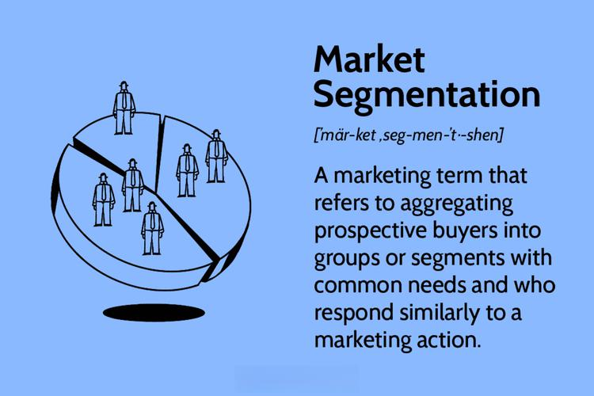

## Table of Contents

## What is XTX Markets and what does it do?

XTX Markets is a company that works in the financial markets. It helps people and other companies buy and sell things like stocks, currencies, and other financial products. They use computers and special math formulas to make these trades happen quickly and efficiently.

The company is known for using technology to make trading better. They have smart systems that can look at a lot of information very fast and decide the best time to buy or sell. This helps their customers make more money and do their trading more easily.

## Who founded XTX Markets and when was it established?

XTX Markets was founded by Alexander Gerko. He started the company in 2015. Alexander used to work at big banks and he wanted to make trading easier and better using technology.

Since it began, XTX Markets has grown a lot. They now work with many big banks and other financial companies around the world. Their main goal is to use smart technology to help people trade things like stocks and currencies quickly and efficiently.

## What are the main products and services offered by XTX Markets?

XTX Markets mainly helps people buy and sell things like stocks, currencies, and other financial products. They do this using computers and special math formulas to make trades happen fast and smoothly. This is called [algorithmic trading](/wiki/algorithmic-trading), and it helps their customers make good decisions quickly.

They also offer something called [liquidity](/wiki/liquidity-risk-premium) provision. This means they help make sure there are always people ready to buy or sell, which makes trading easier for everyone. XTX Markets works with big banks and other financial companies around the world to provide these services.

Their goal is to use technology to make trading simple and efficient. By using smart systems, they can look at a lot of information very quickly and decide the best time to buy or sell. This helps their customers save time and make more money.

## How does XTX Markets generate revenue?

XTX Markets makes money by helping people trade things like stocks and currencies. They use computers and special math formulas to do this quickly and well. When people use XTX Markets to buy or sell, the company charges a small fee for each trade. This fee is how they make money.

They also make money by being a liquidity provider. This means they help make sure there are always people ready to buy or sell. When they do this, they can earn money from the difference between the buying and selling prices. This is called the bid-ask spread, and it's another way XTX Markets earns revenue.

## What is the business model of XTX Markets?

XTX Markets is a company that helps people and other companies buy and sell things like stocks and currencies. They use computers and special math formulas to make these trades happen quickly and smoothly. This is called algorithmic trading. When people use XTX Markets to trade, the company charges a small fee for each trade. This fee is one way they make money.

XTX Markets also makes money by being a liquidity provider. This means they help make sure there are always people ready to buy or sell. When they do this, they can earn money from the difference between the buying and selling prices. This difference is called the bid-ask spread. By providing liquidity, XTX Markets helps make trading easier for everyone and earns revenue at the same time.

## What role does technology play in the success of XTX Markets?

Technology is very important for XTX Markets. They use computers and special math formulas to help people buy and sell things like stocks and currencies quickly and well. This is called algorithmic trading. By using technology, XTX Markets can look at a lot of information very fast and decide the best time to buy or sell. This helps their customers save time and make more money.

XTX Markets also uses technology to be a liquidity provider. This means they help make sure there are always people ready to buy or sell. Their smart systems help them do this job well. By using technology, XTX Markets can make trading easier for everyone and earn money from the difference between buying and selling prices. This is called the bid-ask spread. So, technology helps XTX Markets do their work better and make more money.

## How does XTX Markets maintain a competitive edge in the financial markets?

XTX Markets keeps a strong position in the financial markets by using technology really well. They use computers and special math formulas to help people buy and sell things like stocks and currencies quickly and smoothly. This is called algorithmic trading. By looking at a lot of information very fast, XTX Markets can decide the best time to buy or sell. This helps their customers save time and make more money. Their smart systems give them an advantage over other companies because they can do things faster and better.

Another way XTX Markets stays ahead is by being a good liquidity provider. This means they help make sure there are always people ready to buy or sell. Their technology helps them do this job well. By providing liquidity, XTX Markets makes trading easier for everyone and earns money from the difference between buying and selling prices, which is called the bid-ask spread. Using technology to be a great liquidity provider helps XTX Markets stand out in the financial markets.

## What are some key strategies that XTX Markets uses to manage risk?

XTX Markets uses smart technology to manage risk. They use computers and special math formulas to look at a lot of information very fast. This helps them see what might happen in the markets and make good choices to avoid big losses. By using technology, they can react quickly to changes and keep their trading safe.

They also spread their risk by trading many different things like stocks, currencies, and other financial products. This means if one thing goes down, they can still make money from other things. By not putting all their money into one thing, XTX Markets can protect themselves from big problems in the markets.

## How has XTX Markets expanded globally and what are its international operations?

XTX Markets has grown a lot since it started. They now work with big banks and other financial companies all over the world. They have offices in places like London, New York, Paris, and Singapore. This helps them be close to their customers and understand different markets better. By having offices in different countries, XTX Markets can help people buy and sell things like stocks and currencies no matter where they are.

Their international operations focus on using technology to make trading easy and quick. They use computers and special math formulas to help people trade in many different countries. This means they can look at a lot of information very fast and decide the best time to buy or sell, no matter where the market is. By being in different countries, XTX Markets can provide good service and help their customers make more money from trading around the world.

## What are the major challenges that XTX Markets has faced and how did it overcome them?

XTX Markets has faced some big challenges, like any growing company. One challenge was dealing with fast-changing markets. Financial markets can change very quickly, and it can be hard to keep up. XTX Markets used their smart technology to look at a lot of information very fast and make quick decisions. This helped them stay ahead of the changes and keep their trading safe.

Another challenge was growing their business in different countries. It can be hard to understand and work in new markets. XTX Markets opened offices in places like London, New York, Paris, and Singapore. By being close to their customers and understanding different markets better, they could provide good service and help people trade no matter where they are. This helped XTX Markets grow and become a strong company around the world.

## Can you discuss any significant technological innovations introduced by XTX Markets?

XTX Markets has introduced some really cool technology to help people trade better. One big thing they did is use special math formulas to make trading happen quickly and smoothly. This is called algorithmic trading. With this technology, they can look at a lot of information very fast and decide the best time to buy or sell. This helps their customers save time and make more money because the trades happen so fast.

Another important innovation is how they use computers to provide liquidity. This means they help make sure there are always people ready to buy or sell. Their smart systems make this job easier and more efficient. By using technology to be a good liquidity provider, XTX Markets helps make trading easier for everyone and earns money from the difference between buying and selling prices. This difference is called the bid-ask spread.

## What are the future growth plans and strategic directions for XTX Markets?

XTX Markets wants to keep growing and helping more people trade things like stocks and currencies. They plan to use their smart technology even more to make trading better. They will keep looking at a lot of information very fast and using special math formulas to decide the best time to buy or sell. This will help their customers save time and make more money. XTX Markets also wants to work with more big banks and other financial companies around the world. By doing this, they can help more people and make their business bigger.

Another important part of their plan is to keep opening offices in different countries. Right now, they have offices in places like London, New York, Paris, and Singapore. They want to be in even more places so they can be close to their customers and understand different markets better. By being in different countries, XTX Markets can help people trade no matter where they are. This will make their service better and help them grow as a strong company around the world.

## What is the commitment to research and development?

XTX Markets places a significant emphasis on research and development (R&D), viewing it as integral to its core mission and competitive strength. This commitment is evident in the substantial investment the company makes in cutting-edge research projects and innovative technological advancements. By prioritizing R&D, XTX Markets not only fosters a culture of continuous innovation but also ensures its capacity to adapt swiftly to the ever-evolving landscape of global financial markets.

One of the illustrative examples of XTX Markets' R&D prowess is the development of proprietary algorithms that power its electronic trading systems. These algorithms leverage the latest advancements in [machine learning](/wiki/machine-learning) and [artificial intelligence](/wiki/ai-artificial-intelligence), allowing the firm to process and analyze vast amounts of market data in real-time. This capability not only enhances trading execution but also improves risk management strategies, ensuring robust performance across varying market conditions.

XTX Markets also explores projects that push the boundaries of traditional trading paradigms. For example, its R&D efforts focus on integrating novel data sources into trading models. By utilizing unconventional data inputs, the firm can gain unique insights and enhance predictive accuracy, lending XTX Markets a distinctive edge over competitors reliant on conventional datasets.

Furthermore, continuous improvement and adaptation are central to the long-term success facilitated by XTX Markets' R&D. The firm's structured R&D processes include rigorous testing and iterative refinement, which not only enhance the reliability and efficiency of trading technologies but also allow the firm to remain at the forefront of industry developments. This iterative process is driven by adaptive feedback loops, which incorporate performance outcomes to refine algorithms and strategies. One simple formula to represent the iterative improvement process could be:

$$
\text{Efficiency}_{n+1} = \text{Efficiency}_n + \alpha \cdot \Delta \text{Feedback}
$$

where $\alpha$ is a learning rate parameter and $\Delta \text{Feedback}$ represents the change induced by performance evaluation.

By ensuring that innovation is not a one-time event but an ongoing endeavor, XTX Markets secures its position as a leader in electronic [market making](/wiki/market-making). This relentless pursuit of advancement not only reinforces its market position but also fortifies its capabilities to tackle future challenges and seize new opportunities. Other firms aiming for sustainability and growth can draw valuable lessons from XTX Markets' unwavering commitment to R&D and its strategic approach to integrating cutting-edge innovations into operational frameworks.

## References & Further Reading

[1]: Bergstra, J., Bardenet, R., Bengio, Y., & Kégl, B. (2011). ["Algorithms for Hyper-Parameter Optimization."](https://papers.nips.cc/paper_files/paper/2011/hash/86e8f7ab32cfd12577bc2619bc635690-Abstract.html) Advances in Neural Information Processing Systems 24.

[2]: ["Advances in Financial Machine Learning"](https://www.amazon.com/Advances-Financial-Machine-Learning-Marcos/dp/1119482089) by Marcos Lopez de Prado

[3]: ["Evidence-Based Technical Analysis: Applying the Scientific Method and Statistical Inference to Trading Signals"](https://www.wiley.com/en-gb/Evidence+Based+Technical+Analysis:+Applying+the+Scientific+Method+and+Statistical+Inference+to+Trading+Signals-p-9780470008744) by David Aronson

[4]: ["Machine Learning for Algorithmic Trading"](https://www.amazon.com/Machine-Learning-Algorithmic-Trading-intelligence/dp/9918608013) by Stefan Jansen

[5]: ["Quantitative Trading: How to Build Your Own Algorithmic Trading Business"](https://www.amazon.com/Quantitative-Trading-Build-Algorithmic-Business/dp/0470284889) by Ernest P. Chan