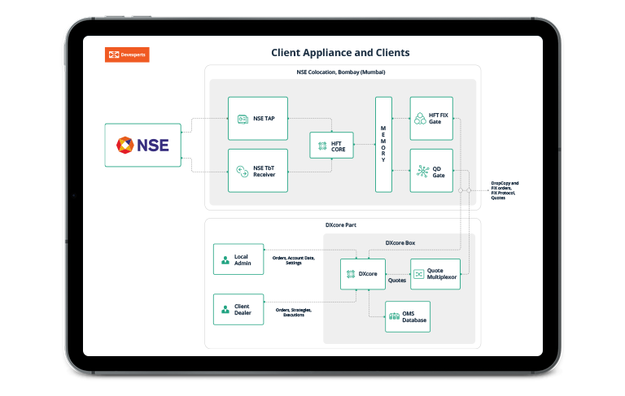

High-Frequency Trading (HFT) represents a revolutionary advancement in financial markets, leveraging technology to execute trades at extraordinary speeds and volumes. HFT platforms are capable of executing thousands of orders in fractions of a second, capitalizing on minor price discrepancies across a variety of trading venues. As a result, these systems have become integral to modern trading, fostering liquidity and tighter spreads, while also introducing complex challenges related to market regulation and stability.

A critical element driving the success of HFT is the technology stack that underpins these platforms. In a domain where milliseconds can determine competitive advantage, having a robust and efficient technology stack is imperative. This stack not only facilitates high-speed data processing and order execution but also ensures low latency—an indispensable factor in achieving optimal trading outcomes. Each layer of this stack, from hardware components like advanced processors and telecommunications infrastructure, to software solutions and algorithms, plays a crucial role in enabling rapid decision-making and trade execution.



The purpose of this article is to explore the critical components and technologies that make up the HFT platforms. By examining these technological building blocks, we aim to provide insights into how they collectively enhance the efficiency and effectiveness of HFT operations. From understanding the hardware requirements and networking solutions to software components and risk management strategies, each section will delve into the fundamental aspects that support the high-paced environment of high-frequency trading.

## Table of Contents

## Understanding High-Frequency Trading

High-Frequency Trading (HFT) is a sophisticated trading strategy characterized by executing a high volume of trades at extremely fast speeds. HFT leverages advanced algorithms and high-speed data networks to capitalize on market inefficiencies that exist for only fractions of a second. Key characteristics of HFT include its reliance on speed and volume; the ability to execute thousands to millions of trades in a single day is made possible through the automation of trading decisions and execution. 

The speed in [HFT](/wiki/high-frequency-trading-strategies) is measured in microseconds or even nanoseconds, which demands not only advanced technology but also strategic infrastructure placement, such as co-location with financial exchanges, to minimize latency. These trades typically involve small profit margins, but the cumulative [volume](/wiki/volume-trading-strategy) generates substantial profits. 

The benefits of HFT are significant, particularly in terms of [liquidity](/wiki/liquidity-risk-premium) and market efficiency. By continuously providing bids and offers, HFT firms contribute to tighter spreads, benefiting retail and institutional investors. Additionally, the rapid execution and order placement by HFT systems can facilitate improved price discovery, ensuring that asset prices reflect true market conditions more accurately and quickly.

However, HFT also poses challenges, particularly concerning market stability and fairness. Events such as the 2010 Flash Crash highlight potential [volatility](/wiki/volatility-trading-strategies) issues where automated trading algorithms malfunction, resulting in dramatic market swings. Critics argue that HFT can disproportionately impact smaller, slower market participants, potentially leading to unfair advantages for firms that can afford advanced technologies.

At the core of HFT's functionality is the use of complex algorithms and automation. These algorithms assess multiple market scenarios and execute trades without human intervention, often employing machine learning and statistical models to predict price movements. The algorithms are designed to detect fleeting [arbitrage](/wiki/arbitrage) opportunities and capitalize on them with precise timing and volume, ensuring profitability even from minuscule price discrepancies.

The automation in HFT trading considers vast amounts of real-time data, analyzing market trends and executing orders based on pre-set criteria defined by the algorithmic logic. This high level of automation and reliance on sophisticated algorithms allows HFT firms to remain competitive, maintaining the delicate balance of speed, efficiency, and risk management to secure continued profitability in an ever-evolving financial landscape. 

In summary, High-Frequency Trading exemplifies the integration of technology and finance, where speed and volume are paramount, and algorithms execute trades at unprecedented scales, impacting both market dynamics and the broader financial ecosystem.

## Core Components of an HFT Technology Stack

High-Frequency Trading (HFT) platforms rely on sophisticated technology stacks to achieve the ultra-fast data processing and order execution required in today's competitive financial markets. The basic building blocks of an HFT platform's technology stack include hardware components, networking infrastructure, and software systems, each meticulously optimized for maximum performance and minimal latency.

A critical aspect of HFT architecture is its ability to handle high-speed data processing. This begins with data acquisition from financial markets, which requires ultra-low latency connections to receive market data in real-time. To ensure the system effectively manages the enormous data influx, HFT platforms often employ distributed computing architectures. These systems are designed to parallelize processes, distributing data and tasks across multiple servers to enhance processing speed and reliability.

Order execution is another vital component of the HFT technology stack, where the architecture must execute trades at lightning speed. The use of direct market access (DMA) is common, allowing the trading platform to send orders directly to the exchange without intermediary intervention, thus minimizing roundtrip time. Additionally, high-frequency trading systems typically encompass an event-driven architecture where algorithms react to market data changes in real-time, enabling rapid order placements based on predefined strategies.

Scalability is crucial in the HFT context. As market conditions and trading volumes vary, an HFT platform must adjust its computing resources dynamically. This often involves the use of cloud computing and virtualization technologies, which allow for flexible scaling of computational resources based on current demands. By implementing scalable infrastructure, trading firms can maintain performance levels and efficiently manage operational costs across different market scenarios.

Real-time data processing capabilities are paramount in high-frequency trading, necessitating advanced techniques for data storage and retrieval. Implementing in-memory databases is a common strategy, as these databases store data directly in RAM, drastically reducing access times compared to traditional disk-based databases. Moreover, employing low-latency messaging systems facilitates quick communication between different parts of the HFT infrastructure, ensuring that trade decisions are based on the most up-to-date data.

In summary, the core components of an HFT technology stack are intricately designed to support high-speed data processing and order execution. Ensuring scalability and real-time data processing within this stack is critical to maintaining a competitive edge in the fast-paced world of high-frequency trading. As technology continues to evolve, these components will require continual innovation to meet the increasing demands of the financial markets.

## Hardware Requirements for HFT Platforms

High-Frequency Trading (HFT) demands exceptional hardware performance due to the need for processing vast amounts of data and executing trades within fractions of a second. Central to this requirement are high-performance CPUs and GPUs. CPUs with multiple cores and high clock speeds are crucial for handling individual trades and decision-making algorithms efficiently. Meanwhile, GPUs are employed for their parallel processing capabilities, significantly enhancing the speed of data analysis tasks which involve running multiple operations simultaneously.

Network cards, designed to deliver low-latency data transmission, are also essential. Specially designed network interface cards (NICs) optimize packet routing and processing directly within the hardware, further minimizing latency. This ensures that trading platforms can rapidly respond to market changes.

Co-location services are integral to minimizing latency. By placing HFT servers physically close to exchange data centers, firms reduce the physical distance and, consequently, the time it takes for data to travel between systems. This proximity can result in minuscule, yet crucial, reductions in transmission time—often measured in microseconds.

Hardware acceleration techniques like Field Programmable Gate Arrays (FPGAs) greatly enhance performance due to their configurability and speed. FPGAs can be customized to execute specific trading algorithms in hardware rather than software, drastically reducing processing times. The ability to implement complex trading strategies directly on the FPGA allows for near-instantaneous execution, which is vital in the fast-paced environment of HFT.

In summary, the necessity for high-performance CPUs, GPUs, and network cards, coupled with strategic infrastructure choices such as co-location and the use of FPGAs, form the backbone of an HFT platform. These elements work in harmony to achieve the ultra-low latency and high-speed processing capabilities needed to maintain a competitive edge in high-frequency trading.

## Networking and Connectivity

In high-frequency trading (HFT), the capability to execute transactions within microseconds is heavily reliant on the network infrastructure employed. One pivotal aspect of this infrastructure is achieving low latency, which is the time it takes for data to travel from one point to another. This is crucial in HFT, where even microsecond delays can significantly impact profitability.

Fiber optic technology plays a vital role in reducing latency due to its ability to transmit data at the speed of light. Unlike traditional copper cables, fiber optics consist of glass threads capable of [carry](/wiki/carry-trading)ing large volumes of data over long distances with minimal signal degradation. This makes it indispensable in ensuring rapid and reliable communication between trading platforms and financial exchanges.

Microwave transmission is another critical technology utilized for its ability to transmit data through the atmosphere at very high speeds. Although it has a lower bandwidth compared to fiber optics, microwave transmission offers the advantage of reduced latency since signals travel a shorter straight-line path over the earth's curvature. This technology is particularly beneficial for linking disparate geographic locations quickly, thereby slightly minimizing the total transmission time.

Network protocols and optimization techniques further contribute to low-latency connectivity. Protocols like User Datagram Protocol (UDP) are preferred over Transmission Control Protocol (TCP) in HFT due to their minimal overhead. Unlike TCP, which ensures data integrity by establishing a connection and error-checking, UDP transmits packets without establishing a connection, hence reducing transmission duration. This trade-off is acceptable in HFT, where speed supersedes the need for guaranteed delivery.

Additionally, network optimization strategies such as route optimization and direct market access (DMA) are central in enhancing network efficiency. Route optimization involves selecting the fastest path for data transmission, often through dynamic adjustments based on network conditions. DMA, on the other hand, allows traders direct access to the markets without intermediary brokers, effectively trimming down the order execution timeline.

In summary, achieving low latency in HFT demands an integrated approach combining advanced technologies like fiber optics and microwave transmission, along with effective utilization of specific network protocols and optimization techniques. These elements collectively ensure that data transmission is executed at unparalleled speeds, thereby sustaining competitive advantage in trading operations.

## Software Components and Programming Languages

High-Frequency Trading (HFT) hinges significantly on sophisticated software platforms and programming languages that enable rapid execution and strategic trading decisions. As HFT platforms aim for high speeds and low latencies, the selection and optimization of software components become crucial.

### Software Platforms and Tools in HFT

1. **Execution Management Systems (EMS):** These systems are essential for managing large volumes of trades with speed and accuracy. They allow traders to execute orders across multiple markets simultaneously, ensuring high performance and low latency. Popular EMS platforms include FlexTrade and TradingScreen, which facilitate flexible strategy implementation and risk management.

2. **Market Data Systems:** Low-latency market data systems are pivotal, as they provide the real-time data necessary for HFT strategies. Tools like Bloomberg Terminal and Thomson Reuters Eikon deliver critical data feeds with minimal lag, helping traders make informed decisions almost instantaneously.

3. **Backtesting Software:** Before deploying an actual trading strategy, thorough testing is necessary to evaluate its viability. Software such as AlgoTrader and QuantConnect allows traders and developers to simulate their strategies against historical market data, ensuring robustness and profitability.

### Programming Languages in HFT

1. **C++:** Renowned for its performance and efficiency, C++ is a favored language in HFT development. Its low-level capabilities allow for precise control over system resources, making it ideal for functions that require high speed and minimal latency. C++ is frequently used in developing trading engines and executing algorithms that demand rapid calculations.

2. **Java:** Combining portability with an extensive library ecosystem, Java is another popular choice in HFT. It is particularly useful for developing scalable systems that need to handle complex transactions and large data sets. The Java Virtual Machine (JVM) optimizes performance, making Java suitable for high-frequency trading applications that require scalability alongside speed.

3. **Python:** Although traditionally slower in execution speed, Python's versatility and ease of use make it valuable for prototyping and developing algorithms. Python’s rich set of libraries, such as NumPy, pandas, and scikit-learn, enable complex analytical processes and data handling. Python is often used in conjunction with other languages for analytics, backtesting, and researching trading strategies.

### Trading Algorithms and Analytics

Trading algorithms form the core of HFT platforms, executing decisions based on pre-defined criteria at lightning speed. These algorithms are typically designed to capitalize on minute price discrepancies, executing large volumes of orders rapidly to gain small, consistent profits.

Analytics software is essential for processing vast amounts of data swiftly, extracting insights that inform trading decisions. Machine learning techniques, often implemented using libraries such as TensorFlow or PyTorch, are increasingly integrated into trading strategies to predict trends and optimize decision-making. Analytics software evaluates historical data, market conditions, and other predictive [factor](/wiki/factor-investing)s to enhance the precision of trading algorithms.

In summary, the technologies and programming languages employed in HFT platforms are essential for achieving the high speed and efficiency characteristic of this trading strategy. As technology continues to evolve, so will the software and tools that make HFT an integral part of the financial markets.

## Risk Management and Security

In High-Frequency Trading (HFT), robust risk management systems are crucial to mitigate potential losses that can arise from the rapid execution of trades and the significant capital they involve. Risk management encompasses several strategies, from setting limit orders to employing advanced algorithms that adapt to real-time market conditions. By leveraging predictive analytics, traders can assess market trends and adjust strategies to minimize exposure to unfavorable market swings. For instance, a key formula in risk management is the Value at Risk (VaR), which helps estimate the maximum potential loss over a set period with a certain confidence level. Here's a simple Python example to calculate VaR:

```python
import numpy as np

def calculate_var(returns, confidence_level=0.95, time_horizon=1):
    # Calculate the mean and standard deviation of returns
    mean_return = np.mean(returns)
    std_dev = np.std(returns)

    # Calculate the z-score for the confidence level
    z_score = np.percentile(returns, (1 - confidence_level) * 100)

    # Calculate VaR
    var = - (mean_return + z_score * std_dev * np.sqrt(time_horizon))
    return var

# Example usage
returns = np.random.normal(0.01, 0.02, 1000)  # Simulated returns data
var = calculate_var(returns)
print(f"Value at Risk: {var:.2f}")
```

Security is critical in protecting HFT platforms from cyber threats. Implementing robust encryption protocols, two-factor authentication, and regular security audits are essential practices to safeguard sensitive data and communication channels. More advanced measures include using [machine learning](/wiki/machine-learning) algorithms to detect anomalous patterns that might indicate a breach, thereby allowing for swift countermeasures. 

Furthermore, compliance with regulatory requirements is non-negotiable in HFT operations. Regulatory bodies like the U.S. Securities and Exchange Commission (SEC) and the Commodity Futures Trading Commission (CFTC) impose guidelines to ensure fair trading practices and market integrity. This involves maintaining transparent record-keeping, conducting regular audits, and adhering to rules such as the Markets in Financial Instruments Directive (MiFID II) in Europe, which mandates stringent reporting and execution standards for HFT activities. Traders and developers must stay informed on regulatory updates to ensure continuous compliance, thereby reducing legal risks and enhancing trust in their operations.

## Challenges and Innovations in HFT Technology

High-Frequency Trading (HFT) constantly challenges both developers and traders, primarily due to the demanding nature of speed and precision required in this highly competitive sector. One of the main challenges is latency. In HFT, microseconds can mean the difference between profit and loss. Therefore, minimizing latency in both order execution and market data feeds is critical.

Another significant challenge involves data management. HFT platforms must process, store, and analyze massive volumes of data in real-time, requiring sophisticated algorithms and powerful computing resources. Furthermore, market volatility and unexpected financial events present risks that need to be mitigated efficiently to prevent substantial losses.

Recent technological innovations have aimed to address these hurdles. Machine learning and [artificial intelligence](/wiki/ai-artificial-intelligence) are increasingly being utilized to optimize trading strategies and manage risk. Machine learning algorithms can analyze trends and predict market movements more effectively, providing traders with an edge. Edge computing is another development that helps reduce latency by processing data near the data source, which is particularly useful for HFT where every millisecond counts.

Hardware advancements, such as the use of FPGA (Field Programmable Gate Arrays), have allowed for higher efficiency in processing trading algorithms. FPGAs can be programmed to perform specific tasks on the trading platform faster than traditional processors. Additionally, microsecond-level time synchronization technologies have improved coordination between different trading systems around the globe.

Looking ahead, the landscape of HFT technology is likely to see even more integration of AI and machine learning to further refine [algorithmic trading](/wiki/algorithmic-trading) strategies. The development of quantum computing may also present transformative opportunities for HFT by drastically increasing computing speeds. Moreover, enhanced cybersecurity measures will become increasingly critical as trading platforms become a prime target for cyber threats.

In summary, while HFT continues to face significant challenges related to latency, data management, and market volatility, ongoing technological innovations are propelling the industry forward. The future promises an evolving array of solutions, likely leading to even faster, more efficient, and secure trading platforms.

## Conclusion

High-Frequency Trading (HFT) is highly reliant on an efficient and advanced technology stack. As we've seen, this stack forms the backbone of any successful HFT platform, enabling it to execute large volumes of trades at near-instantaneous speeds. The core components include high-performance hardware configurations, optimized networking infrastructure, specialized software, and robust risk management systems. Each element is crucial for achieving the speed and reliability required in these high-stakes trading environments.

Continued innovation and adaptation are essential for maintaining a competitive edge in HFT. The markets and technologies are evolving rapidly, and staying ahead means constantly upgrading both the hardware and software aspects of the trading stack. For instance, the incorporation of cutting-edge hardware acceleration techniques like FPGAs and the utilization of low-latency networking solutions such as microwave transmission can provide the milliseconds of advantage that traders seek.

Aspiring developers and investors must thoroughly consider these diverse factors when developing or investing in HFT platforms. Understanding the interplay between different components of the technology stack and their impact on performance and reliability is key. Moreover, it's vital to incorporate comprehensive risk management and security measures to safeguard the platform against potential losses and cyber threats.

Ultimately, the ongoing challenges within the HFT space can be viewed as opportunities for growth and innovation. By keeping a keen eye on emerging technologies and regulatory changes, stakeholders can adapt and excel in the fast-paced world of high-frequency trading, ensuring not only short-term success but long-term sustainability.

## References & Further Reading

[1]: Aldridge, I. (2013). ["High-Frequency Trading: A Practical Guide to Algorithmic Strategies and Trading Systems."](https://www.amazon.com/High-Frequency-Trading-Practical-Algorithmic-Strategies/dp/1118343506) Wiley.

[2]: Duhigg, C. (2014). ["The High-Frequency Trading Arms Race: Explaining the Evolution to a Machine-Based Financial System."](https://academic.oup.com/qje/article/130/4/1547/1916146) SSRN Electronic Journal.

[3]: Narang, R. K. (2013). ["Inside the Black Box: A Simple Guide to Quantitative and High-Frequency Trading."](https://www.amazon.fr/Inside-Black-Box-Quantitative-Frequency/dp/1118362411) Wiley.

[4]: Patterson, S. (2013). ["Dark Pools: The Rise of the Machine Traders and the Rigging of the U.S. Stock Market."](https://www.amazon.fr/Dark-Pools-Machine-Traders-Rigging/dp/0307887189) Crown Business.