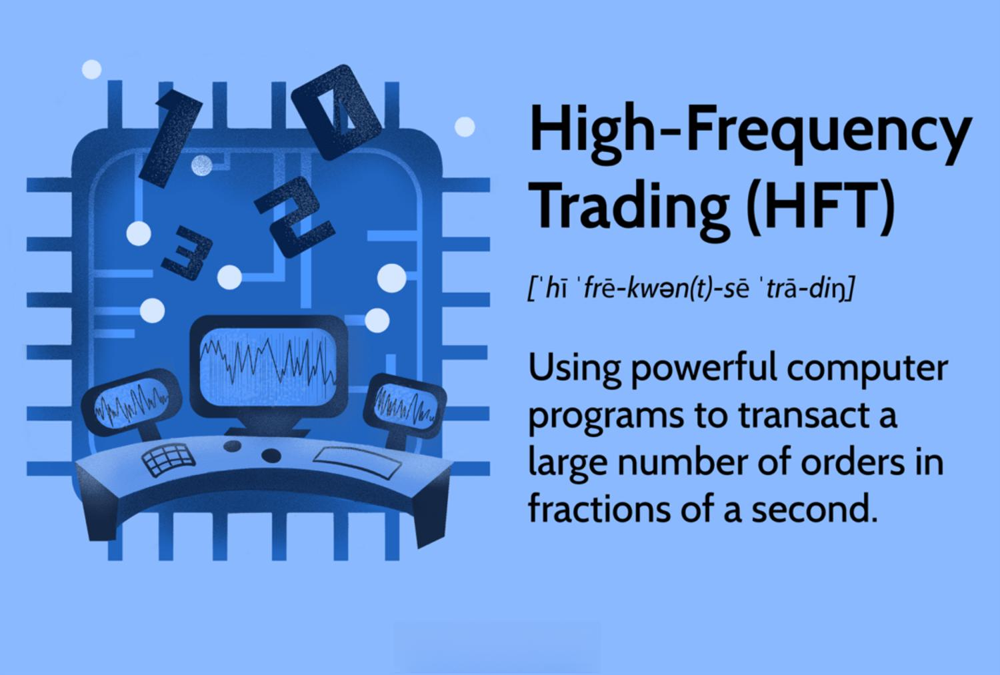

## Table of Contents

## What is High-Frequency Trading (HFT)?

High-Frequency Trading (HFT) is a type of trading that uses powerful computers to buy and sell stocks very quickly. People who do HFT use special programs that can make trades in just a few seconds or even less. The goal is to make small profits from many trades throughout the day. HFT is different from regular trading because it happens so fast and uses a lot of technology.

HFT can be good because it helps make the stock market more active and can make it easier for people to buy and sell stocks. But it can also be risky. Sometimes, the fast trading can cause big changes in stock prices very quickly, which can be confusing and scary for other people who are trading. Also, because HFT uses a lot of technology, it can be hard to understand and control.

## What are the basic components of an HFT platform?

An HFT platform has several important parts that help it work quickly and efficiently. The first part is the trading algorithms. These are like special recipes that tell the computer what to buy and sell, and when to do it. The algorithms use math and data to make quick decisions. Another important part is the data feed. This is like a fast information highway that sends stock prices and other important information to the computer in real time. Without a good data feed, the platform wouldn't know what's happening in the market fast enough to make trades.

The second part of an [HFT](/wiki/high-frequency-trading-strategies) platform is the execution system. This is what actually makes the trades happen. It needs to be very fast and reliable so that the platform can buy and sell stocks in just a few milliseconds. The execution system works closely with the trading algorithms to make sure the trades are done correctly. Finally, there's the risk management system. This part keeps an eye on everything to make sure the platform isn't taking too many risks. It can stop trading if things start to go wrong, which helps protect the money being used for trading.

## What programming languages are commonly used in HFT?

In High-Frequency Trading, people often use a few main programming languages. One of the most common is C++. It's very fast and good at handling a lot of information quickly, which is important for HFT. Another language that's popular is Java. It's a bit easier to use than C++ and can still be very fast, especially when used with special tools that help it run better.

Python is also used a lot in HFT, especially for writing the first versions of trading algorithms. It's easier to learn and use than C++ or Java, but it's not as fast. So, people might start with Python and then move to a faster language like C++ once they have everything working. Sometimes, people also use other languages like C# or even special ones like Erlang, but C++, Java, and Python are the most common.

## How does data feed management work in HFT?

In High-Frequency Trading, data feed management is really important. It's all about getting the latest information about stock prices and other market data as fast as possible. The data feed is like a super-fast information highway that sends this data to the trading computers. These computers need to know what's happening in the market right away so they can make quick decisions about buying and selling stocks. If the data feed is slow or not working right, the HFT platform won't be able to trade effectively.

To manage the data feed, HFT platforms use special technology to make sure the data comes in quickly and correctly. They often use direct connections to stock exchanges or other data providers to get the information as fast as possible. This can mean setting up their computers very close to the stock exchange, a practice known as co-location. The data feed system also needs to handle a lot of information at once without getting overwhelmed. It sorts and processes the data so the trading algorithms can use it to make decisions in just milliseconds.

## What role do co-location services play in HFT?

Co-location services are really important for High-Frequency Trading. They let HFT firms put their computers right next to the stock exchange's computers. This makes the data travel a very short distance, so it can get to the HFT computers super fast. When data moves quickly, HFT platforms can make trades faster than if they were far away from the exchange. This small difference in time can be a big advantage in HFT, where every millisecond counts.

Using co-location services helps HFT firms get the latest market data as soon as it's available. This means they can react to changes in the market before others who are farther away. It's like being at the front of the line when new information comes out. By being so close to the source of the data, HFT platforms can make more trades and possibly make more money. But it also means they have to pay for the special space and connections, which can be expensive.

## What are the key latency reduction techniques used in HFT?

In High-Frequency Trading, reducing latency is super important. One way to do this is by using co-location services, where HFT firms put their computers right next to the stock exchange's computers. This makes the data travel a very short distance, so it gets to the HFT computers really fast. Another technique is using special hardware like Field-Programmable Gate Arrays (FPGAs). These can process data even faster than regular computers because they can be set up to do specific tasks very quickly.

Another key technique is optimizing the software. This means writing the trading algorithms in fast languages like C++ and making sure they run as efficiently as possible. HFT firms also use direct data feeds, which are special connections that send market data straight to their computers without going through a lot of other systems. This cuts down on the time it takes for the data to arrive. All these techniques help HFT platforms make trades in just a few milliseconds, which can be a big advantage in the fast-paced world of trading.

## How is algorithmic trading integrated into HFT platforms?

In High-Frequency Trading, [algorithmic trading](/wiki/algorithmic-trading) is a big part of how things work. It's like the brain of the HFT platform. The algorithms are special programs that use math and data to decide when to buy and sell stocks. They look at lots of information really fast and make decisions in just a few milliseconds. These algorithms are written in fast programming languages like C++ or Java to make sure they can keep up with the speed of the market. The algorithms are always running, looking for small chances to make money by trading quickly.

The HFT platform uses these algorithms to make trades automatically. When the algorithms find a good opportunity, they tell the execution system to buy or sell the stocks right away. The execution system is like the hands of the HFT platform, doing what the algorithms say. The algorithms and the execution system work together very closely to make sure the trades happen as fast as possible. This way, the HFT platform can make lots of small profits throughout the day by trading very quickly.

## What types of databases are used in HFT for storing and retrieving data?

In High-Frequency Trading, the databases used need to be very fast and able to handle a lot of information quickly. One common type of database used is the in-memory database. These databases keep all the data in the computer's memory instead of on a hard drive, which makes them super fast. Examples of in-memory databases that HFT platforms might use are Redis and Apache Ignite. They are good for storing and retrieving data quickly, which is important for making fast trading decisions.

Another type of database used in HFT is the time-series database. These are designed to store data that changes over time, like stock prices. Time-series databases like InfluxDB or TimescaleDB are good at handling lots of data points that come in quickly and need to be looked at in order. They help HFT platforms keep track of how stock prices are changing and use that information to make trading decisions. Both in-memory and time-series databases help HFT platforms work faster and more efficiently.

## How do HFT platforms handle risk management and compliance?

HFT platforms use special systems to manage risk and make sure they follow the rules. Risk management is important because HFT involves making a lot of trades very quickly. The risk management system keeps an eye on everything to make sure the platform isn't taking too many risks. It can stop trading if things start to go wrong, which helps protect the money being used for trading. The system looks at things like how much money is being used, how much the stock prices are changing, and other signs that things might be getting too risky.

Compliance is also important for HFT platforms. They have to follow a lot of rules set by the government and the stock exchanges. To do this, HFT platforms use special software that checks all their trades to make sure they are following the rules. This software can also keep records of all the trades, which is important for showing that the platform is doing things the right way. By using these systems, HFT platforms can trade quickly and safely while still following all the rules.

## What are the advanced networking technologies used in HFT?

In High-Frequency Trading, advanced networking technologies are really important to make sure data moves as fast as possible. One key technology is fiber-optic cables. These cables use light to send information, which is much faster than using regular cables. HFT firms often build their own special routes with these cables to make the distance between their computers and the stock exchange as short as possible. Another technology they use is microwave transmission. Microwaves can travel through the air even faster than light through fiber-optic cables, so some HFT firms use microwave towers to send data quickly.

Another important part of HFT networking is using special network switches and routers that can handle a lot of data very quickly. These devices are made to have very low latency, which means they don't slow down the data much when it passes through them. HFT platforms also use something called network acceleration, which uses special hardware to make sure the data gets to where it needs to go as fast as possible. All these technologies help HFT platforms get the latest market data and make trades in just a few milliseconds, which can be a big advantage in the fast-paced world of trading.

## How do HFT platforms utilize machine learning and AI?

HFT platforms use [machine learning](/wiki/machine-learning) and AI to make their trading better. These technologies help the platforms look at a lot of data and find patterns that might be hard for people to see. For example, machine learning can help the platform predict what the stock prices might do next by looking at past data. This can help the platform make smarter decisions about when to buy and sell stocks. AI can also help the platform learn from its past trades and get better over time, making more money by finding new ways to trade.

Another way HFT platforms use machine learning and AI is to manage risks. These technologies can help the platform see if something might go wrong before it happens. For example, AI can look at how much the stock prices are changing and decide if it's too risky to keep trading. This helps the platform stop trading if things start to get too dangerous, which protects the money being used. By using machine learning and AI, HFT platforms can trade faster and safer, and make more money by being smarter about their trades.

## What are the future trends and technologies expected to impact HFT?

In the future, High-Frequency Trading is expected to be influenced by new technologies like quantum computing. Quantum computers are much faster than regular computers and can solve very hard math problems quickly. This could help HFT platforms make even faster and better trading decisions. Another trend is the use of more advanced AI and machine learning. These technologies will keep getting better at finding patterns in data and predicting what the market will do next. This could make HFT platforms even smarter and more profitable.

Another important trend is the use of blockchain technology. Blockchain can make trading safer and more transparent by keeping a record of all trades that can't be changed. This could help HFT platforms follow the rules better and reduce the risk of fraud. Also, as more trading happens around the world, HFT platforms will need to handle data from different places very quickly. This means they will need even faster and better networking technologies to stay ahead. All these trends and technologies will shape how HFT works in the future, making it faster, safer, and more efficient.

## References & Further Reading

[1]: Aldridge, I. (2013). ["High-Frequency Trading: A Practical Guide to Algorithmic Strategies and Trading Systems."](https://www.amazon.com/High-Frequency-Trading-Practical-Algorithmic-Strategies/dp/1118343506) Wiley.

[2]: Duhigg, C. (2014). ["The High-Frequency Trading Arms Race: Explaining the Evolution to a Machine-Based Financial System."](https://academic.oup.com/qje/article/130/4/1547/1916146) SSRN Electronic Journal.

[3]: Narang, R. K. (2013). ["Inside the Black Box: A Simple Guide to Quantitative and High-Frequency Trading."](https://www.amazon.fr/Inside-Black-Box-Quantitative-Frequency/dp/1118362411) Wiley.

[4]: Patterson, S. (2013). ["Dark Pools: The Rise of the Machine Traders and the Rigging of the U.S. Stock Market."](https://www.amazon.fr/Dark-Pools-Machine-Traders-Rigging/dp/0307887189) Crown Business.
