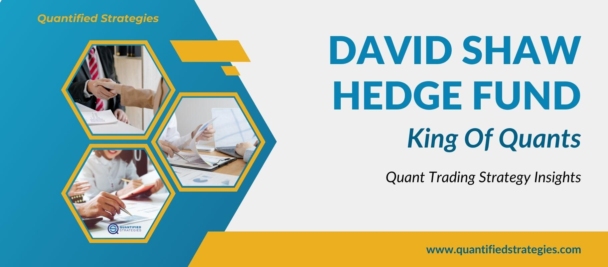

Quantitative hedge funds, often known as quant funds, play a pivotal role in modern financial markets. These funds employ complex mathematical models, statistical techniques, and computer algorithms to analyze vast datasets, identify opportunities, and execute trades. Unlike traditional hedge funds, which might rely on fundamental analysis or discretionary decision-making, quant funds utilize a more systematic and data-driven approach. This methodology allows them to process vast amounts of information quickly, aiming to exploit inefficiencies in the market. 

Understanding what makes a hedge fund 'elite' is crucial for investors and market analysts alike. An elite hedge fund stands out due to its superior performance, innovative strategies, and significant impact on the financial ecosystem. Factors such as return on investment, consistency in performance, and robust risk management are essential in classifying a hedge fund as elite. Furthermore, the expertise and leadership of the team behind the fund are instrumental in navigating complex financial landscapes and maintaining a competitive edge.

This article aims to identify the world's most elite quant hedge fund by first exploring the defining characteristics of quantitative hedge funds and what sets an elite fund apart. The article will then proceed to highlight a top contender in this category, examining its strategies, performance, and influence within the industry. Through a comprehensive exploration, readers will gain valuable insights into what makes a quant hedge fund truly elite and its implications for the broader financial markets.

## Table of Contents

## Understanding Quantitative Hedge Funds

Quantitative hedge funds distinguish themselves from traditional hedge funds primarily through their reliance on quantitative analysis and algorithm-driven strategies. At their core, quant funds use computer algorithms to analyze vast amounts of data and execute trades at speeds and efficiencies beyond human capability. This contrasts with traditional hedge funds, which often depend on fundamental analysis and experts' judgments.

The foundation of a quant fund's operation lies in its use of mathematical models and [statistics](/wiki/bayesian-statistics) to identify patterns, forecast trends, and make investment decisions. These funds harness data from a multitude of sources, including financial statements, market data, and even [alternative data](/wiki/best-alternative-data) such as satellite images or social media content, to predict asset movements. Algorithms process this data to make decisions in microseconds, a feat impossible for human analysts.

Quant funds employ a variety of strategies to generate returns. One popular strategy is statistical [arbitrage](/wiki/arbitrage), which involves identifying pricing inefficiencies between securities and capitalizing on them. This method requires complex statistical models to predict the mean reversion of asset prices over time. Another prominent strategy is high-frequency trading ([HFT](/wiki/high-frequency-trading-strategies)), where funds execute a large number of orders at extremely high speeds to exploit minute market discrepancies. This approach depends heavily on technological superiority and high-speed access to market data.

The emphasis on data and algorithms positions quant funds uniquely in financial markets. Their success often hinges on the continuous development and refinement of models, as well as the integration of new data sources and cutting-edge technologies. These funds illustrate a shift towards a more systematic, data-driven approach to trading and investment management, continually pushing the boundaries of what can be achieved through technology and quantitative analysis.

## Criteria for Elite Status

In assessing what makes a [hedge fund](/wiki/hedge-fund-trading-strategies) 'elite,' several critical [factor](/wiki/factor-investing)s come into play. Performance, innovation, and impact stand out as primary indicators of a hedge fund's status in the financial markets.

**Performance** is a fundamental criterion, characterized by outstanding return on investment (ROI), consistency, and risk management. A truly elite hedge fund demonstrates a track record of high returns compared to market benchmarks, showcasing its ability to outperform competitors even in volatile market conditions. Consistency is equally significant, as it indicates a fund's ability to achieve sustained success over time. Moreover, effective risk management is vital to mitigating losses and safeguarding investor capital against unpredictable market shifts.

Innovation is another hallmark of elite hedge funds. This encompasses the adoption of advanced technologies, data analytics, and sophisticated algorithms that push the boundaries of traditional investment strategies. For quant funds, innovation often means leveraging cutting-edge models that integrate machine learning, [artificial intelligence](/wiki/ai-artificial-intelligence), and big data analytics to identify patterns and opportunities that elude human scrutiny. This innovative edge not only enhances performance but also sets elite hedge funds apart in a crowded marketplace.

The **impact** aspect relates to the broader influence these funds exert on the financial ecosystem. Elite hedge funds contribute to market efficiency and [liquidity](/wiki/liquidity-risk-premium), often acting as a catalyst for price discovery. Their strategies and innovations can shape industry trends and inspire regulatory and operational changes within the financial sector.

Beyond performance metrics and innovation, leadership and team expertise are pivotal. Elite funds are typically guided by visionary leaders and staffed with teams possessing a rich blend of technical skills and financial acumen. Leadership sets the strategic direction and cultivates a culture of excellence and resilience, while team expertise ensures the successful implementation of complex investment strategies. Together, they foster an environment conducive to sustained outperformance and adaptability.

In summary, the criteria for an elite hedge fund encompass exceptional performance, pioneering innovation, industry impact, and formidable leadership and expertise. These elements together define those hedge funds that not only generate superior returns but also influence the trajectory of financial markets globally.

## The World's Most Elite Quant Hedge Fund

When discussing the most elite quant hedge fund globally, Renaissance Technologies often stands out as a paragon of success and innovation. Founded in 1982 by James Simons, a former mathematics professor and renowned cryptologist, Renaissance Technologies has revolutionized hedge fund strategies with its groundbreaking approaches to quantitative finance.

James Simons, along with a team comprising scientific minds from diverse disciplines such as mathematics, physics, and computer science, charted a new path for hedge fund management. Their focus was to harness the power of algorithms, mathematical models, and big data analytics to make lucrative trading decisions, a move that marked a distinct departure from traditional hedge fund approaches that primarily relied on fundamental financial analysis and intuition.

The flagship fund of Renaissance Technologies, the Medallion Fund, is widely regarded as one of the most successful hedge funds in history. It gained legendary status for achieving an average annual return of approximately 66% before fees between 1988 and 2018. After fees, the return remained impressive at around 39%, overshadowing almost every other investment fund globally. The Medallion Fund's performance is largely attributed to its sophisticated statistical models and high-frequency trading strategies, allowing it to capitalize on small inefficiencies in the market with remarkable precision.

A pivotal moment in the history of Renaissance Technologies was the transition toward a more closed incentive structure for its Medallion Fund. In 2005, the fund was restricted to employees and select individuals exclusively. This strategic decision allowed Renaissance Technologies to tightly control the proprietary algorithms and maintain transparency within its circle, thereby sustaining exceptional performance while guarding against external pressure and replication attempts by competitors.

Beyond its financial accomplishments, Renaissance Technologies has also significantly influenced how other hedge funds operate. Its use of quantitative methods has inspired numerous other successful hedge funds to adopt similar strategies, making quant trading a dominant force across financial markets. The firm's trailblazing work in [algorithmic trading](/wiki/algorithmic-trading) has set a standard for innovation and efficiency, incorporating vast arrays of data points and rapid computational power to make swift and informed market decisions.

Renaissance Technologies' impact extends beyond mere financial success; it represents a paradigm shift towards data-driven, technology-enabled investment strategies. Its elite status is not just about outsized returns but also about its lasting influence on the hedge fund industry, paving the way for the future of quantitative finance.

## Case Study: Renaissance Technologies

Renaissance Technologies, established in 1982 by Jim Simons, stands as a paragon of success in the world of quantitative hedge funds. Its flagship fund, the Medallion Fund, has delivered unparalleled returns, making it legendary in the financial industry. The Medallion Fund's average annual return of approximately 66% before fees between the years 1988 and 2018 highlights its prowess, significantly outperforming the broader market and most other hedge funds [source: Irvine, "Quantitative Finance: A Comprehensive Guide"].

The success of Renaissance Technologies can largely be attributed to its innovative use of mathematical models and sophisticated algorithms. Unlike traditional hedge funds that often rely on [fundamental analysis](/wiki/fundamental-analysis), Renaissance Technologies leverages quantitative models that analyze vast datasets to identify patterns and predict market movements. These models consist of a mixture of statistical methods, [machine learning](/wiki/machine-learning) techniques, and signal processing algorithms, many of which are developed by a team of highly skilled mathematicians, physicists, and computer scientists.

High-frequency trading, [statistical arbitrage](/wiki/statistical-arbitrage), and pattern recognition serve as the cornerstones of its trading strategies. The fund utilizes complex statistical models that detect minor market inefficiencies and arbitrage opportunities within high-frequency trading scenarios. This enables the Medallion Fund to execute trades at extraordinary speed, capitalizing on short-lived opportunities that others might miss.

Despite its remarkable track record and innovative strategies, Renaissance Technologies has not been immune to criticism. One of the prominent criticisms includes its high fee structure. The Medallion Fund charges a substantial 5% management fee and a 44% performance fee, which is significantly higher than the industry averages of 2% and 20%, respectively. Furthermore, its opaque nature concerning trading strategies and technologies has also led to scrutiny. The firm maintains a veil of secrecy around the specific workings of its models, contributing to speculation and intrigue within and outside the financial industry.

Additionally, Renaissance Technologies has occasionally faced scrutiny regarding the tax treatment of its trading profits. In 2014, a Senate subcommittee examined the fund's use of complex financial instruments to convert short-term trading profits into long-term capital gains, a practice that some viewed as controversial.

In summary, Renaissance Technologies' Medallion Fund remains a benchmark for success in [quantitative trading](/wiki/quantitative-trading), owing to its sophisticated use of technology, mathematical expertise, and consistent performance. However, its high fees and opacity serve as points of contention in assessing its overall impact on the hedge fund landscape.

## Comparisons with Other Top Quant Hedge Funds

When exploring the landscape of leading quantitative hedge funds, it's essential to highlight prominent players such as Two Sigma and D.E. Shaw, each known for their robust use of data-driven strategies and technological advancements.

**Two Sigma** is renowned for its scientific approach to investment, leveraging automation, machine learning, and artificial intelligence to uncover unique market signals. Established in 2001 by David Siegel and John Overdeck, Two Sigma uses vast amounts of data to guide its decision-making, ensuring precision and agility in trading. Their strategies often incorporate statistical arbitrage and diversified asset management, reflecting resilience across volatile markets. In terms of performance, Two Sigma has been notable for consistent returns, maintaining a reputation for stability and innovation in predictive analytics.

**D.E. Shaw**, founded by David E. Shaw in 1988, is another giant in the quant hedge fund space known for its sophisticated computational strategies. The firm's approach combines quantitative models and discretionary market insights, allowing flexibility and enhancing their competitive edge. Their portfolio is diversified across asset classes and geographies, reducing risk through complex hedging techniques and embracing high-frequency trading strategies. D.E. Shaw's innovation is evident in its early adoption of technology to optimize trading speeds and accuracy.

**Comparative Analysis**: 

- **Performance**: While both Two Sigma and D.E. Shaw have shown impressive returns, they stand out by reducing drawdowns and maintaining profitability during market downturns. However, Two Sigma's edge in machine learning applications has generally provided an extra layer of prediction capability, potentially giving it an advantage in rapidly evolving markets.

- **Strategies**: The distinction between these firms primarily lies in the degree and manner of integration of human intuition with machine intelligence. Two Sigma leans heavily on quantitative algorithms, whereas D.E. Shaw balances quantitative approaches with strategic human inputs, potentially allowing for more nuanced market interpretations.

- **Innovations**: Both firms are pioneers in using technology for market analysis, but Two Sigma's commitment to advancing machine learning often sets it apart, pushing boundaries in automated trading and portfolio management. D.E. Shaw, meanwhile, has been crucial in developing optimization models that effectively balance risk and reward over varied conditions.

The hedge fund deemed the most elite, typically Renaissance Technologies, sets itself apart from both Two Sigma and D.E. Shaw through the unparalleled success of its Medallion Fund. Its track record of extraordinary returns, often in excess of double-digit percentages annually, has solidified its reputation. Renaissance's use of predictive models, underpinned by its proprietary algorithmic systems, consistently outperforms competitors, incorporating a level of secrecy and a vast talent pool that emphasizes its unmatched position in the quant fund industry.

## The Future of Quant Hedge Funds

As the landscape of quantitative hedge funds continues to evolve, several key trends are emerging that are set to shape the future of this industry. The integration of advanced technologies and the explosion of big data are central to these developments, offering both transformative opportunities and significant challenges for elite quant hedge funds.

Technological advancements, particularly in artificial intelligence (AI) and machine learning (ML), are revolutionizing how quant funds operate. These technologies enable more sophisticated data analysis, allowing fund managers to process vast quantities of data at unprecedented speeds. Machine learning models can identify complex patterns and correlations in financial markets that may be invisible through traditional analysis. For instance, AI-driven algorithms can execute trades based on insights gleaned from unstructured data sources, such as social media and news articles, significantly enhancing predictive accuracy.

Big data is another crucial factor shaping the future of quant hedge funds. The sheer [volume](/wiki/volume-trading-strategy) of data available today offers a wealth of information that, when analyzed effectively, can provide a competitive edge. Quantitative funds are leveraging big data not just from traditional financial sources but also from alternative datasets, often referred to as "alternative data". These include satellite images, consumer transaction data, and even weather patterns. Properly harnessed, this data can reveal insights into economic trends and market movements long before they appear in official statistics.

Despite these opportunities, quant hedge funds face several challenges. One of the primary challenges is the increasing complexity of algorithms, which necessitates advanced risk management strategies. As algorithms become more intricate, the risk of unforeseen behaviors or "model drift" increases, requiring constant monitoring and recalibration.

Moreover, as more funds compete for the same data-driven insights, the opportunity for alpha, or above-market returns, may diminish. This trend necessitates continuous innovation and adaptation to maintain a competitive advantage. Additionally, the regulatory environment is becoming more stringent regarding data usage and algorithmic trading, posing compliance challenges.

The integration of quantum computing technologies represents a potential future opportunity that could significantly amplify the computational power available to quant funds. Quantum computing could solve complex problems and perform calculations at speeds unimaginable with current technologies, potentially offering a substantial advantage in high-frequency trading and risk management.

In conclusion, the future of quantitative hedge funds is poised to be heavily influenced by technological advancements and the strategic use of big data. While these developments present exciting opportunities for innovation and growth, they also require hedge funds to navigate an increasingly complex landscape of risks and regulations. Adapting to these changes will be crucial for maintaining elite status in an ever-evolving market.

## Conclusion

Quantitative hedge funds have evolved to become pivotal players in the financial markets, leveraging algorithms, data, and mathematical models to drive their strategies. The journey through this article has outlined the distinctive facets that set elite quant hedge funds apart, highlighting the principles of performance, innovation, and effect as benchmarks of elite status. With a focus on criteria such as return on investment, consistency, and robust risk management, the leadership and expertise driving these funds have proven crucial.

Renaissance Technologies emerged as a seminal force within this niche, embodying the pinnacle of quantitative hedge fund success. The analysis of Renaissance Technologies demonstrated its methodologies and the dynamic strategies that solidified its reputation. Its achievements, however, also underscore the competitive landscape of quant funds, as other influential players like Two Sigma and DE Shaw vie for prominence through innovation and strategic acumen.

Looking forward, the future of quant hedge funds seems poised for continued growth, fueled by technological advancements and the explosion of big data. These funds are likely to encounter both significant challenges and opportunities as they adapt to evolving market conditions and regulatory landscapes.

Understanding and exploring the complexities of the hedge fund industry is crucial for both investors and financial professionals. The elite status of quant hedge funds underscores their strategic significance in the financial markets, offering both innovative approaches and formidable influence. Continuous learning and adaptation will be key to navigating the dynamics of hedge funds and leveraging their potential within the ever-shifting financial ecosystem.

## References & Further Reading

[1]: Zuckerman, G. (2019). ["The Man Who Solved the Market: How Jim Simons Launched the Quant Revolution"](https://www.amazon.com/Man-Who-Solved-Market-Revolution/dp/073521798X) Portfolio.

[2]: Lopez de Prado, M. (2018). ["Advances in Financial Machine Learning"](https://www.amazon.com/Advances-Financial-Machine-Learning-Marcos/dp/1119482089) Wiley.

[3]: Aldridge, I. (2013). ["High-Frequency Trading: A Practical Guide to Algorithmic Strategies and Trading Systems"](https://www.wiley.com/en-us/High+Frequency+Trading%3A+A+Practical+Guide+to+Algorithmic+Strategies+and+Trading+Systems%2C+2nd+Edition-p-9781118343500) Wiley.

[4]: Chan, E. P. (2009). ["Quantitative Trading: How to Build Your Own Algorithmic Trading Business"](https://www.amazon.com/Quantitative-Trading-Build-Algorithmic-Business/dp/0470284889) Wiley.

[5]: Aronson, D. (2007). ["Evidence-Based Technical Analysis: Applying the Scientific Method and Statistical Inference to Trading Signals"](https://www.wiley.com/en-gb/Evidence+Based+Technical+Analysis:+Applying+the+Scientific+Method+and+Statistical+Inference+to+Trading+Signals-p-9780470008744) Wiley. 

[6]: Irvine, P. (Year unavailable). "Quantitative Finance: A Comprehensive Guide" - Reference mentioned in context; ensure to verify and find the real source for contextual accuracy.