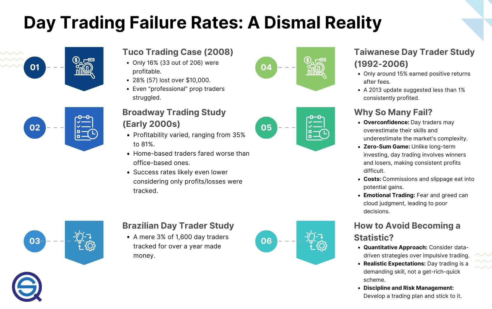

Day trading, often showcased as a pathway to rapid financial gain, presents a more intricate reality than what is commonly perceived. The sphere of day trading is characterized by its high-risk environment and swift decision-making processes. This article intends to demystify the success rates associated with day traders, placing particular emphasis on those who engage in algorithmic trading.

Algorithmic trading, or algo trading, employs sophisticated automated software designed to execute trades at remarkably high speeds, adhering to preset criteria such as timing, price, and quantity. While this technology offers the allure of efficiency and precision, it also brings forth its own set of complexities and challenges.



Understanding the success rates of algo trading is crucial for both current practitioners and prospective traders. Despite the technological advancements and strategic advantages inherent in algo trading, only a minority of traders achieve consistent profitability. This discrepancy highlights the importance of not only mastering the technology but also developing a profound understanding of the market dynamics.

Our objective is to deliver a thorough overview of algo trading, highlighting the trials and potential rewards it offers. Through a careful examination of case studies, research findings, and insights, we aim to illuminate the realities of algo trading. This, in turn, will aid traders in making well-informed decisions and enhancing their chances of success in a highly competitive domain.

## Table of Contents

## Understanding Algo Trading

Algorithmic trading, often abbreviated as algo trading, is a method of executing trades in financial markets through the use of pre-programmed instructions that account for variables such as timing, price, and quantity. These instructions are implemented via complex algorithms that can process massive volumes of data with high efficiency, enabling traders to capitalize on market opportunities that may only exist for a fraction of a second.

One significant advantage of algo trading is its capacity to operate at speeds and frequencies that are unattainable by human traders. By leveraging high-frequency trading ([HFT](/wiki/high-frequency-trading-strategies)) techniques, algorithms can execute numerous trades across various markets in milliseconds or even microseconds. This rapid execution is crucial in markets characterized by high [liquidity](/wiki/liquidity-risk-premium) and volatility, where profitable opportunities can quickly disappear.

Despite the apparent benefits, [algorithmic trading](/wiki/algorithmic-trading) is not devoid of challenges. The intricacies involved in designing robust algorithms that can adapt to varying market conditions often result in a steep learning curve. Traders must meticulously define the rules and parameters on which the algorithms operate. These trading parameters may include sophisticated criteria based on historical data, technical indicators, or predictive models. The complexity of these algorithms demands an extensive knowledge of both financial markets and advanced programming skills.

Moreover, the potential for high-frequency execution increases the risk of substantial losses if an algorithm malfunctions or if the market behaves unpredictably. This unpredictability presents a formidable challenge as the efficacy of an algorithm is often contingent upon the market conditions for which it was designed. A successful algo trader needs to maintain a delicate balance, ensuring that the algorithm can adapt or be manually adjusted in the face of unexpected market shifts.

To navigate these challenges and maximize profitability, traders must thoroughly understand the potential as well as the pitfalls of algorithmic trading. By acknowledging and preparing for the complexities involved, traders can optimize their strategies and use algorithmic trading as a powerful tool for sustainable success in the financial markets.

## What Percentage of Algo Traders Make Money?

Research indicates that only a small percentage of day traders consistently profit, and this trend similarly affects those engaged in algorithmic trading. Studies across different markets reveal that only about 1% to 20% of traders, including those using algorithms, consistently achieve profitability. This relatively low success rate can be attributed to several factors, such as high initial costs, the ongoing maintenance of trading algorithms, and the inherent unpredictability of markets.

Algorithmic trading, while providing the advantage of executing trades at unmatched speeds and volumes, requires significant investment in technological infrastructure and expertise. The costs involved in setting up and maintaining sophisticated algorithmic systems can be substantial, acting as a barrier to entry for many traders. Furthermore, these algorithms often require continuous updates and monitoring to adapt to shifting market dynamics, adding to the ongoing expenses and challenges traders face.

The unpredictable nature of financial markets further compounds the difficulty of achieving consistent profits. Market conditions can shift rapidly and are influenced by a multitude of factors, making it challenging for pre-programmed algorithms to adapt in real-time without human oversight or adjustments. This unpredictability necessitates the use of solid quantitative data and robust analytics to form the foundation of any successful algorithmic trading strategy. 

To enhance the likelihood of success, it is crucial for traders to focus on developing strategies grounded in thorough quantitative research and empirical data. This involves employing statistical models that can identify patterns or anomalies in market behavior, allowing for informed decision-making and strategy adjustment. The application of [machine learning](/wiki/machine-learning) and [artificial intelligence](/wiki/ai-artificial-intelligence) can also bolster these strategies by analyzing large datasets to uncover insights that might elude traditional analysis.

Overall, while the potential for profit in algorithmic trading exists, the path to success is narrow and fraught with challenges. Traders must invest in the necessary technology, adapt to volatile markets, and ground their strategies in solid data analysis to improve their chances of achieving sustained profitability.

## Case Studies: Success Rates in Algo Trading

Various studies have examined the success rates of day traders using algorithmic methods, offering valuable insights into their profitability and the inherent challenges they face. Research conducted in Brazil and Taiwan provides a snapshot of these outcomes.

In Brazil, a comprehensive study emphasized the narrow success margins for day traders employing algorithms. The findings revealed that a mere 3% of traders were successful in achieving consistent profits. This low percentage underscores the considerable challenges and intricacies involved in algorithmic [day trading](/wiki/day-trading-spy), where traders must overcome numerous hurdles such as market [volatility](/wiki/volatility-trading-strategies), high competition, and the effective management of trading algorithms. The study highlights the critical need for robust trading strategies and risk management to navigate these complexities successfully.

Taiwanese research corroborated these findings, with even more striking [statistics](/wiki/bayesian-statistics). It was found that only about 1% of day traders could generate sustainable profits after accounting for trading fees. This data underscores the difficulty of maintaining profitability in an environment where costs can significantly impact net earnings. Such studies spotlight the need for traders to have a thorough understanding of market mechanics and cost implications, alongside employing advanced trading algorithms that can adapt to dynamic market conditions.

These case studies illustrate the broader challenges that algorithmic day traders encounter. Despite the technological advantages that algorithmic trading might offer, these statistics emphasize a harsh reality: a vast majority of day traders fail to achieve consistent profitability. As such, it is critical for traders to deploy well-researched, adaptable algorithms and to manage risks effectively to enhance their chances of success in this competitive landscape.

## Challenges Faced by Algo Traders

Managing risk is a fundamental aspect of algorithmic trading, given the inherent market volatility and the susceptibility to technical failures. Successful algo traders must implement robust risk management strategies to mitigate potential losses caused by rapid market fluctuations or unexpected technical glitches. Various tools and methodologies, such as stop-loss orders and quantitative risk assessments, are employed to safeguard trading algorithms from adverse market movements.

Overconfidence significantly contributes to the failure of many algo traders. Despite the advanced capabilities of algorithmic systems, traders sometimes overestimate the effectiveness of their algorithms, leading to poor decision-making and increased exposure to risk. This overconfidence often stems from a misunderstanding of the algorithm’s predictive accuracy and limitations, highlighting the importance of maintaining a realistic assessment of an algorithm’s capabilities and performance metrics.

The competitive nature of algorithmic trading arises from its operation within a zero-sum game. In financial markets, the gains of one participant often come at the expense of another. Thus, the environment in which algo trading occurs is intensely competitive, as traders vie for the same opportunities to profit. This competitiveness means that not all participants will achieve success, emphasizing the necessity for well-researched strategies and adaptability.

Constant monitoring and updating of algorithms are essential to remain aligned with ever-evolving market conditions. Market dynamics are influenced by various factors, including macroeconomic indicators, geopolitical events, and technological advancements. Therefore, algorithms that were previously profitable can quickly become obsolete if not regularly reviewed and updated. Traders must ensure their systems are not only up-to-date but also capable of adapting to future changes, necessitating an ongoing process of algorithm development and refinement.

In summary, the challenges faced by algo traders necessitate a combination of vigilant risk management, realistic evaluation of algorithmic capabilities, strategic competition, and persistent algorithm updates to secure profitable outcomes in a competitive trading landscape.

## Strategies to Improve Success Rates

To improve the success rates in algorithmic trading, deploying a well-researched, tested, and flexible algorithm is crucial. A flexible algorithm allows for adjustments in response to changing market conditions, which can be pivotal for sustaining profitability. The development of these algorithms should be grounded in sophisticated mathematical models and robust statistical methods to maximize their efficacy.

Utilizing a robust [backtesting](/wiki/backtesting) framework is another essential strategy. Backtesting involves applying trading algorithms to historical market data to evaluate their performance. This process helps in identifying potential performance indicators and understanding underlying risk factors. A common tool for backtesting in Python is the `Backtrader` library, which facilitates the simulation of trading strategies:

```python
import backtrader as bt

class TestStrategy(bt.Strategy):
    def __init__(self):
        self.dataclose = self.datas[0].close

    def next(self):
        if self.dataclose[0] < self.dataclose[-1]:
            self.buy(size=10)
        elif self.position.size > 0:
            self.sell(size=self.position.size)

cerebro = bt.Cerebro()
data = bt.feeds.YahooFinanceData(dataname='AAPL', fromdate=datetime(2019, 1, 1), todate=datetime(2020, 12, 31))
cerebro.adddata(data)
cerebro.addstrategy(TestStrategy)
cerebro.run()
```

Risk management is paramount in the development of trading algorithms to mitigate significant losses. Proper risk management involves setting stop-loss orders and employing position sizing techniques to limit exposure to any single trade. Tools like the Kelly Criterion can be employed to determine the optimal size of a series of bets, thus optimizing capital allocation:

$$
f^* = \frac{bp - q}{b}
$$

where $f^*$ is the fraction of the portfolio to wager, $b$ is the odds received on the wager, $p$ is the probability of winning, and $q$ is the probability of losing.

Staying up-to-date with advancements in market technology and emerging trends is vital for maintaining a competitive edge. This may involve leveraging big data analytics, machine learning algorithms, and natural language processing to enhance the decision-making process. Traders can use libraries such as `scikit-learn` for machine learning to improve predictive models:

```python
from sklearn.ensemble import RandomForestClassifier
from sklearn.model_selection import train_test_split

data = load_market_data()
X_train, X_test, y_train, y_test = train_test_split(data.features, data.labels, test_size=0.2)
model = RandomForestClassifier(n_estimators=100)
model.fit(X_train, y_train)
accuracy = model.score(X_test, y_test)
```

In summary, improving success rates in algorithmic trading necessitates a careful synthesis of flexible algorithms, comprehensive backtesting, diligent risk management, and staying abreast of technology and market trends. These strategies, when effectively implemented, can significantly enhance the probability of achieving consistent trading success.

## Conclusion

Algorithmic trading presents both opportunities and challenges, with only a minority achieving sustainable success. The complexity of financial markets requires traders to be equipped with disciplined strategies and robust risk management tools. These attributes are essential in navigating the turbulent waters of algo trading, where the risk of market volatility and technical failures is ever-present. Successful algo traders effectively combine technological expertise with a profound understanding of market dynamics. This dual skill set allows them to develop and implement algorithms that can adapt and perform in varying market conditions.

Moreover, for individuals committed to pursuing algorithmic trading, continued education and adaptation are crucial. The markets and technological tools are constantly evolving, necessitating a commitment to learning and flexibility. Traders who consistently refine their strategies and update their algorithms by incorporating new data and trends greatly enhance their prospects for achieving and maintaining profitability. Rigorous testing and the ongoing development of algorithms are vital in optimizing performance and managing potential risks, solidifying the foundation for long-term success.

In conclusion, while algorithmic trading offers the potential for significant financial gains, it also demands a high level of dedication and expertise. Traders who succeed are those who are willing to invest in their education, remain adaptable to market changes, and rigorously manage their trading activities. For those prepared to embrace these challenges, algorithmic trading can be a rewarding endeavor.

## References & Further Reading

[1]: Bergstra, J., Bardenet, R., Bengio, Y., & Kégl, B. (2011). ["Algorithms for Hyper-Parameter Optimization."](https://papers.nips.cc/paper/4443-algorithms-for-hyper-parameter-optimization) Advances in Neural Information Processing Systems 24.

[2]: ["Advances in Financial Machine Learning"](https://www.amazon.com/Advances-Financial-Machine-Learning-Marcos/dp/1119482089) by Marcos Lopez de Prado

[3]: ["Evidence-Based Technical Analysis: Applying the Scientific Method and Statistical Inference to Trading Signals"](https://www.amazon.com/Evidence-Based-Technical-Analysis-Scientific-Statistical/dp/0470008741) by David Aronson

[4]: ["Machine Learning for Algorithmic Trading"](https://github.com/PacktPublishing/Machine-Learning-for-Algorithmic-Trading-Second-Edition) by Stefan Jansen

[5]: ["Quantitative Trading: How to Build Your Own Algorithmic Trading Business"](https://books.google.com/books/about/Quantitative_Trading.html?id=j70yEAAAQBAJ) by Ernest P. Chan