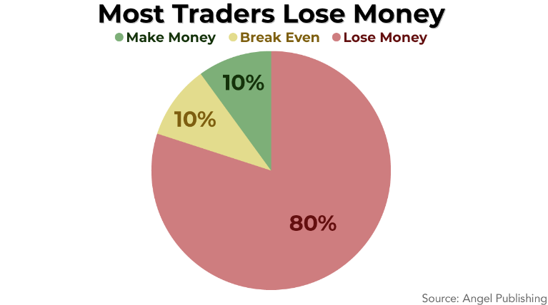

## Table of Contents

## What is the general success rate among traders?

The success rate among traders varies a lot. Some studies say that only about 10% to 20% of traders make consistent profits. This means that most traders, around 80% to 90%, either lose money or just break even. The reasons for this can include not having a good trading plan, letting emotions control decisions, and not understanding the market well enough.

It's important to know that success in trading isn't just about making money. It also means managing risks well and keeping losses small. Many traders who are considered successful might not make huge profits, but they are good at not losing a lot of money. This shows that being a successful trader involves patience, discipline, and continuous learning.

## How is failure defined in the trading industry?

In the trading industry, failure is often defined as consistently losing money over time. This means that if a trader keeps losing more money than they make, they are considered to be failing. It's not just about having a few bad trades; it's about not being able to turn things around and make profits in the long run.

Another way failure is seen in trading is when traders can't stick to their trading plan or strategy. If someone starts making decisions based on emotions like fear or greed instead of following a well-thought-out plan, they are likely to fail. This can lead to big losses and shows that the trader isn't disciplined enough to succeed in the market.

Lastly, failure can also be about not learning from mistakes. Successful traders always try to understand what went wrong and how they can do better next time. If a trader keeps making the same mistakes without trying to improve, they are likely to keep failing. This shows that continuous learning and adapting are key to avoiding failure in trading.

## What percentage of day traders are profitable?

Only a small number of day traders make money. Studies show that about 10% to 20% of day traders are profitable over time. This means that most day traders, around 80% to 90%, either lose money or just break even.

Making money as a day trader is hard. It takes a lot of practice, knowing the market well, and sticking to a good plan. Many day traders start out thinking they will make quick money, but they find out it's not easy. They need to learn from their mistakes and keep trying to get better.

## How do beginner traders typically perform in their first year?

Beginner traders usually don't do very well in their first year. Many of them lose money because they don't know enough about the market yet. They might make decisions based on feelings instead of a plan, which often leads to bad trades. It's common for beginners to think they can make quick money, but they often find out that trading is much harder than they thought.

Over the first year, most beginner traders learn a lot, but they might still end up losing money overall. They start to understand the importance of having a trading plan and sticking to it. They also learn that they need to manage their risks carefully and not put all their money into one trade. Even though it's a tough year, the lessons they learn can help them do better in the future if they keep trying and learning.

## What are the common reasons for trader failure?

Many traders fail because they don't have a good plan. They jump into trading without learning enough about the market or how to manage their money. They might think they can make quick money, but they end up making bad trades because they don't have a clear strategy. Without a plan, they can't stick to a set of rules that help them make smart decisions.

Emotions also cause a lot of traders to fail. When people get scared or too excited, they might make choices based on how they feel instead of what they know. This can lead to big losses because they might buy or sell at the wrong times. It's hard to stay calm when money is on the line, but not being able to control emotions is a big reason why many traders lose money.

Another common reason for trader failure is not learning from mistakes. Successful traders always look back at what went wrong and try to do better next time. But many beginners keep making the same errors without trying to improve. They might not take the time to study the market or practice their skills. Without learning and adapting, it's tough to become a successful trader.

## How does the failure rate differ between retail and institutional traders?

Retail traders, who are everyday people trading with their own money, usually have a higher failure rate than institutional traders. This is because retail traders often don't have the same level of education and resources that big companies have. They might start trading without knowing much about the market or how to manage their money well. Also, retail traders can let their emotions guide their decisions, which can lead to big losses. Studies show that around 80% to 90% of retail traders lose money or just break even.

Institutional traders work for big companies like banks or investment firms. They have more resources, like advanced technology and teams of experts to help them make decisions. Because of this, institutional traders tend to have a lower failure rate than retail traders. They follow strict rules and have plans that help them manage risk better. While they can still lose money, their failure rate is usually lower, often around 20% to 30%, because they have more support and knowledge to help them succeed.

## What impact does trading education have on success rates?

Trading education can really help traders do better. When people learn about the market and how to trade, they can make smarter choices. They learn about things like charts, trends, and how to manage their money. This knowledge helps them make a plan and stick to it. Traders who take the time to learn often have a better chance of making money because they know what they're doing.

But just knowing a lot doesn't mean you'll always win. Trading is hard, and even smart traders can lose money. What really matters is using what you've learned to keep learning and getting better. Successful traders always try to improve their skills and learn from their mistakes. So, while education can boost your chances of success, it's how you use that knowledge that makes the biggest difference.

## How do trading strategies affect the likelihood of failure?

Having a good trading strategy can make a big difference in whether a trader fails or succeeds. A strategy helps traders decide when to buy and sell, and how much money to risk on each trade. Without a clear plan, traders might make choices based on how they feel instead of what they know. This can lead to big losses because they might buy or sell at the wrong times. A good strategy keeps traders focused and helps them stick to rules that can help them make smart decisions.

But even a good strategy doesn't guarantee success. The market can be unpredictable, and even the best plans can fail sometimes. What's important is how traders use their strategy and learn from their mistakes. If a trader keeps trying to improve their plan and learn from what went wrong, they have a better chance of doing well over time. So, while a trading strategy can lower the chances of failure, it's how traders use and adapt their strategy that really matters.

## What role does psychological resilience play in trader success?

Psychological resilience is really important for traders. It helps them keep going even when things get tough. Trading can be stressful because the market can change quickly and traders can lose money. If a trader is resilient, they can stay calm and not let their feelings make them do bad trades. They can handle losing money without getting too upset and keep trying to do better.

Being resilient also means learning from mistakes. When a trade doesn't go well, a resilient trader will look at what went wrong and try to fix it for next time. They won't give up just because they had a few bad trades. Instead, they will keep working on their skills and their plan. This kind of mindset helps traders stay in the game longer and increases their chances of making money over time.

## How have trading failure rates evolved over the past decade?

Over the past ten years, the failure rates among traders have not changed much. Studies still show that around 80% to 90% of retail traders lose money or just break even. This is because trading is still hard, and many people start without knowing enough about the market. They might think they can make quick money, but they often find out it's not that easy. Even with more information and tools available now, a lot of traders still fail because they don't have a good plan or they let their feelings control their decisions.

However, there have been some changes in how people trade. More people are using technology and learning from online resources. This can help some traders do better, but it doesn't change the overall failure rate much. Institutional traders, who work for big companies, still have a lower failure rate than retail traders. They have more resources and support, which helps them manage risks better. But even with all these changes, trading is still a tough business, and most people who try it end up losing money.

## What are the statistical differences in failure rates across various financial markets?

The failure rates among traders can vary a bit depending on which financial market they are trading in. In the stock market, where people buy and sell shares of companies, the failure rate for retail traders is still high, around 80% to 90%. This is because the stock market can be unpredictable, and many traders start without knowing enough about it. In the [forex](/wiki/forex-system) market, where people trade different currencies, the failure rate is also high, often around the same range. Forex can be even trickier because it's open 24 hours a day and can be affected by things happening all over the world.

In the futures market, where traders buy and sell contracts for things like oil or corn, the failure rate can be a bit different. Here, the failure rate might be slightly lower, around 70% to 80%, because futures trading often involves more experienced traders who understand the market better. But it's still hard, and many people lose money. Institutional traders, who work for big companies, tend to do better in all these markets because they have more resources and support. But even with all these differences, the overall picture is that most retail traders fail no matter which market they are in.

## How can advanced risk management techniques influence trader failure rates?

Using advanced risk management techniques can help traders lower their chances of failing. These techniques help traders decide how much money they can risk on each trade. They use tools like stop-loss orders, which automatically sell a stock if it drops to a certain price, to limit how much they can lose. By setting clear rules about how much they are willing to risk, traders can avoid big losses that can wipe out their money. This helps them stay in the game longer and gives them more chances to learn and improve.

Even with these techniques, traders can still fail if they don't use them right. It's important for traders to stick to their risk management plan and not let their feelings make them break the rules. If a trader gets too excited or scared, they might ignore their plan and take bigger risks than they should. But if they keep using their risk management tools and learn from their mistakes, they can lower their chances of failing over time. Advanced risk management can make a big difference, but it's how traders use it that really matters.

## What are some strategies to improve success rates in algo trading?

Analyzing successful algorithmic traders presents a number of practices that can enhance the probability of achieving profitable outcomes. One foundational strategy is rigorous [backtesting](/wiki/backtesting). Backtesting involves simulating the trading strategy using historical market data to determine its effectiveness before implementation in real-time markets. It allows traders to understand potential risks and returns, optimizing strategies for better predictability and reliability. A robust backtest should incorporate out-of-sample testing and consider transaction costs, slippage, and market impact to provide an accurate measure of a strategy’s performance.

Diversification of trading strategies is another critical aspect. Relying solely on a single algorithm can leave traders vulnerable to specific market conditions and anomalies that may adversely impact the strategy’s performance. Implementing a diverse array of algorithms that operate under different market conditions – such as trend-following, mean-reversion, and statistical [arbitrage](/wiki/arbitrage) – can mitigate risks associated with market [volatility](/wiki/volatility-trading-strategies) and unforeseen events. This diversification acts as a hedge, allowing losses in one strategy to potentially be offset by gains in another.

Continuous learning and adaptation are also crucial for maintaining an edge in [algorithmic trading](/wiki/algorithmic-trading). The fast-evolving nature of financial markets demands traders stay informed about the latest developments in technology, data analysis, and [machine learning](/wiki/machine-learning) techniques. Incorporating machine learning can enhance the adaptability of trading algorithms, allowing them to learn from past trading data and adjust to changing market conditions dynamically.

Effective risk management is imperative in algorithmic trading to limit potential losses and protect trading capital. Utilizing controlled leverage is one way to achieve this. While leverage can amplify returns, it equally increases the potential for significant losses. Therefore, traders must use leverage judiciously, ensuring that their positions are proportionate to the capital and risk tolerance.

Position sizing is another integral component of risk management. By determining the amount of capital to invest in each trade relative to the entire trading portfolio, traders can prevent overexposure to any single trade or market. Position sizing can be calculated using the formula:

$$
\text{Position Size} = \frac{\text{Account Balance} \times \text{Risk per Trade}}{\text{Stop Loss Distance}}
$$

where the Stop Loss Distance is the difference between the entry price and the stop-loss price. This formula helps maintain consistent risk levels across trades, ensuring that no single trade substantially impacts the portfolio.

In summary, successful algo traders leverage a suite of strategies encompassing backtesting, strategy diversification, continuous learning, and prudent risk management. These practices are essential for navigating the complexities of algorithmic trading and enhancing the probability of sustained profitability in competitive markets.

## References & Further Reading

[1]: Bergstra, J., Bardenet, R., Bengio, Y., & Kégl, B. (2011). ["Algorithms for Hyper-Parameter Optimization."](https://papers.nips.cc/paper/4443-algorithms-for-hyper-parameter-optimization) Advances in Neural Information Processing Systems 24.

[2]: ["Advances in Financial Machine Learning"](https://www.amazon.com/Advances-Financial-Machine-Learning-Marcos/dp/1119482089) by Marcos Lopez de Prado

[3]: ["Evidence-Based Technical Analysis: Applying the Scientific Method and Statistical Inference to Trading Signals"](https://www.amazon.com/Evidence-Based-Technical-Analysis-Scientific-Statistical/dp/0470008741) by David Aronson

[4]: ["Machine Learning for Algorithmic Trading"](https://github.com/PacktPublishing/Machine-Learning-for-Algorithmic-Trading-Second-Edition) by Stefan Jansen

[5]: ["Quantitative Trading: How to Build Your Own Algorithmic Trading Business"](https://books.google.com/books/about/Quantitative_Trading.html?id=j70yEAAAQBAJ) by Ernest P. Chan