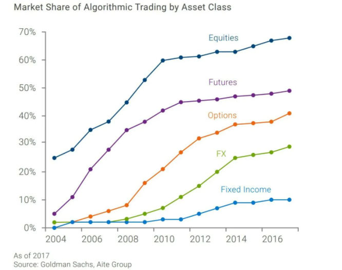

## Table of Contents

## What is algorithmic trading?

Algorithmic trading is a way of buying and selling things like stocks or currencies using a computer program. Instead of a person making decisions about when to buy or sell, the computer follows a set of rules, or an algorithm, to make these decisions automatically. This can happen very quickly, often in fractions of a second, which is much faster than a human could do it.

People use algorithmic trading because it can be more efficient and can take advantage of small price changes in the market. For example, if a stock's price goes up or down just a little bit, the algorithm can quickly decide to buy or sell to make a small profit. This method can also help reduce the impact of emotions on trading decisions, as the computer follows the rules without getting scared or excited like a human might.

## How does algorithmic trading differ from traditional trading?

Algorithmic trading and traditional trading are different in how they make decisions and how fast they can act. In traditional trading, a person looks at the market, thinks about what to do, and then decides to buy or sell. This can take time because the person has to consider many things like news, trends, and their own feelings. On the other hand, algorithmic trading uses a computer program that follows a set of rules to make decisions. The computer can look at a lot of information very quickly and make trades in just a few seconds, much faster than a human could.

Another big difference is how emotions play a role. In traditional trading, people can get scared or excited, which might make them buy or sell at the wrong time. This can lead to mistakes. But with [algorithmic trading](/wiki/algorithmic-trading), the computer doesn't have emotions, so it sticks to the rules no matter what. This can help make trading more consistent and less risky. However, setting up the right rules for the algorithm can be tricky and requires a good understanding of the market.

## What are the common types of algorithms used in trading?

There are several common types of algorithms used in trading. One type is called a trend-following algorithm. This kind of algorithm looks at the market to see if prices are going up or down over time. If it sees a trend, it will buy or sell based on that trend. For example, if prices are going up, the algorithm might buy more, hoping the prices will keep going up. Another type is a mean reversion algorithm. This one believes that prices will eventually go back to their average. So, if a price goes too high, the algorithm might sell, expecting it to come back down.

Another common type is an [arbitrage](/wiki/arbitrage) algorithm. This one looks for small differences in prices between different markets or different forms of the same asset. For example, if a stock is cheaper on one exchange than another, the algorithm will buy it on the cheaper exchange and sell it on the more expensive one to make a quick profit. There are also market-making algorithms. These algorithms help keep the market running smoothly by always being ready to buy or sell. They make money from the difference between the buying and selling prices.

Lastly, there are [statistical arbitrage](/wiki/statistical-arbitrage) algorithms. These use complex math to find patterns in the market that others might miss. They look at lots of data to find small opportunities to make money. Each of these types of algorithms has its own way of trying to make money in the market, and traders often use a mix of them to get the best results.

## What percentage of trading volume is estimated to be algorithmic?

A big part of trading today is done by computers using algorithms. It's hard to say exactly how much, but some people think that around 60% to 70% of all trading in the stock market is done by algorithms. This means that most of the buying and selling of stocks is not done by people, but by computer programs following rules.

This high percentage shows how important algorithms have become in trading. They can trade very quickly and handle a lot of information, which is why they are used so much. But the exact number can change depending on the market and the time, so it's always a bit of a guess.

## How has the percentage of algorithmic trading changed over the last decade?

Over the last decade, the use of algorithmic trading has grown a lot. Ten years ago, around 50% of trading in the stock market was done by algorithms. But now, it's thought to be between 60% and 70%. This shows that more and more people are using computers to trade instead of doing it themselves. The main reason for this growth is that computers can trade very quickly and handle a lot of information, which helps them make better decisions.

The increase in algorithmic trading has changed the way the stock market works. With so many trades being done by computers, the market can move very fast. This can be good because it makes trading more efficient, but it can also be risky because quick changes can cause big swings in prices. Overall, the rise of algorithmic trading over the last decade shows how technology is becoming more important in the world of finance.

## Which markets see the highest percentage of algorithmic trading?

The markets that see the highest percentage of algorithmic trading are the stock markets and the foreign exchange ([forex](/wiki/forex-system)) markets. In the stock markets, especially in places like the New York Stock Exchange and NASDAQ, it's thought that around 60% to 70% of all trades are done by algorithms. This is because stocks can be traded very quickly, and algorithms can take advantage of small price changes to make money.

In the forex markets, where people trade different currencies, the use of algorithms is also very high. It's estimated that over 90% of forex trading is done by algorithms. This is because the forex market is open 24 hours a day and there are always small changes in currency prices that algorithms can use to make profits. Both of these markets are very fast-paced and have a lot of data, which makes them perfect for algorithmic trading.

## What factors contribute to the growth of algorithmic trading?

The growth of algorithmic trading has been driven by several key factors. One big reason is the advancement in technology. Computers have become much faster and can handle a lot more information than before. This means they can make trading decisions very quickly, often in just a few seconds. Also, the internet has made it easier for traders to connect to markets all over the world, which helps algorithms work better. Another [factor](/wiki/factor-investing) is the increase in data. There is now a lot more information available about markets, like prices, news, and trends. Algorithms can use this data to make smarter trading decisions.

Another reason for the growth of algorithmic trading is the need for efficiency. People want to make money faster and with less risk. Algorithms can trade without getting tired or making emotional mistakes, which can lead to better results. Also, many big financial companies have started using algorithms because they can handle a lot of trades at once. This has made algorithmic trading more common and accepted in the market. Overall, technology, data, and the need for efficiency have all helped algorithmic trading grow a lot over the years.

## How do regulatory environments affect the prevalence of algorithmic trading?

Regulatory environments play a big role in how much algorithmic trading is used. In some countries, the rules are strict and make it harder for people to use algorithms. For example, some places have rules about how fast trades can be made or how much information traders have to share. These rules can slow down algorithmic trading because they make it harder for algorithms to work quickly and efficiently. On the other hand, in countries where the rules are more relaxed, algorithmic trading can grow more easily. Traders can use their algorithms without as many restrictions, which can lead to more trading and more money being made.

The way regulators look at algorithmic trading can also change over time. If regulators see that algorithms are causing problems, like big swings in prices or unfair advantages for some traders, they might make new rules to control it more. This can make algorithmic trading less common because it becomes harder to do. But if regulators think that algorithmic trading is good for the market, they might make rules that help it grow. This can lead to more people using algorithms because it becomes easier and safer to do so. Overall, the rules set by regulators can either help or hurt the growth of algorithmic trading, depending on how strict they are and what they are trying to achieve.

## What are the advantages of algorithmic trading over manual trading?

Algorithmic trading has several advantages over manual trading. One big advantage is speed. Computers can make trades much faster than people can. This means they can take advantage of small price changes in the market to make money. Another advantage is that algorithms can handle a lot of information at once. They can look at data from many different sources and make decisions based on all of that information. This can lead to better trading decisions because the computer can see things that a person might miss.

Another advantage is that algorithms don't get tired or emotional. People can get scared or excited when trading, which can lead to bad decisions. But a computer just follows the rules it's given, no matter what. This can make trading more consistent and less risky. Also, algorithms can trade 24/7, which means they can take advantage of opportunities in the market at any time, even when people are sleeping. Overall, these advantages make algorithmic trading a powerful tool for making money in the market.

## What are the potential risks and challenges associated with algorithmic trading?

Algorithmic trading can be risky because it relies a lot on technology. If there's a problem with the computer or the internet, the algorithm might not work right. This can lead to big losses if the algorithm makes bad trades because of the problem. Also, algorithms are only as good as the rules they follow. If the rules are not set up right, the algorithm might make bad decisions. This can happen if the person who made the algorithm didn't understand the market well enough or if the market changes in a way that the algorithm can't handle.

Another challenge is that algorithmic trading can make the market move very quickly. If a lot of algorithms are trading at the same time, they can cause big swings in prices. This can be scary for people who are not using algorithms because they might not understand why the market is moving so fast. Also, some people worry that algorithmic trading can be unfair. If some traders have better algorithms or more information, they might have an advantage over others. This can make the market less fair for everyone.

## How can one measure the impact of algorithmic trading on market efficiency?

Measuring the impact of algorithmic trading on market efficiency can be done by looking at how quickly prices adjust to new information. When algorithms are used a lot, they can help make the market more efficient because they can process information very fast. This means that if something important happens, like a company announcing good news, the price of the company's stock can change very quickly to reflect that news. Researchers can study how fast prices change after new information comes out to see if algorithmic trading is making the market more efficient.

Another way to measure the impact is by looking at the spread between the price people are willing to buy at and the price people are willing to sell at. In an efficient market, this spread should be small because there are a lot of buyers and sellers. Algorithms can help make this spread smaller by always being ready to buy or sell. If the spread gets smaller when more algorithmic trading is happening, it's a sign that the market is becoming more efficient. Overall, by looking at how quickly prices adjust and how small the spread is, we can see if algorithmic trading is helping the market work better.

## What advanced techniques are used in high-frequency algorithmic trading?

High-frequency algorithmic trading uses some very advanced techniques to make money. One of these techniques is called "latency arbitrage." This means the algorithm tries to buy and sell things faster than other traders. It looks for tiny differences in prices between different places and makes trades very quickly to take advantage of these differences. Another technique is "[market making](/wiki/market-making)." Here, the algorithm is always ready to buy or sell, which helps keep the market running smoothly. It makes money from the small difference between the buying and selling prices.

Another important technique is "statistical arbitrage." This uses a lot of math to find patterns in the market that others might miss. The algorithm looks at a lot of data to find small opportunities to make money. It can be very complex but can also be very profitable if done right. All these techniques need very fast computers and a good understanding of the market to work well. They help high-frequency traders make money by being faster and smarter than other traders.

## References & Further Reading

[1]: Bergstra, J., Bardenet, R., Bengio, Y., & Kégl, B. (2011). ["Algorithms for Hyper-Parameter Optimization."](https://papers.nips.cc/paper/4443-algorithms-for-hyper-parameter-optimization) Advances in Neural Information Processing Systems 24.

[2]: ["Advances in Financial Machine Learning"](https://www.amazon.com/Advances-Financial-Machine-Learning-Marcos/dp/1119482089) by Marcos Lopez de Prado

[3]: ["Evidence-Based Technical Analysis: Applying the Scientific Method and Statistical Inference to Trading Signals"](https://www.amazon.com/Evidence-Based-Technical-Analysis-Scientific-Statistical/dp/0470008741) by David Aronson

[4]: ["Machine Learning for Algorithmic Trading"](https://github.com/stefan-jansen/machine-learning-for-trading) by Stefan Jansen

[5]: ["Quantitative Trading: How to Build Your Own Algorithmic Trading Business"](https://books.google.com/books/about/Quantitative_Trading.html?id=j70yEAAAQBAJ) by Ernest P. Chan