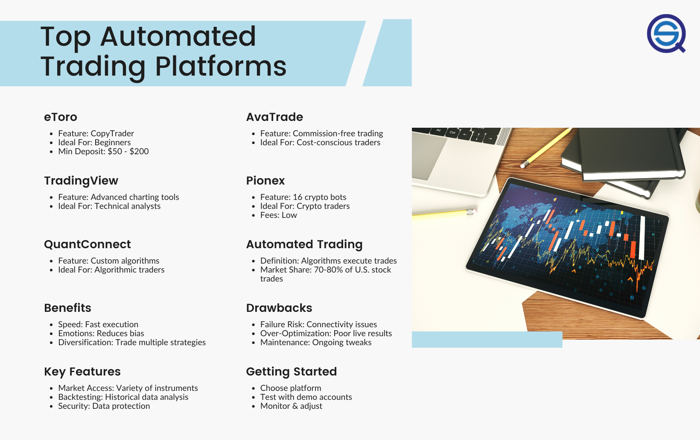

## Table of Contents

## What is automated day-trading and why might someone use it?

Automated day-trading is when a computer program buys and sells stocks quickly during the day without a person doing it manually. The program follows rules set by the user, like when to buy or sell based on certain conditions in the market. This can happen many times in a single day, much faster than a person could do it.

Someone might use automated day-trading because it can save time and possibly make more money. Since the computer can watch the market all day and act quickly, it might catch opportunities that a person would miss. Also, it takes away the emotion of trading, which can sometimes lead to bad decisions. However, it's important to remember that there are risks, and not all automated trading will be successful.

## What are the basic requirements for setting up an automated day-trading system?

To set up an automated day-trading system, you need a few basic things. First, you need a computer that can run trading software. This computer should be reliable and fast enough to handle the trading program without slowing down. Next, you need to choose a trading platform that supports automated trading. Many brokers offer platforms that can connect to your computer and execute trades automatically. You also need to have a good internet connection because the system needs to communicate with the market quickly.

The second part of setting up an automated day-trading system involves creating or choosing a trading algorithm. This is a set of rules that tells the computer when to buy and sell stocks. You can either write your own algorithm if you know how to code, or you can buy one from someone else. Once you have your algorithm, you need to test it to make sure it works the way you want. This is called backtesting, where you see how the algorithm would have performed in the past. After testing, you can start using the system with real money, but it's wise to start small to see how it goes.

## What are the most user-friendly platforms for beginners in automated day-trading?

For beginners in automated day-trading, some of the most user-friendly platforms are MetaTrader 4 (MT4) and eToro. MT4 is popular because it's easy to use and has a lot of tools that help you create and test your trading strategies. It also has a big community where you can learn from other traders. eToro is great for beginners because it lets you copy what other successful traders are doing. This means you can start trading without having to create your own strategies right away.

Both platforms have simple interfaces that make it easier for new traders to get started. MT4 has a lot of free resources and tutorials that can help you learn how to use the platform and understand trading better. eToro's copy trading feature is especially helpful because it takes away the need to know everything about trading from the start. You can just follow experienced traders and learn as you go. Both platforms also have good customer support to help you if you run into any problems.

## How do different platforms handle the integration of trading algorithms?

Different platforms handle the integration of trading algorithms in various ways, but they all aim to make it easy for users. For example, MetaTrader 4 (MT4) allows you to write your own trading algorithms using a simple programming language called MQL4. You can then attach these algorithms to your trading charts, and the platform will automatically execute trades based on the rules you set. MT4 also has a marketplace where you can buy pre-made algorithms from other traders, making it easier if you don't want to code your own.

eToro takes a different approach by focusing on copy trading. Instead of writing your own algorithms, you can follow other successful traders on the platform. eToro's system will automatically copy their trades into your account. This means you don't need to know how to code or create your own trading strategies. If you do want to use your own algorithms, eToro also supports integration with third-party software, but it's more geared towards beginners who want to learn by copying others.

Both platforms make it easy to get started with automated trading, but they cater to different needs. MT4 is great for those who want to dive deep into creating and testing their own strategies, while eToro is perfect for beginners who want to learn by following experienced traders.

## What are the costs associated with using various automated trading platforms?

Using automated trading platforms can cost you in different ways. For MetaTrader 4 (MT4), you usually don't have to pay to use the platform itself. But, you might need to pay for the trading algorithms if you buy them from the marketplace. Also, you'll have to pay trading fees to your broker every time you buy or sell a stock. These fees can add up, especially if your algorithm trades a lot.

eToro also has its own costs. You don't pay to use the platform, but you do pay a fee every time you copy a trade from another trader. This fee is usually a percentage of the trade amount. Like with MT4, you'll also have to pay trading fees to the broker. eToro might charge you extra if you want to withdraw your money or if you're not active on the platform for a while.

Both platforms can be good choices, but it's important to think about all the costs. The fees for trading and using algorithms can make a big difference in how much money you make or lose. Always check the costs before you start using an automated trading platform.

## How do platforms differ in terms of supported markets and asset classes?

Different platforms support different markets and asset classes. MetaTrader 4 (MT4) is mainly used for trading forex, which is trading different currencies. But it also supports trading other things like stocks, commodities, and even cryptocurrencies, depending on which broker you use. This means you can use MT4 to trade a lot of different things, but you need to check with your broker to see what they offer.

eToro is a bit different. It lets you trade stocks, cryptocurrencies, commodities, and forex all in one place. This makes it easy if you want to trade different types of assets without switching platforms. eToro is known for its wide range of supported assets, which can be good for beginners who want to try out different markets.

Both platforms give you a lot of choices, but they focus on different things. MT4 is great if you're really into forex trading but still want to try other markets. eToro is better if you want to trade a mix of stocks, crypto, and other assets easily.

## What kind of customer support and educational resources do these platforms offer?

MetaTrader 4 (MT4) has good customer support and lots of educational resources. You can find help through email, phone, or live chat, depending on your broker. MT4 also has a big community where you can ask questions and learn from other traders. For learning, MT4 offers free tutorials and guides that teach you how to use the platform and understand trading. There are also lots of videos and articles online that can help you learn more about trading strategies and how to use MT4's tools.

eToro also provides good customer support and educational resources. You can reach their support team through email or live chat, and they are usually quick to help. eToro's educational resources are great for beginners. They have a lot of free courses, webinars, and articles that explain trading in simple terms. They also have a feature called "eToro Academy" where you can learn about different markets and trading strategies. This makes it easy for new traders to get started and learn as they go.

## How can one evaluate the reliability and performance of an automated trading platform?

To evaluate the reliability and performance of an automated trading platform, you need to look at a few things. First, check how often the platform is up and running without any problems. A good platform should have very little downtime and should work smoothly without crashing. You can read reviews from other users to see if they have had any issues. Also, see if the platform has a good track record of executing trades quickly and accurately. This is important because even a small delay can affect your trading results.

Another way to evaluate the platform is by looking at its performance over time. You can do this by backtesting your trading algorithms on the platform. Backtesting means running your trading rules on past market data to see how they would have performed. If the platform gives you accurate results during backtesting, it's a good sign that it's reliable. Also, try using the platform with a demo account before you use real money. This lets you see how well the platform works in real-time without risking any money. By doing these things, you can get a good idea of how reliable and effective the platform is for automated trading.

## What advanced features do platforms offer for experienced traders?

For experienced traders, MetaTrader 4 (MT4) offers many advanced features. One of the best things is that you can write your own trading algorithms using MQL4, a special programming language. This lets you create very detailed and specific trading rules. MT4 also has a lot of technical analysis tools, like different types of charts and indicators, which help you study the market in depth. You can also use Expert Advisors (EAs), which are pre-made algorithms you can buy from the marketplace. These can save you time and help you try out new trading strategies without starting from scratch.

eToro also has advanced features for experienced traders. One cool thing is that you can use the platform's API to connect it with other software. This means you can make your own tools or use other programs to help with your trading. eToro also lets you trade a wide range of assets, which is great if you want to spread your investments across different markets. Plus, you can use advanced order types, like stop-loss and take-profit orders, to manage your trades better. These features help experienced traders control their trading more precisely and take advantage of different market opportunities.

## How do platforms ensure security and compliance with financial regulations?

Platforms like MetaTrader 4 (MT4) and eToro take security very seriously. They use strong encryption to keep your information safe when you're trading. This means that your personal details and money are protected from hackers. Both platforms also have strict rules about who can access your account. They use things like two-factor authentication, which means you need more than just a password to log in. This makes it much harder for someone else to get into your account without your permission.

Both MT4 and eToro also make sure they follow the rules set by financial regulators. This means they have to meet certain standards to keep your money safe and to make sure they're trading fairly. They are often checked by these regulators to make sure they're doing everything right. If they don't follow the rules, they can get in big trouble. So, they work hard to stay compliant and keep your trading safe and fair.

## What are the best practices for optimizing and backtesting trading strategies on these platforms?

To optimize and backtest trading strategies on platforms like MetaTrader 4 (MT4) and eToro, it's important to start with a clear plan. First, you need to define what you want your strategy to do. Are you looking to make quick profits, or are you aiming for long-term growth? Once you know your goal, you can start building your strategy. On MT4, you can use the MQL4 programming language to write your own trading rules. On eToro, you might want to use the copy trading feature to see how other traders' strategies work before you create your own. Make sure to keep your strategy simple at first. It's easier to add more rules later than to fix a complicated strategy that isn't working.

After you have your strategy, it's time to backtest it. Backtesting means running your strategy on past market data to see how it would have performed. On MT4, you can use the Strategy Tester to do this. Make sure you use a lot of historical data to get a good idea of how your strategy might work in different market conditions. On eToro, you can use the demo account to test your strategy in real-time without risking any money. Pay attention to how your strategy does in different situations, like when the market is going up or down. If your strategy doesn't work well, don't be afraid to change it. Keep testing and tweaking until you find something that works for you.

## How do the platforms compare in terms of scalability and handling high-frequency trading?

MetaTrader 4 (MT4) is good for people who want to do a lot of trading quickly, but it can get slow if you do too much at once. If you are trading a lot, you might need a strong computer to keep up with MT4. The platform lets you write your own trading rules, which is great for making your trading bigger or faster. But, if you are doing super fast trading, you might find that MT4 has some limits. It's still a popular choice for many traders because it works well for most people's needs.

eToro is different because it's made more for people who are just starting out. It's not as good at handling a lot of trades very quickly. If you want to do high-frequency trading, eToro might not be the best choice because it can get slow. But, eToro is great if you want to grow your trading slowly. You can start by copying what other traders are doing, and then make your own strategies as you learn more. So, while eToro isn't the best for very fast trading, it's good for people who want to take their time and grow their trading over time.

## References & Further Reading

[1]: Bergstra, J., Bardenet, R., Bengio, Y., & Kégl, B. (2011). ["Algorithms for Hyper-Parameter Optimization."](https://papers.nips.cc/paper_files/paper/2011/hash/86e8f7ab32cfd12577bc2619bc635690-Abstract.html) Advances in Neural Information Processing Systems 24.

[2]: ["Advances in Financial Machine Learning"](https://www.amazon.com/Advances-Financial-Machine-Learning-Marcos/dp/1119482089) by Marcos Lopez de Prado

[3]: ["Evidence-Based Technical Analysis: Applying the Scientific Method and Statistical Inference to Trading Signals"](https://www.wiley.com/en-gb/Evidence+Based+Technical+Analysis:+Applying+the+Scientific+Method+and+Statistical+Inference+to+Trading+Signals-p-9780470008744) by David Aronson

[4]: ["Machine Learning for Algorithmic Trading"](https://www.amazon.com/Machine-Learning-Algorithmic-Trading-intelligence/dp/9918608013) by Stefan Jansen

[5]: ["Quantitative Trading: How to Build Your Own Algorithmic Trading Business"](https://www.amazon.com/Quantitative-Trading-Build-Algorithmic-Business/dp/0470284889) by Ernest P. Chan