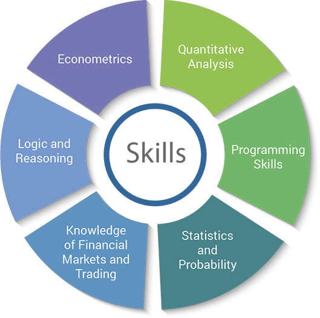

## Table of Contents

## What is algorithmic trading and how does it work?

Algorithmic trading, often called algo-trading, is a method of buying and selling financial assets using computer programs. These programs follow a set of rules, or algorithms, to make trading decisions. Instead of a person deciding when to buy or sell, the computer does it automatically based on the instructions it has been given. This can happen very quickly, often in fractions of a second, which is much faster than a human could trade.

The algorithms used in trading can be simple or very complex. A simple one might tell the computer to buy a stock if its price goes above a certain level and sell it if the price drops below another level. More complex algorithms might use lots of data, like news events, market trends, and historical prices, to make decisions. These algorithms can help traders make money by finding opportunities that are hard for humans to see. However, they also come with risks, like technical failures or unexpected market changes that the algorithm might not handle well.

## What are the basic financial concepts one should know before managing a hedge fund?

Before managing a hedge fund, it's important to understand some basic financial concepts. First, you need to know about risk and return. Risk is the chance that you might lose money, and return is the money you make from your investments. In general, higher risk can lead to higher returns, but it also means you could lose more money. Understanding how to balance risk and return is key to managing a hedge fund successfully. Another important concept is diversification, which means spreading your investments across different assets to reduce risk. If one investment does poorly, others might do well and help balance it out.

You also need to understand how markets work. This includes knowing about supply and demand, which affects the prices of stocks, bonds, and other financial products. When more people want to buy something, its price goes up; when fewer people want it, the price goes down. It's also crucial to know about different types of financial instruments, like stocks, bonds, derivatives, and commodities. Each of these has its own risks and potential returns, and a good hedge fund manager knows how to use them effectively. Lastly, understanding leverage, or using borrowed money to increase potential returns, is important. While leverage can boost your gains, it can also increase your losses, so it needs to be managed carefully.

## What programming languages are essential for developing trading algorithms?

When you want to develop trading algorithms, you need to know some key programming languages. Python is very popular because it's easy to use and has a lot of tools for working with data and making trading decisions. Many people like Python because it lets them write code quickly and it works well with other systems. Another important language is R, which is great for analyzing data and making predictions about the market. R is used a lot by people who need to do a lot of math and statistics in their trading algorithms.

Besides Python and R, you might also use C++ for developing trading algorithms. C++ is faster than Python and R, which can be important if you need your algorithms to work very quickly. Some trading platforms use C++ because it can handle a lot of data and make decisions in a very short time. Lastly, knowing a bit about SQL can be helpful because it lets you work with databases, which are important for storing and managing all the data you need for trading.

## How important is statistical analysis in managing an algorithmic trading hedge fund?

Statistical analysis is very important for managing an algorithmic trading hedge fund. It helps you understand what has happened in the markets in the past and what might happen in the future. By looking at lots of data, you can find patterns and trends that can help you make better trading decisions. For example, statistical analysis can show you how different stocks move together or how certain events affect the market. This information is crucial for building algorithms that can predict when to buy or sell.

Using statistical analysis also helps you manage risk. It lets you figure out how likely it is that your trades will make or lose money. This is important because hedge funds need to balance the chance of making big profits with the risk of losing money. By understanding these risks through statistical models, you can adjust your algorithms to reduce the chance of big losses. In short, statistical analysis is a key tool that helps you make smarter and safer trading decisions in a hedge fund.

## What are the key risk management strategies in algorithmic trading?

Risk management is very important in algorithmic trading. One key strategy is setting stop-loss orders. This means you tell your computer to sell a stock if it goes down to a certain price. This helps you limit how much money you can lose on a single trade. Another strategy is diversification. Instead of putting all your money into one stock or one type of investment, you spread it out. If one investment does badly, the others might do well and help balance it out.

Another important strategy is using position sizing. This means deciding how much money to put into each trade. If you put too much money into one trade and it goes wrong, you could lose a lot. By keeping each trade small, you can manage your risk better. Lastly, backtesting is crucial. This means testing your trading algorithm on past data to see how it would have done. If it worked well in the past, it might work well in the future, but you need to be careful because the past doesn't always predict the future.

## How can one evaluate the performance of trading algorithms?

To evaluate the performance of trading algorithms, you need to look at several key measures. One important measure is the profit and loss, or P&L. This tells you how much money the algorithm made or lost over a certain time. Another measure is the Sharpe ratio, which compares the return of the algorithm to its risk. A higher Sharpe ratio means the algorithm did well for the amount of risk it took. You can also look at the drawdown, which is the biggest drop in the value of the algorithm's portfolio. A smaller drawdown means the algorithm managed risk well.

Another way to evaluate trading algorithms is by comparing them to a benchmark, like a stock market index. If your algorithm does better than the benchmark, it's doing a good job. You can also use backtesting to see how the algorithm would have performed in the past. This helps you understand if the algorithm works well in different market conditions. But remember, past performance doesn't guarantee future results. By looking at these measures and comparing them, you can get a good idea of how well your trading algorithm is doing.

## What regulatory considerations must be taken into account when running a hedge fund?

When you run a hedge fund, you need to follow a lot of rules set by government agencies. In the United States, the main agency is the Securities and Exchange Commission (SEC). The SEC makes sure that hedge funds follow the law and treat investors fairly. You need to register your hedge fund with the SEC if you manage a certain amount of money. This means filling out forms and giving information about your fund, like who is in charge and how you invest the money. You also need to follow rules about how you can advertise your fund and what you can say to potential investors.

Another important thing to think about is how you handle your investors' money. You need to keep good records of all your trades and make sure you are not doing anything that could hurt your investors. There are also rules about how much risk you can take and how you report your performance. In other countries, there might be different agencies and rules, but the main idea is the same: to protect investors and keep the financial markets fair. It's a good idea to work with a lawyer who knows about these rules to make sure you are doing everything right.

## How does one develop and backtest trading strategies effectively?

Developing and backtesting trading strategies starts with coming up with an idea about how to make money in the markets. You might think that certain stocks go up when the economy is doing well, or that some stocks are a good buy when their price drops a lot. Once you have an idea, you need to turn it into a set of rules that a computer can follow. This means writing down exactly when to buy and sell, and what conditions need to be met. For example, you might decide to buy a stock if its price goes above its 50-day moving average and sell it if it drops below its 20-day moving average. After you have your rules, you need to write them into a computer program using a programming language like Python or R.

Backtesting is the next step, where you test your strategy on past data to see how it would have done. You take old market data and run your strategy on it to see if it would have made money. This helps you understand if your idea is good or if it needs changes. But remember, just because a strategy worked in the past doesn't mean it will work in the future. Markets change, and what worked before might not work again. So, you need to be careful and keep testing and tweaking your strategy. Also, it's important to use good data and make sure your backtest is set up correctly, so you get a true picture of how your strategy might perform.

## What are the advanced machine learning techniques used in algorithmic trading?

Advanced machine learning techniques used in algorithmic trading include deep learning and reinforcement learning. Deep learning uses neural networks, which are like a computer's way of thinking and learning, to find patterns in lots of data. These patterns can help predict what will happen in the stock market. For example, a deep learning model might look at past prices, news articles, and even social media posts to guess if a stock's price will go up or down. This can be very powerful because it can find relationships that humans might not see.

Reinforcement learning is another technique where the computer learns by doing. It makes trades and then gets feedback on whether those trades were good or bad. Over time, it learns to make better decisions. Imagine a computer playing a game where it tries to make money in the stock market. If it makes a good trade, it gets a reward; if it makes a bad trade, it learns from that mistake. This method can be very useful in trading because the market is always changing, and the computer can keep learning and adapting to new conditions.

## How can real-time data processing be optimized for high-frequency trading?

High-frequency trading needs very fast computers to look at data and make trades in just a few seconds or even less. To make this happen, you can use special computer programs called stream processing systems. These systems can handle lots of data coming in all at once and make decisions very quickly. They do this by breaking the data into small pieces and working on each piece as it comes in, instead of waiting for all the data to arrive. This way, the computer can start making trades right away without waiting.

Another way to make real-time data processing faster is by using something called co-location. This means putting your computers very close to the stock exchange's computers. When your computers are close, the data doesn't have to travel as far, so it gets there faster. This can make a big difference in high-frequency trading where every millisecond counts. Also, using special hardware like FPGAs (Field-Programmable Gate Arrays) can help. FPGAs are like super-fast chips that you can program to do exactly what you need for trading, making the whole process even quicker.

## What are the psychological skills required to manage a hedge fund successfully?

Managing a hedge fund takes a lot of mental strength. You need to stay calm even when the market is going crazy. This means not letting your feelings make you do things that could hurt your fund, like selling everything when prices drop a lot. It's important to stick to your plan and not let fear or excitement push you into making bad choices. Being able to handle stress well is key because the markets can be very unpredictable, and you need to keep a clear head to make good decisions.

Another important skill is being able to learn from your mistakes. The market is always changing, so you need to keep learning and trying new things. If a trade doesn't go well, you should look at why it happened and use that to make your strategy better. It's also good to be able to talk to your investors and explain what's happening with their money. Building trust with them by being honest and clear can help keep them happy, even when things aren't going great.

## How do you scale operations and manage growth in an algorithmic trading hedge fund?

Scaling operations and managing growth in an algorithmic trading hedge fund involves carefully increasing the size of your trading activities while making sure everything runs smoothly. As your fund grows, you need more money to trade with, which means attracting more investors. You might do this by showing them how well your fund has been doing and explaining your strategy clearly. At the same time, you need to make sure your trading systems can handle more trades without slowing down. This might mean upgrading your computers or hiring more people to help manage the trades. It's important to keep an eye on how well your algorithms are working as you scale up, because what worked with a small amount of money might not work the same way with a lot more.

Managing growth also means dealing with more complicated rules and regulations. As your fund gets bigger, you might have to follow more rules from places like the Securities and Exchange Commission (SEC). This can mean more paperwork and more checks to make sure you're doing everything right. You might need to hire people who know about these rules to help you stay on track. Another part of managing growth is keeping your team happy and working well together. As your fund grows, you might need to hire more traders, analysts, and tech people. It's important to make sure everyone knows what they're supposed to do and feels like they're part of the team. By handling these things well, you can grow your hedge fund without losing the things that made it successful in the first place.

## What are the key aspects of understanding risk management strategies?

Risk management is crucial for maintaining the stability and longevity of an algorithmic trading hedge fund. Effective risk management strategies can mitigate potential losses while optimizing returns, thereby ensuring the fund's sustainability and growth.

One key aspect of risk management in algorithmic trading is diversification. By spreading investments across a variety of financial instruments and markets, hedge funds can reduce the impact of adverse price movements in any single asset or sector. This can be mathematically demonstrated by the concept of portfolio variance, which is expressed as:

$$\sigma^2_p = \sum_{i=1}^{n} (w_i^2 \cdot \sigma_i^2) + \sum_{i=1}^{n-1} \sum_{j=i+1}^{n} (2 \cdot w_i \cdot w_j \cdot \sigma_i \cdot \sigma_j \cdot \rho_{ij})
$$

Here, $ \sigma^2_p $ is the portfolio variance, $ w_i $ and $ w_j $ are weights of assets in the portfolio, $ \sigma_i $ and $ \sigma_j $ are the standard deviations of the assets, and $ \rho_{ij} $ is the correlation coefficient between assets $ i $ and $ j $.

Hedging is another vital risk management technique used in algorithmic trading. By taking offsetting positions, hedge funds can protect against significant losses. For example, if a fund holds a large position in a stock, it might short sell futures contracts of the same stock to hedge against downside risk. This ensures that any loss in the stock holdings is compensated by gains in the futures position.

Stop-loss orders are another strategy that can prevent excessive losses. By automatically selling a security when its price falls to a predetermined level, stop-loss orders help manage the downside risk without constant monitoring. Algorithmic traders often use conditional approaches to adjust stop-loss levels based on market conditions.

Evaluating and mitigating technical risks associated with automated trading systems is equally important. Technical risks include system failures, data errors, and latency in executing trades. To address these risks, robust testing processes such as backtesting and stress testing are essential. Backtesting involves testing trading algorithms against historical data to assess their performance and resilience, while stress testing evaluates how the system behaves under extreme market conditions.

Implementing redundant systems and real-time monitoring can also mitigate technical risks. Tools and frameworks such as continuous integration and deployment ensure that any updates or changes to trading algorithms are systematically tested before being deployed, reducing the likelihood of bugs or disruptions.

In conclusion, effective risk management in algorithmic trading hedge funds involves a combination of diversification, hedging, and stop-loss strategies, alongside a strong focus on managing technical risks. By employing these techniques, hedge funds can better navigate the complexities of the financial markets while safeguarding their assets and ensuring sustainable growth.

## References & Further Reading

[1]: Bergstra, J., Bardenet, R., Bengio, Y., & Kégl, B. (2011). ["Algorithms for Hyper-Parameter Optimization."](https://papers.nips.cc/paper_files/paper/2011/hash/86e8f7ab32cfd12577bc2619bc635690-Abstract.html) Advances in Neural Information Processing Systems 24.

[2]: ["Advances in Financial Machine Learning"](https://www.amazon.com/Advances-Financial-Machine-Learning-Marcos/dp/1119482089) by Marcos Lopez de Prado

[3]: ["Evidence-Based Technical Analysis: Applying the Scientific Method and Statistical Inference to Trading Signals"](https://www.wiley.com/en-gb/Evidence+Based+Technical+Analysis:+Applying+the+Scientific+Method+and+Statistical+Inference+to+Trading+Signals-p-9780470008744) by David Aronson

[4]: ["Machine Learning for Algorithmic Trading"](https://www.amazon.com/Machine-Learning-Algorithmic-Trading-intelligence/dp/9918608013) by Stefan Jansen

[5]: ["Quantitative Trading: How to Build Your Own Algorithmic Trading Business"](https://www.amazon.com/Quantitative-Trading-Build-Algorithmic-Business/dp/0470284889) by Ernest P. Chan