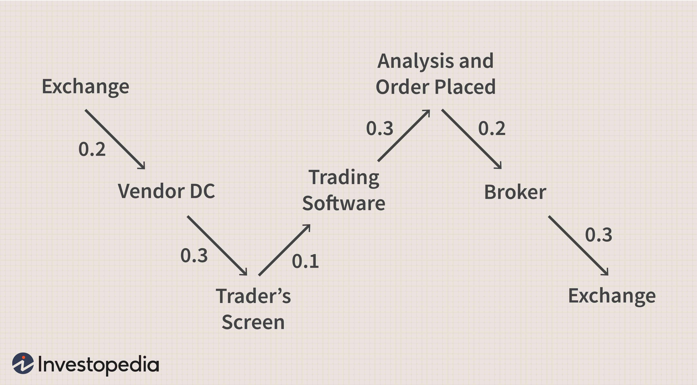

## Table of Contents

## MetaTrader 4 & 5 (MT4/MT5)

- **Description**: These are among the world's most popular trading platforms, mainly focused on Forex. They feature a development environment called MetaEditor for coding automated strategies called Expert Advisors (EAs).
- **Features**: These platforms offer a graphical visualization of backtesting, enabling real-time analysis of strategy performance. MT5, unlike MT4, also offers access to other markets such as equities and commodities.

## QuantConnect

- **Description**: A cloud-based platform that supports several programming languages, including C# and Python.
- **Features**: QuantConnect boasts a large library of historical data, ranging from Forex to options. The active community is also an asset, with many shared algorithms and in-depth discussions.

## NinjaTrader

- **Description**: A platform for both manual and automated traders. It is widely recognized for its advanced analysis tools.
- **Features**: NinjaTrader offers advanced backtesting capabilities, and its NinjaScript scripting language enables in-depth strategy customization.

## Backtrader

- **Description**: A Python library designed for research and development of trading strategies.
- **Features**: Backtrader is highly flexible, allowing the incorporation of custom indicators, analytics and graphical visualization of backtesting.

## Quantlib

- **Description**: An open-source library written mainly in C++.
- **Features**: Designed primarily for quantitative finance professionals, it offers tools for modeling, trading and risk assessment.

## Zipline

- **Description**: The backtesting library behind Quantopian.
- **Features**: Zipline is specially designed for event-driven backtesting and can be used locally on your own machine with customized data.

## AlgoTrader

- **Description**: An integrated platform offering backtesting and automated trading solutions.
- **Features**: It has built-in functionality for machine learning-based strategies and offers a complete solution, from research to execution.

## AmiBroker

- **Description**: Software for backtesting, exploration and technical analysis.
- **Features**: AmiBroker uses a customized scripting language, AFL (AmiBroker Formula Language), which allows great flexibility in strategy creation.

## TradeStation

- **Description**: A comprehensive platform combining technical analysis, backtesting and automated trading.
- **Features**: With its own scripting language, EasyLanguage, users can develop complex strategies and test them with integrated historical data.

## References & Further Reading

[1]: ["Expert Advisor Programming for MetaTrader 5: Creating automated trading systems in the MQL5 language"](https://www.amazon.com/Expert-Advisor-Programming-MetaTrader-automated/dp/0982645929) by Andrew R. Young

[2]: ["Hands-On Machine Learning for Algorithmic Trading"](https://www.amazon.com/Hands-Machine-Learning-Algorithmic-Trading/dp/178934641X) by Stefan Jansen

[3]: ["BackTrader Documentation"](https://www.backtrader.com/doc/) available at Backtrader's official site

[4]: ["QuantLib: A software library for quantitative finance"](https://www.quantlib.org/) by Luigi Ballabio

[5]: ["Building Automated Trading Systems: With an Introduction to Zipline"](https://github.com/quantopian/zipline) by Kevin Davey

[6]: ["Trading Systems and Methods"](https://www.amazon.com/Trading-Systems-Methods-Wiley/dp/1119605350) by Perry J. Kaufman