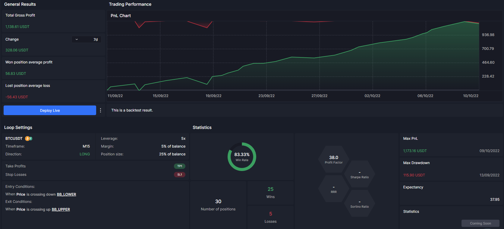

## Table of Contents

## What is backtesting and why is it important for automated trading strategies?

Backtesting is when you test a trading strategy using old market data to see how it would have worked in the past. It's like playing a game where you pretend to trade with data from years ago to see if your strategy would have made money or lost money. You use a computer program to do this, and it helps you understand if your trading idea is good or if it needs changes.

Backtesting is really important for automated trading strategies because it helps you check if your strategy will work before you use real money. If you find out that your strategy loses money in the backtest, you can fix it or try a different one without losing any real money. This way, you can feel more confident that your strategy might work well when you start trading for real.

## What are the basic features to look for in software for testing automated strategies with historical prices?

When you're looking for software to test your automated trading strategies with old prices, you want to make sure it can handle a lot of data quickly. The software should be able to go through years of price information without taking too long. It should also let you easily change your strategy and see how it would have worked in the past. This means you can try different ideas and see which one is the best without starting over each time.

Another important thing is that the software should be easy to use. You don't want to spend a lot of time figuring out how to use it. It should have a clear way to show you the results of your tests, like graphs and numbers that tell you if your strategy made money or lost money. Also, it's good if the software can work with different types of markets, like stocks, forex, or cryptocurrencies, so you can test your strategy in different places.

## Can you recommend some popular software tools for beginners to start backtesting?

For beginners looking to start backtesting, MetaTrader 4 (MT4) is a great choice. It's easy to use and has a lot of tools that help you test your trading strategies. MT4 comes with a strategy tester that lets you use old price data to see how your strategy would have done. It's also free to download, which is good for people just starting out. Plus, there are many online resources and communities where you can learn more about using MT4 for backtesting.

Another good option is TradingView. It's a web-based platform that's user-friendly and doesn't require any downloads. TradingView has a Pine Script editor where you can write your own trading strategies and test them with historical data. It's great for beginners because it has a lot of tutorials and a community where you can ask questions. TradingView also lets you see how your strategy would work on different markets, like stocks or cryptocurrencies.

If you want to try something a bit more advanced but still good for beginners, consider using Backtrader. It's a Python-based tool that's free and open-source. Backtrader is a bit more technical, but it's powerful and flexible. You can write your own code to test strategies, and it works well with different types of data. There are also many online guides to help you get started with Backtrader, making it a good choice if you're willing to learn a bit more.

## How does one import and manage historical price data in backtesting software?

To import and manage historical price data in backtesting software, you first need to find a source for the data. Many platforms like MetaTrader 4 and TradingView come with built-in data, but you can also download data from financial websites or use APIs from data providers. Once you have the data, you usually need to save it in a specific format like CSV or Excel. Then, you can import it into the backtesting software. Most programs have an option to load data from your computer, so you just need to find the right menu or button to do this.

After importing the data, managing it involves making sure it's in the right format and covers the time period you want to test. Some software might need you to set the date range or choose which data columns to use, like open, high, low, and close prices. It's important to check that the data is complete and accurate because any gaps or errors can mess up your backtesting results. Once everything is set up correctly, you can start running your tests and see how your trading strategy would have performed with the historical data.

## What programming languages are commonly used in backtesting software, and which is best for beginners?

The most common programming languages used in backtesting software are Python, R, and sometimes C++. Python is very popular because it's easy to learn and has a lot of libraries that help with backtesting, like Backtrader and Zipline. R is also used a lot, especially by people who work with data and statistics, because it's good for analyzing numbers. C++ is used less often for backtesting because it's harder to learn, but it's very fast and good for big projects.

For beginners, Python is the best choice. It's easy to understand and there are a lot of free resources online to help you learn. Python also has a big community of people who use it for trading and backtesting, so you can find help and advice easily. Plus, many backtesting platforms, like MetaTrader 4 and TradingView, have tools that work well with Python, making it a great starting point for anyone new to backtesting.

## How can you evaluate the performance of an automated strategy using backtesting software?

When you use backtesting software to evaluate the performance of an automated trading strategy, you look at several key numbers. One important number is the total profit or loss, which tells you if your strategy made money or lost money over time. Another number to check is the win rate, which shows how often your strategy made a winning trade. You also want to look at the risk-reward ratio, which compares how much you could lose to how much you could gain on each trade. These numbers help you understand if your strategy is good or if it needs changes.

Another way to evaluate your strategy is by looking at graphs and charts that the software makes. These visuals can show you how your strategy performed over different time periods and in different market conditions. For example, a graph might show that your strategy did well in a bull market but not so well in a bear market. By looking at these graphs, you can see patterns and decide if your strategy works well enough to use with real money. It's important to take your time and look at all these different pieces of information to make sure your strategy is as good as it can be.

## What are some common pitfalls to avoid when backtesting strategies?

One common pitfall when backtesting strategies is overfitting. This happens when you make your strategy too complicated, trying to fit it perfectly to past data. It might look great in the backtest, but it won't work well in real trading because it's too specific to the old data. To avoid this, keep your strategy simple and test it on different time periods and markets to make sure it works well in many situations.

Another pitfall is not accounting for transaction costs and slippage. In real trading, you have to pay fees for buying and selling, and sometimes the price you get isn't exactly what you expected. If you don't include these costs in your backtest, your strategy might look better than it really is. Always make sure to add realistic costs to your backtest to get a true picture of how your strategy will perform.

Lastly, relying too much on historical data can be a mistake. Past performance doesn't always predict future results, especially if market conditions change. It's important to use backtesting as a tool to refine your strategy, but also to stay flexible and ready to adapt to new market conditions. Always keep learning and testing to make sure your strategy stays effective.

## How can advanced users customize backtesting software to fit specific strategy needs?

Advanced users can customize backtesting software by writing their own code to fit their specific strategy needs. For example, if you're using Python with a library like Backtrader, you can write scripts that include custom indicators, entry and exit rules, and risk management techniques that are unique to your strategy. This means you can test very specific ideas that might not be available in the standard software settings. By doing this, you can make sure your backtest is as close as possible to how you plan to trade in real life.

Another way to customize backtesting software is by adjusting the data inputs and parameters. Advanced users can import different types of data, like high-frequency tick data or alternative data sources, to see how their strategy performs under various conditions. You can also change the time frame of the backtest, set different trading hours, or even simulate different market environments. This level of customization helps you understand how your strategy might work in different scenarios, making it more robust and ready for real-world trading.

## What are the differences between backtesting, forward testing, and paper trading?

Backtesting, forward testing, and paper trading are all ways to test trading strategies, but they do it in different ways. Backtesting is when you use old market data to see how your strategy would have worked in the past. You use a computer program to pretend to trade with this old data and see if your strategy would have made money or lost money. It's like playing a game where you go back in time to test your ideas. Backtesting helps you find out if your strategy is good or if it needs changes before you use real money.

Forward testing and paper trading are similar because they both happen in real time, but they are a bit different. Forward testing is when you use your strategy on live market data, but you don't actually trade with real money. You watch the market as it happens and see how your strategy would work if you were trading for real. Paper trading is a lot like forward testing, but it's more like a practice account where you pretend to trade with fake money. You can see how much money you would make or lose if you were using real money, but without any risk. Both forward testing and paper trading help you see how your strategy works in the current market before you start trading for real.

## How can you incorporate real-time data feeds into backtesting software for more accurate testing?

To make backtesting more accurate, you can add real-time data feeds to your software. This means you use live market data as it happens, instead of just old data. By doing this, you can see how your trading strategy would work right now, not just in the past. Some backtesting software lets you connect to live data sources, like APIs from financial websites or trading platforms. This way, you can test your strategy with the most up-to-date information, which can help you understand how it might perform in today's market.

Adding real-time data feeds can make your backtesting more realistic because it includes things like current market conditions and news events. But it's important to remember that using live data can be tricky. You need to make sure your software can handle the fast flow of information without slowing down or missing data. Also, real-time data might not be perfect, so you should always check it for any mistakes or gaps. By using real-time data carefully, you can get a better idea of how your strategy might work in the real world.

## What statistical methods should be used to validate the results of backtested strategies?

To make sure your backtested trading strategy is good, you need to use some statistical methods to check the results. One important method is called the Sharpe Ratio. This helps you see how much return you get for the risk you take. A higher Sharpe Ratio means your strategy is doing well compared to the risk. Another method is the Sortino Ratio, which is similar but focuses more on the bad risk, or downside risk. This can be useful if you want to avoid big losses. You should also use something called the Maximum Drawdown, which shows the biggest drop in your account value. This helps you understand the worst-case scenario for your strategy.

Another useful statistical method is backtest overfitting tests. These tests help you see if your strategy is too complicated and just fits the old data too well, which might not work in the future. One way to do this is by using out-of-sample testing, where you test your strategy on data it hasn't seen before. If it still works well, that's a good sign. You can also use something called walk-forward optimization, where you keep testing your strategy on new data as it comes in. This helps you make sure your strategy stays good over time. By using these statistical methods, you can feel more confident that your backtested strategy will work well when you start trading for real.

## How can machine learning be integrated into backtesting to enhance strategy development?

Machine learning can help make your backtesting better by finding patterns in old market data that you might miss. You can use machine learning to create models that learn from the data and then use these models to predict how the market might move. For example, you can train a model to look at things like price changes, trading volume, and even news to guess if a stock will go up or down. By adding these predictions to your backtesting, you can see if your trading strategy works well with the help of machine learning. This can make your strategy smarter and more likely to make money.

Another way machine learning can help is by making your strategy more flexible. Instead of using fixed rules, machine learning can change your strategy as it learns more about the market. This means your strategy can adapt to new market conditions without you having to change it yourself. You can use techniques like reinforcement learning, where the model learns by trying different actions and seeing what works best. By using machine learning in your backtesting, you can create a strategy that keeps getting better over time, which can give you a big advantage in trading.

## References & Further Reading

[1]: ["Expert Advisor Programming for MetaTrader 5: Creating automated trading systems in the MQL5 language"](https://www.amazon.com/Expert-Advisor-Programming-MetaTrader-automated/dp/0982645929) by Andrew R. Young

[2]: ["Hands-On Machine Learning for Algorithmic Trading"](https://www.amazon.com/Hands-Machine-Learning-Algorithmic-Trading/dp/178934641X) by Stefan Jansen

[3]: ["BackTrader Documentation"](https://www.backtrader.com/doc/) available at Backtrader's official site

[4]: ["QuantLib: A software library for quantitative finance"](https://www.quantlib.org/) by Luigi Ballabio

[5]: ["Building Automated Trading Systems: With an Introduction to Zipline"](https://github.com/quantopian/zipline) by Kevin Davey

[6]: ["Trading Systems and Methods"](https://www.amazon.com/Trading-Systems-Methods-Wiley/dp/1119605350) by Perry J. Kaufman