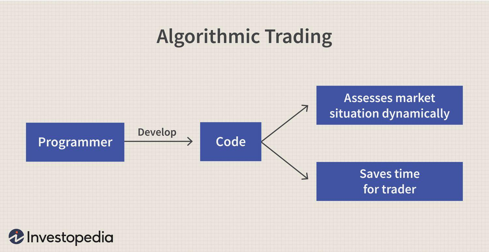

## Table of Contents

## What is algorithmic trading?

Algorithmic trading is when computers use math formulas to buy and sell things like stocks or currencies automatically. Instead of people making the decisions, the computer follows the rules set in the algorithm to make trades. This can happen very quickly, often in fractions of a second, which is much faster than a human could do it.

People use algorithmic trading because it can help them make money by finding good times to buy or sell. It can also help them trade a lot without moving the market too much. But, it can be risky because the algorithms might make mistakes or the market might change in ways the algorithm didn't expect. So, it's important to keep watching and adjusting the algorithms.

## What are the basic technologies required for algorithmic trading?

To do algorithmic trading, you need a few key technologies. First, you need a computer that can run your trading algorithms quickly. This computer should be connected to the internet so it can send and receive information about the market. You also need software that can understand and use the algorithms you create. This software should be able to connect to the places where you buy and sell stocks or other things, like stock exchanges or trading platforms.

Another important technology is a data feed. This is a service that gives your computer up-to-date information about what's happening in the market. You need this data to be fast and accurate so your algorithms can make good decisions. Lastly, you need a way to test your algorithms before using them for real. This is called [backtesting](/wiki/backtesting), and it lets you see how your algorithm would have done in the past. This helps you make sure your algorithm works well before you start using it with real money.

## How do programming languages like Python and C++ contribute to algorithmic trading?

Python and C++ are important for [algorithmic trading](/wiki/algorithmic-trading) because they help traders create and run their trading algorithms. Python is popular because it's easy to learn and use. It has many libraries, like Pandas and NumPy, that make it simple to work with data and do math. This is helpful for analyzing market data and testing trading strategies. Python also connects well with trading platforms, so traders can easily send their buy and sell orders. Because Python is easy to use, it's great for quickly trying out new ideas and making changes to algorithms.

C++ is different because it's faster and more powerful than Python. It's used when speed is very important in trading. C++ can handle a lot of data very quickly, which is crucial for high-frequency trading where trades happen in milliseconds. While C++ is harder to learn and use than Python, it's worth it for traders who need their algorithms to work as fast as possible. Some traders use both languages: they might use Python to develop and test their strategies, and then use C++ to run the final version of their algorithm in the real market.

## What role do APIs play in algorithmic trading?

APIs, or Application Programming Interfaces, are very important in algorithmic trading. They help connect the trading algorithms to the stock exchanges and trading platforms. When a trader wants to buy or sell something, their algorithm sends a request through an API. The API then talks to the trading platform and makes the trade happen. This makes everything faster and easier because the algorithm doesn't need to understand how the trading platform works, it just needs to know how to use the API.

APIs also help traders get the latest market data. This data is important because it tells the algorithm what is happening in the market right now. The algorithm uses this information to decide when to buy or sell. APIs make sure this data comes quickly and correctly, which is crucial for making good trading decisions. Without APIs, it would be much harder and slower to get the information needed for algorithmic trading.

## How are data feeds used in algorithmic trading?

Data feeds are really important for algorithmic trading. They give the computer all the information it needs about what's happening in the market right now. This includes things like the prices of stocks, how many stocks are being bought and sold, and other important details. The computer uses this information to decide when to buy or sell. If the data feed is fast and accurate, the computer can make better decisions and trade more successfully.

Having a good data feed is crucial because the market can change very quickly. If the data feed is slow or wrong, the computer might make bad decisions. This could lead to losing money. That's why traders pay a lot of attention to making sure their data feeds are working well. They want to be sure they're getting the most up-to-date and correct information so their algorithms can work the best they can.

## What is the importance of backtesting platforms in algorithmic trading?

Backtesting platforms are very important in algorithmic trading because they let traders see how their trading strategies would have worked in the past. Traders can use these platforms to test their algorithms with old market data. This helps them find out if their strategies are good or if they need to make changes. By looking at past results, traders can see if their algorithms would have made money or lost money. This is a safe way to check their ideas before using real money in the market.

Using backtesting platforms also helps traders understand how their algorithms might react to different market conditions. They can see how their strategies would have done during times when the market went up, went down, or stayed the same. This information is very useful because it helps traders make their algorithms better and more ready for the real market. Without backtesting, traders would be taking bigger risks because they wouldn't know how their strategies might work in different situations.

## How do machine learning and AI enhance algorithmic trading strategies?

Machine learning and AI help make algorithmic trading better by finding patterns in market data that people might miss. These technologies can look at a lot of information very quickly and learn from it. They can find out which things in the market are important for making good trading decisions. For example, they might see that certain news or events often make stock prices go up or down. By using this information, [machine learning](/wiki/machine-learning) and AI can help create trading strategies that work better and make more money.

Another way machine learning and AI help is by making trading algorithms smarter over time. They can change and improve themselves as they get more data. This means the algorithms can get better at predicting what will happen in the market. They can also adjust to new situations faster than if a person had to change the algorithm. This makes the trading strategies more flexible and able to handle different market conditions. Overall, machine learning and AI make algorithmic trading more powerful and successful.

## What are high-frequency trading technologies and how do they work?

High-frequency trading ([HFT](/wiki/high-frequency-trading-strategies)) technologies are used to buy and sell things like stocks very quickly, often in just a few milliseconds. These technologies use powerful computers and special software to make trades faster than regular trading. The computers are often placed very close to the stock exchanges to save time. HFT technologies use algorithms that can look at a lot of market data very quickly and make decisions about when to buy or sell. This speed can help traders make money by taking advantage of small changes in prices that happen very fast.

HFT technologies also use something called "co-location," where the computers are put right next to the stock exchange's servers. This makes the connection between the computer and the exchange as fast as possible. Another important part of HFT is using very fast data feeds to get the latest market information. These data feeds help the algorithms make quick and accurate decisions. While HFT can be very profitable, it can also be risky because the market can change in ways the algorithms don't expect. So, it's important for traders to keep watching and adjusting their HFT systems.

## How do cloud computing and big data analytics impact algorithmic trading?

Cloud computing and big data analytics have a big impact on algorithmic trading. Cloud computing lets traders use powerful computers without having to buy and keep them. This means they can run their trading algorithms on the internet, which can be cheaper and easier. It also lets them quickly change how much computer power they use, depending on what they need. This is helpful because the market can change a lot, and traders need to be able to adjust their strategies fast.

Big data analytics helps traders by letting them look at a lot of information about the market. This information can come from many places, like news, social media, and past market data. By using big data analytics, traders can find patterns and trends that they might not see otherwise. This can help them make better trading decisions and create smarter algorithms. Together, cloud computing and big data analytics make algorithmic trading more powerful and flexible.

## What security measures are essential for protecting algorithmic trading systems?

Keeping algorithmic trading systems safe is very important because they deal with a lot of money and sensitive information. One key security measure is using strong encryption to protect data. This means turning the data into a code that only people with the right key can read. It's also important to have strong passwords and to change them often. Another good idea is to use two-[factor](/wiki/factor-investing) authentication, which means you need two ways to prove who you are before you can access the system. This makes it harder for someone to break in.

Another important security measure is to keep an eye on the system all the time. This means watching for anything strange or unusual, like someone trying to get in without permission. It's also a good idea to have a plan for what to do if something goes wrong, like a security breach. This plan should include ways to quickly stop the system and fix any problems. Finally, it's important to keep the software up to date. This helps protect against new ways that hackers might try to break in. By using these security measures, traders can help keep their algorithmic trading systems safe.

## How can blockchain technology be integrated into algorithmic trading?

Blockchain technology can be used in algorithmic trading to make things more secure and clear. It's like a digital record book that everyone can see but no one can change without everyone knowing. In trading, blockchain can help keep track of all the trades in a way that's hard to cheat or mess with. This means traders can trust that the information they're using is correct. Also, blockchain can help with something called smart contracts, which are like automatic agreements that happen when certain things are true. This can make trading faster and easier because the computer can do things like pay out money without needing a person to check everything.

Another way blockchain can help with algorithmic trading is by making it easier to trade things that aren't usually traded, like cryptocurrencies. Because blockchain is the technology behind cryptocurrencies, it's a natural fit. Traders can use blockchain to buy and sell these digital currencies quickly and safely. Plus, blockchain can help connect different trading systems together, so traders can see more markets and make better decisions. By using blockchain, algorithmic trading can become more secure, faster, and able to handle more types of trades.

## What are the latest advancements in quantum computing for algorithmic trading?

Quantum computing is a new kind of computer technology that could change how algorithmic trading works. These computers use something called quantum bits, or qubits, which can do many calculations at the same time. This makes them much faster than regular computers. In algorithmic trading, this speed could help traders look at a lot more data and find patterns that are hard to see with normal computers. This could lead to better trading strategies and more money made from trading.

Right now, quantum computing is still new and not used a lot in trading. But people are working on it and trying to figure out how to use it. For example, some are looking at how quantum computers can help with something called portfolio optimization, which is about choosing the best mix of things to buy and sell. Others are trying to use quantum computers to make better predictions about what will happen in the market. As quantum computing gets better, it could become a big part of algorithmic trading and help traders do their jobs even better.

## References & Further Reading

[1]: Bergstra, J., Bardenet, R., Bengio, Y., & Kégl, B. (2011). ["Algorithms for Hyper-Parameter Optimization."](https://papers.nips.cc/paper_files/paper/2011/hash/86e8f7ab32cfd12577bc2619bc635690-Abstract.html) Advances in Neural Information Processing Systems 24.

[2]: ["Advances in Financial Machine Learning"](https://www.amazon.com/Advances-Financial-Machine-Learning-Marcos/dp/1119482089) by Marcos Lopez de Prado

[3]: ["Evidence-Based Technical Analysis: Applying the Scientific Method and Statistical Inference to Trading Signals"](https://www.wiley.com/en-gb/Evidence+Based+Technical+Analysis:+Applying+the+Scientific+Method+and+Statistical+Inference+to+Trading+Signals-p-9780470008744) by David Aronson

[4]: ["Machine Learning for Algorithmic Trading"](https://www.amazon.com/Machine-Learning-Algorithmic-Trading-intelligence/dp/9918608013) by Stefan Jansen

[5]: ["Quantitative Trading: How to Build Your Own Algorithmic Trading Business"](https://www.amazon.com/Quantitative-Trading-Build-Algorithmic-Business/dp/0470284889) by Ernest P. Chan