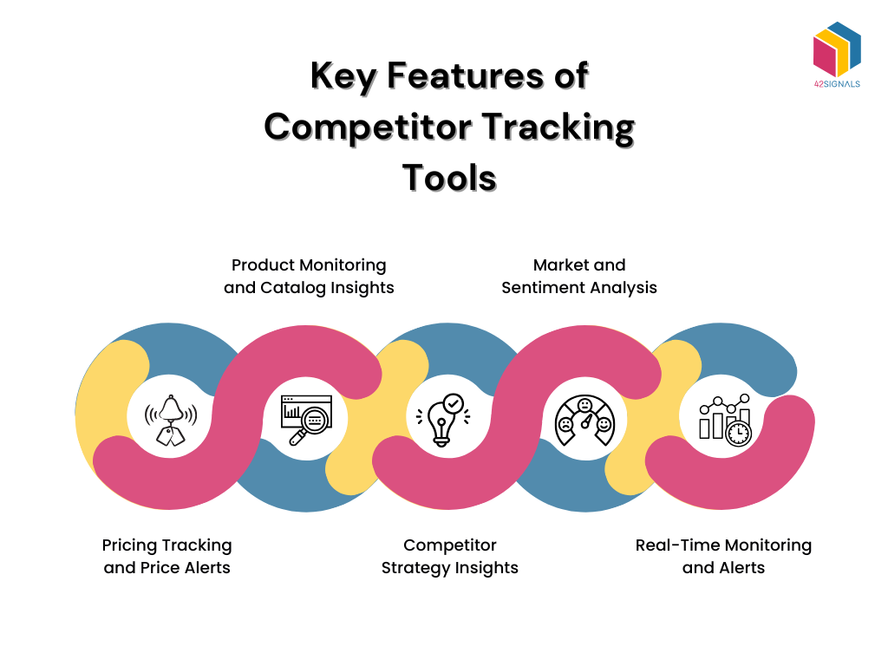

## Table of Contents

## What is real-time strategy monitoring?

Real-time strategy monitoring is a way to keep an eye on how well a plan or strategy is working as it happens. It's like watching a game and making sure all the players are doing what they're supposed to do, right when they're doing it. This helps people in charge see if things are going as planned and if they need to make quick changes to keep everything on track.

In businesses or organizations, real-time strategy monitoring can be used to track things like sales, customer feedback, or how well a new product is doing. By looking at this information as it comes in, leaders can make smart decisions fast. This can help them fix problems before they get too big or take advantage of new opportunities as soon as they appear.

## Why is real-time strategy monitoring important for businesses?

Real-time strategy monitoring is important for businesses because it helps them stay on top of what's happening right now. Imagine you're playing a game and you can see everything that's going on. You can quickly see if something isn't working and fix it before it gets worse. For businesses, this means they can watch their sales, see how customers feel about their products, and make sure everything is going according to plan. If something goes wrong, like a product not selling well, they can find out why and fix it fast.

This kind of monitoring also helps businesses grab new opportunities as soon as they show up. If a new trend starts, a business can jump on it right away because they're watching everything in real time. This can give them an edge over other companies that might not notice the trend until later. By keeping a close eye on what's happening, businesses can make smart decisions quickly, which can lead to more success and growth.

## What are the basic tools needed for beginners in real-time strategy monitoring?

To start with real-time strategy monitoring, beginners need a few basic tools. The first tool is a dashboard. A dashboard is like a big screen that shows all the important information about your business at once. It can show things like how many products you've sold, what customers are saying, and how your website is doing. You can use software like Google Data Studio or Microsoft Power BI to make your own dashboard. These tools are easy to use and can help you see what's happening in your business right now.

Another important tool is a data collection system. This is how you gather all the information that goes into your dashboard. You might use tools like Google Analytics to see how people use your website, or a customer feedback tool like SurveyMonkey to find out what people think about your products. These tools help you collect data in real time, so you can see what's happening as it happens. Once you have the data, you can put it into your dashboard and start monitoring your strategy.

The last tool you'll need is a way to communicate and make decisions quickly. This could be as simple as a group chat on Slack or Microsoft Teams where you and your team can talk about what you see on the dashboard. When you notice something important, like a sudden drop in sales, you can quickly discuss it with your team and decide what to do next. Having a good way to communicate helps you react fast to what you see in your real-time monitoring.

## How can dashboards be used effectively in real-time strategy monitoring?

Dashboards are super helpful for real-time strategy monitoring because they show all the important information about your business in one place. Imagine you're playing a game and you have a screen that shows you everything you need to know, like how many points you have, what your opponents are doing, and what's happening right now. In business, a dashboard does the same thing. It can show you how many products you've sold, what customers are saying, and how your website is doing. By looking at this information all at once, you can quickly see if your strategy is working or if you need to make changes.

To use dashboards effectively, you need to make sure they are easy to understand and update in real time. This means the dashboard should show the most important information in a simple way, like using graphs and numbers that are easy to read. If something changes, like a sudden drop in sales, you want to see it on your dashboard right away. This helps you react quickly and make smart decisions. By keeping your dashboard simple and up-to-date, you can keep a close eye on your strategy and make sure everything is going according to plan.

## What role do data analytics tools play in real-time strategy monitoring?

Data analytics tools are really important for real-time strategy monitoring because they help you understand what's happening in your business right now. These tools take all the information you collect, like how many products you've sold or what customers are saying, and turn it into something you can easily understand. They can show you patterns and trends that you might not see just by looking at the raw data. For example, if you see a sudden drop in sales, data analytics tools can help you figure out why it's happening, like if it's because of a new competitor or a change in what customers want.

By using data analytics tools, you can make better decisions quickly. When you see something important on your dashboard, like a big change in customer feedback, these tools help you dig deeper and find out what's going on. This means you can fix problems before they get too big or take advantage of new opportunities as soon as they appear. In short, data analytics tools make it easier to keep an eye on your strategy and make sure you're always moving in the right direction.

## How can real-time alerts and notifications enhance strategy monitoring?

Real-time alerts and notifications are like little helpers that tell you when something important is happening in your business. They can pop up on your phone or computer to let you know right away if something changes, like if sales suddenly drop or if a lot of customers start complaining about a product. This means you don't have to keep watching your dashboard all the time. Instead, the alerts will tell you when you need to take a look, so you can focus on other things until something needs your attention.

These alerts help you react quickly to what's happening. If you get a notification that sales are going down, you can check your dashboard to see why and then make a plan to fix it. This can stop small problems from turning into big ones. Plus, if you get an alert about a new opportunity, like a sudden increase in demand for a product, you can jump on it right away. By using real-time alerts and notifications, you can keep your strategy on track and make sure your business keeps moving forward.

## What advanced tools are available for expert-level real-time strategy monitoring?

For expert-level real-time strategy monitoring, advanced tools like predictive analytics software can be very helpful. These tools use fancy math to look at your data and guess what might happen next. For example, they can tell you if sales are likely to go up or down in the future based on what's happening now. This can help you plan ahead and make smart decisions before things change. Tools like IBM Watson Analytics or SAS are popular choices for this kind of work. They can help you see patterns and trends that are hard to spot just by looking at the numbers.

Another advanced tool is [machine learning](/wiki/machine-learning) algorithms. These are smart computer programs that can learn from your data and get better over time. They can help you find out what's most important to focus on in your strategy. For example, they might find out which customers are most likely to buy more products or which marketing campaigns work best. Tools like TensorFlow or Azure Machine Learning can help you use machine learning for real-time monitoring. By using these tools, you can keep a very close eye on your strategy and make sure you're always one step ahead.

## How can machine learning and AI be integrated into real-time strategy monitoring tools?

Machine learning and AI can be added to real-time strategy monitoring tools to make them smarter and more helpful. These tools can learn from the data they collect, like how many products you sell or what customers say. Over time, they get better at understanding what's important and what's not. For example, they can figure out which customers are most likely to buy more products or which marketing campaigns work best. By using machine learning, the tools can give you better advice on what to do next, helping you make smarter decisions faster.

AI can also help by sending you alerts and notifications about what's happening in your business right now. It can look at all the data coming in and tell you if something important is changing, like if sales suddenly drop or if a lot of customers start complaining. This means you don't have to watch your dashboard all the time. Instead, AI can keep an eye on things for you and let you know when you need to take action. By using AI in your real-time strategy monitoring, you can react quickly to problems and opportunities, keeping your business on track and moving forward.

## What are the best practices for selecting real-time strategy monitoring tools?

When choosing real-time strategy monitoring tools, it's important to think about what your business needs. Start by figuring out what information is most important to you, like sales numbers, customer feedback, or website traffic. Then, look for tools that can show you this information in a way that's easy to understand, like a simple dashboard. Make sure the tools can update in real time, so you can see what's happening right now. Also, think about how easy the tools are to use. You want something that you and your team can learn quickly, so you can start using it right away.

Another thing to consider is how well the tools can grow with your business. As your business gets bigger, you'll need tools that can handle more data and more people using them. Look for tools that can work with other software you use, like your customer feedback system or your sales tracking software. This makes it easier to get all your information in one place. Finally, think about the cost. You want tools that give you good value for your money, so you can keep an eye on your strategy without spending too much. By keeping these things in mind, you can pick the best tools for your real-time strategy monitoring.

## How do different industries utilize real-time strategy monitoring tools differently?

Different industries use real-time strategy monitoring tools in their own special ways. In the retail industry, these tools help keep track of how many products are sold and what customers think about them. Retailers can see if a product is selling well or if they need to change their prices or marketing. They can also watch how people shop in their stores or online, so they can make shopping easier and more fun for customers. This helps them make quick decisions to keep their business growing.

In the healthcare industry, real-time strategy monitoring tools are used to watch over patient care and hospital operations. Doctors and nurses can see how patients are doing right now and make sure they get the best care. Hospitals can also keep an eye on how busy they are and make sure they have enough staff and supplies. This helps them take care of patients better and run the hospital more smoothly. Each industry uses these tools to solve their own unique problems and make their work better.

## What are the common challenges faced when implementing real-time strategy monitoring tools?

One common challenge when setting up real-time strategy monitoring tools is dealing with a lot of data. Businesses collect tons of information every day, like sales numbers, customer feedback, and website visits. It can be hard to make sense of all this data and figure out what's important. Sometimes, the tools can get overwhelmed and slow down, which means you might not see the latest information right away. This can make it tough to make quick decisions based on what's happening now.

Another challenge is making sure everyone on the team knows how to use the tools. If the tools are too complicated, people might not use them the right way or might not use them at all. This can lead to mistakes and missed opportunities. It's important to pick tools that are easy to learn and use, so everyone can keep an eye on the strategy and help make smart decisions. By training the team well and choosing the right tools, businesses can overcome these challenges and make the most out of real-time strategy monitoring.

## How can the effectiveness of real-time strategy monitoring tools be measured and optimized?

To measure how well real-time strategy monitoring tools are working, you need to look at how they help your business make better decisions. One way to do this is by checking if the tools help you spot problems and fix them quickly. For example, if you see a drop in sales and can figure out why and fix it fast, that's a sign the tools are working well. Another way is to see if the tools help you take advantage of new opportunities. If you notice a new trend and can jump on it right away, that's another good sign. You can also ask your team if they find the tools helpful and easy to use. If they do, it means the tools are making a positive difference.

To make these tools even better, you can keep an eye on how often you use them and how they help you. If you find that you're not using some parts of the tools, you might not need them, and you can focus on the parts that are more useful. You can also update the tools to show the most important information in a simple way, so you can see what's happening at a glance. It's also a good idea to keep learning about new features and tools that might help you even more. By listening to your team's feedback and making small changes over time, you can keep your real-time strategy monitoring tools working at their best.

## References & Further Reading

[1]: Silver, D., Hubert, T., Schrittwieser, J., Baker, L., Lai, M., Guez, A., ... & Hassabis, D. (2018). ["A general reinforcement learning algorithm that masters chess, shogi, and Go through self-play"](https://www.science.org/doi/10.1126/science.aar6404). Nature, 555(7697), 354-359.

[2]: Hamilton, W., Ying, R., & Leskovec, J. (2017). ["Inductive representation learning on large graphs"](https://arxiv.org/abs/1706.02216). In Advances in neural information processing systems (pp. 1024-1034).
