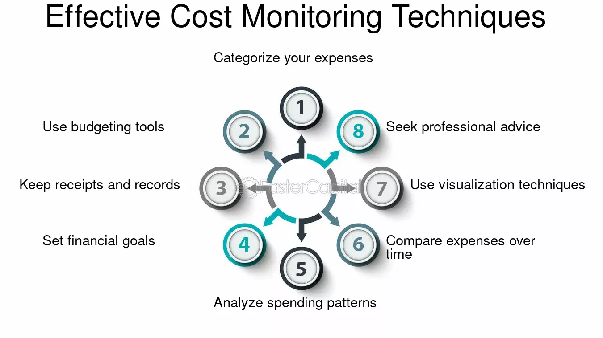

## Table of Contents

## What are transaction costs and why is it important to monitor them?

Transaction costs are the fees and expenses you pay when you buy or sell something, like stocks, goods, or services. These costs can include things like brokerage fees, commissions, and even the time and effort it takes to make the transaction happen. For example, if you buy a stock, you might have to pay a fee to the broker who helps you make the purchase.

It's important to keep an eye on transaction costs because they can add up and eat into your profits or increase the total cost of what you're buying. If you're not careful, high transaction costs can make a good investment less profitable or make the things you buy more expensive than you expected. By monitoring these costs, you can make smarter choices about when and how to buy or sell, helping you save money and get a better deal.

## What are the basic tools available for beginners to track transaction costs?

For beginners, there are some easy tools to help track transaction costs. One simple tool is a spreadsheet, like Microsoft Excel or Google Sheets. You can make a list of all your transactions, including the date, what you bought or sold, and how much you paid in fees. This way, you can see all your costs in one place and add them up to see the total.

Another tool is using apps or websites designed for tracking finances. Apps like Mint or Personal Capital let you connect your bank and investment accounts. They automatically gather all your transaction data, including fees, and show you reports and graphs. This makes it easier to see your costs without having to enter everything by hand.

Both of these methods help you keep an eye on your transaction costs. By using a spreadsheet or a finance app, you can make sure you're not spending too much on fees and make better choices about your money.

## How can spreadsheet software like Microsoft Excel or Google Sheets help in managing transaction costs?

Spreadsheet software like Microsoft Excel or Google Sheets can help you manage transaction costs by letting you keep all your transaction data in one place. You can make a table where you write down the date of each transaction, what you bought or sold, and how much you paid in fees. By putting all this information into a spreadsheet, you can easily see how much you're spending on transaction costs over time. You can also use formulas to add up the total costs, so you don't have to do the math yourself.

Once you have all your data in the spreadsheet, you can use it to find patterns and make better decisions. For example, you might notice that you're paying a lot in fees for certain types of transactions. With this information, you can look for ways to lower those costs, like choosing a different broker or waiting for a time when fees are lower. By keeping track of your transaction costs in a spreadsheet, you can save money and make smarter choices about when and how to buy or sell.

## What features should one look for in a transaction cost monitoring tool?

When looking for a tool to monitor transaction costs, it's important to find one that is easy to use and can show you all your costs in one place. The tool should let you enter or automatically gather information about your transactions, including the date, what you bought or sold, and how much you paid in fees. It should also be able to add up all your costs so you can see the total amount you're spending on fees. This way, you can quickly understand how much you're paying and make sure you're not spending too much.

Another important feature is the ability to see patterns and trends in your transaction costs. The tool should be able to show you graphs or reports that help you see when and why your costs are going up or down. This can help you find ways to save money, like choosing a different time to buy or sell, or switching to a broker with lower fees. By using a tool with these features, you can keep a close eye on your transaction costs and make better decisions about your money.

## How do accounting software solutions like QuickBooks or Xero assist in tracking transaction costs?

Accounting software solutions like QuickBooks or Xero make it easy to track transaction costs by letting you connect your bank and investment accounts. Once connected, these tools automatically gather all your transaction data, including any fees you pay. This means you don't have to enter everything by hand, which saves time and reduces the chance of making mistakes. You can see all your transactions in one place, making it simple to keep an eye on how much you're spending on fees.

These tools also help you understand your transaction costs better by providing reports and graphs. You can see how your costs change over time and spot any patterns or trends. For example, you might notice that you're paying more in fees during certain months or for certain types of transactions. With this information, you can make smarter choices about when and how to buy or sell, helping you save money and manage your finances better.

## What are the benefits of using specialized transaction cost analysis (TCA) software?

Specialized transaction cost analysis (TCA) software helps you understand and manage your transaction costs better. These tools are designed to look closely at every part of your transactions, like the fees you pay when you buy or sell stocks, goods, or services. By using TCA software, you can see exactly how much you're spending on fees and find ways to save money. It shows you detailed reports and graphs that make it easy to spot patterns and trends in your costs, so you can make smarter choices about when and how to make transactions.

Another benefit of TCA software is that it can help you compare different brokers or trading platforms. It shows you how much you would pay in fees with different options, so you can choose the one that saves you the most money. This can be really helpful if you're trying to decide which broker to use or if you want to switch to a different one. By using TCA software, you can make sure you're not spending too much on fees and get a better deal on your transactions.

## How can automated trading platforms help in managing transaction costs for active traders?

Automated trading platforms can help active traders manage transaction costs by making trades faster and more efficient. These platforms use computer programs to buy and sell things like stocks without the trader having to do it manually. Because the trades happen quickly, the platforms can often get better prices and lower fees. This means active traders can save money on each transaction, which adds up over time, especially if they are making a lot of trades.

Another way automated trading platforms help is by using smart algorithms to find the best times to trade. These algorithms look at market data and can figure out when fees are likely to be lower or when the market conditions are better for trading. By choosing the right moments to buy or sell, the platforms can reduce the costs for active traders. This helps traders keep more of their profits and manage their money better.

## What role do financial management apps play in monitoring transaction costs for personal finance?

Financial management apps help people keep track of their transaction costs by connecting to their bank and investment accounts. These apps gather all the information about what you buy and sell, including any fees you pay. This means you don't have to write everything down yourself, which saves time and makes sure you don't miss any costs. By seeing all your transactions in one place, you can easily check how much you're spending on fees and make sure you're not paying too much.

These apps also show you reports and graphs that help you understand your transaction costs better. You can see how your costs change over time and spot any patterns, like if you're paying more fees during certain months or for certain types of transactions. With this information, you can make smarter choices about when and how to buy or sell things. By using a financial management app, you can keep a close eye on your transaction costs and manage your money better.

## How can enterprise resource planning (ERP) systems be utilized to manage transaction costs in large organizations?

Enterprise Resource Planning (ERP) systems help large organizations manage their transaction costs by keeping track of all their financial activities in one place. These systems connect different parts of the business, like buying, selling, and accounting, so everyone can see the same information. This makes it easier to see how much the organization is spending on fees for things like buying materials or selling products. By having all this data in one system, managers can quickly find out where costs are too high and make changes to save money.

ERP systems also help by giving detailed reports and graphs that show how transaction costs change over time. This helps managers see patterns and trends, like if costs go up during certain times of the year or for certain types of transactions. With this information, they can make better decisions about when to buy or sell things and how to negotiate better deals with suppliers or customers. By using an ERP system, large organizations can keep a close eye on their transaction costs and manage their money more effectively.

## What advanced analytics and machine learning tools are available for expert-level transaction cost optimization?

Advanced analytics and [machine learning](/wiki/machine-learning) tools help experts optimize transaction costs by looking at a lot of data and finding patterns that people might miss. These tools can go through huge amounts of information about past transactions, like when and how much was spent on fees. They use this data to predict when fees might be lower or when it's a good time to buy or sell. By using these predictions, experts can make smarter choices and save money on each transaction. Tools like Alteryx, SAS, and IBM Watson Analytics are examples that can do this kind of work.

Machine learning also helps by learning from past transactions and getting better over time. For example, it can figure out which brokers or trading platforms have the lowest fees for certain types of transactions. This means experts can choose the best options to keep their costs down. Tools like TensorFlow and PyTorch are used to build these machine learning models. By using these advanced tools, experts can keep a close eye on their transaction costs and make sure they're always getting the best deal.

## How do regulatory compliance tools help in managing transaction costs while ensuring adherence to financial regulations?

Regulatory compliance tools help manage transaction costs by making sure that all transactions follow the rules set by financial regulators. These tools keep an eye on every transaction to make sure it meets the legal requirements. If a transaction doesn't follow the rules, the tool can flag it and stop it from happening. This helps avoid fines and penalties that can add to the cost of doing business. By using these tools, companies can make sure their transactions are both cost-effective and compliant, saving money and staying out of trouble.

These tools also help by giving detailed reports and alerts about any issues with transactions. This means that if there's a problem, like a fee that's too high or a transaction that might break a rule, the company can fix it quickly. By keeping everything in line with the regulations, the tools help lower the risk of costly mistakes. This way, companies can focus on making smart choices about their transactions, knowing that they're following the rules and keeping their costs down.

## What are the future trends in transaction cost management tools and how can one prepare for them?

In the future, transaction cost management tools will become even smarter and easier to use. They will use more advanced technology like [artificial intelligence](/wiki/ai-artificial-intelligence) (AI) and machine learning to look at a lot of data and find the best ways to save money on fees. These tools will be able to predict when fees will be lower and suggest the best times to buy or sell things. They will also connect with more types of accounts and systems, making it easier to see all your costs in one place. This means that managing transaction costs will become more automatic and less work for people.

To get ready for these future trends, it's a good idea to start learning about AI and machine learning now. You can take online courses or read [books](/wiki/algo-trading-books) to understand how these technologies work. It's also important to keep up with new tools and software that come out, so you can start using them as soon as they're available. By staying informed and trying out new technology, you can make sure you're ready to use the best tools to manage your transaction costs in the future.

## References & Further Reading

[1]: AMF, CFM (2019). ["Some Stylized Facts On Transaction Costs And Their Impact On Investors"](https://www.amf-france.org/sites/institutionnel/files/resource/Some%20stylized%20facts%20on%20transaction%20costs%20-%20Presentation%20CA%20Lehalle.pdf).

