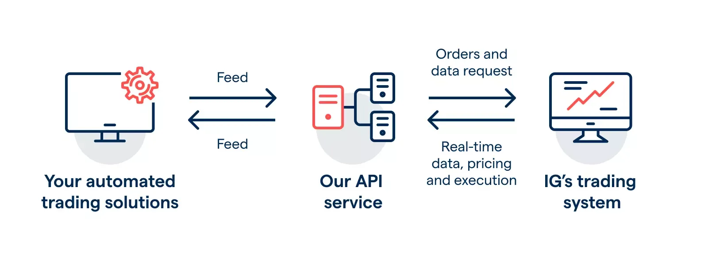

## Table of Contents

## What is an API and how does it relate to trading platforms?

An API, or Application Programming Interface, is like a set of rules that lets different computer programs talk to each other. It's a way for one piece of software to use the services or data of another piece of software without needing to know how it all works behind the scenes. Think of it as a translator that helps different apps understand each other.

In the world of trading platforms, APIs are super important. They let traders connect their trading software to other tools and services, like real-time market data, automated trading bots, or even their own custom programs. This means traders can get the latest stock prices, execute trades automatically, and analyze data more easily, all without having to switch between different apps or manually enter data. So, APIs make trading smoother and more efficient.

## What are the benefits of using an API to access trading platforms?

Using an API to access trading platforms makes things a lot easier and faster for traders. Instead of having to manually enter data or switch between different apps, traders can use an API to connect their trading software directly to other tools and services. This means they can get real-time market data, execute trades automatically, and even use custom programs they've built themselves. It's like having a super-efficient helper that does all the hard work behind the scenes.

Another big benefit is that APIs help traders save time and reduce errors. When you're trading, every second counts, and mistakes can be costly. By using an API, traders can automate a lot of their work, which means they don't have to spend as much time on repetitive tasks. Plus, since the API does the work, there's less chance of making mistakes that could happen if you were doing everything by hand. This can lead to better trading decisions and potentially more profits.

## Can you list some popular trading platforms that offer API access?

Some popular trading platforms that offer API access are MetaTrader 4 (MT4), MetaTrader 5 (MT5), and [Interactive Brokers](/wiki/interactive-brokers-api). These platforms are well-known in the trading world and are used by many traders because they provide easy ways to connect to other tools and services. MT4 and MT5 are especially popular among [forex](/wiki/forex-system) traders, while Interactive Brokers is favored by those who trade stocks, options, and futures.

Another platform that offers API access is the Binance exchange, which is a go-to for [cryptocurrency](/wiki/cryptocurrency) traders. Binance's API allows users to automate their trading strategies and access real-time market data. For those interested in [algorithmic trading](/wiki/algorithmic-trading), platforms like Alpaca and Robinhood also provide API access, making it easier for traders to build and execute their own trading bots.

These platforms make trading more efficient by letting traders connect their software to other tools without having to do everything manually. This can save time, reduce errors, and help traders make better decisions. Whether you're into forex, stocks, or cryptocurrencies, there's likely a trading platform with an API that can meet your needs.

## How do beginners start using an API for trading?

To start using an API for trading, beginners should first choose a trading platform that offers API access, like MetaTrader 4, Interactive Brokers, or Binance. Once you've picked a platform, you'll need to sign up for an account if you don't already have one. After that, you'll need to find the API documentation on the platform's website. This documentation will explain how to connect to the API and what commands you can use. It might seem a bit technical at first, but don't worry, there are plenty of tutorials and guides online to help you understand it better.

Next, you'll need to set up your API key, which is like a special password that lets your software talk to the trading platform. You can usually find instructions on how to get your API key in the platform's documentation. Once you have your key, you can start writing simple programs or using existing software that connects to the API. For example, you might write a program that automatically buys or sells a stock when it reaches a certain price. It's a good idea to start small and test your programs with small amounts of money to make sure everything works as expected. As you get more comfortable, you can start using the API for more complex trading strategies.

## What are the common programming languages used for trading platform APIs?

When it comes to trading platform APIs, the most common programming languages used are Python, JavaScript, and C++. Python is really popular because it's easy to learn and has lots of libraries that make it simple to connect to APIs and analyze data. Many beginners start with Python because it's user-friendly and there are tons of tutorials and examples online to help you get started.

JavaScript is another common choice, especially if you're working with web-based trading platforms. It's great for building interactive web applications and can be used to create trading bots that run in your browser. C++ is used by more advanced traders who need fast and efficient programs. It's a bit harder to learn, but it's powerful and can handle complex trading algorithms.

These languages are widely used because they offer different advantages depending on what you're trying to do. Whether you're just starting out or you're an experienced trader, there's a language that can help you make the most of trading platform APIs.

## What security measures should be considered when using trading platform APIs?

When using trading platform APIs, it's important to keep your API keys safe. Think of your API key like a special password that lets your software talk to the trading platform. If someone else gets your key, they could use it to make trades without your permission. So, always keep your keys secret and don't share them with anyone. It's also a good idea to use different keys for different parts of your trading software, so if one key gets compromised, the rest of your system stays safe.

Another important security measure is to use secure connections when you're sending data back and forth with the trading platform. This means using something called HTTPS, which encrypts your data so it's harder for hackers to steal it. Also, make sure to regularly update your software and the libraries you're using. Updates often fix security holes that could be used by bad guys to get into your system. By taking these simple steps, you can help keep your trading activities safe and secure.

## How can one manage and optimize API requests to trading platforms?

To manage and optimize API requests to trading platforms, it's important to use them wisely. One way to do this is by making fewer requests. Instead of asking for data all the time, you can set up your program to ask for it only when you really need it. For example, if you're checking stock prices, you might only need to do it every few minutes instead of every second. This helps keep your program running smoothly and saves on the number of requests you're making, which can be important if the platform limits how many requests you can make.

Another way to optimize API requests is by grouping them together. Instead of sending lots of small requests, you can send one big request that asks for all the data you need at once. This is called batching, and it can make your program faster and more efficient. Also, make sure to handle errors well. If your request fails, your program should be able to try again without causing problems. By managing and optimizing your API requests like this, you can make your trading software work better and avoid running into limits set by the trading platform.

## What are the limitations or restrictions when using APIs for trading?

When using APIs for trading, there are some limitations and restrictions you need to know about. One big one is the rate limit, which means the trading platform only lets you make a certain number of requests in a certain amount of time. If you go over this limit, your requests might get blocked or delayed, which can mess up your trading strategy. Another restriction is that some APIs might not give you all the data you want. For example, you might not be able to get real-time data for every stock or currency pair, or the data might be delayed by a few seconds.

Also, there are security restrictions to think about. Trading platforms often have rules about how you can use your API keys to keep things safe. If you don't follow these rules, like sharing your keys or not using secure connections, your access might get cut off. Plus, some platforms might limit what you can do with their API, like not letting you automate certain types of trades or only allowing you to use the API for certain kinds of accounts. Knowing these limitations and restrictions can help you use APIs more effectively and avoid any surprises while trading.

## How do advanced traders use APIs to automate their trading strategies?

Advanced traders use APIs to automate their trading strategies by connecting their custom software to trading platforms. They write programs that can automatically buy or sell stocks, currencies, or other assets based on certain rules they set up. For example, a trader might create a program that buys a stock when its price goes below a certain level and sells it when the price goes above another level. This way, the trader doesn't have to watch the market all the time and can make trades even when they're not at their computer. APIs let them get real-time data, execute trades quickly, and even analyze market trends to make smarter decisions.

These traders also use APIs to test and improve their strategies. They can run simulations with historical data to see how their trading rules would have worked in the past. This helps them fine-tune their strategies to make them more profitable. Advanced traders might also use multiple APIs from different platforms to gather more data and execute trades across different markets. By automating their trading, they can take advantage of opportunities faster and more efficiently than if they were doing everything by hand.

## What are some advanced features available through trading platform APIs?

Advanced traders can use trading platform APIs to do some pretty cool things. One advanced feature is algo trading, where they can write programs that automatically buy or sell based on certain rules. For example, a program might buy a stock when its price drops to a certain level and sell it when the price goes up. This way, traders don't have to watch the market all the time. They can also use APIs to get real-time data from different markets, which helps them make better decisions and take advantage of opportunities faster.

Another advanced feature is [backtesting](/wiki/backtesting). Traders can use APIs to test their trading strategies with old data to see how they would have worked in the past. This helps them improve their strategies and make them more profitable. APIs also let traders connect to multiple platforms at once, so they can gather more data and execute trades across different markets. By using these advanced features, traders can automate their work, save time, and potentially make more money.

## How can one integrate multiple trading platform APIs into a single trading system?

To integrate multiple trading platform APIs into a single trading system, you first need to understand how each API works. Each trading platform, like MetaTrader 4, Interactive Brokers, or Binance, has its own set of rules and commands. You'll need to read the API documentation for each platform to learn how to connect to them and what data you can get. Once you know this, you can write a program that talks to all these APIs at the same time. This program will need to handle different types of data and make sure everything works together smoothly.

After you've connected to the APIs, you can start using them to gather data and execute trades. For example, you might use one API to get real-time stock prices from one platform and another API to place trades on a different platform. Your program will need to keep track of all this data and make decisions based on the rules you set up. By integrating multiple APIs, you can create a powerful trading system that takes advantage of different markets and tools, helping you make better trading decisions and potentially earn more money.

## What future trends are expected in the development of trading platform APIs?

In the future, trading platform APIs are expected to become even more advanced and user-friendly. One big trend is the use of [artificial intelligence](/wiki/ai-artificial-intelligence) and [machine learning](/wiki/machine-learning). These technologies can help APIs understand market trends better and make smarter trading decisions. For example, an API might use AI to predict stock prices and suggest the best times to buy or sell. This can make trading easier for everyone, even people who are new to it. Another trend is better integration with other tools and services. APIs will be able to connect to more platforms and apps, making it easier for traders to get all the data they need in one place.

Another important trend is increased security and privacy. As more people use APIs for trading, keeping data safe becomes more important. Future APIs will likely have stronger security measures to protect users' information and prevent hacking. This might include things like better encryption and more secure ways to handle API keys. Also, APIs might become more customizable, letting traders set up their own rules and strategies more easily. This can help traders create systems that fit their needs perfectly, making trading more efficient and effective.

## References & Further Reading

[1]: ["Interactive Brokers API"](https://www.interactivebrokers.com/en/index.php?f=5041) - Interactive Brokers

[2]: ["Alpaca API Documentation"](https://alpaca.markets/docs/) - Alpaca Markets

[3]: ["Advances in Financial Machine Learning"](https://www.amazon.com/Advances-Financial-Machine-Learning-Marcos/dp/1119482089) by Marcos Lopez de Prado

[4]: ["Machine Learning for Algorithmic Trading"](https://www.amazon.com/Machine-Learning-Algorithmic-Trading-intelligence/dp/9918608013) by Stefan Jansen

[5]: ["Quantitative Trading: How to Build Your Own Algorithmic Trading Business"](https://www.amazon.com/Quantitative-Trading-Build-Algorithmic-Business/dp/0470284889) by Ernest P. Chan