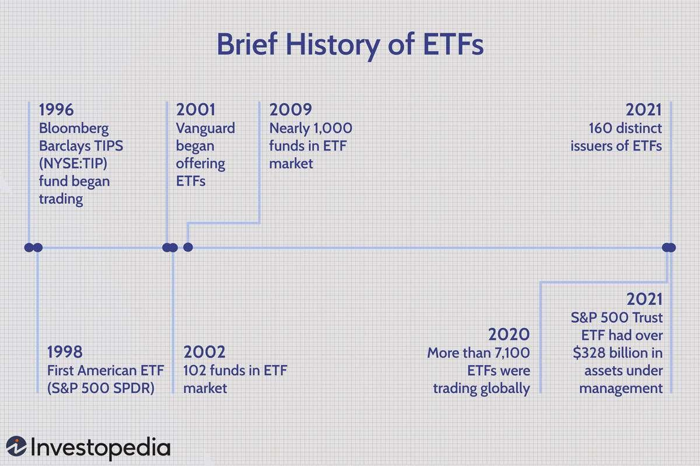

Exchange-Traded Funds, commonly referred to as ETFs, have established themselves as a fundamental component in the investment landscape. Offering the benefits of diversification and trading flexibility comparable to individual stocks, ETFs provide investors with opportunities to access a wide range of assets through a single investment vehicle. Over recent years, the integration of ETFs with algorithmic trading has revolutionized the way financial markets operate, bringing about enhanced trading efficiency and more sophisticated strategy implementation.

Algorithmic trading, at its core, involves the use of computer algorithms to automate and optimize trading decisions. This technology leverages quantitative models to determine the optimal timing, price, and quantity for trade execution, allowing transactions to occur at speeds and frequencies far beyond the capacity of human traders. When applied to ETFs, algorithmic trading introduces a new dimension of operational precision and market accessibility.



This article explores how some of the earliest ETFs embraced algorithmic trading, setting the stage for innovations that have considerably influenced market dynamics. By examining both the operational frameworks and historical impacts of these pioneering ETFs, we gain insights into the transformative role they have played in financial markets. These ETFs have not only enhanced trading liquidity but have also significantly contributed to the democratization of investment strategies, allowing a broader spectrum of market participants to engage in complex financial transactions with reduced costs.

As we examine this intersection of technology and investment, we aim to provide a comprehensive understanding of how ETF and algorithmic trading symbiosis has unfolded and the implications it holds for the past, present, and future of financial markets.

## Table of Contents

## Understanding ETFs and Algorithmic Trading

Exchange-Traded Funds (ETFs) are financial instruments that have gained immense popularity due to their unique ability to combine the diversification benefits of mutual funds with the liquidity characteristics of stocks. Essentially, an ETF is a basket of securities that is traded on a stock exchange, allowing investors to buy or sell shares throughout the trading day, similar to individual stock transactions. The appeal of ETFs lies in their ability to provide investors with exposure to a variety of asset classes, sectors, or strategies while offering the convenience and efficiency of stock trading.

Algorithmic trading, meanwhile, refers to the use of computer algorithms to execute trades. These algorithms can analyze stock market data, recognize trading opportunities, and execute buy or sell orders automatically, often at speeds impossible for human traders to achieve. The primary goal of algorithmic trading is to ensure the 'best execution' of trades by optimizing the timing, price, and volume parameters to achieve the highest possible returns at the lowest possible costs.

The integration of ETFs with [algorithmic trading](/wiki/algorithmic-trading) creates a powerful synergy that enhances the efficiency and effectiveness of trading activities. One of the primary advantages is the significant increase in trading [volume](/wiki/volume-trading-strategy) and [liquidity](/wiki/liquidity-risk-premium). Algorithmic trading systems can process high volumes of trades rapidly, ensuring that investments in ETFs can be entered and exited swiftly without suffering from market delays or liquidity constraints.

Furthermore, algorithmic trading reduces the costs associated with trading ETFs. By automating the trading process, these algorithms minimize human errors and trading-related expenses such as brokerage fees. Algorithms are capable of executing complex strategies that might include [arbitrage](/wiki/arbitrage), monitoring price differentials, and capturing minute market inefficiencies before they can be spotted by manual trading methods.

The integration of algorithmic trading with ETFs also offers enhanced market transparency and price discovery. Automation allows for continuous monitoring of price movements and order flows, resulting in accurate pricing that fosters fair trading conditions. This transparency is beneficial to institutional and retail investors alike, as it ensures that they are trading at prices that reflect real-time market conditions.

Moreover, with the capability of algorithms to analyze large datasets, trading strategies can be fine-tuned in response to emerging trends and market signals, offering investors a dynamic means of managing risk and optimizing returns. Algorithmic trading enables a systematic approach to investing, where pre-defined rules are strictly adhered to, reducing the psychological biases that typically affect human decision-making.

In summary, the convergence of ETFs and algorithmic trading represents a significant evolution in the financial markets. By offering increased liquidity, reduced transaction costs, and improved execution quality, this integration has attracted a wide spectrum of investors seeking efficient and flexible investment vehicles. As technology continues to advance, the relationship between ETFs and algorithmic trading is likely to grow stronger, further shaping the landscape of modern investing.

## The Pioneers: Oldest ETFs in Algorithmic Trading

Exchange-Traded Funds (ETFs) have played a pivotal role in introducing advanced trading strategies to the financial markets. Among the first ETFs to pioneer the adoption of algorithmic trading was the SPDR S&P 500 [ETF](/wiki/etf-trading-strategies) (SPY). Launched in 1993, SPY was instrumental in demonstrating the potential benefits of integrating algorithmic strategies with ETF trading.

### Historical Timelines

The advent of the SPDR S&P 500 ETF set the stage for a new era where algorithmic trading started to gain [momentum](/wiki/momentum) in the late 1990s and early 2000s. The widespread adoption of internet technology facilitated this growth, allowing for quicker data processing and real-time market analysis. ETFs inherently offered diversification, and with algorithmic trading, they could also offer increased trading efficiency.

### Strategies and Benefits

Algorithmic trading employs complex algorithms to automate and optimize trading decisions. For instance, strategies such as momentum trading, mean reversion, and [statistical arbitrage](/wiki/statistical-arbitrage) have been significant. An algorithm might be designed to detect if the SPY ETF is moving significantly compared to its historical average, triggering trades that capitalize on these deviations.

Python, with libraries such as Pandas and NumPy, provides a robust framework for developing such algorithms:

```python
import pandas as pd
import numpy as np

# Sample momentum strategy
def momentum_strategy(prices, window=20):
    returns = prices.pct_change()
    momentum = returns.rolling(window=window).mean()
    signal = np.where(momentum > 0, 1, -1)
    return signal

# Example usage
prices = pd.Series([100, 102, 101, 105, 107])  # Sample price data
signals = momentum_strategy(prices)
```

By using these strategies, ETFs such as SPY experienced enhanced liquidity and tighter bid-ask spreads, making them attractive to both institutional and retail investors.

### Impact on Market Behavior and Liquidity

The integration of algorithmic trading with ETFs like the SPDR S&P 500 ETF generated profound impacts on market behavior. Specifically, it increased market depth, allowing for substantial trade volumes without significant price disruptions. Furthermore, it improved price discovery, ensuring that market prices reflected all available information more efficiently. This was particularly beneficial during volatile periods, providing stability through enhanced liquidity.

These pioneering ETFs laid the groundwork for subsequent innovation in algorithmic trading strategies. They demonstrated the feasibility and advantages of utilizing technology to optimize trading, setting a precedent for other financial instruments to follow suit. As the technology and methodologies continue to evolve, these early adopters remain a testament to the transformative power of algorithmic trading within the ETF market.

## Impact of Algorithmic Trading on ETF Performance

Exchange-Traded Funds (ETFs) have undergone significant transformation with the integration of algorithmic trading strategies. This technological shift has considerably enhanced ETF performance metrics, providing insights into trading volume, liquidity, and efficiency. Algorithmic trading uses complex algorithms to automate trade execution, enabling rapid responses to market conditions while ensuring optimal pricing and minimal market impact.

### Enhanced Performance Metrics

Algorithmic trading systems enable the efficient execution of large orders by breaking them into smaller trades, reducing market impact and avoiding unfavorable price movements. This has resulted in improved performance metrics for ETFs, including higher return rates and tighter bid-ask spreads. By analyzing historical data, algorithms adeptly identify trends and execute trades at opportune times, capturing price improvements and contributing to the increased overall performance of ETFs.

### Case Studies Illustrating Improved Efficiency and Return Rates

Several case studies illustrate the impact of algorithmic trading on ETF performance. For example, the SPDR S&P 500 ETF (NYSEARCA: SPY), one of the oldest and most traded ETFs, has leveraged algorithmic trading to enhance its trading efficiency. The adoption of high-frequency trading strategies enabled the ETF to achieve better synchronization with the S&P 500 index movements, thus improving tracking precision. As a result, the ETF realized improved return rates due to optimized trade execution and reduced slippage.

Another example includes the iShares MSCI Emerging Markets ETF (NYSEARCA: EEM), where algorithmic trading has been crucial in managing the [volatility](/wiki/volatility-trading-strategies) and liquidity challenges inherent in emerging markets. Automated trading systems have enabled the ETF to maintain performance despite fluctuations by executing trades swiftly and ensuring better price discovery.

### Influence on Trading Volume and Liquidity

Algorithmic trading has significantly affected the trading volume and liquidity of ETFs. These systems enhance liquidity by facilitating continuous buying and selling, providing a deeper and more resilient market. For instance, liquidity providers leverage algorithms to offer real-time quotes, adjusting continuously to market conditions. This automatic liquidity provision ensures that ETFs have substantial market depth, allowing large transactions with minimal price impact.

Increased trading volume is a direct consequence of improved liquidity, as market participants find it easier to enter and [exit](/wiki/exit-strategy) positions. The presence of algorithmic traders who can execute high-frequency trades in milliseconds further amplifies trading volume, thereby contributing positively to the ETFs' liquidity profile.

### Overcoming Challenges Faced by Early Adopters

Early adopters of algorithmic trading faced numerous challenges, including the risk of technical failures and market instability. Initial algorithms were limited by computational power and data availability, often resulting in suboptimal trades. However, advancements in technology and data analytics have addressed these issues. Modern systems are equipped with sophisticated risk management protocols, [backtesting](/wiki/backtesting) frameworks, and real-time monitoring to mitigate potential pitfalls.

Moreover, regulatory measures have been introduced to ensure market stability and mitigate systemic risks associated with high-frequency trading. These include circuit breakers, designed to pause trading in extreme volatility scenarios, and stringent reporting requirements to enhance transparency.

### Conclusion

The integration of algorithmic trading has undeniably transformed ETF performance metrics through enhanced efficiency, liquidity, and returns. By leveraging technology, ETFs have achieved greater resilience and adaptability in ever-changing market environments, overcoming initial challenges and setting a foundation for future advancements in trading strategies.

## Risks and Considerations in Algorithmic Trading for ETFs

Algorithmic trading in ETFs offers substantial benefits but is accompanied by notable risks and considerations. One of the primary concerns involves technical failures, which can occur due to system glitches, software bugs, or connectivity issues. Such failures can lead to significant financial losses, as automated systems may execute trades at undesirable prices or at incorrect quantities.

Another risk [factor](/wiki/factor-investing) is market imbalance exacerbated by algorithmic trading, particularly through high-frequency trading ([HFT](/wiki/high-frequency-trading-strategies)). HFT strategies can rapidly execute a high volume of trades, sometimes leading to market disruptions. This rapid pace of trading can cause price fluctuations and may contribute to events like the Flash Crash of 2010, where the Dow Jones Industrial Average briefly plummeted almost 1,000 points only to recover minutes later. ETFs, being highly liquid and heavily traded, are especially susceptible to such volatility due to their integration with high-speed trading technologies.

Regulatory bodies have responded to these challenges by implementing safeguards and regulations. Notable among these are requirements for 'circuit breakers' designed to pause trading if prices move too sharply within a short timeframe. Additionally, there are rules for order-to-trade ratios to limit the amount of non-executed orders. These measures aim to maintain orderly markets and protect against the adverse impacts of HFT on ETFs. Furthermore, many exchanges have introduced co-location services, reducing the advantages of proximity for certain traders and helping level the playing field.

Investors considering algorithmic trading in ETFs should be aware of these risks. They should assess the technological robustness of trading platforms and ensure they have contingency plans for system outages. A thorough understanding of the regulatory environment is also crucial to navigate potential implications on trading strategies. Moreover, investors need to be mindful of the liquidity of ETFs involved in algorithmic trading as it can affect the execution quality and costs associated with high-frequency rebalancing.

Overall, while algorithmic trading brings efficiency and liquidity to ETF trading, market participants must remain vigilant about the potential technical and systemic risks, aligning their strategies with prevailing regulations and market conditions to safeguard their investments.

## The Future of ETFs in Algorithmic Trading

The intersection of Exchange-Traded Funds (ETFs) and algorithmic trading is anticipated to undergo significant transformations in the next decade, driven by technological advancements and evolving market dynamics. The use of [artificial intelligence](/wiki/ai-artificial-intelligence) (AI) is poised to reshape algorithmic trading strategies within the ETF landscape, offering enhanced predictive analytics, pattern recognition, and decision-making capabilities. AI can analyze vast datasets and learn from historical market behaviors to optimize trading strategies, potentially improving the accuracy and efficiency of ETF trades.

Emerging strategies in algorithmic trading are likely to incorporate [machine learning](/wiki/machine-learning) techniques, enabling adaptive and self-improving algorithms. Machine learning models, such as [deep learning](/wiki/deep-learning) and [reinforcement learning](/wiki/reinforcement-learning), may be employed to develop algorithms that can autonomously test and refine trading strategies based on real-time market data. For example, reinforcement learning models can simulate various market scenarios and iteratively adjust strategies to maximize trade outcomes, emulating a trial-and-error learning process.

Python code for a basic reinforcement learning model to optimize trading strategies might look like this:

```python
import numpy as np

class TradingEnv:
    def __init__(self, data):
        self.data = data
        self.n = len(data)
        self.current_step = 0

    def reset(self):
        self.current_step = 0
        return self.data[self.current_step]

    def step(self, action):
        reward = action * (self.data[self.current_step + 1] - self.data[self.current_step])
        self.current_step += 1
        next_state = self.data[self.current_step] if self.current_step < self.n - 1 else None
        done = self.current_step >= self.n - 1
        return next_state, reward, done

def train(env, episodes):
    for episode in range(episodes):
        state = env.reset()
        done = False
        while not done:
            action = np.random.choice([-1, 0, 1])  # Simplistic action: sell, hold, buy
            next_state, reward, done = env.step(action)
            # Implement learning algorithm here

# Example usage
price_data = np.random.randn(100)  # random price changes
env = TradingEnv(price_data)
train(env, 100)
```

Despite the promise of these advancements, there are challenges to consider. Market volatility and unpredictability can still undermine algorithmic predictions, and AI systems require continuous monitoring to prevent drift or overfitting. Moreover, the increased reliance on technology raises the potential for systemic risk, particularly through high-frequency trading, which can exacerbate market swings.

Regulatory frameworks are likely to evolve to address these risks, balancing innovation with the need for market stability and investor protection. Opportunities lie in the development of proprietary AI algorithms that can provide a competitive edge, offering tailored solutions for complex trading environments.

In conclusion, as ETFs and algorithmic trading continue to evolve, participants in this domain must remain agile, adapting to technological and regulatory changes while harnessing new tools to exploit market opportunities. The synergy between AI and ETFs holds significant promise for the future, offering the potential for more sophisticated, efficient, and profitable trading strategies.

## Conclusion

The integration of Exchange-Traded Funds (ETFs) with algorithmic trading has significantly reshaped the landscape of financial markets. These advancements have not only enhanced efficiency but also introduced new dynamics that investors must contend with. The adoption of algorithmic trading in ETFs has enabled more precise execution, increased liquidity, and reduced transaction costs, allowing investors to diversify their portfolios with greater ease and effectiveness. Moreover, the automation of trading processes has allowed for the handling of vast volumes of data, offering insights into trends and behaviors that were previously difficult to discern.

Investors can learn much from the evolution of ETFs within the framework of algorithmic trading. One key takeaway is the importance of agility and adaptability in managing portfolios. As technology continues to advance, investors must be prepared to adjust their strategies in response to new tools and insights provided by algorithmic trading. It's also crucial to recognize the role of technological literacy in contemporary investment strategies; understanding how algorithms operate and influence market conditions can provide a competitive edge.

Additionally, there is an increasing need for investors to remain informed about ongoing developments in ETF trading and algorithmic technologies. Staying abreast of regulatory changes, new trading platforms, and emerging market trends can help in making informed decisions that capitalize on future opportunities while mitigating risks. 

As the technological landscape of financial markets continues to evolve, investors are encouraged to embrace a mindset of continuous learning and adaptation. By
closely monitoring advancements in ETFs and algorithmic trading, investors can better position themselves to maximize financial opportunities and navigate the complexities of modern markets. The transformative journey of ETFs intersecting with algorithmic capabilities highlights an era where technology and finance converge, fostering an environment ripe with both challenges and opportunities.

## References & Further Reading

[1]: Gallagher, D. R., & Segara, R. (2006). ["The Performance and Trading Characteristics of Exchange-Traded Funds."](https://www.researchgate.net/profile/David-Gallagher-8/publication/228645630_The_performance_and_trading_characteristics_of_exchange-traded_funds/links/02e7e5216c9a5e52f4000000/The-performance-and-trading-characteristics-of-exchange-traded-funds.pdf) Journal of Investment Strategy.

[2]: Kuepper, J. (2020). ["History and Development of ETFs."](https://www.sciencedirect.com/science/article/pii/S0273229722000399) Investopedia.

[3]: Hasbrouck, J. (2003). ["Intraday Price Formation in U.S. Equity Index Markets."](https://onlinelibrary.wiley.com/doi/10.1046/j.1540-6261.2003.00609.x) The Review of Financial Studies.

[4]: Aldridge, I. (2013). ["High-Frequency Trading: A Practical Guide to Algorithmic Strategies and Trading Systems."](https://books.google.com/books/about/High_Frequency_Trading.html?id=8QpIsVUMhmEC) Wiley.

[5]: Gomber, P., Arndt, B., Lutat, M., & Uhle, T. (2011). ["High-Frequency Trading."](https://papers.ssrn.com/sol3/papers.cfm?abstract_id=1858626) Business & Information Systems Engineering.