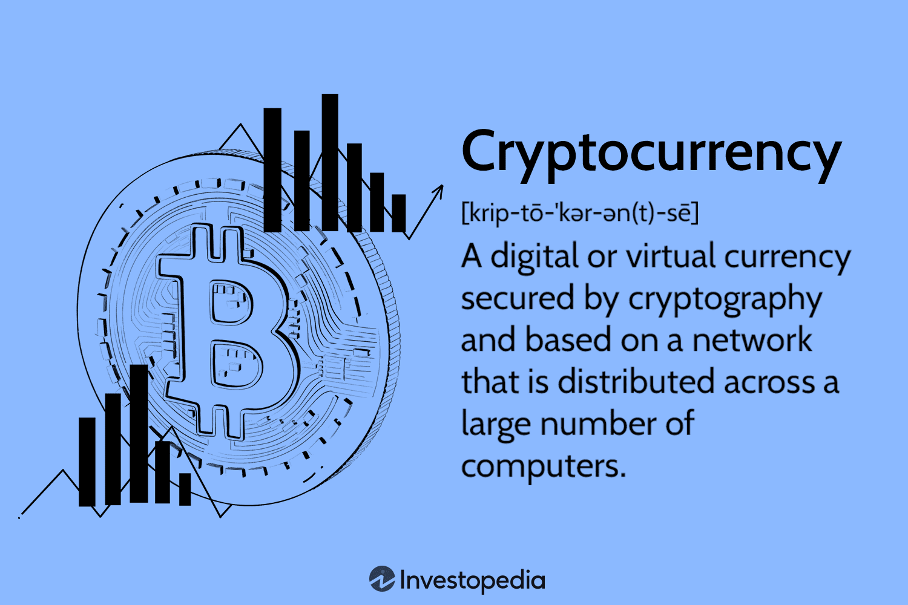

## Table of Contents

## What is a cryptocurrency and how does it work?

A cryptocurrency is a type of digital money that you can use to buy things online. It's different from regular money because it's not controlled by banks or governments. Instead, it uses a technology called blockchain, which is like a big, shared notebook that keeps track of all the transactions. This means that when you send or receive cryptocurrency, the details are recorded in this notebook for everyone to see, but your personal information stays private.

When you want to use cryptocurrency, you need a special app called a digital wallet to store it. You can get cryptocurrency by buying it from an exchange, which is like an online store for digital money, or you might get it as payment for goods or services. Once you have it, you can send it to others by using their digital wallet address, kind of like sending an email. The whole process is secure because the blockchain makes sure that once a transaction is recorded, it can't be changed or deleted, keeping your money safe.

## What are the most popular cryptocurrencies and why are they popular?

The most popular cryptocurrencies are Bitcoin, Ethereum, and Tether. Bitcoin is the first and most well-known cryptocurrency. It's popular because it started the whole idea of digital money without banks. People like it because it's been around for a long time and many places accept it as payment. Ethereum is also very popular because it's not just a currency, but a platform where you can create and run special programs called smart contracts. These programs can do things automatically, like making sure a deal is followed without needing a middleman. Tether is popular because it's tied to the US dollar, so its value doesn't go up and down as much as other cryptocurrencies. This makes it useful for people who want to move money around without worrying about big price changes.

These cryptocurrencies are popular for different reasons. Bitcoin is seen as a kind of digital gold, a safe place to store value over time. Ethereum's popularity comes from its flexibility and the ability to do more than just be a currency. It's like a building block for new kinds of apps and financial tools. Tether, on the other hand, is popular because it gives people a way to use cryptocurrencies without the big risks that come with their price swings. Each of these cryptocurrencies fills a different need in the world of digital money, which is why they are so widely used and talked about.

## How can someone start investing in cryptocurrencies?

To start investing in cryptocurrencies, the first thing you need to do is choose a reputable [cryptocurrency](/wiki/cryptocurrency) exchange. This is like an online store where you can buy and sell digital money. Some popular exchanges are Coinbase, Binance, and Kraken. Once you pick an exchange, you'll need to sign up for an account. This usually involves giving some personal information and verifying your identity, similar to opening a bank account. After your account is set up, you can add money to it using a bank transfer or a credit card. Then, you can use that money to buy the cryptocurrency you're interested in, like Bitcoin or Ethereum.

Once you've bought your cryptocurrency, you need to decide where to keep it. You can leave it on the exchange, but it's often safer to move it to a digital wallet that you control. There are two main types of wallets: hot wallets, which are connected to the internet and easy to use, and cold wallets, which are not connected to the internet and are more secure. After you've set up your wallet, you can start investing. This means buying more cryptocurrency when you think the price will go up and selling it when you think it's a good time. Remember, investing in cryptocurrencies can be risky because their prices can change a lot, so it's important to do your research and only invest money you can afford to lose.

## What are the basic principles of blockchain technology?

Blockchain technology is like a big, shared notebook that keeps track of transactions in a way that's safe and can't be changed. Imagine if you and your friends each had a copy of a notebook where you write down who gave what to whom. Every time someone makes a new entry, everyone gets a new page with the latest information. This way, everyone can see all the transactions, and because everyone has a copy, it's hard for anyone to cheat or change the records without others noticing.

The magic of blockchain comes from how it groups transactions into blocks and links them together in a chain. Each block has a special code called a hash, which is like a unique fingerprint for that block. This hash is made from the information in the block and the hash of the block before it. If someone tries to change a transaction in an old block, it would change its hash, and then all the hashes after it would be wrong. This makes the blockchain very secure because it's almost impossible to change old records without everyone seeing it.

## What are the common risks associated with investing in cryptocurrencies?

Investing in cryptocurrencies can be risky because their prices can go up and down a lot. One day, the price might be high, and the next day, it could drop a lot. This is called [volatility](/wiki/volatility-trading-strategies). Because of this, you might lose money if you need to sell your cryptocurrency when the price is low. Another risk is that there are many scams and frauds in the world of cryptocurrencies. Some people might try to trick you into sending them your money or giving them your private information. It's important to be careful and do your research before you invest.

Another risk is that cryptocurrencies are not controlled by banks or governments, which means there's no one to help if something goes wrong. If you lose your digital wallet or if someone hacks into it, you might not be able to get your money back. Also, the rules about cryptocurrencies can change from one country to another. Some places might not let you use them, or they might tax them in a way that you didn't expect. So, it's a good idea to know the rules in your area before you start investing.

## How do regulations impact the use and trading of cryptocurrencies?

Regulations can really change how people use and trade cryptocurrencies. Some countries have strict rules that make it hard to buy, sell, or even own digital money. For example, they might need you to report your crypto earnings as income and pay taxes on them. In some places, you might even need special permission to trade cryptocurrencies. These rules can make people think twice before getting involved with cryptocurrencies because they might be worried about breaking the law or facing big fines.

On the other hand, some countries have lighter rules or no rules at all, which can make it easier to use and trade cryptocurrencies. But this can also be risky because without strong rules, there might be more scams and frauds. People might feel safer investing in cryptocurrencies in places with clear rules because they know what to expect. Overall, regulations can affect how popular cryptocurrencies are in different parts of the world and how safe people feel about using them.

## What are the key differences between centralized and decentralized cryptocurrencies?

Centralized cryptocurrencies are like regular money because they are controlled by a single group or company. This group makes the rules and can change them whenever they want. They also keep track of all the transactions. Because of this, centralized cryptocurrencies can be easier to use and might feel safer because there's someone in charge. But, if the group in charge does something wrong or gets hacked, it can be a big problem for everyone using the cryptocurrency.

Decentralized cryptocurrencies, on the other hand, don't have one group in charge. Instead, they use a technology called blockchain, where everyone who uses the cryptocurrency helps keep track of the transactions. This makes it harder for anyone to cheat or change the rules because everyone has to agree. Decentralized cryptocurrencies can be more secure and private, but they can also be harder to use and might be riskier because there's no one to help if something goes wrong.

## How do cryptocurrencies compare to traditional currencies in terms of stability and security?

Cryptocurrencies and traditional currencies are very different when it comes to stability. Traditional currencies, like the US dollar or the Euro, are usually more stable because they are controlled by governments and central banks. These banks can change the amount of money in circulation and set interest rates to keep the economy steady. On the other hand, cryptocurrencies can be much more unstable. Their prices can go up and down a lot in a short time because they are not controlled by anyone. This means that if you have cryptocurrencies, their value might change a lot, which can be risky.

In terms of security, traditional currencies have a lot of protection because banks and governments work to keep them safe. If something goes wrong, like if your money is stolen, you might be able to get it back with help from your bank or the government. Cryptocurrencies, however, are more secure in a different way. They use blockchain technology, which makes it very hard for anyone to change or steal transactions. But, if you lose your digital wallet or if it gets hacked, you might not be able to get your money back because there's no central authority to help you. So, while cryptocurrencies can be very secure, they also come with different risks compared to traditional money.

## What advanced trading strategies can be used in cryptocurrency markets?

One advanced trading strategy in cryptocurrency markets is called "[arbitrage](/wiki/arbitrage)." This means buying a cryptocurrency on one exchange where the price is low and selling it on another exchange where the price is higher. Because cryptocurrency prices can be different on different exchanges, you can make money from these price differences. It's like buying something at a discount in one store and selling it for a higher price in another store. But you need to be quick because these price differences don't last long.

Another strategy is "dollar-cost averaging," where you invest a fixed amount of money into a cryptocurrency at regular intervals, no matter what the price is. This helps you avoid trying to guess the best time to buy. Over time, you end up buying more when the price is low and less when the price is high, which can lower your average cost. This strategy can be less risky than trying to time the market, but it takes patience and discipline.

A third strategy is "technical analysis," where traders use charts and past price data to predict future price movements. They look for patterns and trends to decide when to buy or sell. For example, if a cryptocurrency's price has been going up and then starts to go down, a trader might think it's time to sell. This strategy needs a lot of practice and knowledge about how to read charts, but it can help you make better trading decisions.

## How does the mining process work and what are its implications for the environment?

Mining is how new cryptocurrencies like Bitcoin are created and how transactions are added to the blockchain. Imagine a big puzzle that miners, who are people with special computers, try to solve. When they solve it, they get to add a new block of transactions to the blockchain and are rewarded with new cryptocurrency. This process needs a lot of computer power because the puzzles are hard to solve. Miners compete to solve them first, and the more powerful their computers, the better their chances. This is why mining uses a lot of electricity.

The big problem with mining is that it uses a lot of energy, which can be bad for the environment. All those computers running all the time need a lot of power, and most of that power comes from burning fossil fuels like coal and gas. This releases a lot of carbon dioxide into the air, which can make the planet warmer. Some people are trying to use cleaner energy like wind or solar power for mining, but right now, it's still a big problem. So, while mining helps keep the cryptocurrency system running, it also has a big impact on the environment.

## What role do smart contracts play in the functionality of certain cryptocurrencies?

Smart contracts are like special computer programs that run automatically on the blockchain. They help make deals happen without needing a middleman, like a bank or a lawyer. For example, if you want to buy something, a smart contract can make sure you get the item only after you've paid for it. This makes things faster and cheaper because you don't have to wait for someone else to check everything. Ethereum is a popular cryptocurrency that uses smart contracts a lot. People can create all sorts of apps and tools with them, like games or ways to trade money.

Using smart contracts can make cryptocurrencies more useful because they can do more than just be money. They can help with all kinds of things, like voting in elections or keeping track of where goods are in a supply chain. But, they also have some risks. If there's a mistake in the code of a smart contract, it can be hard to fix, and people might lose money. So, it's important for people who make smart contracts to be very careful and test them well before using them.

## What are the future trends and potential developments in the field of cryptocurrencies?

In the future, cryptocurrencies might become even more popular and easier to use. More people and businesses might start using them for everyday things like buying groceries or paying bills. Governments might also start making clearer rules about cryptocurrencies, which could make people feel safer about using them. New kinds of cryptocurrencies could come out, and they might have special features that make them even more useful. For example, some might focus on being super fast and cheap to use, while others might be all about privacy and keeping your information safe.

Another big trend could be the growth of something called decentralized finance, or DeFi. This is where people use cryptocurrencies to do things like borrow money, lend money, or invest, without needing banks. DeFi could change the way we think about money and make financial services available to more people around the world. Also, more and more things might start working together with cryptocurrencies, like smart contracts and the Internet of Things. This could lead to new kinds of apps and services that we can't even imagine yet. But, as cryptocurrencies grow, it's important to keep an eye on how they affect the environment and make sure they're used in a way that's good for everyone.

## What are Risk Management Techniques?

Effective risk management is crucial in crypto [algorithmic trading](/wiki/algorithmic-trading) to safeguard against the market's inherent volatility and potential losses. One key technique is diversification, which involves spreading investments across different strategies and asset classes. This approach minimizes risk by ensuring that a decline in one area does not disproportionately affect the entire portfolio. By combining strategies such as trend-following, arbitrage, and market-making, traders can achieve a balanced exposure to various market conditions.

Incorporating stop-loss and take-profit orders into trading strategies is another essential method for automating risk management. Stop-loss orders are set at predefined price levels to sell an asset when its price falls to that point, thereby limiting potential losses. Conversely, take-profit orders lock in gains by selling an asset once it reaches a predetermined profit target. These mechanisms help remove emotional decision-making from the trading process, promoting discipline and consistency.

Position sizing is also fundamental to managing risk in crypto algo trading. By determining the size of each trade relative to the overall portfolio, traders can ensure that no single position exposes them to excessive risk. A common method for position sizing is the Kelly Criterion, which optimally allocates capital based on the probability of success and the payoff of the trade. The formula is given by:

$$
f^* = \frac{bp - q}{b}
$$

where:
- $f^*$ is the fraction of the portfolio to bet,
- $b$ is the odds received on the wager (net odds),
- $p$ is the probability of a win,
- $q$ is the probability of a loss (i.e., $q = 1 - p$). 

In Python, position sizing can be calculated using the Kelly Criterion as follows:

```python
def kelly_criterion(b, p):
    q = 1 - p
    return (b * p - q) / b

# Example usage with inputs: odds of 2, 60% win probability
bet_fraction = kelly_criterion(2, 0.6)
print("Optimal position size:", bet_fraction)
```

This systematic process allows for controlled risk-taking, potentially leading to more sustainable trading success. By combining these risk management techniques, algo traders can enhance their ability to protect their investments against the unpredictable nature of cryptocurrency markets.

## How can one balance diversification and specialization?

Diversification is a fundamental principle in asset management, designed to mitigate risk by spreading investments across various assets or strategies. In the context of cryptocurrency algorithmic trading, diversification involves implementing a range of trading strategies and engaging with multiple digital assets to cushion against market volatility. However, excessive diversification can introduce unnecessary complexity and potentially reduce overall returns.

Balancing diversification with specialization is an essential task for traders. While diversification helps in reducing unsystematic risk, excessive diversification may dilute potential gains. This concept is aligned with the principle of diminishing marginal returns, where adding more assets to a portfolio leads to a decrease in the incremental benefit.

Quality over quantity is vital when selecting trading strategies. Focusing on a few well-researched and thoroughly backtested strategies often yields better results than attempting to manage a larger collection of less effective ones. By optimizing and customizing strategies for specific market conditions and assets, traders can enhance their ability to react to market changes effectively.

Consider the mathematical expression of diversification benefits in a simplified form:

$$
\sigma_p = \sqrt{\sum w_i^2 \sigma_i^2 + 2 \sum \sum w_i w_j \sigma_i \sigma_j \rho_{ij}}
$$

Where:
- $\sigma_p$ is the portfolio's standard deviation.
- $w_i$ and $w_j$ are the weights of the assets in the portfolio.
- $\sigma_i$ and $\sigma_j$ are the standard deviations of those assets.
- $\rho_{ij}$ is the correlation coefficient between assets $i$ and $j$.

While diversification can reduce $\sigma_p$, overly high $n$ or broad implementation across under-researched areas can diminish returns. It is crucial for algorithmic traders to use data-driven approaches to evaluate strategy effectiveness, using performance metrics such as Sharpe Ratio or Sortino Ratio to determine if diversification leads to improved risk-adjusted returns.

Moreover, enhanced focus on specialization allows traders to exploit specific market inefficiencies or optimize strategies for particular currency pairs. This approach requires deep research and understanding of market dynamics, as well as continuous monitoring and modification of strategies based on market evolutions.

In conclusion, while diversification is beneficial for risk management, traders must carefully assess and select strategies that align with their risk tolerance and investment goals, ensuring an optimal balance between diversification and specialization to maintain effective portfolio performance.

## References & Further Reading

[1]: Bergstra, J., Bardenet, R., Bengio, Y., & Kégl, B. (2011). ["Algorithms for Hyper-Parameter Optimization."](https://papers.nips.cc/paper/4443-algorithms-for-hyper-parameter-optimization.pdf) Advances in Neural Information Processing Systems 24.

[2]: ["Advances in Financial Machine Learning"](https://www.amazon.com/Advances-Financial-Machine-Learning-Marcos/dp/1119482089) by Marcos Lopez de Prado

[3]: ["Evidence-Based Technical Analysis: Applying the Scientific Method and Statistical Inference to Trading Signals"](https://www.amazon.com/Evidence-Based-Technical-Analysis-Scientific-Statistical/dp/0470008741) by David Aronson

[4]: ["Machine Learning for Algorithmic Trading"](https://github.com/PacktPublishing/Machine-Learning-for-Algorithmic-Trading-Second-Edition) by Stefan Jansen

[5]: ["Quantitative Trading: How to Build Your Own Algorithmic Trading Business"](https://books.google.com/books/about/Quantitative_Trading.html?id=j70yEAAAQBAJ) by Ernest P. Chan