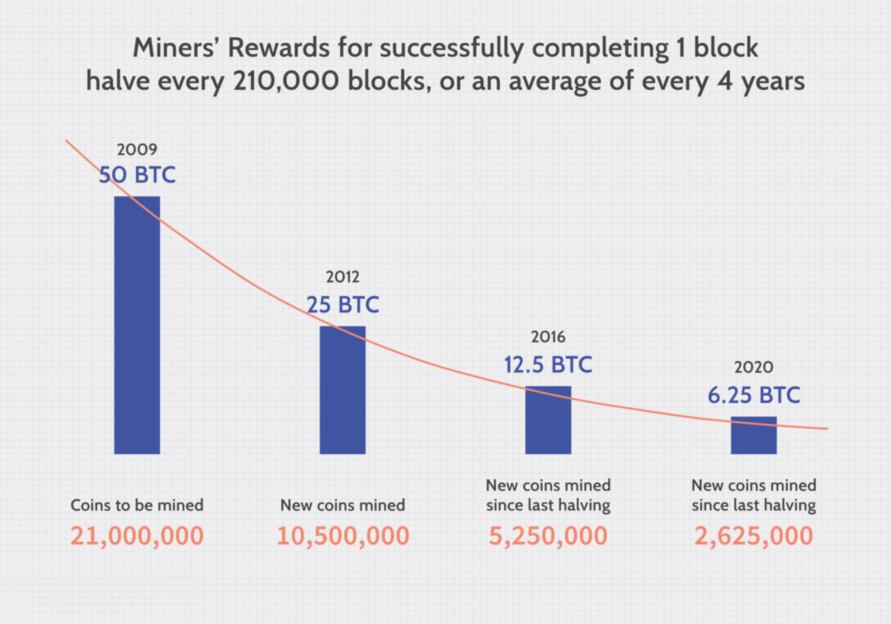

The rise of cryptocurrency markets has generated significant interest in algorithmic trading, commonly known as algo trading. This technological advancement involves the use of computer programs and algorithms to execute trades automatically, capitalizing on the unique characteristics of cryptocurrencies. Unlike traditional financial assets, cryptocurrencies exhibit high volatility, a 24/7 trading environment, and often speculative valuations, making them a fertile ground for the deployment of sophisticated trading strategies.

Cryptocurrencies are known for their speculative nature and can be difficult to value based on traditional financial metrics. This ambiguity makes it essential for traders to understand both the potential benefits and inherent risks of deploying algo trading strategies in this sector. While the technological efficiency offered by algorithmic trading can enhance speed and accuracy, the unpredictable nature of crypto markets can pose significant challenges.



This article sets out to assess what works effectively in crypto algo trading and what does not, providing insights into the design and implementation of successful trading strategies. It is important to consider that cryptocurrencies exhibit behavioral patterns distinct from those observed in traditional assets, requiring a nuanced approach to market analysis and strategy formulation. Both the opportunities and pitfalls inherent in crypto algo trading will be explored, drawing attention to the unique nature of these digital assets compared to their conventional counterparts.

## Table of Contents

## Understanding Crypto Algorithmic Trading

Crypto [algorithmic trading](/wiki/algorithmic-trading), often referred to as crypto algo trading, involves the use of computer programs and algorithms to execute trades automatically based on predefined rules. This practice has become increasingly popular due to the unique and volatile nature of [cryptocurrency](/wiki/cryptocurrency) markets, which operate 24/7 and allow for significant price fluctuations. By automating the trading process, algo trading removes the element of human emotion, which often leads to irrational decision-making and trading errors. This can enhance the speed and accuracy of trade execution, providing traders with a competitive edge. 

A significant advantage of algo trading is its ability to exploit market inefficiencies, such as [arbitrage](/wiki/arbitrage) opportunities. Arbitrage involves taking advantage of price discrepancies of the same asset across different exchanges. For instance, if Bitcoin is priced at $60,000 on one exchange and $59,800 on another, an algo trading system can simultaneously buy from the cheaper exchange and sell on the more expensive one, thus securing a profit from the price difference.

### Example of a Simple Arbitrage Algorithm in Python

```python
import time
import requests

def get_price(exchange_api_url):
    response = requests.get(exchange_api_url)
    price = response.json()['ticker']['price']
    return float(price)

def arbitrage_opportunity(price1, price2, threshold=0.5):
    return abs(price1 - price2) > threshold

exchange_1_url = "https://api.exchange1.com/ticker"
exchange_2_url = "https://api.exchange2.com/ticker"

while True:
    price1 = get_price(exchange_1_url)
    price2 = get_price(exchange_2_url)

    if arbitrage_opportunity(price1, price2):
        if price1 < price2:
            print(f"Buy on Exchange 1 at {price1} and sell on Exchange 2 at {price2}")
        else:
            print(f"Buy on Exchange 2 at {price2} and sell on Exchange 1 at {price1}")
    time.sleep(10)
```

In the example above, the Python script continuously checks for price discrepancies between two exchanges and identifies potential arbitrage opportunities exceeding a defined threshold. This illustrates the core of algo trading: the ability to act swiftly on precise data without hesitation or delay.

Overall, crypto algo trading plays a pivotal role in modern financial trading, offering both efficiency and opportunities in navigating the complex landscape of cryptocurrency exchanges.

## What Works in Crypto Algo Trading

Price [momentum](/wiki/momentum) is particularly effective in cryptocurrency markets, where trends often show that past winners continue to outperform. This phenomenon is largely due to the unique characteristics of digital assets, which create an environment that is well-suited for algorithmic trading strategies.

Cryptocurrency markets operate continuously, providing traders with the opportunity to capitalize on price movements at any time. This 24/7 availability, combined with the frequent [volatility](/wiki/volatility-trading-strategies) observed in these markets, offers an ideal setting for algorithmic trading. Strategies that leverage rapid changes in price can quickly exploit arbitrage opportunities, thereby increasing potential profitability for traders.

Backtesting, a crucial component of successful algorithmic trading, involves assessing a strategy using historical market data to evaluate its effectiveness and performance. By analyzing past price movements and trends, traders can develop predictive models that forecast future performance, allowing for the refinement of trading algorithms before their deployment in live markets. When executed properly, [backtesting](/wiki/backtesting) offers critical insight into how a strategy might perform, thus reducing the likelihood of unforeseen losses.

In summary, past price momentum, the 24/7 operational tempo of crypto markets, and effective backtesting are significant factors contributing to the success of algorithmic trading strategies in cryptocurrency markets. These elements enable traders to make informed decisions and more effectively navigate the volatile landscape of digital assets.

## Challenges and Limitations

Algorithmic trading in cryptocurrency markets faces several challenges and limitations that can affect its performance. A critical aspect to consider is the relatively low significance of risk-based anomalies, like return moment risks, in cryptocurrencies compared to traditional equities. In traditional markets, higher risk tends to correlate with higher expected returns. However, in cryptocurrency markets, the risk-return relationship is often less predictable, partly due to the nascent and inherently volatile nature of the asset class.

The speculative characteristics of cryptocurrencies also contribute to overconfidence among noise traders. These traders, often lacking substantial market fundamentals, engage in frequent buying and selling based on sentiment rather than data, leading to extreme price movements and heightened volatility. Such behavior can introduce additional market inefficiencies but also magnifies the risk of substantial losses due to abrupt market reversals.

Technical challenges in crypto algo trading are another prominent issue. One significant hurdle is the risk of over-optimizing strategies during backtesting. Over-optimization, sometimes called "curve fitting," occurs when algorithms are tweaked to perform exceptionally well on historical data but fail to generalize to future, unseen market conditions. This can result in poor performance when the strategy is deployed in live trading environments.

Mitigating these challenges requires a balanced approach that accounts for the unique attributes of cryptocurrency markets. Risk assessment should consider the unpredictable nature of price movements and the limited historical data available. Employing robust validation techniques, such as out-of-sample testing and walk-forward analysis, can help ensure that strategies remain effective even as market conditions change.

## Risk Management Techniques

Effective risk management is crucial in crypto algorithmic trading to safeguard against the market's inherent volatility and potential losses. One key technique is diversification, which involves spreading investments across different strategies and asset classes. This approach minimizes risk by ensuring that a decline in one area does not disproportionately affect the entire portfolio. By combining strategies such as trend-following, arbitrage, and market-making, traders can achieve a balanced exposure to various market conditions.

Incorporating stop-loss and take-profit orders into trading strategies is another essential method for automating risk management. Stop-loss orders are set at predefined price levels to sell an asset when its price falls to that point, thereby limiting potential losses. Conversely, take-profit orders lock in gains by selling an asset once it reaches a predetermined profit target. These mechanisms help remove emotional decision-making from the trading process, promoting discipline and consistency.

Position sizing is also fundamental to managing risk in crypto algo trading. By determining the size of each trade relative to the overall portfolio, traders can ensure that no single position exposes them to excessive risk. A common method for position sizing is the Kelly Criterion, which optimally allocates capital based on the probability of success and the payoff of the trade. The formula is given by:

$$
f^* = \frac{bp - q}{b}
$$

where:
- $f^*$ is the fraction of the portfolio to bet,
- $b$ is the odds received on the wager (net odds),
- $p$ is the probability of a win,
- $q$ is the probability of a loss (i.e., $q = 1 - p$). 

In Python, position sizing can be calculated using the Kelly Criterion as follows:

```python
def kelly_criterion(b, p):
    q = 1 - p
    return (b * p - q) / b

# Example usage with inputs: odds of 2, 60% win probability
bet_fraction = kelly_criterion(2, 0.6)
print("Optimal position size:", bet_fraction)
```

This systematic process allows for controlled risk-taking, potentially leading to more sustainable trading success. By combining these risk management techniques, algo traders can enhance their ability to protect their investments against the unpredictable nature of cryptocurrency markets.

## Balancing Diversification and Specialization

Diversification is a fundamental principle in asset management, designed to mitigate risk by spreading investments across various assets or strategies. In the context of cryptocurrency algorithmic trading, diversification involves implementing a range of trading strategies and engaging with multiple digital assets to cushion against market volatility. However, excessive diversification can introduce unnecessary complexity and potentially reduce overall returns.

Balancing diversification with specialization is an essential task for traders. While diversification helps in reducing unsystematic risk, excessive diversification may dilute potential gains. This concept is aligned with the principle of diminishing marginal returns, where adding more assets to a portfolio leads to a decrease in the incremental benefit.

Quality over quantity is vital when selecting trading strategies. Focusing on a few well-researched and thoroughly backtested strategies often yields better results than attempting to manage a larger collection of less effective ones. By optimizing and customizing strategies for specific market conditions and assets, traders can enhance their ability to react to market changes effectively.

Consider the mathematical expression of diversification benefits in a simplified form:

$$
\sigma_p = \sqrt{\sum w_i^2 \sigma_i^2 + 2 \sum \sum w_i w_j \sigma_i \sigma_j \rho_{ij}}
$$

Where:
- $\sigma_p$ is the portfolio's standard deviation.
- $w_i$ and $w_j$ are the weights of the assets in the portfolio.
- $\sigma_i$ and $\sigma_j$ are the standard deviations of those assets.
- $\rho_{ij}$ is the correlation coefficient between assets $i$ and $j$.

While diversification can reduce $\sigma_p$, overly high $n$ or broad implementation across under-researched areas can diminish returns. It is crucial for algorithmic traders to use data-driven approaches to evaluate strategy effectiveness, using performance metrics such as Sharpe Ratio or Sortino Ratio to determine if diversification leads to improved risk-adjusted returns.

Moreover, enhanced focus on specialization allows traders to exploit specific market inefficiencies or optimize strategies for particular currency pairs. This approach requires deep research and understanding of market dynamics, as well as continuous monitoring and modification of strategies based on market evolutions.

In conclusion, while diversification is beneficial for risk management, traders must carefully assess and select strategies that align with their risk tolerance and investment goals, ensuring an optimal balance between diversification and specialization to maintain effective portfolio performance.

## Selecting the Right Crypto Trading Software

Selecting the right crypto trading software is crucial for successfully implementing algorithmic trading strategies in the cryptocurrency market. An ideal software should offer a comprehensive suite of functionalities tailored to the needs of both novice and experienced traders. Key features to look for include:

### Functionalities

1. **Backtesting**: This allows traders to test their strategies against historical data to evaluate potential future performance. The software should facilitate thorough backtesting functionalities that accommodate various market conditions and trading strategies, enabling traders to refine their approaches effectively.

2. **Real-Time Data Analysis**: Access to real-time market data is essential for making informed trading decisions. The software should provide seamless integration with multiple data sources to deliver current price quotes, order book data, and trading volumes, enabling traders to respond swiftly to market movements.

3. **Customizable Algorithms**: Offering the ability to create and modify trading algorithms is vital for adapting strategies to ever-changing market conditions. Traders should be able to program custom rules and indicators, allowing for a more tailored approach to executing trades.

### Security and Reliability

Reliability and robust security measures are crucial for safeguarding your trading infrastructure. The software should include features such as:

- **Data Encryption**: To protect sensitive data and transaction details from potential breaches.

- **Two-Factor Authentication (2FA)**: A fundamental security feature that adds an extra layer of protection for user accounts.

- **Performance Stability**: The software must provide consistent performance and uptime, especially during periods of high market volatility, to ensure uninterrupted trading operations.

### Reputation and Customer Service

Selecting reputable software with excellent customer service can significantly influence a trader's experience. Consider the following when evaluating options:

- **Provider Reputation**: Research the software provider's history and credibility within the trading community. A well-regarded provider is more likely to offer reliable and effective solutions.

- **Customer Support**: Efficient and responsive customer support can be invaluable, especially when encountering technical issues. Verify if the provider offers various channels for support such as live chat, email, or phone, and assess their availability and responsiveness.

Choosing crypto trading software with robust functionalities, security features, and a trustworthy provider ensures the tools at your disposal are optimal for executing sophisticated trading strategies and navigating the complexities of the cryptocurrency market.

## Conclusion

Algo trading in cryptocurrencies presents both significant opportunities and notable challenges. The potential for [high frequency](/wiki/high-frequency-trading) and speed in executing trades appeals greatly to traders seeking to capitalize on the rapid price movements characteristic of crypto markets. However, this same volatility brings about substantial risks, making it essential for traders to employ robust risk management strategies.

Understanding the factors that contribute to successful trading strategies—such as price momentum and the ability to exploit arbitrage opportunities—can lead to increased profitability. Conversely, recognizing the pitfalls, such as over-optimizing models or failing to adapt to unpredictable market changes, is equally crucial. Traders who can effectively navigate these challenges by continuously adapting their strategies stand a better chance of achieving sustained success.

As cryptocurrency markets mature and undergo regulatory and technological changes, algo traders must remain agile. This requires ongoing refinement of trading algorithms, continuous learning from historical data, and leveraging advanced tools that offer improved analytical capabilities and security. As a result, the evolution of strategies and tools is not just beneficial but necessary for maintaining a competitive edge in the dynamic landscape of cryptocurrency trading.

## References & Further Reading

[1]: Bergstra, J., Bardenet, R., Bengio, Y., & Kégl, B. (2011). ["Algorithms for Hyper-Parameter Optimization."](https://papers.nips.cc/paper/4443-algorithms-for-hyper-parameter-optimization.pdf) Advances in Neural Information Processing Systems 24.

[2]: ["Advances in Financial Machine Learning"](https://www.amazon.com/Advances-Financial-Machine-Learning-Marcos/dp/1119482089) by Marcos Lopez de Prado

[3]: ["Evidence-Based Technical Analysis: Applying the Scientific Method and Statistical Inference to Trading Signals"](https://www.amazon.com/Evidence-Based-Technical-Analysis-Scientific-Statistical/dp/0470008741) by David Aronson

[4]: ["Machine Learning for Algorithmic Trading"](https://github.com/PacktPublishing/Machine-Learning-for-Algorithmic-Trading-Second-Edition) by Stefan Jansen

[5]: ["Quantitative Trading: How to Build Your Own Algorithmic Trading Business"](https://books.google.com/books/about/Quantitative_Trading.html?id=j70yEAAAQBAJ) by Ernest P. Chan