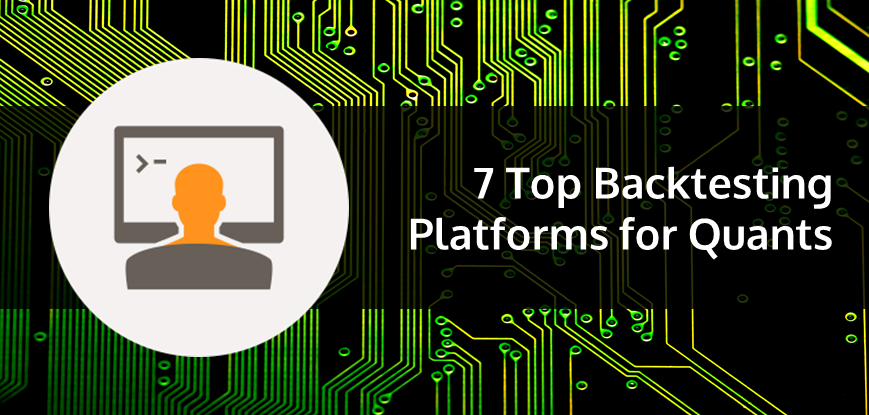

## Table of Contents

## What is backtesting and why is it important for traders and investors?

Backtesting is a way for traders and investors to test their trading strategies using past data. They use a computer program to see how their strategy would have worked if they had used it in the past. This helps them understand if their strategy is good or if it needs changes before they use real money.

It's important for traders and investors because it helps them make better decisions. By testing their strategies with old data, they can see what might happen in the future. This can save them from losing money on strategies that don't work. It also gives them more confidence when they start trading for real, knowing their strategy has been tested.

## What are the key features to look for in a backtesting tool?

When choosing a backtesting tool, it's important to look for features that make it easy to use and reliable. The tool should have a user-friendly interface so you can set up your trading strategies without getting confused. It should also allow you to import historical data easily, so you can test your strategies with real market conditions. Another key feature is the ability to customize your tests. This means you can change different parts of your strategy, like when to buy or sell, to see how these changes affect your results.

Accuracy is also crucial in a backtesting tool. The tool should give you accurate results based on the data you input, so you can trust the outcomes of your tests. It should also run quickly, so you don't have to wait too long to see your results. Lastly, good reporting features are important. The tool should provide clear reports and charts that help you understand how well your strategy performed. This way, you can make better decisions about whether to use your strategy in real trading.

## How user-friendly should a backtesting tool be for beginners?

A backtesting tool should be very user-friendly for beginners. It should have a simple interface that is easy to understand and navigate. Beginners might not know a lot about trading or coding, so the tool should let them set up their strategies without needing to write complicated code. It should also have clear instructions and guides to help them learn how to use it. If the tool is too hard to use, beginners might get frustrated and give up on backtesting their strategies.

The tool should also make it easy to import data and run tests. Beginners need a tool that can quickly show them the results of their tests, so they can see if their strategies work. The tool should also have good reporting features that show the results in a simple way, like with charts and graphs. This helps beginners understand what the results mean and how they can improve their strategies. A user-friendly backtesting tool can make a big difference for beginners, helping them learn and gain confidence in their trading.

## Can you recommend a backtesting tool that is suitable for beginners?

For beginners, I recommend using TradingView. It's a great tool because it's easy to use and doesn't need any coding. You can set up your trading strategies by just clicking and dragging on the charts. TradingView also has a lot of free historical data, so you can test your strategies with real market conditions. It's also good because it has a community where you can learn from other traders and get help if you need it.

Another good option for beginners is MetaTrader 4 (MT4). This tool is also user-friendly and has a lot of built-in indicators and tools that you can use to set up your strategies. MT4 lets you backtest your strategies easily and gives you clear reports on how well they did. It's a bit more technical than TradingView, but it's still easy enough for beginners to use and learn from. Both of these tools can help beginners get started with backtesting and improve their trading skills.

## What are the advantages and disadvantages of using free versus paid backtesting tools?

Free backtesting tools are great because they don't cost any money. This means beginners can start testing their trading strategies without spending anything. Tools like TradingView offer a lot of features for free, including access to historical data and easy-to-use interfaces. This can be really helpful for people who are just starting out and want to learn without spending money. However, free tools might have some limits. They might not let you test as many strategies or use as much data as you want. Sometimes, the results might not be as accurate as with paid tools, and you might see ads or other things that can be annoying.

Paid backtesting tools, on the other hand, usually offer more features and better accuracy. They let you test more complex strategies and use more data, which can be important for experienced traders. These tools often have better support and more detailed reports, which can help you understand your results better. The downside is that they cost money, which might be a problem for beginners or people who don't trade a lot. You have to decide if the extra features are worth the cost. In the end, it depends on what you need and how much you're willing to spend.

## How does the choice of programming language affect the selection of a backtesting tool?

The choice of programming language can really change which backtesting tool you pick. Some tools work best with certain languages. For example, if you know Python, you might like tools like Backtrader or Zipline because they use Python. These tools let you write your trading strategies in Python, which can be easier if you already know the language. But if you don't know Python, these tools might be hard to use. On the other hand, tools like MetaTrader 4 use their own language called MQL4. If you're comfortable with MQL4, then MetaTrader 4 could be a good choice for you.

The language you choose can also affect how easy or hard it is to set up and run your backtests. If you pick a tool that uses a language you're good at, you can make your strategies more detailed and test them faster. But if you have to learn a new language just to use a tool, it might take a lot of time and be frustrating. So, it's important to think about what languages you know and what you're willing to learn when you're choosing a backtesting tool. This way, you can find a tool that fits your skills and helps you test your strategies without too much trouble.

## What advanced features should an expert look for in a backtesting tool?

An expert trader should look for advanced features in a backtesting tool that allow for more detailed and complex testing. One important feature is the ability to use multiple time frames. This means the tool can test strategies across different time periods, like daily, hourly, or even minute-by-minute data. Another key feature is the ability to run simulations with different market conditions. This helps experts see how their strategies would work in different situations, like during a market crash or a bull market. Experts also need tools that can handle large amounts of data quickly and accurately, so they can test many strategies without waiting too long.

Additionally, experts should look for tools that offer advanced statistical analysis. This means the tool can give detailed reports on things like risk, return, and how often a strategy works. It's also important for the tool to allow for custom indicators and algorithms. This way, experts can create their own unique strategies and test them thoroughly. Finally, the ability to automate the backtesting process is crucial. This means the tool can run tests automatically, saving experts time and letting them focus on other parts of their trading.

## How do different backtesting tools handle data quality and availability?

Different backtesting tools handle data quality and availability in various ways. Some tools, like TradingView, offer a lot of free historical data that is easy to use. This data is usually good enough for beginners and can help them test their strategies without spending money. However, the quality of this free data might not be as high as what you get with paid tools. Paid tools often have better data because they get it from more reliable sources. This can be important for experts who need accurate data to make sure their backtests are trustworthy.

Other tools, like MetaTrader 4, let you use data from different places. You can buy data from special providers or use data you already have. This gives you more control over the quality of the data you use. But it can also be more work to set up. Some advanced tools, like those using Python, let you connect to big databases or even get live data. This can be really helpful for experts who need the most up-to-date and accurate information. The choice of tool depends on how much you care about data quality and how much time and money you want to spend on getting good data.

## Can you explain how to validate the results of a backtesting tool?

To validate the results of a backtesting tool, you need to check if the results are real and not just by chance. One way to do this is by using a method called "out-of-sample testing." This means you test your strategy on data that the tool hasn't seen before. If your strategy still works well with this new data, it's a good sign that your results are valid. Another way is to use something called "walk-forward optimization." This is where you test your strategy on a small part of the data, then move forward and test it on the next part, and so on. This helps you see if your strategy keeps working over time.

It's also important to look at how well your strategy does compared to just buying and holding the market. If your strategy doesn't do better than that, it might not be worth using. You should also check for something called "overfitting." This happens when your strategy works perfectly on the data you used to test it, but it doesn't work well with new data. To avoid this, keep your strategy simple and don't change it too much just to make it fit the data you're using. By doing these things, you can be more sure that the results from your backtesting tool are reliable and useful for real trading.

## What are some common pitfalls to avoid when using backtesting tools?

One common pitfall when using backtesting tools is overfitting. This happens when you change your strategy too much to make it fit the past data perfectly. But then, it might not work well with new data. To avoid this, keep your strategy simple and don't tweak it too much just to make it look good on the data you're using. Another mistake is not using enough data. If you only test your strategy on a short period, you might miss how it would do in different market conditions. Make sure to use a lot of data from different times to get a better idea of how your strategy will work.

Another pitfall is ignoring transaction costs and slippage. When you backtest, you might not think about the costs of buying and selling, or how the price might change a bit when you make a trade. These things can make a big difference in real trading. Always include these costs in your backtests to get a more realistic picture. Also, some people forget to validate their results. Just because a strategy worked in the past doesn't mean it will work in the future. Use out-of-sample testing and walk-forward optimization to make sure your strategy is really good and not just lucky.

## How can backtesting tools be integrated with other trading software and platforms?

Backtesting tools can be integrated with other trading software and platforms in different ways. Some tools, like MetaTrader 4, have built-in features that let you connect them to other trading platforms. This means you can use the backtesting tool to test your strategies and then use the same platform to trade for real. Other tools, like those using Python, can be connected to trading platforms through something called an API. An API is like a bridge that lets different software talk to each other. This way, you can send your backtesting results to your trading platform and use them to make trades.

Another way to integrate backtesting tools is by using data from different sources. Some backtesting tools let you import data from other platforms or databases. This can be helpful if you want to use the same data for backtesting and real trading. For example, you might use data from a trading platform to test your strategies and then use the same data to make trades. By integrating backtesting tools with other software and platforms, you can make your trading process smoother and more efficient.

## What future trends or developments should we watch for in backtesting technology?

In the future, backtesting technology is likely to become even more advanced and easier to use. One trend to watch for is the use of artificial intelligence (AI) and machine learning. These technologies can help backtesting tools learn from past data and make better predictions about how strategies will work in the future. This means that even beginners might be able to use more complex strategies without needing to know a lot about coding or trading. Another trend is the integration of backtesting tools with more trading platforms and data sources. This will make it easier for traders to test their strategies with real-time data and then use the same tools to trade for real.

Another important development to keep an eye on is the improvement in data quality and availability. As more and more data becomes available, backtesting tools will be able to use this data to give more accurate results. This is important because good data helps traders make better decisions. Also, cloud computing might play a bigger role in backtesting. This means that backtesting tools could use powerful computers in the cloud to run tests faster and handle more data. All these trends will make backtesting more useful and easier for everyone, from beginners to experts.

## References & Further Reading

[1]: Bergstra, J., Bardenet, R., Bengio, Y., & Kégl, B. (2011). ["Algorithms for Hyper-Parameter Optimization."](https://papers.nips.cc/paper_files/paper/2011/hash/86e8f7ab32cfd12577bc2619bc635690-Abstract.html) Advances in Neural Information Processing Systems 24.

[2]: ["Advances in Financial Machine Learning"](https://www.amazon.com/Advances-Financial-Machine-Learning-Marcos/dp/1119482089) by Marcos Lopez de Prado

[3]: ["Evidence-Based Technical Analysis: Applying the Scientific Method and Statistical Inference to Trading Signals"](https://www.wiley.com/en-gb/Evidence+Based+Technical+Analysis:+Applying+the+Scientific+Method+and+Statistical+Inference+to+Trading+Signals-p-9780470008744) by David Aronson

[4]: ["Machine Learning for Algorithmic Trading"](https://www.amazon.com/Machine-Learning-Algorithmic-Trading-intelligence/dp/9918608013) by Stefan Jansen

[5]: ["Quantitative Trading: How to Build Your Own Algorithmic Trading Business"](https://www.amazon.com/Quantitative-Trading-Build-Algorithmic-Business/dp/0470284889) by Ernest P. Chan