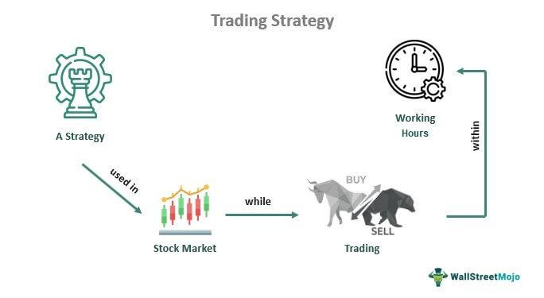

## Table of Contents

## What are the basic concepts of stock trading that beginners should understand?

Stock trading involves buying and selling shares of companies. When you buy a stock, you are essentially buying a small piece of that company. The goal is to buy stocks at a low price and sell them at a higher price to make a profit. However, the stock market can be unpredictable, and prices can go up or down based on many factors like company performance, economic news, and global events. It's important for beginners to understand that there is always a risk of losing money, so they should only invest what they can afford to lose.

Another key concept is diversification, which means spreading your investments across different stocks or types of investments. This can help reduce risk because if one stock performs poorly, others might do well and balance out your losses. Beginners should also learn about different types of orders, like market orders and limit orders. A market order buys or sells a stock at the current market price, while a limit order sets a specific price at which you want to buy or sell. Understanding these basics can help new traders make more informed decisions and navigate the stock market more effectively.

## How can beginners start learning about stock trading strategies?

Beginners can start learning about stock trading strategies by reading books and articles written for new investors. These resources often explain things in simple terms and can help you understand the basics of different strategies like day trading, swing trading, and long-term investing. Websites and blogs dedicated to stock trading are also great places to learn. They often have guides and tutorials that break down complex ideas into easy-to-understand pieces. You can also find online courses that teach stock trading strategies. These courses might be free or paid, but they can give you a structured way to learn at your own pace.

Another good way to learn is by using a stock market simulator. These are online tools that let you practice trading with fake money. This way, you can try out different strategies without risking real money. It's a safe way to see how the market works and how different strategies might perform. Joining online communities and forums can also be helpful. You can ask questions, share ideas, and learn from more experienced traders. Remember, it's important to be patient and keep learning because the stock market can be complicated, and there's always more to learn.

## What are the most common stock trading strategies for beginners?

One common strategy for beginners is called "buy and hold." This means you buy stocks and keep them for a long time, like years or even decades. The idea is to invest in good companies and let your money grow over time. This strategy is good for beginners because it doesn't need a lot of time to watch the market every day. You just need to pick good companies and be patient. Another strategy is "dollar-cost averaging." This means you invest a fixed amount of money at regular times, like every month. This can help you buy more shares when prices are low and fewer when prices are high, which can lower your average cost over time.

Another strategy beginners might use is "dividend investing." This means you buy stocks that pay dividends, which are regular payments to shareholders. You can use these dividends to buy more shares or just keep them as extra income. This strategy can be good if you want to earn money without selling your stocks. Lastly, "value investing" is a strategy where you look for stocks that you think are priced lower than they should be. You buy these stocks hoping their price will go up when other people realize their true value. This strategy needs some research to find good deals, but it can be rewarding if you pick the right stocks.

## What resources (books, courses, websites) are recommended for learning stock trading?

For beginners looking to learn about stock trading, there are many helpful [books](/wiki/algo-trading-books) available. "A Beginner's Guide to the Stock Market" by Matthew R. Kratter is a great start because it explains things in simple terms. Another good book is "The Intelligent Investor" by Benjamin Graham, which teaches about long-term investing and value investing. If you want to learn about trading strategies, "Trading for a Living" by Dr. Alexander Elder is very useful. These books can help you understand the basics and more advanced ideas about stock trading.

There are also many online resources and courses that can help you learn. Websites like Investopedia and The Motley Fool have lots of articles and guides that explain stock trading in easy-to-understand ways. For online courses, you can try "Stock Market Investing for Beginners" on Udemy or "Introduction to Stock Trading" on Coursera. These courses can give you a structured way to learn at your own pace. Also, using a stock market simulator like those on Investopedia or TradeStation can let you practice trading without risking real money. Joining online communities like Reddit's r/investing or r/stockmarket can also be helpful because you can ask questions and learn from other people's experiences.

## How important is it to understand market analysis when developing trading strategies?

Understanding market analysis is very important when you're developing trading strategies. Market analysis helps you figure out what's going on in the stock market and why stock prices are moving the way they are. There are two main types of market analysis: technical analysis and [fundamental analysis](/wiki/fundamental-analysis). Technical analysis looks at past price movements and patterns to predict future price changes. Fundamental analysis looks at a company's financial health, like its earnings and growth, to decide if its stock is a good buy. By using these types of analysis, you can make better decisions about which stocks to buy and when to buy or sell them.

Without understanding market analysis, you might make decisions based on guesses or feelings, which can be risky. For example, if you don't know how to read a company's financial statements, you might buy a stock that looks cheap but is actually a bad investment. Or, if you don't understand technical indicators, you might miss out on good opportunities to buy or sell. Learning about market analysis can help you create a trading strategy that's based on facts and data, which can increase your chances of making money in the stock market. It's like having a map when you're trying to find your way – it doesn't guarantee you'll reach your destination, but it sure helps a lot.

## What are the differences between short-term and long-term trading strategies?

Short-term trading strategies focus on making quick profits by buying and selling stocks in a short period, often within days or even hours. This type of trading, sometimes called [day trading](/wiki/day-trading-spy) or swing trading, requires a lot of time and attention because you need to watch the market closely. Short-term traders use technical analysis to look at price patterns and trends to decide when to buy and sell. The goal is to take advantage of small price movements, but it can be risky because the market can be unpredictable, and small mistakes can lead to big losses.

Long-term trading strategies, on the other hand, are about holding onto stocks for a longer time, like months or years. This approach, often called buy and hold or investing, is based on the belief that good companies will grow over time, and their stock prices will go up. Long-term traders use fundamental analysis to look at a company's financial health and future growth potential. This strategy requires less daily attention to the market but still needs research to pick the right stocks. The main advantage is that it can be less stressful and might lead to bigger gains over time, but it also means you have to be patient and wait for your investments to grow.

## How can one use technical analysis to improve their trading strategies?

Technical analysis can help you make better trading decisions by looking at past price movements and patterns. It's like trying to predict the weather by looking at old weather reports. You use charts and graphs to see how a stock's price has moved in the past. This can help you spot trends, like if a stock's price is going up, down, or staying the same. You can also use technical indicators, like moving averages or the Relative Strength Index (RSI), to help you decide when to buy or sell. For example, if a stock's price is above its moving average, it might be a good time to buy because it could keep going up.

By using technical analysis, you can create rules for your trading strategy. For instance, you might decide to buy a stock when its price breaks above a certain level or when an indicator gives a buy signal. This can help you be more disciplined and avoid making decisions based on emotions. It's important to remember that technical analysis isn't perfect and can't predict the future with 100% accuracy. But it can give you a better chance of making good trades by helping you understand what the market might do next.

## What role does fundamental analysis play in stock trading strategies?

Fundamental analysis is like looking under the hood of a car before you buy it. It helps you understand if a company is a good investment by looking at its financial health and future growth potential. You check things like the company's earnings, how much debt it has, and how fast it's growing. This can help you decide if a stock is priced right or if it's a bargain. For example, if a company is making a lot of money and growing quickly, its stock might be a good buy, even if it seems expensive at first.

Using fundamental analysis in your trading strategy can help you make smarter choices. Instead of just guessing or following the crowd, you can pick stocks based on solid information. This can be especially useful for long-term investing, where you want to hold onto stocks for years. By understanding a company's fundamentals, you can feel more confident that your investment will grow over time. It's like planting a tree – if you pick the right spot and take care of it, it can grow into something valuable.

## How can traders manage risk effectively when implementing different trading strategies?

Managing risk is a big part of trading. One way to do this is by setting stop-loss orders. A stop-loss order is like a safety net that automatically sells your stock if the price drops to a certain level. This can help you limit how much money you lose on a trade. Another way to manage risk is by not putting all your money into one stock. This is called diversification. By spreading your money across different stocks or types of investments, you can reduce the chance that one bad trade will wipe out all your money.

It's also important to only invest money you can afford to lose. Trading can be risky, and there's always a chance you could lose money. So, it's smart to only use money that you don't need for important things like bills or rent. Lastly, keeping a trading journal can help you learn from your mistakes and improve your strategies over time. By writing down what worked and what didn't, you can see patterns and make better decisions in the future.

## What advanced trading strategies should experienced traders consider?

Experienced traders might want to try out options trading. Options are like bets on whether a stock's price will go up or down. You can use options to make money if you think a stock will move a lot, even if you don't know which way it will go. This can be a good way to make money in different market conditions, but it's also more complicated and risky than just buying and selling stocks. You need to understand things like "calls" and "puts," and how to use them to make money. It's important to learn a lot about options before you start trading them.

Another advanced strategy is [algorithmic trading](/wiki/algorithmic-trading). This means using computer programs to buy and sell stocks automatically. These programs can look at a lot of data very quickly and make trades based on rules you set up. This can help you take advantage of small price changes that happen very fast. But, setting up these programs can be hard, and you need to know how to code and understand the market well. It's also important to keep an eye on your algorithms to make sure they're working right and not making big mistakes.

Lastly, experienced traders might use a strategy called "pairs trading." This involves finding two stocks that usually move together and betting on the difference between them. If one stock goes up more than the other, you might buy the one that went down and sell the one that went up, hoping they'll come back together. This can be a good way to make money even when the market is not moving a lot. But, it needs a lot of research to find the right pairs and understand how they move together.

## How can algorithmic trading be integrated into a trader's strategy?

Algorithmic trading can be a powerful tool for experienced traders. It involves using computer programs to automatically buy and sell stocks based on rules you set up. These rules can be based on things like price movements, technical indicators, or even news events. By using algorithms, you can take advantage of small price changes that happen very quickly, which can be hard to do if you're trading by hand. It's like having a robot that can watch the market all the time and make trades for you, even when you're not looking.

To integrate algorithmic trading into your strategy, you first need to learn how to code or work with someone who can. You'll need to create or use a program that can connect to the stock market and make trades. Then, you have to decide what rules you want your algorithm to follow. This could be simple, like buying a stock when its price goes above a certain level, or more complex, like using many different indicators to decide when to trade. Once your algorithm is set up, you need to keep an eye on it to make sure it's working right and not making big mistakes. It's important to test your algorithm with fake money first to see how it does before using real money.

## What are the latest trends and innovations in stock trading strategies for expert traders?

One of the latest trends in stock trading for expert traders is the use of [machine learning](/wiki/machine-learning) and [artificial intelligence](/wiki/ai-artificial-intelligence) (AI). These technologies can analyze huge amounts of data very quickly, finding patterns and making predictions that would be hard for a human to see. Expert traders are using AI to create more advanced trading algorithms that can learn from the market and improve over time. This can help them make better trading decisions and take advantage of opportunities that come and go in a flash. But, using AI in trading is still new, and it needs a lot of technical know-how to set up and use right.

Another innovation is the rise of social trading platforms. These platforms let traders copy the trades of other successful traders automatically. This can be a good way for expert traders to share their strategies and make money from others following them. It also lets them see what other traders are doing and learn from their successes and mistakes. Social trading can make the market more open and help traders work together. But, it's important to be careful and do your own research, because not all traders you can follow will be successful all the time.

## References & Further Reading

[1]: Graham, B. (1949). ["The Intelligent Investor."](https://www.amazon.com/Intelligent-Investor-Definitive-Value-Investing/dp/0060555661) Harper & Brothers.

[2]: Malkiel, B. G. (1973). ["A Random Walk Down Wall Street."](https://www.amazon.com/Random-Walk-Down-Wall-Street/dp/0393330338) W.W. Norton & Company.

[3]: Elder, A. (1993). ["Trading for a Living: Psychology, Trading Tactics, Money Management."](https://www.amazon.com/Trading-Living-Psychology-Tactics-Management/dp/0471592242) John Wiley & Sons.

[4]: Schwager, J. D. (1989). ["Market Wizards: Interviews with Top Traders."](https://www.amazon.com/Market-Wizards-Interviews-Top-Traders/dp/1118273044) John Wiley & Sons.

[5]: Lefèvre, E. (1923). ["Reminiscences of a Stock Operator."](https://www.amazon.com/Reminiscences-Stock-Operator-Edwin-Lef%C3%A8vre/dp/0471770884) George H. Doran Company.

[6]: ["Financial Markets"](https://www.coursera.org/learn/financial-markets-global) by Yale University on Coursera.

[7]: ["Stock Trading and Investing for Beginners 4-in-1 Course Bundle"](https://www.udemy.com/course/complete-stock-market-starter-toolkit-for-beginners/) on Udemy.

[8]: ["Become a Day Trader"](https://www.investopedia.com/articles/active-trading/051415/10-steps-becoming-day-trader.asp) on Investopedia Academy.

[9]: [Investopedia Simulator](https://www.investopedia.com/simulator/)

[10]: [TD Ameritrade's thinkorswim](https://www.schwab.com/td-ameritrade)

[11]: [Wall Street Survivor](https://www.wallstreetsurvivor.com/)

