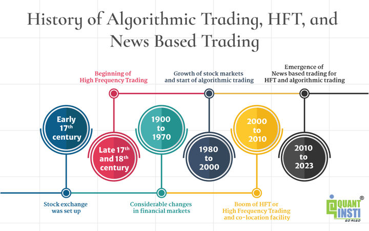

## Table of Contents

## What is algorithmic trading?

Algorithmic trading is a method of buying and selling financial assets using computer programs. These programs follow a set of rules, called algorithms, to make trading decisions automatically. Instead of a person deciding when to buy or sell, the computer does it based on the instructions in the algorithm. This can happen very quickly, often in fractions of a second, which is much faster than a human could trade.

People use algorithmic trading because it can be more efficient and less emotional than trading by hand. The algorithms can analyze a lot of data, like stock prices and news, to find the best times to trade. This can help traders make more money and reduce the risk of losing money. However, algorithmic trading can also be risky if the algorithms are not set up correctly or if the market behaves in unexpected ways.

## What are the basic components of an algorithmic trading system?

An algorithmic trading system has a few main parts that work together to make trades. The first part is the data feed, which gives the system information about the market, like stock prices and news. This data is really important because it helps the system decide when to buy or sell. The second part is the algorithm itself, which is like a set of instructions that the computer follows to make trading decisions. The algorithm looks at the data and decides if it's a good time to trade based on the rules it has.

The third part is the execution system, which actually makes the trades happen. Once the algorithm decides to buy or sell, the execution system sends the order to the market. It tries to do this as quickly and efficiently as possible. The last part is the risk management and monitoring system. This part keeps an eye on how the trades are doing and makes sure the system isn't taking too much risk. It can stop trading if things start to go wrong, which helps protect the trader's money.

## How does algorithmic trading differ from traditional trading?

Algorithmic trading and traditional trading are different in how they make decisions and [carry](/wiki/carry-trading) out trades. In traditional trading, a person looks at the market and decides when to buy or sell based on their own analysis and feelings. They might use charts, news, and their experience to make these decisions. It can take a while for them to decide and then place the order. On the other hand, [algorithmic trading](/wiki/algorithmic-trading) uses a computer program to make these decisions. The program follows a set of rules, called an algorithm, to decide when to trade. This can happen very quickly, often in just a few seconds, which is much faster than a human could do it.

Another big difference is how much data they can handle. Traditional traders can only look at so much information at once, and they might miss important details. Algorithmic trading systems can look at a lot of data all at once, like prices from many different markets, news articles, and even social media. This helps them find good trading opportunities that a person might not see. However, algorithmic trading can be risky if the algorithms are not set up right or if the market does something unexpected. Traditional trading might be slower, but it can be safer because a person can use their judgment to avoid big mistakes.

## When was the first recorded use of algorithmic trading?

The first recorded use of algorithmic trading happened in the 1970s. A group of researchers at the University of California, Irvine, created a computer program to trade stocks. They called it the "Systematic Trading Model." This was a big deal because it showed that computers could make trading decisions without people having to do it all the time.

This early use of algorithmic trading was simple compared to what we have now. The program used basic math to decide when to buy or sell stocks. It was not as fast or smart as today's systems, but it started the idea of using computers to trade. Over time, this idea grew and became a big part of how trading works today.

## What were the early forms of algorithmic trading?

The early forms of algorithmic trading started in the 1970s. A group of researchers at the University of California, Irvine, made a computer program called the "Systematic Trading Model." This program used simple math to decide when to buy or sell stocks. It was not as fast or smart as the systems we have now, but it was a big step because it showed that computers could make trading decisions without people having to do it all the time.

In the 1980s and 1990s, algorithmic trading started to grow. More people and companies began using computers to trade. They made programs that could look at more data and make better decisions. These early systems were still pretty simple compared to today's technology, but they helped show that algorithmic trading could work well and make money. Over time, these early forms of algorithmic trading led to the more advanced systems we use today.

## Who were the pioneers in the development of algorithmic trading?

The pioneers in the development of algorithmic trading were a group of researchers at the University of California, Irvine, in the 1970s. They created a computer program called the "Systematic Trading Model." This program used simple math to decide when to buy or sell stocks. It was a big step because it showed that computers could make trading decisions without people having to do it all the time. This early work laid the foundation for what would become a major part of the financial world.

In the 1980s and 1990s, more people and companies started to use computers for trading. One key figure was Thomas Peterffy, who founded [Interactive Brokers](/wiki/interactive-brokers-api). He developed early systems that could look at more data and make better trading decisions. These systems were still simple compared to today's technology, but they helped show that algorithmic trading could work well and make money. Over time, the work of these pioneers led to the advanced algorithmic trading systems we use today.

## What technological advancements facilitated the rise of algorithmic trading?

The rise of algorithmic trading was helped a lot by better computers and the internet. In the 1980s and 1990s, computers got faster and could handle more information. This meant they could look at lots of data quickly and make smart decisions about trading. The internet also made it easier for computers to get information from all over the world, like stock prices and news, in real time. This helped trading programs make better choices because they had more up-to-date information.

Another big help was the growth of electronic trading platforms. These platforms let computers send buy and sell orders to the market very quickly. Before, people had to call or use slow systems to trade, but electronic platforms made it almost instant. This speed was really important for algorithmic trading because it could make trades happen in just a few seconds. All these technological advancements together made algorithmic trading possible and helped it grow into a big part of the financial world.

## How did regulatory changes impact the growth of algorithmic trading?

Regulatory changes have played a big role in the growth of algorithmic trading. In the early 2000s, rules changed to make markets more open and fair. One big change was the introduction of Regulation National Market System (Reg NMS) in the United States. This rule made sure that everyone could see the best prices for stocks and trade at those prices. This helped algorithmic trading because computers could find and use the best prices quickly. It also made markets more competitive, which pushed more people to use algorithms to trade.

However, not all regulatory changes have been good for algorithmic trading. Some rules have tried to slow down or control how fast computers can trade. For example, after the "Flash Crash" in 2010, when the market dropped a lot in just a few minutes, regulators started to worry about the risks of fast trading. They made new rules to try to stop big, sudden drops in the market. These rules can make it harder for algorithmic trading to work as well as before. But overall, the growth of algorithmic trading has been helped a lot by rules that make markets more open and fair.

## What are some key milestones in the history of algorithmic trading?

The history of algorithmic trading started in the 1970s when researchers at the University of California, Irvine, made a computer program called the "Systematic Trading Model." This was a big deal because it showed that computers could make trading decisions without people having to do it all the time. The program used simple math to decide when to buy or sell stocks. In the 1980s and 1990s, more people and companies started using computers to trade. Thomas Peterffy, who founded Interactive Brokers, was a key figure in this time. He made early systems that could look at more data and make better trading decisions.

In the early 2000s, big changes in rules helped algorithmic trading grow even more. The introduction of Regulation National Market System (Reg NMS) in the United States made markets more open and fair. This helped computers find and use the best prices quickly. But not all changes were good for algorithmic trading. After the "Flash Crash" in 2010, when the market dropped a lot in just a few minutes, new rules were made to try to stop big, sudden drops. These rules can make it harder for algorithmic trading to work as well as before. Overall, the growth of algorithmic trading has been helped a lot by better computers, the internet, and rules that make markets more open and fair.

## How has the prevalence of algorithmic trading evolved over time?

The use of algorithmic trading has grown a lot since it started in the 1970s. At first, it was just a new idea tried by researchers at the University of California, Irvine. They made a computer program to trade stocks, which was a big deal because it showed that computers could make trading decisions without people having to do it all the time. In the 1980s and 1990s, more people and companies started using computers to trade. This was helped by better computers and the internet, which made it easier for computers to get information and make trades quickly.

By the early 2000s, algorithmic trading became a big part of the financial world. Rules like Regulation National Market System (Reg NMS) in the United States made markets more open and fair, which helped computers find and use the best prices quickly. But after the "Flash Crash" in 2010, when the market dropped a lot in just a few minutes, new rules were made to try to stop big, sudden drops. These rules can make it harder for algorithmic trading to work as well as before. Even with these challenges, algorithmic trading keeps growing and is now a big part of how trading happens today.

## What are the current trends in algorithmic trading?

Right now, one big trend in algorithmic trading is using [artificial intelligence](/wiki/ai-artificial-intelligence) (AI) and [machine learning](/wiki/machine-learning). These are smart computer programs that can learn from data and get better over time. Traders use them to find patterns in the market that are hard for people to see. This can help them make better trading decisions and make more money. Another trend is high-frequency trading, where computers make a lot of trades very quickly. This can be good because it can make money from small changes in prices, but it can also be risky if the market changes suddenly.

Another trend is using more data from different places, like social media and news. Traders use this data to understand what people are thinking and feeling about the market. This can help them predict what will happen next and make better trades. Also, more people are using cloud computing for algorithmic trading. This means they use the internet to access powerful computers that can handle a lot of data and make trades quickly. This can make algorithmic trading easier and cheaper for more people to use.

## What future developments might we expect in algorithmic trading?

In the future, we might see more use of artificial intelligence and machine learning in algorithmic trading. These smart programs will get even better at finding patterns in the market and making good trading decisions. They will be able to learn from more data and make trades based on what they learn. This could help traders make more money and take less risk. Also, we might see more use of quantum computing, which is a new type of computer that can solve hard problems much faster than regular computers. This could make algorithmic trading even quicker and more accurate.

Another thing that might happen is that more people will use algorithmic trading. Right now, it's mostly big companies and professional traders who use it, but in the future, it could be easier for regular people to use too. This could happen because of new technology like cloud computing, which makes it cheaper and easier to use powerful computers. Also, rules might change to make algorithmic trading safer and more fair for everyone. This could help more people use it without worrying about big risks.

## References & Further Reading

[1]: Kirilenko, A. A., Kyle, A. S., Samadi, M., & Tuzun, T. (2017). ["The Flash Crash: High-Frequency Trading in an Electronic Market"](https://www.jstor.org/stable/26652722). Review of Financial Studies, 30(11), 2221-2222.

[2]: European Securities and Markets Authority. (2018). ["MiFID II/MiFIR."](https://www.esma.europa.eu/policy-rules/mifid-ii-and-mifir)

[3]: U.S. Securities and Exchange Commission. (2012). ["Concept Release on Equity Market Structure."](https://www.sec.gov/rules/concept/2010/34-61358.pdf)

[4]: Lopez de Prado, M. (2018). ["Advances in Financial Machine Learning."](https://www.amazon.com/Advances-Financial-Machine-Learning-Marcos/dp/1119482089) John Wiley & Sons.

[5]: Chan, E. P. (2009). ["Quantitative Trading: How to Build Your Own Algorithmic Trading Business."](https://www.amazon.com/Quantitative-Trading-Build-Algorithmic-Business/dp/0470284889) John Wiley & Sons.

[6]: Jansen, S. (2020). ["Machine Learning for Algorithmic Trading."](https://www.amazon.com/Machine-Learning-Algorithmic-Trading-intelligence/dp/9918608013) Packt Publishing.

[7]: Aronson, D. R. (2007). ["Evidence-Based Technical Analysis: Applying the Scientific Method and Statistical Inference to Trading Signals."](https://www.wiley.com/en-gb/Evidence+Based+Technical+Analysis:+Applying+the+Scientific+Method+and+Statistical+Inference+to+Trading+Signals-p-9780470008744) John Wiley & Sons.