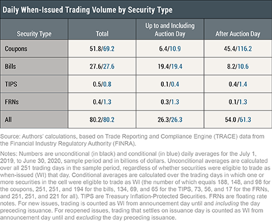

## Table of Contents

## What are When Issued (WI) securities?

When Issued (WI) securities are a type of financial instrument that is traded before they are officially issued. This means that investors can buy and sell these securities even before they exist in their final form. WI securities are often used for new stocks, bonds, or other financial products that are expected to be released soon. Trading in WI securities allows investors to take positions in these new securities early, which can be beneficial if they believe the price will change after the official issuance.

The process of trading WI securities involves some risk because the final terms of the security, like the interest rate for a bond, might not be known until the issuance date. This uncertainty can lead to price fluctuations in the WI market. However, WI trading also provides liquidity and allows the market to start pricing the new security based on available information. Once the securities are officially issued, the WI trades are settled, and the securities are delivered to the buyers in their final form.

## How do When Issued securities differ from regular securities?

When Issued (WI) securities are different from regular securities because you can trade them before they actually exist. With regular securities, you buy and sell them after they have been officially released. But with WI securities, you can start trading them even before they are fully created. This means you can buy or sell them based on what you think they will be worth when they finally come out.

Another difference is that WI securities come with more uncertainty. When you trade regular securities, you know exactly what you are getting because they are already issued. But with WI securities, the final details like the [interest rate](/wiki/interest-rate-trading-strategies) on a bond might not be set yet. This can make the price go up and down more than with regular securities. However, trading WI securities lets people start figuring out what the new security might be worth before it's officially released.

## What types of securities are typically traded as When Issued?

When Issued (WI) securities are often new stocks or bonds that companies or governments plan to release soon. For example, if a company is about to launch new shares, people can start trading those shares as WI securities before they officially exist. This helps investors get a head start on buying or selling these new securities.

Another common type of WI security is government bonds. When a government announces it will issue new bonds, traders can start buying and selling them as WI securities. This allows the market to start figuring out the value of these bonds before they are fully issued. It's a way for investors to take positions early and manage their investments based on what they think will happen when the bonds are officially released.

## What is the purpose of trading securities on a When Issued basis?

Trading securities on a When Issued basis lets investors buy and sell new stocks or bonds before they are officially released. This helps people get a head start on their investments. If someone thinks the price of a new security will go up after it's issued, they can buy it early and maybe make a profit. It's like getting in line before everyone else to buy something you think will be popular.

Another reason for trading When Issued securities is to help the market figure out what these new securities might be worth. Since the final details of the security might not be known yet, the price can change a lot. But by trading them early, the market can start to set a price based on what people think the security will be like. This can make the market more ready for when the security is officially released.

## How can investors participate in When Issued trading?

Investors can participate in When Issued trading by working with a broker or a financial institution that offers this type of trading. They need to tell their broker they want to buy or sell a security that is about to be released. The broker will then place the order in the When Issued market, where other investors are also trading these soon-to-be-released securities.

When investors decide to trade When Issued securities, they should know that there's more risk because the final details of the security might not be set yet. This means the price can change a lot before the security is officially released. But if investors think they know what the security will be worth, they can try to buy it early and maybe make a profit when it's finally issued.

## What are the risks associated with investing in When Issued securities?

Investing in When Issued securities can be risky because you're buying something that doesn't exist yet. The final details of the security, like the interest rate on a bond, might not be known until it's officially released. This means the price can change a lot before you get the security. If the final terms are different from what you expected, you might end up paying more than the security is worth.

Another risk is that the company or government issuing the security might decide not to release it at all. If that happens, you could lose your investment because there's no security to give you. Also, since When Issued securities are traded before they're fully created, there might not be as many people buying and selling them. This can make it harder to find someone to trade with and can make the price go up and down more than with regular securities.

## How is the pricing of When Issued securities determined?

The pricing of When Issued securities is based on what people think they will be worth when they are officially released. Since these securities don't exist yet, the price can change a lot. People look at the information they have about the new security, like the expected interest rate for a bond, and guess what it might be worth. If a lot of people want to buy the security, the price might go up. If not many people want it, the price might go down.

Another thing that affects the price is how much risk people think there is. If there's a chance the security might not be released at all, or if the final terms could be different from what people expect, the price can be more uncertain. The price also depends on how easy it is to buy and sell the security before it's issued. If there aren't many people trading, the price can move around a lot.

## What are the settlement procedures for When Issued securities?

When you trade When Issued securities, the settlement happens after the securities are officially released. This means you don't get the actual security right away. Instead, you wait until the security is issued, and then it's delivered to you. The exact date for this is usually set when the security is announced, so you know when to expect it.

Once the security is issued, the trades that happened in the When Issued market are settled. This means if you bought a security, you pay for it, and if you sold one, you get paid. The settlement process is similar to regular securities, but it happens a bit later because you have to wait for the security to be officially released. This can take a few days or even weeks, depending on the security.

## Can When Issued securities be short sold, and if so, how?

Yes, When Issued securities can be short sold. Short selling means you sell something you don't own yet, hoping to buy it back later at a lower price. With When Issued securities, you can do this before the security is officially released. You tell your broker you want to short sell the security, and they will handle the trade in the When Issued market. If you think the price of the security will go down after it's issued, you can make money by short selling it.

The process of short selling When Issued securities is a bit tricky because the security doesn't exist yet. You're betting on what the price will be when it's finally released. If the price goes down as you expected, you can buy the security at the lower price and give it to the person you sold it to earlier, making a profit. But if the price goes up, you'll lose money because you have to buy it at a higher price than you sold it for. So, short selling When Issued securities can be risky, but it's a way to try to make money if you think the price will drop.

## How do regulatory frameworks affect When Issued securities trading?

Regulatory frameworks play a big role in how When Issued securities are traded. They set rules that everyone has to follow to make sure the trading is fair and safe. For example, regulators might say who can trade these securities, how they can be traded, and what information has to be shared with investors. This helps keep the market honest and protects people from getting tricked or losing money because of bad information.

These rules can also affect how easy or hard it is to trade When Issued securities. If the rules are strict, it might be harder for people to start trading them, but it can also make the market more stable. On the other hand, if the rules are more relaxed, more people might be able to trade, but there could be more risk. So, the regulatory framework tries to balance making the market work well with keeping it safe for everyone involved.

## What historical events have significantly impacted the When Issued market?

One big event that changed the When Issued market was the financial crisis in 2008. During this time, a lot of people were worried about the economy, and this made the prices of When Issued securities go up and down a lot. Many investors were scared and didn't want to take risks, so they stopped trading these securities. This made it harder for the When Issued market to work well because there were fewer people buying and selling.

Another important event was the introduction of new rules by the U.S. Securities and Exchange Commission (SEC) in the early 2000s. These rules were made to make the When Issued market safer and more fair. They said that companies had to share more information about new securities before they were issued. This helped investors make better choices and made the market more stable. But it also made it a bit harder for some people to trade When Issued securities because they had to follow more rules.

## What advanced strategies can be employed by expert traders in the When Issued market?

Expert traders in the When Issued market often use a strategy called [arbitrage](/wiki/arbitrage). This means they buy and sell the same security in different markets to make a profit from the price difference. For example, if a When Issued security is cheaper in one market than another, they can buy it in the cheaper market and sell it in the more expensive one. This can be tricky because the prices can change quickly, but it can also be very profitable if done right.

Another strategy is called hedging. This is when traders use When Issued securities to protect themselves from losing money on other investments. For example, if a trader thinks the price of a bond they own will go down, they might short sell a When Issued bond that's similar. If the price does go down, the profit from the short sale can help cover the loss on the bond they own. Hedging can make trading safer, but it also means the trader might not make as much money if the prices go up instead of down.

## References & Further Reading

[1]: ["Securities Finance: Securities Lending and Repo"](https://www.icmagroup.org/market-practice-and-regulatory-policy/repo-and-collateral-markets/icma-ercc-publications/frequently-asked-questions-on-repo/13-what-is-the-difference-between-repo-and-securities-lending/) by Frank J. Fabozzi and Steven V. Mann

[2]: Mishkin, F. S. (2021). ["The Economics of Money, Banking, and Financial Markets"](https://elibrary.pearson.de/book/99.150005/9781292409566) (Global Edition). Pearson.

[3]: Aldridge, I. (2013). ["High-Frequency Trading: A Practical Guide to Algorithmic Strategies and Trading Systems"](https://www.amazon.com/High-Frequency-Trading-Practical-Algorithmic-Strategies/dp/1118343506) (2nd Edition). Wiley.

[4]: SEC Office of Investor Education and Advocacy. (2017). ["When-Issued Trading"](https://www.sec.gov/about/divisions-offices/office-investor-education-advocacy). U.S. Securities and Exchange Commission.

[5]: Vaananen, L. (2015). ["Understanding the Professional Buyers of U.S. Treasury Securities in the When-Issued Market."](https://quizlet.com/698858014/ch-6-interest-rates-fin-370-flash-cards/) Federal Reserve Bank of New York Economic Policy Review, 21(2).

[6]: Hasbrouck, J., & Saar, G. (2013). ["Low-Latency Trading."](https://www.sciencedirect.com/science/article/abs/pii/S1386418113000165) Financial Analysts Journal, 69(2), 70-93.

[7]: SEC. (2014). ["Regulation Systems Compliance and Integrity (Reg SCI)"](https://www.sec.gov/rules-regulations/2015/12/regulation-systems-compliance-integrity). U.S. Securities and Exchange Commission.