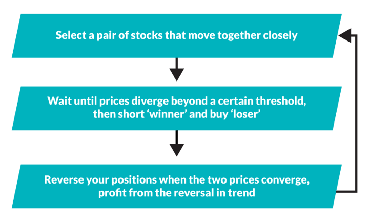

Statistical arbitrage, commonly referred to as stat arb, represents a sophisticated and systematic approach to exploiting financial market inefficiencies through algorithmic trading. Emerging in the late 20th century, this strategy gained prominence due to its ability to capitalize on short-term discrepancies in asset prices across various instruments. Stat arb involves using quantitative models to identify and trade on these discrepancies, aiming for a market-neutral stance. This methodology relies heavily on computational power, mathematical models, and historical data analysis to predict and execute trades with high precision.

Historically, stat arb has played a significant role in shaping financial markets by providing liquidity and contributing to market efficiency. The strategy was particularly lucrative during its early years when markets were less saturated and inefficiencies were more prevalent. Institutional investors, hedge funds, and proprietary trading firms were among the first to adopt statistical arbitrage, leveraging its potential for high-frequency trading profits without significant directional market exposure.



Despite its historical success, recent years have posed challenges for statistical arbitrage practitioners. One major concern has been the diminishing profit margins in stat arb strategies. Several factors contribute to this decline, including enhanced market efficiency driven by technological advancements, increased participation of sophisticated market players, and the rapid dissemination of information reducing the window of opportunity for exploiting inefficiencies. The competitive landscape has further intensified with new entrants equipped with advanced high-frequency trading tools, leading to a saturation of traditional stat arb opportunities.

This article aims to explore the dynamics behind the waning profits of statistical arbitrage in algorithmic trading. By examining the historical trajectory, current market conditions, and technological innovations, we will provide insight into why stat arb profits have been eroded and suggest pathways for adapting to the evolving financial environment. The goal is to understand the underlying market transformations and identify potential avenues for sustaining profitability in a challenging and rapidly changing landscape.

## Table of Contents

## Understanding Statistical Arbitrage

Statistical [arbitrage](/wiki/arbitrage), often abbreviated as stat arb, is a sophisticated trading strategy used in the financial markets to exploit price discrepancies between related financial instruments. Unlike traditional arbitrage which aims to capitalize on price differences in identical instruments across different markets, [statistical arbitrage](/wiki/statistical-arbitrage) leverages mathematical models and statistical techniques to identify and profit from relative value mispricings. 

At its core, statistical arbitrage relies on a mean-reversion principle, which posits that deviations in pricing relationships between assets will eventually return to their historical norms. Traders using stat arb execute trades based on the expectation that these temporary divergences will correct over time.

### Key Strategies within Statistical Arbitrage

#### Pairs Trading
Pairs trading is one of the most recognized stat arb strategies. It involves selecting two stocks or assets that historically move together and trading them against each other. When the price of one stock deviates significantly from its historical correlation with the other, traders sell the overpriced security and buy the underpriced one, betting that the spread will converge. For example, if Stock A and Stock B are typically highly correlated but their correlation diverges, a pairs trade may involve shorting Stock A and buying Stock B, or vice versa. The profitability of this strategy depends on accurately predicting the convergence of the asset pair.

Mathematically, assume $P_A$ and $P_B$ are the prices of stocks A and B, respectively. The spread $S$ is defined as:
$$
S = P_A - \beta \times P_B
$$
where $\beta$ is the hedge ratio estimated through historical data. Trading signals are generated based on the behavior of $S$.

#### Market-Neutral Strategies
Market-neutral strategies aim to profit from both rising and falling markets by neutralizing market exposure. This approach helps isolate the alpha, or excess return, from specific strategies without being affected by broader market movements. Two common forms of market-neutral strategies are long/short equity and convertible bond arbitrage. 

For example, within long/short equity, a trader would take a long position in undervalued securities while simultaneously short-selling overvalued ones, attempting to create a portfolio that remains neutral to market movements.

#### Cross-Market Arbitrage
Cross-market arbitrage involves trading across different asset classes or markets to exploit inefficiencies. This strategy can involve trading between equities and their derivatives, such as options or futures, or between different asset classes entirely, such as bonds and stocks. The inefficiencies typically arise from differing speeds of information dissemination across markets.

### Examples of Statistical Arbitrage Operations

In different market conditions, statistical arbitrage can manifest uniquely:

- **Volatile Markets**: During high market volatility, pricing inefficiencies are more pronounced. Stat arb strategies that can quickly adapt to rapidly changing correlations between assets can capture significant profits. High-frequency trading systems may be used in such environments to capitalize on fleeting opportunities. 

- **Stable Markets**: In periods of low volatility, mean reversion strategies may perform better as temporary inefficiencies are less likely to be disrupted by sudden market movements. For instance, pairs trading based on long-term historical correlations is more applicable in stable market conditions.

- **Event-Driven Markets**: Events such as mergers, earnings reports, or macroeconomic announcements can result in short-term price inefficiencies. Event-driven stat arb strategies focus on the price impact of these events and anticipate the subsequent reversion to mean values.

In conclusion, statistical arbitrage is an inherently dynamic and complex strategy requiring sophisticated models and in-depth analysis. Its effectiveness is contingent not only on the soundness of the statistical models employed but also on the trader’s ability to rapidly adapt to changing market conditions. As with all trading strategies, stat arb involves risks, and its success is not guaranteed across all market scenarios.

## The Rise and Fall of Stat Arb Profits

Statistical arbitrage (stat arb) has been a cornerstone of [algorithmic trading](/wiki/algorithmic-trading) since its inception, offering traders significant profit margins through quantitative strategies that exploit price inefficiencies. The impressive initial profitability of stat arb was primarily driven by a combination of underexplored correlations among financial instruments and advancements in computing power that allowed for complex data analysis. Early adopters capitalized on the discrepancies between statistical expectations and market reality, effectively employing methods such as pairs trading and market-neutral strategies to generate returns. These strategies were particularly effective in the 1980s and 1990s when financial data was less accessible, and competition in algorithmic trading was minimal.

Initially, the profitability of stat arb can be attributed to several key factors. First, the inefficiencies present in less liquid or emerging markets provided ample opportunities for arbitrage. Markets were less efficient due to slower information dissemination and reaction times among traders, enabling stat arb practitioners to exploit temporary mispricings. Second, the technological advancements in computing and data processing powered the early days of stat arb. Traders could now harness greater processing power and storage capacity to analyze large datasets and deploy sophisticated models, such as linear regression and time-series analysis, to predict price movements accurately.

However, the landscape of stat arb began to change as financial markets evolved and trading technology advanced. One major shift was the widespread adoption of electronic trading platforms, which increased market efficiency and reduced the latency traders could exploit. The proliferation of high-frequency trading ([HFT](/wiki/high-frequency-trading-strategies)) and improvements in execution algorithms allowed for near-instantaneous trades, significantly limiting the window of opportunity for traditional stat arb strategies.

Moreover, increased competition in the financial markets has been a critical [factor](/wiki/factor-investing) in diminishing stat arb profits. As stat arb strategies gained notoriety, more traders and firms adopted similar approaches, leading to an overcrowding effect where too many participants targeted the same inefficiencies. This saturation resulted in a rapid correction of price discrepancies, leaving only minimal profits available for exploitation. The influx of new entrants intensified this competition, as firms continuously sought to develop novel strategies to gain an edge over their peers.

Market efficiency has also played a significant role in the decline of stat arb profitability. As markets incorporate new information more swiftly and accurately, the assumption of statistical arbitrage—namely, that prices will revert to a historical mean—becomes less reliable. This increased efficiency is partly due to better regulatory oversight and standardized disclosure requirements, ensuring that all market participants have access to the same high-quality information.

In summary, the initial high profitability of statistical arbitrage stemmed from exploiting under-optimized market inefficiencies with advanced computational tools. Over time, changes in market structure, the rise of electronic and high-frequency trading, increased competition, and improved market efficiency have all contributed to a noticeable decline in stat arb profits. As these trends continue, traders must constantly innovate and adapt their strategies to sustain profitability in this highly dynamic environment.

## Market Factors Affecting Stat Arb Profitability

Statistical arbitrage (stat arb) has historically been a lucrative strategy in algorithmic trading; however, various market factors have increasingly challenged its profitability. 

### Impact of Regulatory Changes and Financial Innovations

Regulatory changes have significantly affected the operation and profitability of statistical arbitrage. Post-2008 financial regulations, such as the Dodd-Frank Act in the U.S., increased transparency and reduced the leverage that firms could apply, potentially curbing profits derived from high risk. These regulations have altered the landscape in which stat arb strategies operate, making it costlier and more challenging to exploit inefficiencies. Similarly, financial innovations have both facilitated and eroded stat arb strategies. The introduction of complex financial instruments and derivatives often results in new arbitrage opportunities; however, they also demand a higher level of sophistication and risk management, often leading to a compression of arbitrage spreads.

### The Role of High-Frequency Trading and Automation

High-frequency trading (HFT) and advanced automation play a crucial role in saturating stat arb opportunities. The acceleration of trading speeds, combined with improved algorithmic capabilities, has increased market efficiency, leaving less room for traditional stat arb approaches. High-frequency traders, using sophisticated algorithms, can exploit market discrepancies and inefficiencies faster than traditional stat arb models. As an example, algorithms can automatically execute trades in milliseconds, often neutralizing price discrepancies before traditional stat arb strategies can capitalize on them. This speed advantage, combined with substantial data analytics, allows HFT firms to continuously scan and react to market conditions, effectively reducing the profit margins available to slower competitors.

### Economic Cycles and Market Volatility

Economic cycles and market [volatility](/wiki/volatility-trading-strategies) play significant roles in determining the effectiveness of statistical arbitrage strategies. During periods of high market volatility, statistical relationships between asset prices may break down, increasing the risk for stat arb strategies that rely on historical correlations. Conversely, low volatility and stable markets may not offer sufficient price dispersions for profitable arbitrage opportunities. The 2008 financial crisis is a case in point, where extreme volatility disrupted many classical stat arb models, causing devastating losses for some firms. Economic downturns can also lead to changes in market participant behavior, [liquidity](/wiki/liquidity-risk-premium) levels, and risk appetite, further influencing the feasibility and attractiveness of stat arb strategies.

In conclusion, while statistical arbitrage remains an integral component of algorithmic trading, its profitability is significantly affected by regulatory changes, financial innovation, HFT competition, and market conditions. Continuous adaptation and innovation are essential for traders seeking to maintain the viability of stat arb approaches in the evolving financial market landscape.

## Technological and Analytical Challenges

Statistical arbitrage (stat arb) trading strategies have faced numerous technological and analytical challenges that impact their competitiveness. The evolution of technology in trading has introduced both opportunities and obstacles for participants in the market.

**Technological Advancements**

The advancement of computing technology has significantly enhanced the competitiveness of stat arb. High-performance computing (HPC) allows traders to process vast datasets more quickly than ever before. Parallel computing frameworks, such as Apache Hadoop and Apache Spark, enable the manipulation and analysis of large datasets at unprecedented speeds. Moreover, the rise of quantum computing presents the potential for exponential improvements in computational power, although its practical application in trading is still exploratory.

Automation and algorithmic precision through [machine learning](/wiki/machine-learning) (ML) models have further reshaped the landscape. Machine learning allows for the dynamic adaptation of models based on real-time data inputs, improving the response time and operational efficiency. Techniques such as [reinforcement learning](/wiki/reinforcement-learning) can be used to refine trading strategies based on past market data and simulated scenarios, contributing to adaptive stat arb strategies.

```python
# Example of a simple linear regression model using Python's sklearn library
from sklearn.linear_model import LinearRegression
import numpy as np

# Simulated price data for two assets
price_a = np.array([100, 102, 105, 107])
price_b = np.array([101, 103, 106, 110])

# Reshape and fit the model
X = price_a.reshape(-1, 1)
y = price_b

model = LinearRegression().fit(X, y)
predicted_price_b = model.predict(X)
```

**Sophisticated Analytical Techniques**

Sophisticated analytical techniques are crucial for maintaining a competitive edge in stat arb. The deployment of advanced statistical methods, such as co-integration and principal component analysis (PCA), helps identify non-obvious relationships between trading instruments. These methods can enhance the robustness of stat arb models by capturing complex dependencies that simple correlations might overlook.

The integration of [artificial intelligence](/wiki/ai-artificial-intelligence) (AI) and [deep learning](/wiki/deep-learning) models has also emerged as a vital aspect of modern trading strategies. Convolutional neural networks (CNNs) and recurrent neural networks (RNNs) can process time-series data to uncover intricate market patterns and trends. This allows traders to develop predictive models capable of forecasting price movements with higher accuracy.

**Challenges with Data Accuracy and Model Reliability**

Despite these advancements, data accuracy and model reliability remain persistent challenges. The quality and granularity of financial data can significantly affect model outcomes. Inaccurate data inputs, stemming from latency issues, erroneous feeds, or incomplete datasets, may lead to flawed analysis and poor trading decisions. The reliance on third-party data providers further complicates the matter, as discrepancies between vendors might arise.

Model reliability is also hampered by overfitting, where models excel on historical datasets but fail in future scenarios due to the lack of genuine robustness. Continuous validation, [backtesting](/wiki/backtesting), and stress-testing under various market conditions are essential to mitigate this risk and ensure that trading models are adaptive to structural market shifts.

In conclusion, while technological advancements and sophisticated analytical techniques have enhanced stat arb's competitiveness, they also necessitate careful management of data and models. Ensuring data accuracy and building resilient models are critical for sustaining profitable stat arb strategies in a competitive market.

## Adapting to the New Environment

Adapting traditional statistical arbitrage (stat arb) models to contemporary market conditions requires a multifaceted approach, emphasizing flexibility, technological integration, and strategic diversification. The evolving landscape of financial markets presents both challenges and opportunities for stat arb practitioners seeking to sustain profitability.

**Strategies for Adapting Traditional Stat Arb Models**  
To remain competitive, traders must update their models to accommodate new market realities. This includes incorporating advanced machine learning techniques and big data analytics to enhance predictive accuracy. Machine learning algorithms such as Random Forests, Support Vector Machines, or Deep Learning can be used to capture complex, non-linear relationships between asset prices. Python libraries like scikit-learn or TensorFlow provide robust tools for deploying such models. An example Python snippet for a simple Random Forest model might look like this:

```python
from sklearn.ensemble import RandomForestRegressor

# Assuming X_train and y_train are pre-defined datasets
model = RandomForestRegressor(n_estimators=100)
model.fit(X_train, y_train)

# Predictions
predictions = model.predict(X_test)
```

Additionally, the integration of [alternative data](/wiki/best-alternative-data) sources, such as social media sentiment, satellite imagery, or web traffic metrics, can uncover new arbitrage signals. These data sources help identify inefficiencies or trends not immediately apparent through traditional financial metrics, thereby maintaining a strategic edge.

**Exploration of New Markets and Instruments**  
As traditional equity markets become increasingly efficient, exploring markets with less liquidity and competition can provide fresh stat arb opportunities. This includes emerging markets, commodity markets, or even [cryptocurrency](/wiki/cryptocurrency) exchanges where inefficiencies are more pronounced. Cryptocurrencies, for example, can present significant arbitrage opportunities due to their volatility and fragmented exchange landscape. Developing cross-exchange arbitrage strategies or currency [pair trading](/wiki/pair-trading) mechanisms can capitalize on these inefficiencies.

Derivative instruments also offer potential for stat arb strategies. Options, futures, and swaps can be included to create more nuanced, delta-neutral strategies that potentially thrive under different market conditions. By hedging against a basket of derivatives, traders can mitigate risk while capturing pricing anomalies.

**Importance of Continuous Learning and Innovation**  
The financial markets' dynamic nature mandates a culture of continuous learning and innovation. Practitioners should regularly update their knowledge of market conditions, regulatory changes, and technological advancements. Networking with industry peers, participating in relevant forums, webinars, or conferences, and staying abreast of academic research contribute to a deeper understanding of emerging trends and technique evolution.

Moreover, maintaining a robust research and development function within trading firms inspires sustainable innovation. Backtesting new strategies under various historical market conditions ensures resilience and adaptability. This approach is complemented by ongoing strategy evaluations, confirming that even those which have been successful maintain their edge in changing environments.

In summary, adapting to new market environments in statistical arbitrage hinges on technological advancement, market diversification, and a commitment to learning and innovation. By leveraging these strategies, traders can better navigate the complexities of modern financial markets, seeking to rediscover and sustain arbitrage profitability.

## Case Studies and Real-world Examples

Statistical arbitrage (stat arb) strategies have undergone significant evolution, mirroring the broader changes in financial markets. This section provides case studies highlighting both successful adaptations and notable failures of stat arb strategies, offering insights into the practical challenges and innovations within this domain.

### Case Study 1: Long-Term Capital Management (LTCM)

Long-Term Capital Management, a renowned [hedge fund](/wiki/hedge-fund-trading-strategies) in the 1990s, provides a classic example of stat arb failure. Founded by former Salomon Brothers traders and Nobel laureates, LTCM employed complex quantitative models to exploit minute inefficiencies in bond markets. Initially, their strategies generated substantial returns, but in 1998, a combination of excessive leverage and a global financial crisis led to its downfall. The primary lesson from LTCM's failure is the inherent risk of over-leveraging and the critical impact of rare, extreme market events on statistical models that assume normal market conditions.

### Case Study 2: Renaissance Technologies

In contrast, Renaissance Technologies, particularly its flagship Medallion Fund, exemplifies successful stat arb implementation. Employing a team of scientists and mathematicians, Renaissance utilizes advanced algorithms to conduct stat arb across various asset classes. Their success is attributed to rigorous data analysis, continuous model refinement, and incorporating higher-dimensional data inputs, setting industry standards for effective stat arb.

### Lessons from Struggles: The Hedge Fund Collapse

Several hedge funds, particularly during the late 2000s financial downturn, struggled with their stat arb strategies, witnessing diminished returns and fund closures. One key lesson from these failures is the danger of relying solely on historical data without accounting for structural market changes. As markets evolve, strategies that lack adaptability tend to underperform or fail completely.

### Adaptations: The Sophisticated Use of Machine Learning

In recent years, some funds have successfully adapted their stat arb strategies by integrating machine learning to enhance predictive accuracy and adapt to dynamic market conditions. Machine learning models, such as neural networks and random forests, have been employed to identify complex patterns and relationships that traditional stat arb models might miss. These advanced strategies illustrate the importance of technological adaptability in modern stat arb.

### Successful Innovation: The Use of Alternative Data

Firms such as Two Sigma have leveraged alternative data sources, including satellite imagery and web data, to gain novel insights and competitive advantages in stat arb. By integrating unconventional data into their analytical frameworks, these firms have been able to capture new opportunities that traditional approaches might overlook. This strategic innovation underscores the expanding scope of resource utilization for sustainable profits.

In summary, the evolution of statistical arbitrage reflects a balance between leveraging sophisticated mathematical models and adapting to ongoing market developments. By learning from past mistakes and embracing technology-driven innovations, firms can enhance their ability to maintain or even increase profitability in statistical arbitrage.

## Conclusion

Statistical arbitrage (stat arb) has experienced a pronounced decline in profitability over recent years. Key factors contributing to this trend include increased market efficiency, which has reduced pricing anomalies that stat arb traditionally exploits. With the proliferation of advanced trading technologies and algorithms, the competition has intensified, driving down the profit margins that were once achievable. Moreover, regulatory changes and innovations in financial markets have also posed challenges, often limiting the strategies that can be employed within stat arb.

Looking ahead, the future of stat arb in algorithmic trading depends on the ability to adapt to these evolving conditions. The continuous integration of cutting-edge technologies, such as machine learning and artificial intelligence, could offer pathways to revive profitability. These technologies might unveil new patterns or anomalies that are not apparent with traditional methods. Additionally, exploring underserved markets or emerging financial instruments could present new opportunities for stat arb strategies.

In conclusion, while the traditional profitability of statistical arbitrage has diminished, there remains potential for resurgence with innovation and adaptation. Firms that invest in research and development to enhance their analytical capabilities and remain agile in response to market changes may sustain and even enhance their stat arb profitability. As the landscape of algorithmic trading continues to evolve, so too must the strategies employed to harness its opportunities.

## References and Further Reading

1. **Books:**
   - **"Quantitative Trading: How to Build Your Own Algorithmic Trading Business" by Ernest Chan** - This book provides fundamental insights into building and implementing algorithmic trading strategies, including statistical arbitrage strategies.
   - **"Algorithmic Trading and DMA: An Introduction to Direct Access Trading Strategies" by Barry Johnson** - This comprehensive guide covers a range of algorithmic trading strategies and includes discussions on the principles of statistical arbitrage.
   - **"Statistical Arbitrage: Algorithmic Trading Insights and Techniques" by Andrew Pole** - This in-depth book focuses specifically on statistical arbitrage, offering detailed techniques and insights into its practical application.

2. **Articles:**
   - Harvey, C. R., & Liu, Y. (2021). "Decreasing Risk Premia and the Unprofitability of Pairs Trading: Evidence from the Market" – This article explores changes in market conditions and their impact on historical statistical arbitrage strategies, particularly pairs trading.
   - Gatev, E. G., Goetzmann, W. N., & Rouwenhorst, K. G. (2006). "Pairs Trading: Performance of a Relative Value Arbitrage Rule" – A seminal paper in the field of statistical arbitrage, presenting empirical analysis on the effectiveness of pairs trading.

3. **Blogs and Online Discussions:**
   - **Quantitative Finance Stack Exchange** - A community-driven platform where practitioners discuss a wide range of quantitative finance topics, including statistical arbitrage techniques and market dynamics.
   - **QuantStart Blog** - Focused on quantitative finance and trading, this blog offers practical coding tutorials in Python for algorithmic traders, including posts on statistical arbitrage.
   - **Alpha Architect Blog** - Offers insights into the latest quantitative investment strategies, with periodic discussions on the effectiveness and evolution of statistical arbitrage.

4. **Research Papers:**
   - Avellaneda, M., & Lee, J. H. (2008). "Statistical Arbitrage in the U.S. Equities Market" – This paper presents a detailed examination of statistical arbitrage in equities, providing readers with complex models and empirical findings.
   - Bowen, D. A., Hutchinson, M. C., & O'Sullivan, N. (2010). "High Frequency Equity Pairs Trading: Transaction Costs, Speed of Execution and Patterns in Returns" – Investigates high-frequency trading aspects of pairs trading, shedding light on execution challenges and profit patterns.

5. **Further Reading:**
   - **"Introduction to Statistical Arbitrage"** by the Quantitative Research Group (QR) – Palgrave Macmillan offers concise reading material for anyone new to statistical arbitrage.
   - **Tactical Asset Allocation: Trading Markets like a Hedge Fund** by Michael Dever – While broader in focus, this book discusses various hedge fund strategies, including statistical arbitrage.

These resources will provide a more profound understanding of statistical arbitrage, helping readers navigate both the theoretical and practical aspects of the field.

## References & Further Reading

[1]: Avellaneda, M., & Lee, J. H. (2008). ["Statistical Arbitrage in the U.S. Equities Market."](https://papers.ssrn.com/sol3/papers.cfm?abstract_id=1153505) Quantitative Finance. 

[2]: Gatev, E. G., Goetzmann, W. N., & Rouwenhorst, K. G. (2006). ["Pairs Trading: Performance of a Relative Value Arbitrage Rule."](https://www.nber.org/papers/w7032) The Review of Financial Studies, 19(3), 797-827.

[3]: Chan, E. P. (2009). ["Quantitative Trading: How to Build Your Own Algorithmic Trading Business."](https://github.com/ftvision/quant_trading_echan_book) Wiley.

[4]: Pole, A. (2007). ["Statistical Arbitrage: Algorithmic Trading Insights and Techniques."](https://books.google.com/books/about/Statistical_Arbitrage.html?id=xSjXTnKqIKoC) Wiley.

[5]: Wilcox, C., & Crittenden, T. (2008). ["The Guide to Consistent Risk."](https://onlinelibrary.wiley.com/doi/10.1002/car.2380) Wiley.

[6]: Harvey, C. R., & Liu, Y. (2021). ["Decreasing Risk Premia and the Unprofitability of Pairs Trading: Evidence from the Market."](https://people.duke.edu/~charvey/Research/Published_Papers/P146_Lucky_factors.pdf)