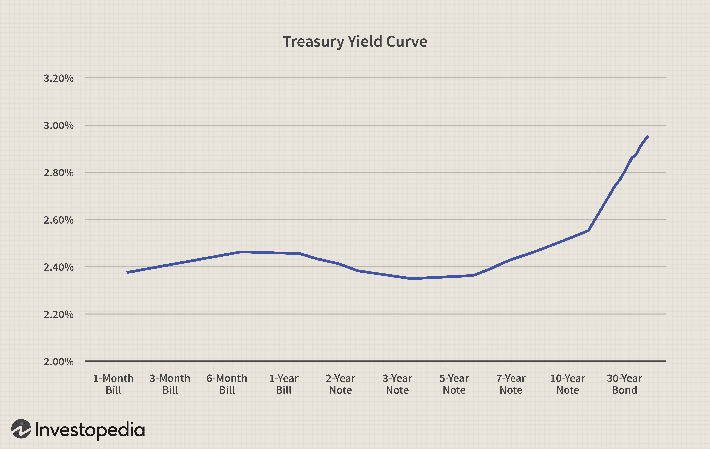

In an evolving financial landscape, bonds have emerged as a vital component of a diversified investment portfolio. These financial instruments provide a more stable and predictable return compared to the volatile nature of stocks, making them an attractive option for risk-averse investors. Bonds are essentially loans made by investors to borrowers, typically corporations or governments. This article explores the intricacies of buying bonds by focusing on government bonds, the fundamentals of bond investing, and the innovative developments in algorithmic trading within the bond market.

Government bonds, such as U.S. Treasury bonds and municipal bonds, serve as a safe haven for investors seeking security and tax advantages. These instruments are debt securities issued by a government to support public spending and obligations, offering unique benefits like tax exemptions. Understanding the different types of government bonds and their respective advantages is essential for making informed investment decisions.



Algorithmic trading has brought a modern twist to the traditional bond market. By leveraging computer algorithms to execute trades at optimal speeds and frequencies, algorithmic trading has transformed the market, enhancing liquidity and market efficiency. This technological advancement has opened up new opportunities for investors, enabling them to implement advanced strategies and optimize their bond investment portfolios.

As we examine the elements of bond investing, it becomes clear that a thorough understanding of the various strategies and tools available can significantly impact an investor's financial goals. The integration of traditional finance and cutting-edge technology in the bond market highlights the dynamic nature of today's investment environment. Understanding these elements provides a comprehensive framework for navigating contemporary bond investment strategies.

## Table of Contents

## Understanding Bonds: A Financial Staple

Bonds are financial instruments that represent a loan between an investor and a borrower, which is typically a corporation or government entity. As a fixed-income investment, bonds promise to return the principal amount invested along with periodic interest payments. This predictable income stream makes bonds an appealing option for those seeking stability and lower risk within their investment portfolios.

### The Nature of Bonds

At their core, bonds are straightforward: the investor lends money to the borrower for a predetermined period, known as the bond's term or maturity. During this period, the borrower pays interest, often referred to as the coupon, to the investor. Upon reaching maturity, the borrower repays the bond's face value to the investor.

The formula to calculate the price of a bond is essential in understanding its valuation and is given as:

$$
P = \sum_{t=1}^{T} \frac{C}{(1 + r)^t} + \frac{F}{(1 + r)^T}
$$

where:
- $P$ is the bond's price,
- $C$ represents the coupon payment,
- $r$ is the discount rate or yield,
- $F$ is the face value of the bond,
- $T$ is the number of periods to maturity.

### Types of Bonds

There are various types of bonds, each catering to different investor needs and risk profiles:

1. **Government Bonds**: Issued by national governments, these typically offer lower yields due to their reduced default risk. Examples include U.S. Treasury bonds, which are considered one of the safest investments due to the backing of the U.S. government.

2. **Corporate Bonds**: These are issued by companies to raise capital. They usually offer higher yields compared to government bonds, commensurate with the increased risk of default.

3. **Municipal Bonds**: Issued by state or local governments, these bonds often provide tax advantages to investors, such as tax-free interest income, making them attractive for individuals in higher tax brackets.

4. **Zero-Coupon Bonds**: Unlike traditional bonds, these do not pay periodic interest. Instead, they are sold at a discount and provide a return at maturity when the full face value is repaid.

### Safety and Stability in Bond Investments

Bonds are generally considered safer than stocks, primarily due to their place in the capital structure of a company. In the event of bankruptcy, bondholders are prioritized over equity holders, thus safeguarding their investments to a greater extent. This seniority, coupled with bonds' fixed-income nature, offers predictability that appeals to risk-averse investors.

Moreover, the performance of bonds is typically less volatile than that of equities, providing a buffer against market fluctuations. This stability makes them a crucial component of diversified investment portfolios, serving as a hedge against economic uncertainty.

In conclusion, understanding the fundamental characteristics and varieties of bonds enables investors to make informed investment decisions, aligning their strategies with their financial goals and risk tolerance. As investors seek stability and consistent returns, bonds remain a cornerstone of prudent financial planning.

## Government Bonds: A Safe Haven

Government bonds are debt securities issued by a government to finance its spending and meet financial obligations. These bonds are considered low-risk investments as they are backed by the government's credit and tax powers. Among the various types of government bonds, U.S. Treasury bonds and municipal bonds are particularly popular. Each offers unique advantages, including financial security and tax benefits.

U.S. Treasury bonds are long-term securities issued by the Department of the Treasury to finance the national debt. These bonds are available with maturities ranging from 20 to 30 years, offering a fixed [interest rate](/wiki/interest-rate-trading-strategies) paid semi-annually until maturity. Due to their government backing, Treasury bonds are deemed one of the safest investments, leading to their use as benchmarks for interest rates in the financial market. The interest earned on Treasury bonds is exempt from state and local taxes, enhancing their appeal to investors seeking tax-efficient income.

Municipal bonds, on the other hand, are issued by state and local governments or their agencies to fund public projects such as highways, schools, and infrastructure improvements. These bonds generally provide tax-exempt income at the federal level and often at the state and local levels for residents of the issuing state. As such, they attract investors in higher tax brackets looking to maximize after-tax returns. Municipal bonds can be divided into general obligation bonds, which are backed by the issuer's taxing power, and revenue bonds, supported by revenues from specific projects or sources.

Investing in government bonds offers a safeguard for portfolios, particularly during times of economic uncertainty, when investors may seek to protect their investments from [volatility](/wiki/volatility-trading-strategies). The steady income stream, coupled with tax benefits, makes government bonds an attractive option for risk-averse investors. Additionally, these bonds play a crucial role in diversifying portfolios, balancing the more volatile equity investments, and stabilizing returns over time.

## Investing in Bonds: Steps and Considerations

Investing in bonds involves a strategic evaluation of several key factors that can significantly impact the overall performance of a bond portfolio. One of the primary considerations is the bond’s maturity, which refers to the time at which the bond will repay its principal. Short-term bonds, with maturities of up to five years, generally offer less risk and lower yields, while long-term bonds, which can extend beyond ten years, typically present higher yields due to increased exposure to interest rate fluctuations over time.

The yield of a bond is another critical component to consider. Yield is the return an investor can expect to earn from a bond, usually expressed as an annual percentage of the bond's face value. It is influenced by the bond’s coupon rate (the interest rate paid by the bond issuer), the bond price, and market conditions. The yield to maturity (YTM) is a useful metric for investors as it considers the total expected return from the bond if held until maturity, accounting for all coupon payments and the difference between the purchase price and par value.

Issuer creditworthiness is equally important and is assessed through bond ratings provided by agencies like Moody's, Standard & Poor’s, and Fitch. These ratings indicate the likelihood that issuers will meet their financial obligations, with higher ratings (such as AAA or AA) representing lower risk and lower ratings signaling higher default risk. Investors must balance their tolerance for risk with potential returns, often opting for higher-rated bonds to ensure more stable returns, especially in volatile markets.

When purchasing bonds, investors can access them through various platforms. For U.S. Treasury Bonds, TreasuryDirect is the go-to government portal, allowing for direct transactions without intermediaries, thereby minimizing costs. Other avenues include brokerages and financial advisors who can provide access to a broader array of bond types, including corporate bonds and municipal bonds.

Additional considerations in bond investing include assessing interest rate risk, as bond prices typically move inversely to interest rate changes. Inflation risk is also pertinent, as inflation can erode the purchasing power of future cash flows. Diversification across different bond types and issuers is recommended to manage these risks effectively.

Engaging with a thoughtful strategy that includes evaluating maturity, yield, and creditworthiness ensures a well-rounded approach to bond investing. By leveraging these insights, investors can make informed decisions that align with their financial objectives and risk tolerance.

## Algorithmic Trading in the Bond Market

Algorithmic trading in the bond market utilizes sophisticated computer programs to make trading decisions based on pre-defined criteria, allowing for high-speed and high-frequency trading which is transforming traditional trading practices. This method addresses inefficiencies in the bond market by drastically reducing the time between trade identification and execution, thereby enhancing market [liquidity](/wiki/liquidity-risk-premium) and efficiency.

High-frequency trading ([HFT](/wiki/high-frequency-trading-strategies)) is a key component of [algorithmic trading](/wiki/algorithmic-trading), characterized by the execution of numerous orders at extremely rapid speeds. Algorithms in HFT are designed to analyze market data and execute trades within microseconds, taking advantage of small price movements. This rapid trading is made possible by advanced computational power and technological infrastructure, such as low-latency networks, ensuring that trades are made as close to real-time as possible. As a result, such systems can handle multiple trades simultaneously, improving overall market performance and liquidity.

The impact of algorithmic trading on the bond market has been significant. By providing liquidity, it has decreased bid-ask spreads, making transactions cheaper for investors. Furthermore, by facilitating a higher [volume](/wiki/volume-trading-strategy) of trades, algorithmic trading aids in more accurate price discovery, reflecting the assets' true market value. This increased market efficiency benefits both individual and institutional investors by potential lowering transaction costs and improving returns.

Algorithmic trading strategies can be structured around various factors including market trends and historical data. For instance, a basic mean reversion strategy—one of the numerous strategies employed in algorithmic trading—could be implemented in Python as follows:

```python
def mean_reversion_strategy(prices, window_size, threshold):
    # Calculate rolling mean and standard deviation
    rolling_mean = prices.rolling(window=window_size).mean()
    rolling_std = prices.rolling(window=window_size).std()

    # Calculate z-score
    z_score = (prices - rolling_mean) / rolling_std

    # Generate buy and sell signals
    buy_signal = z_score < -threshold
    sell_signal = z_score > threshold

    return buy_signal, sell_signal
```

This code snippet calculates the rolling mean and standard deviation of asset prices and generates buy or sell signals based on deviations from the mean, quantified by the z-score. Through such strategies, algorithmic trading can systematically capture market opportunities which manual trading might miss.

The growing influence of algorithmic trading in the bond market presents both opportunities and challenges. While it has made trading more efficient, concerns over systemic risks and market fairness have led to increased regulatory scrutiny. Nonetheless, algorithmic trading’s capacity to integrate vast data sets and execute complex strategies positions it as a cornerstone in the evolution of global bond investment strategies, influencing future market dynamics and investor methodologies.

## Comparing Traditional and Modern Bond Investing Methods

The landscape of bond investing has significantly transformed with the advent of algorithmic trading, juxtaposing traditional methods with a technology-driven approach. Traditional bond investing typically involves buying and holding bonds to maturity, relying on interest payments and principal repayment for returns. This approach emphasizes stability and predictability, attracting risk-averse investors who prefer a long-term, less volatile investment strategy.

Traditional bond investing requires investors to undertake thorough analysis of bond ratings, creditworthiness of issuers, and factors such as interest rate risk. Investors must manually track bond prices and yields, which can be time-consuming. They often base decisions on macroeconomic indicators and inherent bond market conditions, involving a certain degree of subjectivity and reliance on personal judgment or advice from financial analysts and advisors.

In contrast, modern investing methods incorporate algorithmic trading, utilizing complex algorithms to automate trading decisions and executions. This technology uses advanced mathematical models and statistical analyses to forecast market trends and execute trades at speeds unattainable by human traders. Algorithms can swiftly process vast volumes of data, identifying opportunities for profit from minute discrepancies in bond prices or market inefficiencies.

Algorithmic trading enhances bond portfolio performance through strategies such as high-frequency trading, statistical [arbitrage](/wiki/arbitrage), and [market making](/wiki/market-making), offering improved liquidity and tighter bid-ask spreads. This results in cost efficiencies and potentially higher returns. For instance, high-frequency trading employs algorithms to conduct thousands of trades within milliseconds, capitalizing on small price movements that might occur within short timescales.

Investors leveraging technology through algorithmic trading can optimize portfolio diversification and risk management. Algorithms enable real-time portfolio adjustments in response to shifting market conditions, thereby maintaining desired asset allocation and risk exposure levels. Furthermore, algorithm-driven platforms often come equipped with tools for stress testing and scenario analysis, aiding investors in anticipation and mitigation of potential market downturns.

Despite these advancements, the importance of [fundamental analysis](/wiki/fundamental-analysis) and understanding of market dynamics remains critical. Algorithms, though efficient, have limitations and can be impacted by unforeseen market events or systemic failures, underscoring the necessity of investor oversight and adaptable strategies.

In summary, the convergence of traditional bond investing with modern algorithmic approaches offers a hybrid model that enhances investment decision-making and execution. By harnessing technology, investors can achieve improved efficiency, optimized performance, and comprehensive risk management, thus navigating the complexities of today's bond markets more effectively.

## The Future of Bond Investing

As global financial markets undergo constant evolution, bond investing is experiencing transformative changes. This evolution is driven by technological advancements and regulatory adjustments that are reshaping the landscape for investors. 

Algorithmic trading and digital platforms have ushered in significant competitive advantages in the bond market. These technologies allow for rapid execution of trades, increased market efficiency, and improved liquidity. High-frequency trading, facilitated by sophisticated algorithms, enables investors to capitalize on small price discrepancies within fractions of a second. This method reduces transaction costs and contributes to the overall efficiency of the bond market by tightening bid-ask spreads. However, while these modern methods are gaining traction, understanding the fundamental principles of traditional bond trading remains critical. Traditional approaches, such as analyzing issuer creditworthiness and bond ratings, continue to play a pivotal role in assessing investment risks and rewards.

Regulatory changes are also a crucial [factor](/wiki/factor-investing) shaping the future of bond investing. Increasing transparency and the implementation of new risk management standards are affecting how bonds are traded and managed. For example, regulations aimed at reducing systemic risks may include stress testing for high-frequency trading algorithms and mandates for more comprehensive disclosure of trading data. These measures seek to create a more stable and transparent market environment, promoting investor confidence.

Technological advancements are not limited to trading methodologies—they are also altering other facets of the bond market. Blockchain technology, for instance, promises to enhance the issuance, trading, and settlement processes by providing immutable and transparent records of transactions. This could potentially reduce settlement times from days to minutes and lower associated costs.

Internet-based platforms and robo-advisors are democratizing access to bond investing by offering personalized portfolio management and broad market access to retail investors. These platforms use algorithms to assess individual risk preferences and financial goals, recommending tailored investment strategies.

In summary, the future of bond investing is characterized by the integration of advanced technologies with traditional investment strategies, supported by evolving regulatory frameworks. The ability of investors to adapt to these changes will be crucial in optimizing their investment outcomes in a dynamic and rapidly advancing market.

## Conclusion

Bonds, as critical components of investment portfolios, encompass a broad spectrum of securities, including government bonds known for their safety and algorithmically traded bonds recognized for their efficiency. These instruments present distinct opportunities, enabling investors to balance risk and return effectively. By grasping the diverse strategies available—such as the careful selection of government bonds for stability or employing algorithmic trading for enhanced market efficiency—investors can align their investments with specific financial objectives.

To optimize financial goals, investors must appreciate the synergies between traditional and modern investment approaches. Traditional government bonds provide a foundation of security and predictability, appealing to risk-averse individuals seeking steady income. On the other hand, advancements in technology, particularly algorithmic trading, have introduced a level of precision and speed previously unattainable in bond markets. This technology-driven approach allows for high-frequency trading, potentially increasing market liquidity and tightening bid-ask spreads, which could benefit investors with an appetite for innovation.

Algorithmic trading's integration into the bond markets further highlights the dynamic evolution of investment strategies. Traditional finance principles combined with cutting-edge technologies underscore the need for a thorough understanding of both domains. Investors equipped with insights into market fluctuations, regulatory environments, and technological advancements stand a better chance of achieving robust portfolio performance.

In conclusion, the intersection of traditional government bonds and algorithmically traded securities illustrates the shifting landscape of bond investing. Investors who adeptly navigate this complex terrain, leveraging both historic stability and modern innovation, are better positioned to capitalize on the changing financial markets, achieving their varied financial aspirations.

## References & Further Reading

[1]: Fabozzi, F. J. (2007). ["Fixed Income Analysis."](https://books.google.com/books/about/Fixed_Income_Analysis.html?id=lujLawVLS3YC) John Wiley & Sons.

[2]: ["Algorithmic Trading: Winning Strategies and Their Rationale"](https://www.wiley.com/en-us/Algorithmic+Trading%3A+Winning+Strategies+and+Their+Rationale-p-9781118460146) by Ernest P. Chan

[3]: ["Advances in Financial Machine Learning"](https://www.amazon.com/Advances-Financial-Machine-Learning-Marcos/dp/1119482089) by Marcos Lopez de Prado

[4]: Fleming, M. J., & Mizrach, B. (2009). ["The Microstructure of a U.S. Treasury ECN: The BrokerTec Platform."](https://www.sciencedirect.com/science/article/pii/S1386418117301477)

[5]: Twaddle, J., & Magee, R. (2008). ["The Effects of Electronic Trading on Liquidity in the New Zealand Government Securities Market."](https://en.wikipedia.org/wiki/Hebberley_Shield) Reserve Bank of New Zealand Bulletin.