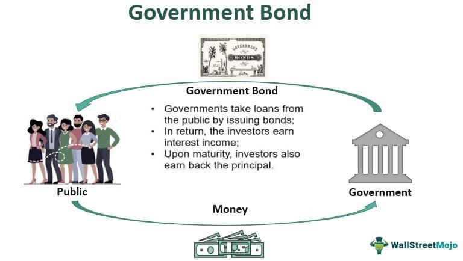

## Table of Contents

## What are government bonds?

Government bonds are like loans that people give to the government. When you buy a government bond, you are lending money to the government. In return, the government promises to pay you back the money you lent them, plus some extra money as a thank you, which is called interest. This interest is usually paid to you every year until the bond reaches its end date, which can be anywhere from a few years to several decades.

These bonds are considered safe investments because they are backed by the government. This means that the government is responsible for paying back the money, and they have the power to raise taxes or print more money if they need to. Because of this, government bonds are popular with people who want a steady and reliable source of income. They are also used by the government to help pay for big projects like building roads or schools, without having to raise taxes right away.

## Why should someone consider investing in government bonds?

Someone should consider investing in government bonds because they are very safe. When you buy a government bond, you are lending money to the government, and they promise to pay you back with interest. Since the government has the power to raise taxes or print more money, it is very unlikely that they will not be able to pay you back. This makes government bonds a good choice if you want to keep your money safe and not take big risks.

Government bonds can also give you a steady income. The interest you earn from the bonds is usually paid to you every year. This can be helpful if you need regular money coming in, like if you are retired. Plus, because government bonds are safe, they can balance out riskier investments in your savings plan. This way, you can have some money in safe bonds and some in other investments that might grow more but are also riskier.

## Where can beginners start purchasing government bonds?

Beginners can start buying government bonds by opening an account with a bank or a brokerage firm. These places let you buy and sell different kinds of investments, including government bonds. You can visit their website or go to their office to open an account. Once you have an account, you can look at the different bonds they offer and choose the ones you want to buy.

Another way to buy government bonds is directly from the government. In the United States, you can buy bonds from the Treasury Department through their website, TreasuryDirect.gov. This website is easy to use and lets you buy bonds straight from the government without needing a bank or broker. Just create an account on the website, pick the bonds you want, and buy them. This can be a good option if you want to keep things simple and avoid extra fees.

## What are the different types of government bonds available?

Government bonds come in different types, and each one works a bit differently. Treasury bonds, for example, are long-term bonds that the U.S. government issues. They usually last for 20 or 30 years, and they pay interest every six months. Treasury notes are similar, but they last for a shorter time, usually between 2 and 10 years. Savings bonds are another type, and they are meant for people who want to save money over time. They come in two main types: Series EE and Series I. Series EE bonds earn a fixed [interest rate](/wiki/interest-rate-trading-strategies), while Series I bonds earn an interest rate that changes with inflation.

There are also other types of government bonds from different countries. For example, in the UK, you can buy gilts, which are similar to U.S. Treasury bonds. In Germany, they are called bunds. Each country's bonds have their own rules and interest rates, but they all work on the same basic idea: you lend money to the government, and they pay you back with interest. Some bonds, like municipal bonds in the U.S., are issued by local governments instead of the national government. These can be used to fund projects like building schools or roads in a specific area.

## How do you buy government bonds directly from the government?

To buy government bonds directly from the government, you can use a website called TreasuryDirect.gov if you live in the United States. First, you need to create an account on the website. You will need to give some personal information like your name, address, and Social Security number. Once your account is set up, you can look at the different types of bonds they offer, like Treasury bonds, Treasury notes, or savings bonds. Choose the bond you want to buy, decide how much money you want to spend, and then complete the purchase. The money will be taken from your bank account, and the bond will be added to your TreasuryDirect account.

This way of buying bonds is easy and does not need a bank or a broker. It's good for people who want to keep things simple and avoid extra fees that banks or brokers might charge. Once you have bought the bond, you will get interest payments, usually every six months for Treasury bonds and notes, or according to the terms for savings bonds. You can keep track of your bonds and the interest they earn through your TreasuryDirect account. When the bond reaches its end date, the money you lent, plus the final interest payment, will be sent back to your bank account.

## Can government bonds be purchased through banks, and which ones offer this service?

Yes, you can buy government bonds through banks. Many big banks let you buy and sell government bonds. Some well-known banks that offer this service are Bank of America, Wells Fargo, and JPMorgan Chase. You can go to the bank in person or use their website to open an account and start buying bonds. The bank will help you with the process and might charge a small fee for their services.

When you buy government bonds through a bank, you can choose from different types of bonds, like Treasury bonds, Treasury notes, and savings bonds. The bank will show you the options and help you pick the ones that fit your needs. Buying through a bank can be convenient because you can handle all your investments in one place, but remember that the bank might charge you fees for buying and selling bonds.

## What are the minimum investment requirements for government bonds?

The minimum amount you need to invest in government bonds depends on the type of bond and where you buy it from. If you buy Treasury bonds or Treasury notes directly from the U.S. government through TreasuryDirect.gov, the minimum amount is $100. For savings bonds, like Series EE and Series I, you can buy them for as little as $25. This makes it easier for people who don't have a lot of money to start investing in government bonds.

When you buy government bonds through a bank or a brokerage firm, the minimum amount can be different. Some banks might let you buy bonds for the same minimum amounts as TreasuryDirect, but others might have higher minimums, like $1,000 or more. It's a good idea to check with the bank or brokerage firm to find out their rules before you start buying bonds.

## How does the process of buying government bonds through a brokerage work?

To buy government bonds through a brokerage, you first need to open an account with a brokerage firm. You can do this by visiting their website or going to their office. Once your account is set up, you'll need to add money to it, usually by transferring funds from your bank account. After that, you can look at the different government bonds they offer, like Treasury bonds, Treasury notes, or savings bonds. Choose the bond you want to buy, decide how much you want to spend, and place your order. The brokerage will then buy the bond for you, and it will show up in your account.

Brokerages might charge a fee for buying and selling bonds, so it's a good idea to check their fees before you start. Once you've bought a bond, you'll get interest payments, usually every six months for Treasury bonds and notes. You can keep track of your bonds and the interest they earn through your brokerage account. When the bond reaches its end date, the money you lent, plus the final interest payment, will be sent back to your account. Buying through a brokerage can be convenient because you can handle all your investments in one place, but remember to consider any fees they might charge.

## What are the fees associated with purchasing government bonds through various platforms?

When you buy government bonds through TreasuryDirect.gov, there are no fees. You can buy bonds directly from the U.S. government without paying any extra money. This makes it a good choice if you want to keep things simple and save money on fees. The only thing you need to think about is the minimum amount you need to spend, which is $100 for Treasury bonds and notes, and $25 for savings bonds.

If you buy government bonds through a bank or a brokerage firm, there might be fees. Banks like Bank of America, Wells Fargo, and JPMorgan Chase might charge you a fee for buying and selling bonds. The fee can be different depending on the bank, but it's usually a small amount of money. Brokerage firms also charge fees, which can be a flat fee or a percentage of the money you spend on bonds. It's a good idea to check the fees before you start buying bonds through a bank or a brokerage to make sure you know how much extra money you will need to pay.

## How can one assess the risks and returns of different government bonds?

Assessing the risks and returns of government bonds involves looking at a few key things. Government bonds are usually seen as safe investments because they are backed by the government. This means the government promises to pay you back the money you lent them, plus interest. But, there is still some risk. For example, if the government has a lot of debt and struggles to pay it back, there could be a small chance they might not pay you on time. Also, interest rates can change, which affects the value of your bond. If interest rates go up, the value of your bond might go down because new bonds will pay more interest. So, even though government bonds are safer than many other investments, it's good to think about these risks.

The returns on government bonds come from the interest they pay. Different bonds have different interest rates, and the rate depends on things like how long the bond lasts and what's happening in the economy. For example, Treasury bonds usually pay more interest than savings bonds because they last longer. You can look at the interest rate to see how much money you'll earn each year. The longer you hold the bond, the more interest you'll get. But remember, if you need to sell the bond before it reaches its end date, you might get more or less money than you paid for it, depending on what's happening with interest rates. So, when you're thinking about buying government bonds, it's important to look at both the risks and the returns to make a smart choice.

## What are the tax implications of investing in government bonds?

When you invest in government bonds, you need to think about taxes. The interest you earn from most government bonds is usually taxable. This means you have to pay taxes on the interest money you get every year. For example, if you buy a Treasury bond and earn $100 in interest, you'll have to pay taxes on that $100. The tax rate depends on your income and where you live. But there's a special kind of bond called a municipal bond. If you buy a municipal bond from the state or city where you live, the interest might not be taxed by the federal government, and sometimes not by your state or city either. This can be a big advantage if you want to keep more of your money.

Savings bonds, like Series EE and Series I bonds, have different tax rules. You can choose to pay taxes on the interest every year, or you can wait until you cash in the bond or it reaches its end date. If you use the money from a Series EE or Series I bond to pay for college, you might not have to pay taxes on the interest at all. This is called the education tax exclusion, and it can save you a lot of money if you're planning to go to school. So, before you buy government bonds, it's a good idea to think about how taxes will affect your returns and choose the bonds that work best for your situation.

## How can advanced investors use government bonds in a diversified investment portfolio?

Advanced investors can use government bonds in a diversified investment portfolio to balance out riskier investments. Government bonds are seen as safe because they are backed by the government, so they can help protect your money if the stock market goes down. By putting some of your money in government bonds, you can lower the overall risk of your portfolio. This way, if your other investments lose value, the steady income from the bonds can help make up for it. Government bonds can also provide a steady stream of interest payments, which can be helpful if you need regular income.

In addition to reducing risk, advanced investors can use government bonds to take advantage of different market conditions. For example, if interest rates are expected to go down, buying long-term bonds like Treasury bonds can be a good move because their value might go up. On the other hand, if interest rates are expected to rise, shorter-term bonds like Treasury notes might be better because you can reinvest the money at higher rates when the bonds mature. By carefully choosing different types of government bonds, advanced investors can fine-tune their portfolios to match their goals and the current economic situation.

## What is the key to understanding bonds as a financial staple?

Bonds are financial instruments that represent a loan between an investor and a borrower, which is typically a corporation or government entity. As a fixed-income investment, bonds promise to return the principal amount invested along with periodic interest payments. This predictable income stream makes bonds an appealing option for those seeking stability and lower risk within their investment portfolios.

### The Nature of Bonds

At their core, bonds are straightforward: the investor lends money to the borrower for a predetermined period, known as the bond's term or maturity. During this period, the borrower pays interest, often referred to as the coupon, to the investor. Upon reaching maturity, the borrower repays the bond's face value to the investor.

The formula to calculate the price of a bond is essential in understanding its valuation and is given as:

$$
P = \sum_{t=1}^{T} \frac{C}{(1 + r)^t} + \frac{F}{(1 + r)^T}
$$

where:
- $P$ is the bond's price,
- $C$ represents the coupon payment,
- $r$ is the discount rate or yield,
- $F$ is the face value of the bond,
- $T$ is the number of periods to maturity.

### Types of Bonds

There are various types of bonds, each catering to different investor needs and risk profiles:

1. **Government Bonds**: Issued by national governments, these typically offer lower yields due to their reduced default risk. Examples include U.S. Treasury bonds, which are considered one of the safest investments due to the backing of the U.S. government.

2. **Corporate Bonds**: These are issued by companies to raise capital. They usually offer higher yields compared to government bonds, commensurate with the increased risk of default.

3. **Municipal Bonds**: Issued by state or local governments, these bonds often provide tax advantages to investors, such as tax-free interest income, making them attractive for individuals in higher tax brackets.

4. **Zero-Coupon Bonds**: Unlike traditional bonds, these do not pay periodic interest. Instead, they are sold at a discount and provide a return at maturity when the full face value is repaid.

### Safety and Stability in Bond Investments

Bonds are generally considered safer than stocks, primarily due to their place in the capital structure of a company. In the event of bankruptcy, bondholders are prioritized over equity holders, thus safeguarding their investments to a greater extent. This seniority, coupled with bonds' fixed-income nature, offers predictability that appeals to risk-averse investors.

Moreover, the performance of bonds is typically less volatile than that of equities, providing a buffer against market fluctuations. This stability makes them a crucial component of diversified investment portfolios, serving as a hedge against economic uncertainty.

In conclusion, understanding the fundamental characteristics and varieties of bonds enables investors to make informed investment decisions, aligning their strategies with their financial goals and risk tolerance. As investors seek stability and consistent returns, bonds remain a cornerstone of prudent financial planning.

## References & Further Reading

[1]: Fabozzi, F. J. (2007). ["Fixed Income Analysis."](https://books.google.com/books/about/Fixed_Income_Analysis.html?id=lujLawVLS3YC) John Wiley & Sons.

[2]: ["Algorithmic Trading: Winning Strategies and Their Rationale"](https://www.wiley.com/en-us/Algorithmic+Trading%3A+Winning+Strategies+and+Their+Rationale-p-9781118460146) by Ernest P. Chan

[3]: ["Advances in Financial Machine Learning"](https://www.amazon.com/Advances-Financial-Machine-Learning-Marcos/dp/1119482089) by Marcos Lopez de Prado

[4]: Fleming, M. J., & Mizrach, B. (2009). ["The Microstructure of a U.S. Treasury ECN: The BrokerTec Platform."](https://www.sciencedirect.com/science/article/pii/S1386418117301477)

[5]: Twaddle, J., & Magee, R. (2008). ["The Effects of Electronic Trading on Liquidity in the New Zealand Government Securities Market."](https://en.wikipedia.org/wiki/Hebberley_Shield) Reserve Bank of New Zealand Bulletin.