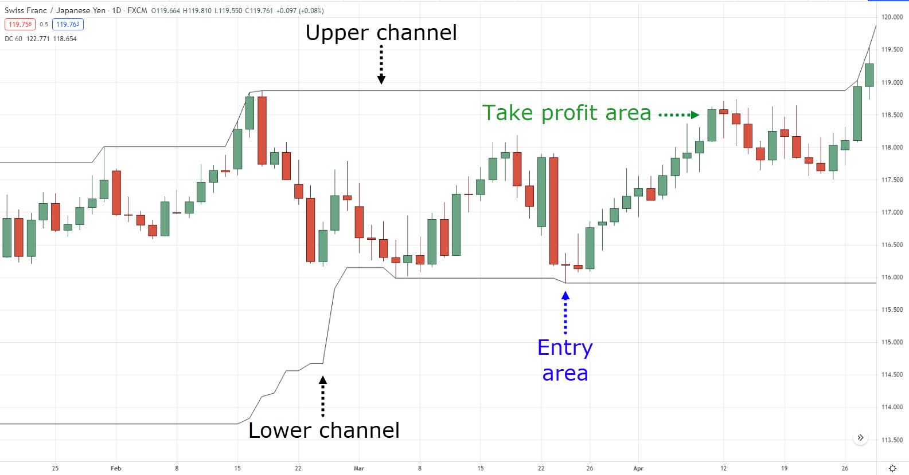

## Table of Contents

## What is swing trading and how does it differ from other trading styles?

Swing trading is a style of trading where you hold onto stocks, currencies, or other financial instruments for a few days to a few weeks. The goal is to make money from the 'swings' or changes in the price of these instruments. Swing traders look for patterns in the price movements and try to buy low and sell high within this short to medium time frame. They use technical analysis, which means they study charts and past price data to make their decisions.

Swing trading is different from other trading styles like day trading and long-term investing. Day trading involves buying and selling within the same day, so it's much faster and requires more attention. Day traders might make many trades in a single day, trying to catch small price movements. On the other hand, long-term investing means holding onto investments for months or years, focusing on the overall growth of the company or market. Swing trading sits in the middle, offering a balance between the quick action of day trading and the patience of long-term investing. It's less stressful than day trading but can still give you quicker returns than long-term investing.

## Why are indicators important in swing trading?

Indicators are important in swing trading because they help traders see patterns and trends in the price of stocks or other financial instruments. They use these patterns to make better guesses about when to buy and sell. For example, if an indicator shows that the price is going up, a swing trader might decide to buy, hoping to sell later at a higher price. Indicators act like a map, guiding traders through the ups and downs of the market.

Without indicators, swing trading would be a lot harder. Traders would have to guess more, and that can lead to mistakes. Indicators give swing traders a way to make more informed decisions, which can help them make more money and avoid big losses. By using indicators, swing traders can feel more confident in their choices and have a clearer plan for when to enter and exit trades.

## What are the most common indicators used by swing traders?

Swing traders often use a few key indicators to help them make decisions. One of the most common is the Moving Average, which smooths out price data to show a clearer trend. There are different types of Moving Averages, like the Simple Moving Average (SMA) and the Exponential Moving Average (EMA). Swing traders might use these to see if a stock's price is going up or down over time. If the price is above the Moving Average, it might be a good time to buy, and if it's below, it might be time to sell.

Another popular indicator is the Relative Strength Index (RSI), which measures how fast a stock's price is moving and if it's overbought or oversold. If the RSI is above 70, it means the stock might be overbought and could go down soon, so it might be a good time to sell. If it's below 30, the stock might be oversold and could go up, making it a good time to buy. Swing traders also like to use the Moving Average Convergence Divergence (MACD), which shows the relationship between two moving averages and can signal when to buy or sell based on crossovers and divergence.

These indicators help swing traders see the bigger picture and make better choices. They don't guarantee success, but they give traders more information to work with. By combining these indicators with other tools and their own experience, swing traders can improve their chances of making profitable trades.

## How does the Moving Average Convergence Divergence (MACD) help in swing trading?

The Moving Average Convergence Divergence (MACD) helps swing traders by showing them when a stock's price might change direction. It does this by comparing two moving averages, which are lines that smooth out price data over time. The MACD line is the difference between a fast moving average (usually 12 periods) and a slow moving average (usually 26 periods). There's also a signal line, which is usually a 9-period moving average of the MACD line. When the MACD line crosses above the signal line, it's a sign that the stock's price might go up, so it might be a good time to buy. When the MACD line crosses below the signal line, it's a sign that the price might go down, so it might be a good time to sell.

Swing traders also look for something called divergence with the MACD. Divergence happens when the stock's price is going in one direction, but the MACD is going in the opposite direction. For example, if the stock's price is going up but the MACD is going down, it could mean that the price increase might not last long. This can be a warning sign for swing traders to be careful or to sell their stocks. By watching the MACD and its signals, swing traders can make better guesses about when to buy and sell, helping them make more money and avoid big losses.

## What role does the Relative Strength Index (RSI) play in identifying swing trading opportunities?

The Relative Strength Index (RSI) helps swing traders find good times to buy and sell stocks. It's a number that goes from 0 to 100 and shows if a stock's price is moving too fast or too slow. When the RSI is over 70, it means the stock might be overbought. This could mean the price might go down soon, so it might be a good time to sell. When the RSI is under 30, it means the stock might be oversold. This could mean the price might go up soon, so it might be a good time to buy.

Swing traders use the RSI to spot these overbought and oversold situations. If they see the RSI going above 70, they might get ready to sell their stocks before the price drops. If they see the RSI going below 30, they might get ready to buy stocks before the price goes up. By watching the RSI, swing traders can make better choices about when to enter and exit their trades, helping them catch the swings in the market and make more money.

## Can the Bollinger Bands be effectively used for swing trading, and if so, how?

Bollinger Bands can be a helpful tool for swing traders because they show how much a stock's price moves around. They are made of three lines: the middle line is a moving average, and the other two lines are above and below it. These outer lines show the highest and lowest prices the stock usually reaches. When the price goes outside these bands, it might mean the stock is moving too fast and could soon move back to the middle. Swing traders can use this to decide when to buy or sell. If the price goes above the top band, it might be a good time to sell because the price could drop back down. If the price goes below the bottom band, it might be a good time to buy because the price could go back up.

Swing traders also look for something called a Bollinger Band squeeze. This happens when the bands get closer together, showing that the stock's price isn't moving much. A squeeze can mean that a big move is coming soon. When the bands start to spread out again, it's a sign that the price is starting to move more. Swing traders can use this to get ready for a new trend. If the price breaks out above the top band after a squeeze, it might be a good time to buy. If it breaks out below the bottom band, it might be a good time to sell. By watching Bollinger Bands, swing traders can find good times to make their trades and catch the swings in the market.

## How do Fibonacci retracement levels assist in planning swing trades?

Fibonacci retracement levels help swing traders find good places to buy and sell stocks. These levels are based on a special set of numbers called the Fibonacci sequence. Traders use them to see where the price of a stock might go up or down after it has moved a lot. For example, if a stock's price goes up a lot, it might pull back to one of these Fibonacci levels before going up again. Swing traders look at these levels to decide when to buy. They might buy when the price pulls back to a level like 38.2%, 50%, or 61.8%, hoping the price will go up again from there.

On the other hand, if a stock's price goes down a lot, it might bounce back up to one of these Fibonacci levels before going down again. Swing traders can use these levels to decide when to sell. They might sell when the price bounces back to a level like 38.2%, 50%, or 61.8%, expecting the price to go down again from there. By using Fibonacci retracement levels, swing traders can plan their trades better and try to make money from the ups and downs of the stock's price.

## What are the advantages and limitations of using the Stochastic Oscillator for swing trading?

The Stochastic Oscillator is a helpful tool for swing traders because it shows if a stock's price is overbought or oversold. It works by comparing the closing price of a stock to its price range over a certain time. When the Stochastic Oscillator is above 80, it means the stock might be overbought and could go down soon. This can be a good time for swing traders to sell. When it's below 20, it means the stock might be oversold and could go up soon. This can be a good time for swing traders to buy. By using the Stochastic Oscillator, swing traders can find good times to enter and exit their trades and make money from the swings in the market.

However, the Stochastic Oscillator has some limitations too. One big problem is that it can give false signals. Sometimes, the oscillator might show that a stock is overbought or oversold, but the price keeps going in the same direction anyway. This can trick swing traders into making bad trades. Another problem is that the Stochastic Oscillator works best in markets that move sideways and not so well in markets that have strong trends. If the market is going up or down a lot, the oscillator might not be very helpful. Swing traders need to be careful and use other tools along with the Stochastic Oscillator to make better decisions.

## How can volume indicators like the On-Balance Volume (OBV) enhance swing trading strategies?

Volume indicators like the On-Balance Volume (OBV) can help swing traders make better decisions by showing how many people are buying and selling a stock. The OBV adds up the volume on days when the stock's price goes up and subtracts it on days when the price goes down. If the OBV is going up, it means more people are buying the stock, which can be a good sign that the price might keep going up. Swing traders can use this to decide when to buy a stock, hoping to sell it later at a higher price. If the OBV is going down, it means more people are selling the stock, which can be a warning that the price might go down. Swing traders can use this to decide when to sell a stock before its price drops.

However, volume indicators like OBV have their limits. They can be tricky to read because they don't always match what the stock's price is doing. Sometimes, the OBV might go up even if the stock's price is going down, or vice versa. This can confuse swing traders and lead to bad trades. Also, volume indicators work best when used with other tools, like moving averages or RSI. By combining OBV with other indicators, swing traders can get a fuller picture of what's happening in the market and make smarter choices about when to buy and sell.

## In what ways can the Average Directional Index (ADX) be used to gauge the strength of a swing trading trend?

The Average Directional Index (ADX) helps swing traders figure out how strong a trend is. It's a number that goes from 0 to 100. When the ADX is above 25, it means the trend is strong. This can be a good time for swing traders to jump into a trade and ride the trend. If the ADX is below 20, it means the trend is weak. Swing traders might want to wait for a stronger trend before making a trade. By looking at the ADX, swing traders can decide if it's a good time to buy or sell based on how strong the trend is.

However, the ADX doesn't tell swing traders if the trend is going up or down, just how strong it is. To know the direction of the trend, swing traders need to use other tools along with the ADX. For example, they might use moving averages or the MACD to see if the trend is going up or down. By combining the ADX with other indicators, swing traders can get a better idea of when to enter and exit their trades and make more money from the swings in the market.

## How do experienced swing traders combine multiple indicators to increase their trading accuracy?

Experienced swing traders use more than one indicator to make better guesses about when to buy and sell stocks. They might use the Moving Average to see the trend, the RSI to see if a stock is overbought or oversold, and the MACD to catch signals about when the trend might change. By looking at all these indicators together, they can see if they all point in the same direction. For example, if the Moving Average shows an uptrend, the RSI is below 30, and the MACD line crosses above the signal line, it's a strong sign that it might be a good time to buy. This way, swing traders can feel more sure about their trades and make fewer mistakes.

However, using many indicators can also be tricky. Sometimes, the indicators might give different signals, which can confuse traders. That's why experienced swing traders also use their own experience and understanding of the market to make decisions. They might look at the big picture, like what's happening in the news or the economy, to help them decide if the signals from the indicators make sense. By combining indicators with their own knowledge, swing traders can increase their chances of making profitable trades and avoid big losses.

## What advanced techniques can be applied to traditional indicators to optimize swing trading performance?

Experienced swing traders can use something called "filtering" to make traditional indicators work better. Filtering means using more than one indicator to check if a trade is a good idea. For example, they might use the Moving Average to see if the stock's price is going up or down, and then use the RSI to see if the stock is overbought or oversold. If both indicators agree, like if the Moving Average shows an uptrend and the RSI is below 30, it's a strong sign to buy. This way, swing traders can feel more sure about their trades and make fewer mistakes. They might also use something called "time frame analysis," where they look at the same stock on different time frames, like daily and weekly charts. If the indicators show the same thing on both time frames, it's a stronger signal.

Another advanced technique is using "divergence" with indicators like the MACD or RSI. Divergence happens when the stock's price is going in one direction, but the indicator is going in the opposite direction. For example, if the stock's price is going up but the MACD is going down, it could mean the price increase might not last long. This can be a warning sign for swing traders to be careful or to sell their stocks. By watching for divergence, swing traders can catch changes in the market before they happen and make smarter trades. Combining these advanced techniques with traditional indicators can help swing traders make more money and avoid big losses.

## How can optimization and risk management be effectively implemented?

Optimizing swing trading strategies in algorithmic trading involves a systematic approach to improving performance and managing risk effectively. By refining these strategies, traders can achieve better risk-adjusted returns and ensure their trades align more closely with their financial goals.

Optimizing swing trading strategies requires a comprehensive evaluation of variables and parameters within trading algorithms. This process is often data-driven and may involve the use of advanced computational techniques like [machine learning](/wiki/machine-learning). Key techniques include:

1. **Parameter Optimization**: Identifying optimal values for parameters within trading algorithms can directly influence the success of a trading strategy. Parameters such as moving averages, stop-loss levels, and take-profit thresholds need careful calibration to optimize performance. This can be achieved through techniques such as grid search or genetic algorithms.

2. **Walk-Forward Analysis**: This technique involves testing a strategy on partitioned data sets, sequentially updating the model with new data while ensuring that past performance does not bias future results. Walk-forward analysis helps refine models while keeping them adaptive to changing market conditions.

3. **Risk Management**: Effective risk management is crucial in swing trading. Drawdown levels and risk-adjusted returns are critical metrics in assessing strategy performance. Drawdown measures the peak-to-trough decline during a trading period, serving as an indicator of downside risk. Minimizing drawdown levels is pivotal in preserving capital.

   Risk-adjusted return metrics, such as the Sharpe Ratio, provide insight into the return per unit of risk. Traders aim to maximize these ratios to ensure that their portfolios not only yield high returns but do so in a manner consistent with prudent risk-taking. The Sharpe Ratio is defined as:
$$
   \text{Sharpe Ratio} = \frac{\bar{R} - R_f}{\sigma}

$$

   where $\bar{R}$ is the average return of the portfolio, $R_f$ is the risk-free rate, and $\sigma$ is the standard deviation of the return.

4. **Diversification**: To minimize risks specific to swing trading, diversification across different assets and strategies is critical. By spreading investments across multiple assets or employing varied trading strategies, traders reduce dependency on any single source of risk. This decreases the portfolio's overall volatility, leading to steadier returns.

   Diversification can involve multiple sectors, asset classes, or geographical regions, ensuring that adverse movements in one area have a limited impact on the overall portfolio.

By implementing these optimization and risk management strategies, traders can enhance the robustness and performance of their swing trading strategies in algorithmic trading. These approaches help in achieving consistent returns while adequately managing the associated risks.

## References & Further Reading

[1]: Bergstra, J., Bardenet, R., Bengio, Y., & Kégl, B. (2011). ["Algorithms for Hyper-Parameter Optimization."](https://papers.nips.cc/paper/4443-algorithms-for-hyper-parameter-optimization) Advances in Neural Information Processing Systems 24.

[2]: ["Advances in Financial Machine Learning"](https://www.amazon.com/Advances-Financial-Machine-Learning-Marcos/dp/1119482089) by Marcos Lopez de Prado

[3]: ["Evidence-Based Technical Analysis: Applying the Scientific Method and Statistical Inference to Trading Signals"](https://www.semanticscholar.org/paper/Evidence-Based-Technical-Analysis%3A-Applying-the-and-Aronson/3b33df8737f1772e9e14d66a08c9696f140a2ee1) by David Aronson

[4]: ["Machine Learning for Algorithmic Trading"](https://github.com/stefan-jansen/machine-learning-for-trading) by Stefan Jansen

[5]: ["Quantitative Trading: How to Build Your Own Algorithmic Trading Business"](https://books.google.com/books/about/Quantitative_Trading.html?id=j70yEAAAQBAJ) by Ernest P. Chan