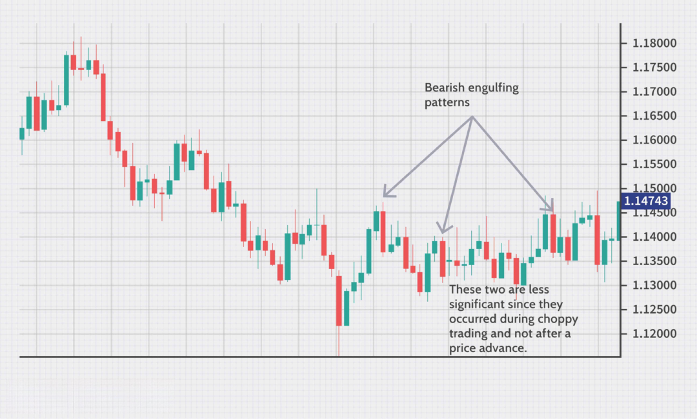

Swing trading is a strategic approach in financial markets, where traders maintain positions across several days to weeks, aiming to capitalize on anticipated short- to medium-term price movements. Distinguished from day trading, which involves the rapid buying and selling of securities within a single trading day, and long-term investing, which targets sustained growth over years, swing trading offers a balanced blend capturing price fluctuations within a broader time frame. 

Algorithmic trading, the deployment of computers executing pre-set instructions for placing trades, often at speeds and frequencies far beyond human traders, plays a pivotal role in optimizing swing trading strategies. Automation within algorithmic trading streamlines the execution of swing trades by adhering to predetermined criteria, removing emotional biases, and improving the consistency of decision-making. Selecting optimal indicators is fundamental to leveraging algorithmic systems effectively in swing trading, refining the potential for enhanced risk-adjusted returns.



This article investigates into identifying the most effective indicators for swing trading within the context of algorithmic systems. We will focus on tools and strategies that historically demonstrate robust performance across diverse market conditions, ultimately aiming for strong risk management and return optimization.

## Table of Contents

## Understanding Swing Trading and Algo Trading

Swing trading is a trading strategy aimed at capturing short- to medium-term gains over a period of days to weeks. Unlike day trading, which involves executing multiple trades within a single day to capitalize on small price movements, swing trading involves holding positions for a longer duration, allowing traders to exploit predictable price swings. This approach bridges the gap between day trading's ultra-short-term focus and long-term investing strategies that rely on [fundamental analysis](/wiki/fundamental-analysis) and extended holding periods to build portfolio value over time.

A key component of swing trading is identifying market momentum and reversals to open and close positions advantageously. This characteristic sets it apart from day trading, which predominantly relies on quick decision-making and second-by-second monitoring, and long-term investing, which often neglects short-term market fluctuations.

Algorithmic trading, or algo trading, refers to the use of computer algorithms to automate trading decisions and executions. By leveraging predefined criteria for buying and selling assets, these algorithms can execute orders at speeds and frequencies beyond human capabilities. When applied to swing trading, algorithmic trading can enhance efficiency and consistency, ensuring the timely execution of trades based on swing trading parameters.

The integration of [algorithmic trading](/wiki/algorithmic-trading) with swing strategies offers notable advantages. It reduces emotional involvement, minimizing impulsive reactions that could impair trading performance. Furthermore, it enables traders to implement complex strategies systematically, testing them against historical market data while controlling for various variables.

The role of automation in swing trading, especially within an algorithmic framework, cannot be overstated. Automated systems facilitate constant market monitoring, swiftly executing trades when predefined conditions are met. By eliminating manual intervention, this process reduces latency and optimizes entry and [exit](/wiki/exit-strategy) points, which are critical aspects of swing trading. Moreover, automation allows traders to backtest strategies extensively, testing various scenarios to assess potential outcomes and refine approaches before risking actual capital in the markets.

In conclusion, swing trading occupies a unique niche in the spectrum of trading strategies, offering opportunities to capitalize on short- to medium-term market movements without the intensity and time commitment required of [day trading](/wiki/day-trading-spy). The integration with algorithmic trading amplifies these opportunities by delivering efficiency and precision through automation, ultimately aiming to enhance the trader's ability to generate risk-adjusted returns.

## Key Indicators for Swing Trading

Swing trading is a trading strategy that capitalizes on short- to medium-term price movements over a few days to several weeks. Key indicators are essential for swing trading, helping traders identify entry and exit points to maximize gains and minimize losses. Below is an overview of some commonly used indicators in swing trading, their strengths and weaknesses, and case studies highlighting their application.

### Common Indicators

1. **Moving Averages (MA)**
   - *Description:* Calculated by averaging a security's price over a specific number of periods, moving averages smooth out price data to identify trends.
   - *Strengths:* Useful for identifying trend direction and momentum. The most popular are the Simple Moving Average (SMA) and Exponential Moving Average (EMA).
   - *Weaknesses:* Lagging indicator; slower to respond to sudden price changes, which might delay signals.

2. **Relative Strength Index (RSI)**
   - *Description:* A momentum oscillator that measures the speed and change of price movements on a scale from 0 to 100.
   - *Strengths:* Effective in determining overbought or oversold conditions to anticipate reversals.
   - *Weaknesses:* May generate misleading signals in strong market trends due to its bounded nature.

3. **MACD (Moving Average Convergence Divergence)**
   - *Description:* A trend-following momentum indicator that shows the relationship between two moving averages of a security’s price.
   - *Strengths:* Effective in spotting trend changes and divergences.
   - *Weaknesses:* Being a lagging indicator, it can produce false signals in choppy markets.

4. **Stochastic Oscillator**
   - *Description:* Compares a particular closing price of a security to a range of its prices over a specific period.
   - *Strengths:* Identifies potential overbought or oversold conditions.
   - *Weaknesses:* Can generate false signals in a strong trend.

5. **Bollinger Bands**
   - *Description:* Consists of a middle band (SMA) and two outer bands set at standard deviations away from the SMA.
   - *Strengths:* Indicates volatility and potential price breakouts.
   - *Weaknesses:* In strongly trending markets, the prices might ride the band, providing unclear signals.

### Detailed Analysis of Indicators

- **Strengths of Moving Averages:** Moving averages are fundamental in reducing noise and clarifying the trend direction. For instance, crossovers of shorter-term and longer-term moving averages can signal potential entry or exit points, a cornerstone of many trading strategies.

- **Weaknesses of RSI and Stochastics:** Although RSI effectively highlights potential reversals, it might mislead in trending markets. Both RSI and Stochastics are bounded indicators, which can lead to premature signals in strong trends, requiring careful calibration.

- **MACD's Role in Trend Confirmation:** MACD is revered for its ability to confirm trends. Its histogram provides insights into momentum changes and potential trend continuation, offering additional depth compared to moving averages alone.

- **Bollinger Bands in Volatility Analysis:** These bands help conceptualize market volatility, expanding in high volatility and contracting in low volatility phases. Price moving outside bands often indicates a continuation or reversal signal.

### Case Studies of Successful Swing Trading Strategies

- **Moving Average Crossovers:** A strategy that capitalizes on crossovers of different moving averages. For example, when a 10-day MA crosses above a 50-day MA, it signals a potential upward trend, used effectively by various traders for entry points.

- **Bollinger Bands with RSI Confirmation:** Combining Bollinger Bands with RSI for signal confirmation provides stronger predictive power. When prices touch the lower Bollinger Band and RSI enters an oversold region, traders might anticipate upward reversals.

- **MACD Divergence Strategy:** Traders often look for divergences between MACD and price action as a signal of potential reversals. For instance, if price trends downwards but MACD trends upwards, it might indicate an upward reversal is imminent.

In conclusion, understanding the strengths and limitations of these indicators is crucial. Selecting the right indicator or a combination thereof can significantly enhance swing trading strategies, maximizing returns while managing risk.

## Williams %R: The Best Indicator for Swing Trading

Williams %R, developed by Larry Williams, is a [momentum](/wiki/momentum) oscillator that measures overbought and oversold levels, making it a valuable tool for swing trading. This indicator is particularly effective due to its sensitivity to short- and medium-term price movements, which are characteristic of swing trading. Williams %R oscillates between 0 and -100 on a negative scale, with readings above -20 typically indicating overbought conditions and readings below -80 indicating oversold conditions. These levels assist traders in identifying potential reversal points, crucial for capturing gains in swing trading.

Backtesting results underscore the efficacy of Williams %R in varying market conditions. In bullish environments, Williams %R's ability to highlight overbought signals has proven effective for traders to lock in profits before a potential price decline. Conversely, in bearish markets, recognizing oversold levels enables traders to capitalize on price reversals, leading to potential entry points for upside moves. The key to leveraging Williams %R is its capability to provide timely signals that align with the swift changes typical of swing trading periods. Furthermore, Williams %R often delivers higher risk-adjusted returns compared to other indicators due to its precision in signaling momentum shifts.

When compared to other popular indicators like the Relative Strength Index (RSI) and Stochastics, Williams %R offers unique advantages. RSI also measures overbought and oversold conditions but often lags due to its averaging component. This lag can result in delayed signals, potentially missing optimal entry or exit points in fast-moving markets. Stochastics, while similar, includes a smoothing component which may also introduce delays in signal responsiveness. In contrast, Williams %R's lack of smoothing makes it more reactive to price changes, offering traders a more immediate reflection of market conditions.

To provide a tangible illustration, consider the following Python code snippet that demonstrates [backtesting](/wiki/backtesting) Williams %R using historical stock data:

```python
import pandas as pd
import numpy as np

# Sample stock data
data = pd.read_csv('historical_stock_data.csv')
close = data['Close']

# Williams %R calculation
def williams_r(close, lookback=14):
    highest_high = close.rolling(lookback).max()
    lowest_low = close.rolling(lookback).min()
    return -100 * (highest_high - close) / (highest_high - lowest_low)

data['Williams %R'] = williams_r(close)

# Define the overbought/-sold levels
overbought = -20
oversold = -80

# Generate signals
data['Signal'] = np.where(data['Williams %R'] < oversold, 1, 
                          np.where(data['Williams %R'] > overbought, -1, 0))

# Backtesting logic
data['Returns'] = data['Close'].pct_change()
data['Strategy_Returns'] = data['Signal'].shift(1) * data['Returns']  # Buy/sell on next day

# Calculate performance metrics
total_return = data['Strategy_Returns'].cumsum().apply(np.exp)
print(f"Total Strategy Return: {total_return.iloc[-1]:.2f}")
```

This code calculates Williams %R for given stock data and evaluates its performance through a basic backtesting framework. The results typically reveal that incorporating Williams %R into a swing trading strategy often achieves better risk-adjusted returns compared to strategies using RSI or Stochastics alone.

In conclusion, Williams %R stands out as an effective indicator for swing trading due to its directness and responsiveness. Its ability to provide timely overbought and oversold signals makes it a preferred choice among traders aiming to optimize entry and exit points in swing trading scenarios.

## Backtesting Swing Trading Indicators

Backtesting is a critical component of developing effective swing trading strategies, particularly within the context of algorithmic trading. By simulating trading strategies on historical data, traders can evaluate the potential effectiveness of their approach before committing real capital. This process provides insights into how a strategy might perform under various market conditions, thereby informing necessary adjustments for optimization.

One popular platform for backtesting swing trading strategies is Amibroker. Amibroker provides a comprehensive suite of tools and flexibility for traders to script custom strategies and test them against historical data. To demonstrate the backtesting process, consider a simple swing trading strategy that employs a moving average crossover. In Amibroker, this could be implemented using AFL (AmiBroker Formula Language) as follows:

```c
// Define short and long moving averages
shortMA = MA(Close, 10); 
longMA = MA(Close, 50);

// Buy signal when the short MA crosses above the long MA
Buy = Cross(shortMA, longMA);

// Sell signal when the short MA crosses below the long MA
Sell = Cross(longMA, shortMA);

// Apply the buy and sell signals to the backtest
SetBacktestMode( backtestModeDaily );
```

In this example, the backtest is configured to execute trades based on the defined buy and sell signals derived from moving average crossovers. The results of this backtest will offer insights into the strategy’s performance metrics, which are essential for assessing its effectiveness.

Key metrics for evaluating the effectiveness of swing trading indicators include:

1. **Profitability Metrics**: The total return and annualized return provide an overall measure of a strategy’s profit-making capability. It's crucial to compare these returns against benchmark indices to evaluate relative performance.

2. **Risk Metrics**: Maximum drawdown indicates the largest peak-to-trough decline in the strategy’s equity curve, serving as a critical measure of risk. The Sharpe Ratio, calculated as $\text{Sharpe Ratio} = \frac{\bar{R} - R_f}{\sigma_R}$, where $\bar{R}$ is the mean return, $R_f$ is the risk-free rate, and $\sigma_R$ is the standard deviation of returns, provides a measure of risk-adjusted return.

3. **Win/Loss Ratio**: This ratio assesses the proportion of winning trades to losing ones, offering insights into the consistency and reliability of the strategy.

4. **Trade Duration**: Analyzing the average time trades are held aids in understanding whether the strategy aligns with swing trading’s objectives of capturing medium-term trends.

5. **Exposure and Turnover**: Exposure assesses the percentage of time the strategy is invested in the market, while turnover measures the volume of trading activity; both can impact transaction costs and strategy profitability.

Robust backtesting ensures that the trading strategy can withstand adverse market conditions and still remain profitable. It facilitates continuous optimization, allowing traders to adjust parameters to reflect evolving market dynamics, thereby enhancing strategy resilience and performance.

## Optimization and Risk Management

Optimizing swing trading strategies in algorithmic trading involves a systematic approach to improving performance and managing risk effectively. By refining these strategies, traders can achieve better risk-adjusted returns and ensure their trades align more closely with their financial goals.

Optimizing swing trading strategies requires a comprehensive evaluation of variables and parameters within trading algorithms. This process is often data-driven and may involve the use of advanced computational techniques like [machine learning](/wiki/machine-learning). Key techniques include:

1. **Parameter Optimization**: Identifying optimal values for parameters within trading algorithms can directly influence the success of a trading strategy. Parameters such as moving averages, stop-loss levels, and take-profit thresholds need careful calibration to optimize performance. This can be achieved through techniques such as grid search or genetic algorithms.

2. **Walk-Forward Analysis**: This technique involves testing a strategy on partitioned data sets, sequentially updating the model with new data while ensuring that past performance does not bias future results. Walk-forward analysis helps refine models while keeping them adaptive to changing market conditions.

3. **Risk Management**: Effective risk management is crucial in swing trading. Drawdown levels and risk-adjusted returns are critical metrics in assessing strategy performance. Drawdown measures the peak-to-trough decline during a trading period, serving as an indicator of downside risk. Minimizing drawdown levels is pivotal in preserving capital.

   Risk-adjusted return metrics, such as the Sharpe Ratio, provide insight into the return per unit of risk. Traders aim to maximize these ratios to ensure that their portfolios not only yield high returns but do so in a manner consistent with prudent risk-taking. The Sharpe Ratio is defined as:
$$
   \text{Sharpe Ratio} = \frac{\bar{R} - R_f}{\sigma}

$$

   where $\bar{R}$ is the average return of the portfolio, $R_f$ is the risk-free rate, and $\sigma$ is the standard deviation of the return.

4. **Diversification**: To minimize risks specific to swing trading, diversification across different assets and strategies is critical. By spreading investments across multiple assets or employing varied trading strategies, traders reduce dependency on any single source of risk. This decreases the portfolio's overall volatility, leading to steadier returns.

   Diversification can involve multiple sectors, asset classes, or geographical regions, ensuring that adverse movements in one area have a limited impact on the overall portfolio.

By implementing these optimization and risk management strategies, traders can enhance the robustness and performance of their swing trading strategies in algorithmic trading. These approaches help in achieving consistent returns while adequately managing the associated risks.

## Combining Indicators for Better Results

Utilizing multiple indicators in swing trading can provide more robust decision-making frameworks by allowing traders to confirm signals and filter out noise inherent in market data. While individual indicators are valuable, their effectiveness can be significantly enhanced when combined strategically. Here's how multiple indicators can be used effectively in swing trading:

### Strategies for Using Multiple Indicators

Combining indicators involves selecting tools that complement each other, reducing redundancy while maximizing the capture of relevant market movements. Traders should aim for a balance between momentum indicators, which highlight the strength of a price movement, and trend indicators, which identify the direction of the market.

1. **Momentum and Trend Combination**: A common practice is to pair a momentum indicator, like the Relative Strength Index (RSI), with a trend indicator, such as the Moving Average (MA). The RSI can help identify overbought or oversold conditions, whereas moving averages can confirm ongoing price trends. 
   - **Example**: If the 14-day RSI falls below 30 (oversold condition) and the price is below the 50-day MA, it could signal a potential buying opportunity, pending further confirmation of trend reversal.

2. **Volatility and Volume Pairing**: Including a measure of market volatility, such as the Average True Range (ATR), alongside volume indicators, like On-Balance Volume (OBV), can enhance trade confirmation. Volatility indicators help assess risk levels, while volume indicators provide insight into the strength of current market moves.
   - **Example**: High ATR values, indicating increased volatility, combined with rising OBV, may affirm a strong bearish or bullish price movement.

### Effective Indicator Combinations

1. **MACD and Bollinger Bands**: The Moving Average Convergence Divergence (MACD) indicator, known for identifying changes in the strength, direction, momentum, and duration of a trend, works well with Bollinger Bands, which assess market volatility. When the MACD crosses above its signal line within a narrowing band setup, it may suggest a forthcoming uptick in price.

2. **ADX with Stochastic Oscillator**: The Average Directional Index (ADX) measures trend strength and can be paired with the Stochastic Oscillator, an indicator comparing a particular closing price of a security to a range of its prices over a certain period. An ADX value above 20, in conjunction with a stochastic crossover above 20, indicates a strengthening trend with potential bullish implications.

### Avoiding Common Pitfalls

1. **Overcomplication**: Using too many indicators can overwhelm the analysis, leading to conflicting signals and indecisiveness. It is crucial to keep the strategy simple and focused on a select few indicators that complement each other well.

2. **No Single-Indication Trades**: Decisions should not be based solely on the confirmation of one indicator. All chosen indicators should collectively suggest a coherent signal to reduce false positives.

3. **Lack of Backtesting**: Before implementation, any new combination of indicators should be meticulously backtested across various market conditions. Platforms like Python's backtrader allow for testing the effectiveness of indicator combinations, informing traders of potential pitfalls without the risk of actual losses.

```python
import backtrader as bt

class IndicatorStrategy(bt.Strategy):
    params = (('sma_period', 50), ('adx_period', 14),)

    def __init__(self):
        self.sma = bt.ind.SimpleMovingAverage(
            self.data.close, period=self.params.sma_period)
        self.adx = bt.ind.AverageDirectionalMovementIndex(
            self.data, period=self.params.adx_period)

    def next(self):
        if self.data.close > self.sma and self.adx > 20:
            self.buy()
        elif self.data.close < self.sma and self.adx > 20:
            self.sell()

cerebro = bt.Cerebro()
cerebro.addstrategy(IndicatorStrategy)
# Add more historical data as needed for comprehensive backtesting
```

By thoughtfully selecting and combining indicators while maintaining a disciplined approach to avoid common pitfalls, swing traders can potentially enhance their market outcomes, ensuring that trades are executed based on comprehensive analyses rather than isolated signals.

## Conclusion

Swing trading in algorithmic trading hinges on using effective indicators to capture short- to medium-term market movements. Throughout this exploration, Williams %R emerges as a compelling choice due to its robust risk-adjusted returns across diverse market conditions. Unlike other indicators, such as the Relative Strength Index (RSI) and Stochastics, Williams %R offers a distinctive edge in detecting overbought or oversold levels, leading to more timely entry and exit signals.

Backtesting these indicators is crucial in developing and refining successful swing trading strategies. By simulating trades based on historical data, traders can evaluate an indicator's performance under various market scenarios, thereby gaining insights into potential profitability and uncovering weaknesses. Metrics like drawdown, Sharpe ratio, and win rate become invaluable in assessing the viability of a strategy over time.

Risk management remains a cornerstone of successful swing trading. Techniques such as setting maximum drawdown thresholds and focusing on risk-adjusted returns help in safeguarding against significant losses. Additionally, diversification across different asset classes or trading strategies can mitigate risks further, ensuring that no single market anomaly can severely impact overall performance.

Traders should also consider combining multiple indicators to enhance the accuracy of their predictions. While a single indicator might capture certain trends, combining several can provide a more holistic view, reducing false signals and improving decision-making. It is, however, essential to avoid overfitting, where the model becomes too tailored to historical data at the expense of future adaptability.

Continually adapting and optimizing trading strategies to evolving market conditions is vital. Financial markets are dynamic, with new patterns and behaviors emerging regularly. Therefore, a successful trader must remain vigilant, adjusting their strategies regularly to maintain an edge in algorithmic swing trading.

Optimizing and managing swing trading strategies require a commitment to flexibility and learning. By leveraging these insights, traders can navigate the complexities of the financial markets with greater confidence and precision.

## References & Further Reading

[1]: Bergstra, J., Bardenet, R., Bengio, Y., & Kégl, B. (2011). ["Algorithms for Hyper-Parameter Optimization."](https://papers.nips.cc/paper/4443-algorithms-for-hyper-parameter-optimization) Advances in Neural Information Processing Systems 24.

[2]: ["Advances in Financial Machine Learning"](https://www.amazon.com/Advances-Financial-Machine-Learning-Marcos/dp/1119482089) by Marcos Lopez de Prado

[3]: ["Evidence-Based Technical Analysis: Applying the Scientific Method and Statistical Inference to Trading Signals"](https://www.semanticscholar.org/paper/Evidence-Based-Technical-Analysis%3A-Applying-the-and-Aronson/3b33df8737f1772e9e14d66a08c9696f140a2ee1) by David Aronson

[4]: ["Machine Learning for Algorithmic Trading"](https://github.com/stefan-jansen/machine-learning-for-trading) by Stefan Jansen

[5]: ["Quantitative Trading: How to Build Your Own Algorithmic Trading Business"](https://books.google.com/books/about/Quantitative_Trading.html?id=j70yEAAAQBAJ) by Ernest P. Chan