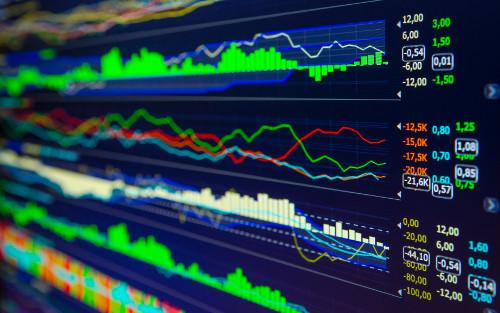

Quantitative trading is a sophisticated approach to trading in financial markets, distinguished by its reliance on mathematical models and algorithms to inform trading decisions. This method contrasts with traditional trading, which often depends on market sentiment or human intuition. By analyzing large sets of historical and real-time market data, quantitative trading aims to identify patterns and execute trades based on predefined criteria.

A critical component of quantitative trading is the selection of appropriate software, which plays a pivotal role in the effectiveness of the strategies employed. Given the complex computational requirements and the need for rapid data processing and analysis, choosing the right software is essential. The decision-making process must consider several factors such as data analysis capabilities, speed, integration with market data feeds, and customization options.



In an era where milliseconds can have significant impacts on trading outcomes, the use of robust, efficient, and reliable software can provide a competitive edge. This article will explore some of the leading software options available for quantitative trading. Whether geared towards backtesting, live trading, or strategy development, each software solution offers unique features. Understanding your specific needs and strategies will guide you in making an informed choice.

## Table of Contents

## Criteria for Choosing Quant Trading Software

When selecting software for quantitative trading, it's essential to assess several critical features to ensure it aligns with your trading objectives. One of the first considerations should be the software's data analysis capabilities. Effective quant trading software must handle vast datasets, performing operations swiftly and efficiently to analyze market trends and develop predictive models. This entails robust support for data collection, storage, and processing, often leveraging high-performance computing and efficient algorithms.

Speed is another vital [factor](/wiki/factor-investing), particularly in environments where milliseconds can make the difference between profit and loss. Software that prioritizes low-latency data feed integrations and order execution can provide a competitive edge. The capability to seamlessly integrate with market data feeds ensures real-time data accuracy and enables precise decision-making.

Customization is crucial since many traders rely on proprietary models tailored to their unique strategies. Look for software that offers flexibility in customizing algorithms, indicators, and trading rules. This is especially important for sophisticated strategies that leverage machine learning or other advanced techniques.

Moreover, different software solutions emphasize distinct functionalities such as [backtesting](/wiki/backtesting), live trading, or strategy development. For instance, some platforms may excel in backtesting capabilities, allowing traders to simulate strategies using historical data before committing capital. Others might focus on live trading infrastructure to enhance execution reliability under high-frequency trading conditions.

Cost is a pragmatic consideration that includes not just the initial investment but also subscription fees, data feed costs, and transaction fees. Opt for software that fits your budget while meeting your trading needs. Additionally, seek platforms with strong community support, as active forums and user communities can be invaluable for troubleshooting and strategy optimization.

Finally, ease of use cannot be overlooked, particularly for novices in [quantitative trading](/wiki/quantitative-trading). Software with intuitive user interfaces, comprehensive documentation, and learning resources can significantly shorten the learning curve, enabling traders to focus on refining their strategies rather than struggling with technical hurdles.

In summary, choosing the right quant trading software necessitates a balanced evaluation of data analysis capabilities, speed, integration, customization options, cost, community support, and user-friendliness, all tailored to align with your specific trading strategies and expertise.

## Top Quant Trading Software Options

When selecting quant trading software, traders have a variety of options, each with its unique features and requirements. Among the popular choices, MetaTrader 5, QuantConnect, and NinjaTrader stand out, each catering to different aspects of quantitative trading. 

MetaTrader 5, widely favored for its comprehensive charting tools, also boasts the MQL5 programming language. It's intuitive and beginner-friendly with numerous tutorials available online, making it accessible for those new to quant trading. Additionally, its [algorithmic trading](/wiki/algorithmic-trading) capability and advanced testing environments render it suitable for more experienced traders.

QuantConnect offers a cloud-based platform with capabilities for backtesting, research, and live trading. It supports multiple programming languages such as C#, F#, Python, and R, offering developers flexibility in strategy development. The platform's strong community aids in strategy sharing and collaborative problem-solving, which can be particularly beneficial for traders looking to expand their knowledge and skills.

NinjaTrader is renowned for its advanced charting and automation features using NinjaScript, a C#-based scripting language. This software is often used by futures and [forex](/wiki/forex-system) traders because of its low-latency order execution. Its simulation capabilities are essential for thoroughly testing quant strategies before live deployment.

Surprisingly, the choice between open-source and proprietary software depends largely on budget, customization needs, and support preferences. Open-source options, such as QuantConnect, provide transparency and the ability to modify code, which is valuable for traders requiring highly tailored solutions. Proprietary software, on the other hand, might offer more polished interfaces and dedicated customer support, which can be critical for those unfamiliar with coding.

In terms of programming language compatibility, Python's popularity in quant trading cannot be overstated. Its comprehensive libraries, like NumPy and pandas, enable complex data analysis and algorithmic strategy development. Platforms like QuantConnect have embraced Python due to its widespread use and flexibility. Similarly, R is favored for statistical analyses, while C++ is often chosen for its execution speed, particularly in high-frequency trading scenarios. When selecting software, traders should consider language compatibility based on their existing programming skills and the specific requirements of their trading strategies.

## MetaTrader 5

MetaTrader 5 is a powerful tool highly regarded in quantitative trading circles for its robust suite of features designed to accommodate both novice and experienced traders. At its core, MetaTrader 5 offers comprehensive charting tools that allow users to conduct detailed technical analysis, an essential activity in quant trading where data visualization and pattern recognition play pivotal roles.

One of the standout features of MetaTrader 5 is its built-in MQL5 programming language. This language enables traders to develop custom trading strategies, scripts, and indicators tailored to their specific needs. MQL5 allows for the creation of complex algorithms that can integrate with the platform's backtesting and algorithmic trading capabilities. For instance, a user might write a script that automates trade entry and [exit](/wiki/exit-strategy) based on predefined signals, optimizing the execution process.

MetaTrader 5 is particularly suitable for beginners due to its intuitive interface, which eases the learning curve typically associated with complex trading software. The platform is complemented by a wealth of tutorials and educational resources available online, empowering newcomers to quickly build proficiency. This supportive ecosystem helps users transition from understanding basic charting concepts to implementing sophisticated quantitative strategies.

Moreover, MetaTrader 5's algorithmic trading functionality stands out as a critical feature for quantitative traders. This functionality allows users to automate trading operations, leveraging their custom-developed algorithms to execute trades automatically. The testing environment on MetaTrader 5 provides users with a sandbox to simulate trading strategies under varying market conditions without financial risk. This simulation capability is invaluable for refining strategies and ensuring they perform optimally before deploying them in live environments.

Overall, the combination of versatility, user-friendly design, and rich educational support makes MetaTrader 5 an attractive choice for quantitative traders looking to enhance their trading expertise and strategy execution efficiency.

## QuantConnect

QuantConnect is a leading cloud-based platform designed for quantitative trading, offering comprehensive features that cater to both novice and experienced traders. One of its standout capabilities is the integrated environment for backtesting, research, and live trading, which streamlines the process of developing and deploying trading algorithms.

The platform's support for multiple programming languages including C#, F#, Python, and R enhances its flexibility. This multi-language capability allows developers to utilize the programming language they are most proficient in or that best suits their trading strategy. For instance, Python's vast ecosystem of libraries, such as NumPy and pandas, can be effortlessly tapped into for data analysis and trading logic when using QuantConnect.

QuantConnect's community-centric approach greatly benefits traders. The platform has a robust community where strategy sharing and collaborative problem-solving are encouraged. This environment not only facilitates knowledge sharing but also promotes innovation as users can learn from each other's experiences and expertise. The community often shares strategies, code snippets, and insights that can be highly beneficial for refining trading algorithms.

Moreover, QuantConnect ensures that traders have access to extensive historical and real-time data, which is essential for accurate backtesting and informed decision-making in live trading. The accuracy and breadth of data feeds provided can make a significant difference in the development of robust trading strategies.

In conclusion, QuantConnect stands out as a versatile and community-driven platform for quantitative trading, thanks to its multi-language support, extensive data resources, and collaborative ecosystem. Whether you're looking to refine your backtesting processes or engage in live trading, QuantConnect offers the tools and community support necessary to succeed in quantitative trading.

## NinjaTrader

NinjaTrader is a prominent choice for traders prioritizing advanced charting, market analysis, and automation features. Its unique leveraging of NinjaScript, a variant of the C# programming language, allows traders to create intricate and customizable trading strategies. This customization can range from simple scripts to complex algorithms that execute trades autonomously, catering to the diverse needs of quantitative traders.

NinjaTrader stands out among futures and forex traders largely due to its low-latency order execution. In the fast-paced world of trading, minimizing the time between executing a trade and its realization in the market can substantially impact profitability. NinjaTrader’s infrastructure is optimized to ensure rapid trade execution, which is vital for strategies reliant on speed and timing.

The platform offers robust simulation capabilities that are essential for rigorous testing of quantitative strategies before deploying them live. Simulation allows traders to test their strategies under various market conditions without financial risk. This testing involves backtesting against historical data and forward testing with current market data in a simulated environment, providing invaluable insights that help in refining strategies. NinjaTrader’s simulation environment accounts for factors such as transaction costs and slippage, offering a realistic evaluation of potential trading outcomes.

In addition to these features, NinjaTrader facilitates comprehensive market analysis through its wide array of charting tools and indicators. Traders can customize their charts using technical indicators and drawing tools to analyze market trends and patterns, aiding in the development of informed trading strategies. Its built-in features also support market scanning and analysis, enabling traders to identify potential trading opportunities based on pre-defined criteria.

For users interested in algorithmic trading, NinjaTrader’s community offers a wealth of resources and support. Educational content, forums, and third-party add-ons are readily available, providing traders with the tools and knowledge needed to maximize the platform's capabilities. These resources further enhance NinjaTrader's appeal, making it a favored choice for both novice and experienced traders seeking a comprehensive solution for quantitative trading.

## Algorithmic Trading with Python

Python is increasingly becoming the language of choice for algorithmic trading, thanks to its extensive ecosystem of libraries and flexibility in constructing sophisticated trading algorithms. Essential libraries such as NumPy and pandas provide powerful data manipulation capabilities, while TensorFlow enables the integration of [machine learning](/wiki/machine-learning) into trading strategies. These libraries allow traders to perform data analysis, develop predictive models, and automate trading efficiently.

For instance, NumPy supports handling large datasets and performing numerical operations, which are crucial for evaluating historical data and conducting statistical analysis. Pandas further simplifies data manipulation through DataFrames, making it easier to clean and preprocess financial data.

```python
import numpy as np
import pandas as pd

# Example: Calculating moving average
data = pd.Series([100, 101, 102, 105, 110])
moving_average = data.rolling(window=3).mean()
print(moving_average)
```

As Python gains popularity, many trading platforms and brokers now support it, recognizing the language's versatility in implementing complex strategies. This includes platforms such as QuantConnect and [Interactive Brokers](/wiki/interactive-brokers-api), which offer Python APIs for seamless strategy deployment and execution.

Moreover, the wealth of online resources enables both novice and experienced traders to harness Python's full potential in quantitative trading. Numerous [course](/wiki/best-algorithmic-trading-courses)s, tutorials, and [books](/wiki/algo-trading-books) serve as guides to mastering algorithmic trading with Python, covering topics from basic programming skills to advanced machine learning techniques. Websites like Coursera, Udemy, and specific blog sites provide structured learning paths, making algorithmic trading more accessible. 

In summary, Python's comprehensive libraries and growing support from trading platforms make it an optimal choice for developing and executing quantitative trading strategies. Leveraging these tools, traders can increase their efficiency and effectiveness, staying ahead in the competitive financial markets.

## Conclusion

In the world of quantitative trading, selecting the ideal software can be a game-changer, yet it's important to acknowledge that no one-size-fits-all solution exists. Your choice should be guided by specific requirements such as the type of strategies you plan to implement, the markets you wish to trade in, and your programming proficiency. For those just beginning, starting with free or open-source solutions can be an effective approach. These platforms often provide a low-risk environment to explore various features and understand your precise needs before committing to a costly purchase. 

Moreover, staying current with software updates and developments within the quantitative trading community is crucial for maintaining a competitive edge. The field is continuously evolving, with frequent advancements in technology and methodology, which means today's best practices can quickly become outdated. Engaging with the community, participating in forums, and following leading experts can facilitate continuous learning and adaptation, ensuring that your trading strategies remain effective and relevant. This proactive approach not only enhances your technical capabilities but also prepares you for emerging trends and challenges in quantitative trading.

## FAQs

### What is quantitative trading, and why is software important for it?

Quantitative trading involves using mathematical models and sophisticated algorithms to exploit market inefficiencies. The practice relies on analyzing vast datasets to identify patterns and make informed trading decisions. Software is crucial in this field because manual analysis of complex datasets is impractical. Quant trading software enables quick processing of data, model implementation, strategy optimization, and automated execution of trades. These tools allow traders to backtest strategies on historical data to identify their effectiveness before applying them to live markets. Moreover, quant trading software provides the scalability necessary for handling multiple data streams and complex computations simultaneously.

### How does one begin with choosing the right software for trading strategies?

Choosing the right software for trading strategies starts with understanding your specific needs and expertise. Key factors to consider include:

1. **Data Analysis Capabilities:** Ensure the software can handle large data sets and offers robust analytical tools.

2. **Speed and Latency:** For high-frequency trading strategies, software with low-latency performance is essential.

3. **Integration and Compatibility:** Consider software that easily integrates with your existing systems and supports programming languages you're familiar with, such as Python, R, or C++.

4. **Customization and Flexibility:** Look for software that allows for the customization of trading models and strategies.

5. **Cost:** Evaluate the pricing structures, which can range from free open-source options to expensive proprietary platforms.

6. **Community Support:** Active user communities can offer invaluable support, peer advice, and sharing of strategies.

Ultimately, trial versions or free alternatives are a good starting point to explore what fits your trading strategies and workflows best.

### Are there free options available for beginners in quant trading?

Yes, there are several free options available for beginners in quant trading. Open-source platforms like QuantConnect and QuantLib allow users to backtest and develop strategies without initial investment. Python, widely used in quant trading, is equipped with libraries like NumPy, pandas, and TensorFlow, which are free to use for developing trading algorithms. Besides open-source software, Metatrader 5 offers a free version suitable for novice traders looking to gain experience through its intuitive interface and extensive tutorials.

Starting with these free resources allows beginners to test the waters of quantitative trading, experiment with various strategies, and build a foundational understanding before committing resources to more advanced tools.

## References & Further Reading

[1]: Bergstra, J., Bardenet, R., Bengio, Y., & Kégl, B. (2011). ["Algorithms for Hyper-Parameter Optimization."](https://papers.nips.cc/paper_files/paper/2011/hash/86e8f7ab32cfd12577bc2619bc635690-Abstract.html) Advances in Neural Information Processing Systems 24.

[2]: ["Advances in Financial Machine Learning"](https://www.amazon.com/Advances-Financial-Machine-Learning-Marcos/dp/1119482089) by Marcos Lopez de Prado

[3]: ["Evidence-Based Technical Analysis: Applying the Scientific Method and Statistical Inference to Trading Signals"](https://www.wiley.com/en-gb/Evidence+Based+Technical+Analysis:+Applying+the+Scientific+Method+and+Statistical+Inference+to+Trading+Signals-p-9780470008744) by David Aronson

[4]: ["Machine Learning for Algorithmic Trading"](https://www.amazon.com/Machine-Learning-Algorithmic-Trading-intelligence/dp/9918608013) by Stefan Jansen

[5]: ["Quantitative Trading: How to Build Your Own Algorithmic Trading Business"](https://www.amazon.com/Quantitative-Trading-Build-Algorithmic-Business/dp/0470284889) by Ernest P. Chan