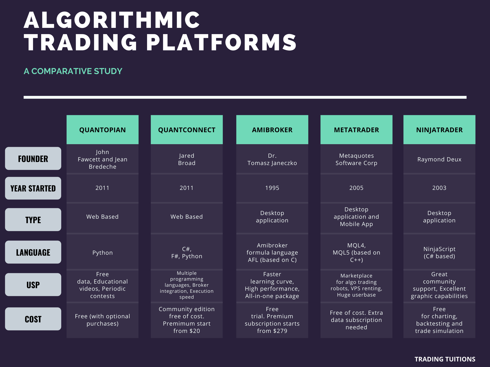

## Table of Contents

## What is quantitative trading and why is software important for it?

Quantitative trading is a way of buying and selling things like stocks or commodities using math and computer programs. Instead of guessing or following feelings, people who do quantitative trading use numbers and data to make decisions. They look at past information and use special math formulas to predict what might happen next in the market. This method tries to take the emotion out of trading and make it more scientific.

Software is really important for quantitative trading because it helps handle all the numbers and calculations. Without software, it would be very hard and slow to do all the math needed for this kind of trading. Software can quickly look at huge amounts of data, find patterns, and make decisions much faster than a person could. It also helps keep everything organized and can run the trading strategies automatically, which means it can buy or sell things without needing someone to do it manually. This makes the whole process smoother and more efficient.

## What are the basic features to look for in quant trading software?

When looking for quant trading software, it's important to find something that can handle a lot of data quickly. The software should be able to take in big amounts of information from the market, like prices and trading volumes, and process it fast. This is because the market can change in seconds, and you need the software to keep up. It should also have good tools for analyzing this data, like charts and graphs, so you can see patterns and make smart decisions.

Another key feature is the ability to backtest your trading strategies. This means you can test your ideas using old market data to see how they would have worked in the past. Good software will let you do this easily and accurately. It should also be able to run your strategies automatically, so once you've set them up, the software can buy and sell without you having to do it yourself. This makes trading smoother and less stressful.

Lastly, the software should be reliable and secure. Since you're dealing with money and sensitive information, you need to trust that the software won't crash or get hacked. It should also be easy to use, with a clear interface that doesn't confuse you. This way, you can focus on your trading strategies instead of struggling with the software.

## How does the user interface of quant trading software affect its usability?

The user interface of quant trading software plays a big role in how easy it is to use. A good interface is clear and simple, so you can find what you need without getting confused. If the interface is messy or hard to understand, it can make trading more difficult and stressful. You might spend more time trying to figure out how to use the software instead of focusing on your trading strategies. A well-designed interface helps you work faster and more efficiently, which is important in the fast-paced world of trading.

Also, a user-friendly interface can make it easier to learn and use new features. If the software has tools for analyzing data or backtesting strategies, a clear interface helps you understand how to use them. This can be really helpful, especially if you're new to quant trading. When the interface is easy to navigate, you can spend more time improving your trading skills and less time dealing with the software itself. In the end, a good user interface can make a big difference in how successful you are with quant trading.

## What are the differences between free and paid quant trading software?

Free quant trading software often has basic features that can help you get started with trading. These tools might let you look at market data and test your trading ideas, but they usually don't have all the fancy tools that paid software has. Free software might be slower and not as reliable, and it might not let you trade automatically. Also, free software might show you ads or try to sell you other things, which can be annoying.

Paid quant trading software usually has more advanced features and works better. It can handle a lot of data quickly and has tools for analyzing the market in detail. Paid software often lets you trade automatically, which can save you time and help you make better trades. It's usually more reliable and secure, so you don't have to worry about it crashing or getting hacked. While it costs money, the extra features and better performance can be worth it if you're serious about quant trading.

In summary, the main differences between free and paid quant trading software come down to features, performance, and reliability. Free software is good for beginners or people who want to try out quant trading without spending money, but it has limitations. Paid software offers more tools and better performance, which can be important for experienced traders who need advanced features to succeed.

## Can you recommend beginner-friendly quant trading software?

For beginners in quant trading, MetaTrader 4 (MT4) is a great choice. It's free to use and has a simple interface that's easy to understand. MT4 lets you look at market data with charts and graphs, and you can even test your trading ideas with old data. It also has a feature called Expert Advisors, which are like little programs that can trade for you automatically. This can be really helpful if you're new to trading and want to learn how to set up strategies without doing everything by hand.

Another good option for beginners is TradingView. It's also free and has a user-friendly interface. TradingView is great for looking at market data and making charts. It has a lot of tools that help you see patterns in the market. You can also write your own trading strategies using a simple coding language called Pine Script. TradingView has a big community of traders who share ideas and strategies, which can be really helpful when you're starting out. Both MT4 and TradingView are good choices for beginners because they're easy to use and have enough features to help you learn quant trading.

## What advanced features should experienced traders look for in quant trading software?

Experienced traders should look for quant trading software that can handle a lot of data really quickly. This is important because the market can change fast, and you need the software to keep up. It should have advanced tools for analyzing data, like machine learning algorithms, which can help you find patterns that are hard to see with just simple charts. The software should also let you backtest your strategies with detailed and accurate results. This means you can test your ideas with old market data to see how they would have worked in the past, but with more advanced options and settings than what beginners might use.

Another important feature for experienced traders is the ability to trade automatically with complex strategies. This means the software can buy and sell things without you having to do it yourself, but it should be able to handle more complicated trading rules and conditions. The software should also be reliable and secure, with strong protection against crashes and hacking. It's also good if the software can connect with other tools and data sources, so you can get all the information you need in one place. This makes trading smoother and more efficient for experienced traders who need advanced features to succeed.

## How important is backtesting capability in quant trading software?

Backtesting capability is very important in quant trading software. It lets you test your trading ideas using old market data to see how they would have worked in the past. This is helpful because it shows you if your strategy might make money or lose money before you use real money. Without backtesting, you would be guessing if your strategy is good, which can be risky. By using backtesting, you can make changes to your strategy to make it better before you start trading for real.

Having good backtesting tools in your software is also important because it helps you learn and improve. You can try different ideas and see what works best. This way, you can get better at trading without losing money. Good backtesting tools should be easy to use and give you detailed results, so you can understand why your strategy worked or didn't work. This makes a big difference in how successful you can be in quant trading.

## What role does real-time data integration play in quant trading software?

Real-time data integration is very important in quant trading software. It means the software can get the latest information from the market as it happens. This is crucial because the market can change quickly, and you need to know what's going on right away to make good trading decisions. If your software can't get real-time data, you might miss out on good chances to buy or sell, or you might make decisions based on old information, which can lead to losses.

Having real-time data also helps you use your trading strategies better. Many strategies in quant trading depend on knowing the current market conditions. With real-time data, your software can automatically buy or sell things based on the latest information. This makes your trading smoother and more efficient. Without real-time data, your strategies might not work as well, and you could miss out on making the most money possible.

## How do different programming languages supported by quant trading software impact its functionality?

Different programming languages supported by quant trading software can make a big difference in how well it works. Some languages, like Python, are easy to learn and have a lot of tools that help with data analysis and machine learning. This makes it easier for traders to write and test their trading strategies. Other languages, like C++ or Java, are faster and can handle more data at once. This is important for traders who need their software to work quickly and handle a lot of information. The choice of language can affect how fast the software runs, how easy it is to use, and what kinds of tools and libraries you can use.

Having support for multiple programming languages can also make the software more useful for different kinds of traders. For example, a beginner might prefer a language like Python because it's easier to learn and use. An experienced trader might choose C++ for its speed and ability to handle complex calculations. By supporting different languages, the software can meet the needs of more people. This flexibility can help traders use the language they're most comfortable with, which can make their trading strategies more effective and easier to manage.

## What are the security considerations when choosing quant trading software?

When choosing quant trading software, security is really important because you're dealing with money and personal information. You need to make sure the software is safe from hackers who might try to steal your data or mess with your trades. Look for software that uses strong encryption to protect your information. It should also have good ways to check who is using it, like strong passwords and two-factor authentication. This helps make sure only you can access your account.

Another thing to think about is how the software handles updates and fixes. Good software will have regular updates to fix any security problems quickly. It should also have a way to back up your data, so if something goes wrong, you don't lose everything. Make sure the company behind the software has a good reputation for keeping their users safe. This way, you can trust that your trading information and money are in good hands.

## How does the scalability of quant trading software affect its suitability for different trading volumes?

Scalability is important when choosing quant trading software because it decides how well the software can handle different amounts of trading. If you trade a lot, you need software that can process a lot of data quickly without slowing down. This means the software should be able to handle more trades and bigger data sets as your trading grows. If the software can't scale up, it might get slow or crash when you need it the most, which can be a big problem.

On the other hand, if you're just starting out and don't trade much, you might not need software that can handle huge volumes. But it's still good to pick software that can grow with you. This way, as you trade more and your needs change, the software can keep up without you having to switch to something else. Choosing scalable software helps make sure it will work well no matter how much you're trading.

## What are the latest trends and future developments in quant trading software?

One of the latest trends in quant trading software is the use of artificial intelligence and machine learning. These technologies help traders find patterns in the market that are hard to see with just simple charts. They can also make trading strategies better by learning from past data. More and more software is using AI to help traders make smarter decisions and trade more automatically. This makes trading easier and can help traders make more money.

Another trend is the move towards cloud-based solutions. Instead of having the software on your own computer, it's stored on the internet. This means you can use it from anywhere and it can handle a lot more data. Cloud-based software is also easier to update and keep secure. In the future, we might see even more software moving to the cloud, making it easier for traders to use advanced tools without needing powerful computers.

Looking ahead, we can expect quant trading software to keep getting better at handling big data and using new technologies. Things like blockchain and quantum computing might start to play a bigger role. Blockchain could make trading safer and more transparent, while quantum computing could make calculations much faster. As these technologies grow, they could change how quant trading software works and help traders in new ways.

## References & Further Reading

[1]: Bergstra, J., Bardenet, R., Bengio, Y., & Kégl, B. (2011). ["Algorithms for Hyper-Parameter Optimization."](https://papers.nips.cc/paper_files/paper/2011/hash/86e8f7ab32cfd12577bc2619bc635690-Abstract.html) Advances in Neural Information Processing Systems 24.

[2]: ["Advances in Financial Machine Learning"](https://www.amazon.com/Advances-Financial-Machine-Learning-Marcos/dp/1119482089) by Marcos Lopez de Prado

[3]: ["Evidence-Based Technical Analysis: Applying the Scientific Method and Statistical Inference to Trading Signals"](https://www.wiley.com/en-gb/Evidence+Based+Technical+Analysis:+Applying+the+Scientific+Method+and+Statistical+Inference+to+Trading+Signals-p-9780470008744) by David Aronson

[4]: ["Machine Learning for Algorithmic Trading"](https://www.amazon.com/Machine-Learning-Algorithmic-Trading-intelligence/dp/9918608013) by Stefan Jansen

[5]: ["Quantitative Trading: How to Build Your Own Algorithmic Trading Business"](https://www.amazon.com/Quantitative-Trading-Build-Algorithmic-Business/dp/0470284889) by Ernest P. Chan