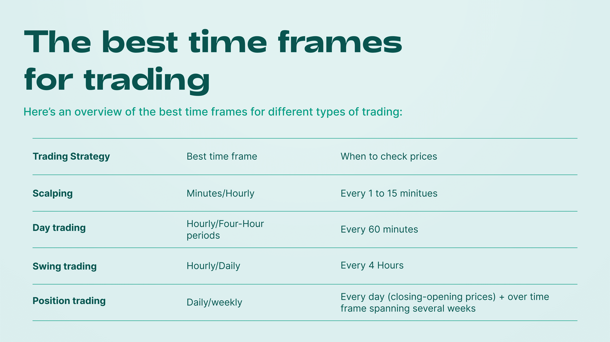

## Table of Contents

## What is a time frame in trading?

A time frame in trading refers to the duration of time shown on a trading chart. Traders use different time frames to analyze market trends and make decisions. For example, a short time frame might show price changes over minutes or hours, while a longer time frame could show changes over days, weeks, or even months.

Choosing the right time frame depends on a trader's goals and trading style. Some traders, called day traders, might focus on short time frames to make quick trades within a single day. Others, like swing traders, might look at longer time frames to hold onto their investments for several days or weeks. Understanding time frames helps traders see different patterns and make better trading choices.

## Why is choosing the right time frame important for trading?

Choosing the right time frame is important for trading because it helps traders see the market in a way that matches their goals and style. If a trader picks a time frame that is too short, they might see a lot of quick ups and downs that can be confusing. But if they pick a time frame that is too long, they might miss out on smaller changes that could be important for making quick trades. By picking the right time frame, traders can focus on the information that matters most to them.

For example, a day trader who wants to buy and sell within the same day will look at short time frames, like minutes or hours. This helps them catch small changes in the market and make fast decisions. On the other hand, a swing trader who holds onto investments for a few days or weeks will look at longer time frames, like days or weeks. This helps them see bigger trends and make decisions that fit their longer-term goals. So, choosing the right time frame is key to seeing the market clearly and making smart trading choices.

## What are the common time frames used in trading?

In trading, common time frames range from very short to very long. Short time frames include 1-minute, 5-minute, and 15-minute charts. These are often used by day traders who want to make quick trades and catch small changes in the market. A 1-minute chart shows price changes every minute, which can help traders see fast movements. A 5-minute chart shows changes every five minutes, giving a bit more time to see trends. A 15-minute chart is a bit longer but still short enough for day traders to use.

Medium time frames include 1-hour, 4-hour, and daily charts. These are often used by swing traders who hold onto their investments for a few days or weeks. A 1-hour chart shows price changes every hour, which can help traders see trends over a few hours. A 4-hour chart shows changes every four hours, giving a clearer picture of the market over a longer period. A daily chart shows changes over each day, which can help traders see bigger trends and make decisions that fit their longer-term goals.

Long time frames include weekly and monthly charts. These are often used by position traders who hold onto their investments for months or even years. A weekly chart shows price changes over each week, which can help traders see long-term trends. A monthly chart shows changes over each month, giving the biggest picture of the market. These long time frames are useful for traders who want to make big, long-term decisions based on the overall direction of the market.

## How does a beginner trader choose an appropriate time frame?

For a beginner trader, choosing the right time frame can feel a bit tricky at first. It's important to think about what kind of trading you want to do. If you want to make quick trades and see fast changes in the market, you might want to start with short time frames like 1-minute, 5-minute, or 15-minute charts. These are good for [day trading](/wiki/day-trading-spy), where you buy and sell within the same day. But remember, short time frames can be a bit confusing because they show a lot of quick ups and downs.

If you're more interested in holding onto your investments for a few days or weeks, you might want to look at medium time frames like 1-hour, 4-hour, or daily charts. These are good for swing trading, where you try to catch bigger trends in the market. They give you a clearer picture of what's happening over a longer period. As a beginner, it's a good idea to start with a medium time frame because it's easier to see the trends and make decisions. Once you get more comfortable, you can try shorter or longer time frames to see what works best for you.

## What are the advantages of using shorter time frames in trading?

Using shorter time frames in trading, like 1-minute, 5-minute, or 15-minute charts, can help traders see quick changes in the market. This is good for day traders who want to buy and sell within the same day. They can catch small ups and downs in prices and make fast decisions. This means they can take advantage of small price movements to make a profit. It's like being able to jump in and out of the market quickly, which can be exciting and rewarding if done right.

However, shorter time frames can also be a bit tricky. They show a lot of quick ups and downs, which can be confusing for beginners. It's easy to get caught up in the fast pace and make quick decisions that might not be the best. But for traders who are good at reading these quick changes, shorter time frames can be a powerful tool. They can help you stay on top of the market and make trades that fit your goals.

## What are the risks associated with trading on shorter time frames?

Trading on shorter time frames can be risky because the market moves very fast. When you look at charts that show price changes every minute or every few minutes, you see a lot of quick ups and downs. It's easy to get confused by all these fast changes and make quick decisions that might not be the best. If you're not careful, you might buy or sell at the wrong time and lose money. It's like trying to catch a fast-moving ball - if you're not quick enough, you might miss it or get hit.

Another risk is that shorter time frames can make you feel stressed and pressured. When you're watching the market change every minute, it can be hard to stay calm and think clearly. You might feel like you have to make a trade right away, even if it's not a good idea. This can lead to making trades based on emotions instead of careful thinking. Over time, this can wear you out and make it harder to keep trading well. So, while shorter time frames can help you catch small price movements, they also come with a lot of risks that you need to be ready for.

## How do longer time frames benefit traders?

Longer time frames, like weekly or monthly charts, help traders see big trends in the market. When you look at these charts, you can see how prices change over weeks or months. This makes it easier to understand where the market is going in the long run. Traders who use longer time frames, called position traders, can make big decisions based on these trends. They don't worry about small ups and downs every day. Instead, they focus on the overall direction of the market, which can help them make smart choices about when to buy or sell.

Using longer time frames can also make trading less stressful. When you're not watching the market change every minute, you have more time to think and plan. This can help you stay calm and make better decisions. It's like taking a step back to see the whole picture instead of getting caught up in the little details. For traders who want to hold onto their investments for a long time, longer time frames are a good way to stay focused on their goals and avoid getting stressed out by short-term changes.

## What are the potential drawbacks of using longer time frames?

Using longer time frames can make it hard to catch small changes in the market. If you're looking at weekly or monthly charts, you might miss out on quick price movements that could be good for making a profit. Traders who want to buy and sell quickly might find that longer time frames don't give them the information they need to make fast decisions. It's like trying to catch a fast-moving ball with a slow camera - you might not see it until it's too late.

Another problem with longer time frames is that they can make you wait a long time before you see results. If you're holding onto an investment for weeks or months, it can take a while to see if your decision was right. This can be frustrating if you're used to seeing quick changes and making trades based on them. It's like planting a seed and waiting for it to grow - you need to be patient and trust that it will work out in the end.

## How can a trader effectively use multiple time frames in their strategy?

A trader can use multiple time frames to get a better view of the market. They can start by looking at a longer time frame, like a daily or weekly chart, to see the big trends. This helps them understand where the market is going in the long run. Then, they can switch to a shorter time frame, like a 1-hour or 15-minute chart, to find good times to buy or sell. By using both long and short time frames, traders can make smart decisions based on the big picture and the small details.

For example, a trader might see a big upward trend on a weekly chart. This tells them that the market is going up over time. But they need to find the right time to buy. So, they look at a 1-hour chart and see that the price is going down a bit right now. They can buy at this lower price and then sell when the price goes back up. By using multiple time frames, traders can catch the best moments to make trades and make more money.

## What role does a trader's personal schedule play in selecting a time frame?

A trader's personal schedule is really important when [picking](/wiki/asset-class-picking) a time frame. If you have a lot of time during the day to watch the market, you might choose shorter time frames like 1-minute or 5-minute charts. These are good for day trading because you can make quick trades and catch small changes in the market. But if you're busy and can't watch the market all the time, shorter time frames might not work well for you. You might miss important changes and make bad trades.

On the other hand, if you don't have a lot of time to watch the market, longer time frames like daily or weekly charts might be better. These are good for swing trading or position trading because you don't need to check the market every minute. You can look at the charts once a day or once a week and still make good decisions. So, your personal schedule helps you pick the right time frame that fits your life and trading goals.

## How do different trading styles (e.g., day trading, swing trading) influence the choice of time frame?

Different trading styles really affect which time frame a trader should use. Day traders, who buy and sell within the same day, need to watch the market closely. They use short time frames like 1-minute, 5-minute, or 15-minute charts. These charts help them see quick changes in the market and make fast trades. Day traders want to catch small price movements to make a profit, so they need to be able to act quickly.

Swing traders, on the other hand, hold onto their investments for a few days or weeks. They use medium time frames like 1-hour, 4-hour, or daily charts. These charts help them see bigger trends in the market and make decisions that fit their longer-term goals. Swing traders don't need to watch the market every minute, so they can take their time and plan their trades carefully. Position traders, who hold onto their investments for months or years, use even longer time frames like weekly or monthly charts. They focus on the overall direction of the market and make big decisions based on long-term trends.

## What advanced techniques can expert traders use to optimize their time frame selection?

Expert traders can use a technique called multi-time frame analysis to get a better view of the market. They start by looking at a longer time frame, like a weekly or daily chart, to see the big trends. This helps them understand where the market is going in the long run. Then, they switch to a shorter time frame, like a 1-hour or 15-minute chart, to find the best times to buy or sell. By using both long and short time frames, expert traders can make smart decisions based on the big picture and the small details. This way, they can catch the best moments to make trades and make more money.

Another advanced technique is using technical indicators on different time frames. Expert traders might use moving averages, RSI, or MACD on both long and short time frames to confirm their trading signals. For example, if a long-term moving average on a weekly chart shows an upward trend, and a short-term moving average on a 1-hour chart also shows an upward trend, this can give the trader more confidence in their decision to buy. By combining information from different time frames and using technical indicators, expert traders can fine-tune their strategies and improve their chances of success.

## References & Further Reading

[1]: Bergstra, J., Bardenet, R., Bengio, Y., & Kégl, B. (2011). ["Algorithms for Hyper-Parameter Optimization."](https://papers.nips.cc/paper/4443-algorithms-for-hyper-parameter-optimization) Advances in Neural Information Processing Systems 24.

[2]: ["Advances in Financial Machine Learning"](https://www.amazon.com/Advances-Financial-Machine-Learning-Marcos/dp/1119482089) by Marcos Lopez de Prado

[3]: ["Evidence-Based Technical Analysis: Applying the Scientific Method and Statistical Inference to Trading Signals"](https://www.amazon.com/Evidence-Based-Technical-Analysis-Scientific-Statistical/dp/0470008741) by David Aronson

[4]: ["Machine Learning for Algorithmic Trading"](https://github.com/stefan-jansen/machine-learning-for-trading) by Stefan Jansen

[5]: ["Quantitative Trading: How to Build Your Own Algorithmic Trading Business"](https://books.google.com/books/about/Quantitative_Trading.html?id=j70yEAAAQBAJ) by Ernest P. Chan