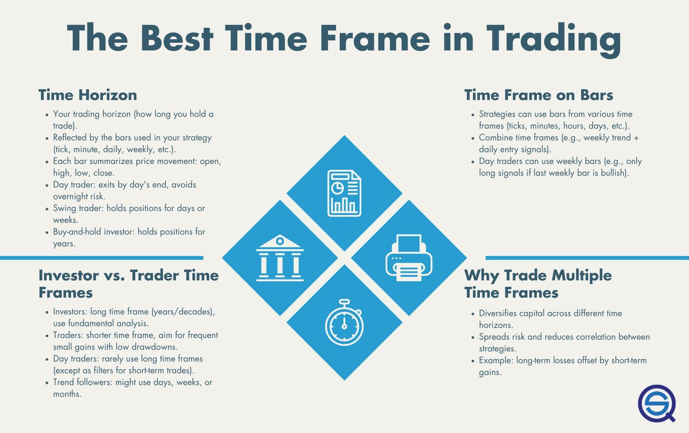

Swing trading is a widely adopted trading strategy that focuses on capturing short- to medium-term gains in financial markets. This strategy involves holding positions for a few days to several weeks, aiming to profit from market 'swings'—the natural oscillations in asset prices during a market trend. Such a trading style is appealing due to its balanced approach between the fast pace of day trading and the prolonged commitments of long-term investing.

In recent years, algorithmic trading, often referred to as algo trading, has become an integral component for swing traders. This approach leverages automation to execute trades based on predefined criteria, making it particularly advantageous for traders who cannot continuously monitor market movements. By employing complex algorithms and computational techniques, traders can program strategies that assess price movements, predict market conditions, and execute trades with precision and speed that human traders might struggle to achieve consistently.

One of the pivotal decisions in swing trading, especially when intertwined with algo trading, is choosing the right time frame. The time frame chosen can significantly influence potential returns and risk levels. It dictates the duration a trade is held, thus affecting exposure to market volatility and impacting the overall strategy's effectiveness. Selecting an appropriate time frame in algorithmic swing trading is crucial; it must strike a balance between being reactive to market dynamics and mitigating risks associated with overtrading or undertrading.

This article evaluates various time frames suitable for swing trading within the context of algorithmic trading. By analyzing different options, we aim to identify the optimal time frames that align with the objectives of maximizing returns while keeping risks in check. Such analysis helps traders implement strategies that are not only robust and reliable but also adaptive to changing market landscapes.

## Table of Contents

## Understanding Time Frames in Trading

Time frames in trading are a crucial component that can greatly influence a trading strategy's structure and efficacy. They specify the duration for which a trade is held before being closed and are fundamentally tied to the types of price bars used in analysis—such as tick, minute, or daily bars. Each of these time frames offers distinct insights into market patterns, trends, and price actions, necessitating careful consideration when crafting a trading strategy.

The selection of a time frame is indicative of a trader’s broader strategy and objectives. For instance, tick charts reflect every single trade that is made regardless of time, providing granular detail which can be invaluable in high-frequency trading or very short-term strategies. These charts can reveal micro-trends and market fluctuations that are otherwise invisible in longer time frames.

Minute bars, on the other hand, aggregate all transactions within specific, shorter intervals such as one minute, five minutes, or fifteen minutes. This aggregation helps in identifying shorter trends and intraday price actions while filtering out some of the noise present in tick data. They are particularly useful for day traders who seek to exploit short-term price movements within a single market day.

Daily bars condense a full trading day into a single bar, which encapsulates the opening, closing, high, and low prices for the day. This level of data aggregation makes daily bars a favorite among swing traders, as they provide a clearer picture of the overall market trend by filtering out the noise of intraday [volatility](/wiki/volatility-trading-strategies). They allow traders to make informed decisions based on broader macroeconomic trends without being caught in the stochastic fluctuations that occur on a minute-by-minute basis.

Selecting the appropriate time frame is not a one-size-fits-all process. It demands alignment with individual trading goals, risk tolerance, the required level of monitoring, and the specific characteristics intrinsic to the market being traded. For markets with higher volatility, shorter time frames might yield better insights due to their ability to capture rapid price movements. Conversely, in more stable markets, longer time frames might offer better reliability by portraying more stable trend lines.

Ultimately, understanding and selecting the right time frame for a particular trading strategy requires an appreciation of how these frames interact with the trader’s analytical approach and the market context. Aligning this choice with the trader’s objectives and the nature of the market can significantly enhance the reliability and effectiveness of their trading strategy.

## Why Daily Bars are Often Preferred in Swing Trading

Daily bars are frequently recommended for swing trading due to their ability to encapsulate a full trading day's data, effectively filtering out the noise associated with intraday price fluctuations. This comprehensive view allows traders to focus on broader market trends rather than the volatility seen in shorter intervals. By capturing daily movements, traders can better align their strategies with significant macroeconomic developments, such as [interest rate](/wiki/interest-rate-trading-strategies) changes or geopolitical events, that often drive market directions over extended periods.

When employing daily bars, traders can conduct more efficient [backtesting](/wiki/backtesting) of their strategies. Backtesting involves applying a trading strategy to historical data to evaluate its effectiveness. Using daily bars simplifies this process because it reduces the overall number of data points to analyze while still capturing the essential price trends necessary for accurate assessment. This simplification aids in identifying enduring market inefficiencies and patterns that can be leveraged for profit over longer time periods.

Moreover, trading with daily bars facilitates the management of trades without the necessity for constant monitoring. This is particularly beneficial for traders who may have other commitments and cannot dedicate their entire day to watching the markets. As a result, swing traders can adopt a more strategic approach, entering trades with a broader perspective and capitalizing on sustained market moves rather than short-lived intra-day spikes.

Overall, the use of daily bars in swing trading provides a balanced approach that emphasizes trend consistency and reliability. By steering clear of the distractions posed by short-term market fluctuations, traders are better positioned to make informed decisions that are aligned with overarching market conditions.

## The Benefits of Using Multiple Time Frames

Utilizing multiple time frames in swing trading can significantly enhance a trader's strategy by providing a broader perspective and reducing risks associated with relying on a single time frame. When traders analyze various time frames, they can observe both macro and micro trends, allowing a more comprehensive analysis of market conditions. This approach not only spreads risk but also decreases correlations between different trades.

One considerable advantage of using multiple time frames is the capability to generate trading signals based on longer-term trends, while simultaneously refining the timing of entries and exits through shorter-term analysis. For instance, while a daily chart may indicate a general upward trend, an hourly or 15-minute chart can offer insight on the optimal entry point to maximize potential upside while minimizing risk exposure. This dual-layered strategy enables traders to capitalize on broader market movements without ignoring short-term fluctuations.

Moreover, the integration of several time frames can help traders to better adapt to varying market conditions, which is crucial in maintaining a balanced portfolio. For example, during high-volatility periods, shorter time frames can offer valuable insights into price movements that are not visible on longer time frames, thus helping traders to adjust their positions accordingly. Conversely, in stable market conditions, longer time frames may provide a clear trend direction, allowing for more strategic positioning and risk management.

In implementing a multi-time frame strategy, traders can also employ technical analysis indicators and algorithms across different time frames to confirm trade signals or to filter out false entries. For example, a 200-day moving average on a daily chart might align with a 50-period moving average on a four-hour chart, providing a triple confirmation for a trade entry or [exit](/wiki/exit-strategy).

Ultimately, leveraging multiple time frames requires a nuanced understanding of how different time scales interact and affect market dynamics. This strategic approach enables traders to construct a more resilient trading framework, capable of adjusting to various market conditions while effectively managing portfolio risks.

## Challenges in Swing Trading with Algo Trading

Selecting the right time frame is a crucial aspect of algorithmic swing trading, affecting the responsiveness and overall effectiveness of the trading strategy. Different time frames offer varying insights and come with their own set of challenges, especially when it comes to balancing signal reliability and trading frequency.

Shorter time frames, such as those using minute or hourly bars, can lead to increased trading activity. This frequency can be beneficial by capturing numerous short-term market movements; however, it comes with the downside of potentially escalating transaction costs. Each trade incurs costs such as spreads, commissions, and slippage, which can accumulate significantly with a higher trading frequency. Moreover, shorter time frames expose the trader to increased market noise, which can dilute signal accuracy and lead to less reliable trading decisions.

Conversely, longer time frames, like daily or weekly bars, focus on broader market trends. These time frames reduce the impact of intraday fluctuations, thereby potentially increasing signal reliability. However, a reliance on longer time frames can result in fewer trading opportunities, which might cause traders to miss out on short-term market movements that could be profitable. Large movements within a day might go unnoticed until they manifest over a series of days, by which time the opportunity might have diminished.

The core challenge for traders lies in finding an optimal time frame that bridges the gap between these two extremes. A well-chosen time frame ensures that the trading strategy remains responsive to meaningful market changes without succumbing to excessive noise or trading costs. Traders often employ optimization techniques to achieve this balance, including backtesting their strategies across different time frames and market conditions.

Implementing a hybrid approach by using multiple time frames can further enhance trading outcomes. For instance, traders might analyze long-term trends using daily bars while leveraging shorter-term time frames to fine-tune entry and exit points. This multipronged approach allows traders to maintain strategic flexibility, adapting to varying market dynamics and enhancing overall trading performance. However, the complexity of managing multiple time frames requires a robust algorithmic framework capable of integrating varied data inputs and swiftly executing trades.

Overall, the selection of a suitable time frame in algorithmic swing trading is pivotal to crafting a successful strategy. Traders must evaluate their risk tolerance, market volatility, and transaction costs to determine time frames that effectively balance trading frequency and signal reliability, thereby optimizing their strategy's performance.

## Conclusion: Finding the Optimal Time Frame

Choosing the optimal time frame for swing trading with algorithmic strategies is inherently subjective and hinges on a variety of factors such as the trader's objectives, risk tolerance, and prevailing market dynamics. There is no universally applicable time frame that guarantees success for every trader.

Daily bars often serve as an effective starting point for many traders. This time frame reduces the impact of market noise by focusing on longer-term trends, offering a balanced approach that facilitates reliable analysis without overwhelming complexity. The data from daily bars allow for strategies that align with broader macroeconomic trends, enhancing decision-making about entry and exit points over days or weeks.

Moreover, while daily bars provide simplicity and clarity, it's essential that the chosen time frame for swing trading in algorithmic contexts improves a trader's capacity to take advantage of market opportunities effectively. Traders should aim to avoid heightened market noise and minimize execution risks. Employing multiple time frame analyses can further optimize strategy by allowing traders to corroborate signals from daily bars with short-term insights.

Ultimately, traders are advised to tailor their time frame selection to match their personal goals and accommodate evolving market conditions. Customization and adaptability remain crucial, highlighting the importance of continuously refining time frame choices to optimize performance over time.

## References & Further Reading

[1]: Bergstra, J., Bardenet, R., Bengio, Y., & Kégl, B. (2011). ["Algorithms for Hyper-Parameter Optimization."](https://papers.nips.cc/paper/4443-algorithms-for-hyper-parameter-optimization) Advances in Neural Information Processing Systems 24.

[2]: ["Advances in Financial Machine Learning"](https://www.amazon.com/Advances-Financial-Machine-Learning-Marcos/dp/1119482089) by Marcos Lopez de Prado

[3]: ["Evidence-Based Technical Analysis: Applying the Scientific Method and Statistical Inference to Trading Signals"](https://www.amazon.com/Evidence-Based-Technical-Analysis-Scientific-Statistical/dp/0470008741) by David Aronson

[4]: ["Machine Learning for Algorithmic Trading"](https://github.com/stefan-jansen/machine-learning-for-trading) by Stefan Jansen

[5]: ["Quantitative Trading: How to Build Your Own Algorithmic Trading Business"](https://books.google.com/books/about/Quantitative_Trading.html?id=j70yEAAAQBAJ) by Ernest P. Chan