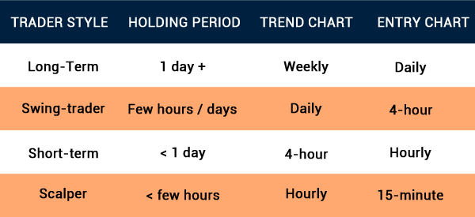

## Table of Contents

## What is day trading and why is the timeframe important?

Day trading is when people buy and sell stocks or other things in one day. They try to make money from small changes in prices during that day. Day traders watch the market closely and make quick decisions. They don't keep their investments overnight because they want to avoid risks that can happen when the market is closed.

The timeframe is important in day trading because it affects how much money you can make and how much risk you take. Day traders need to act fast, often within minutes or hours, to take advantage of small price movements. If they wait too long, they might miss their chance to make a profit. Also, by closing their trades before the end of the day, they can avoid big changes in price that might happen overnight when they can't do anything about it.

## What are the common timeframes used in day trading?

In day trading, people often use short timeframes to make their decisions. The most common ones are the 1-minute, 5-minute, and 15-minute charts. These short timeframes help traders see quick changes in price and act fast. For example, a 1-minute chart shows what's happening every minute, so traders can jump in and out of trades very quickly.

Some day traders also use longer timeframes like the 30-minute or 1-hour charts. These can give a bigger picture of what's happening in the market during the day. They help traders see trends that might last a bit longer than just a few minutes. By looking at these different timeframes, traders can make better choices about when to buy and sell.

Overall, the choice of timeframe depends on what the trader wants to do. If they want to make many quick trades, they might stick to the shorter timeframes. If they want to catch bigger moves that happen over a few hours, they might use the longer ones. It's all about finding the right balance between speed and seeing the bigger picture.

## How does the 1-minute chart benefit beginners in day trading?

The 1-minute chart helps beginners in [day trading](/wiki/day-trading-spy) by showing them quick changes in prices. This makes it easier for them to see what's happening right now in the market. Beginners can practice making fast decisions without waiting too long. They can see if a stock is going up or down in just a minute, which helps them learn how to react quickly.

Using a 1-minute chart also lets beginners start with small trades. They can try to make money from small price movements without risking too much. This way, they can learn the basics of day trading without losing a lot of money. As they get better, they can move to longer timeframes, but starting with the 1-minute chart helps them build confidence and skills.

## What are the advantages of using a 5-minute chart for day trading?

A 5-minute chart is good for day trading because it gives you a bit more time to think about your trades. It's not as fast as a 1-minute chart, so you don't have to make decisions as quickly. This can help you see trends that last a little longer than just a minute. You can watch how a stock moves over several minutes and decide if it's going up or down.

Using a 5-minute chart also helps you avoid getting too caught up in every little price change. Sometimes, prices can jump around a lot in just a minute, and it can be hard to tell what's really happening. With a 5-minute chart, you can see the bigger picture and make better choices. It's a good middle ground between the very fast 1-minute chart and the slower 15-minute or longer charts.

## Can you explain the use of a 15-minute chart in day trading?

A 15-minute chart is useful for day traders because it shows how prices move over a longer period than the shorter timeframes. This helps traders see bigger trends that might last for a while. Instead of focusing on tiny price changes, traders can look at how a stock moves over 15 minutes and decide if it's going up or down. This can make it easier to spot good times to buy or sell.

Using a 15-minute chart also helps traders avoid getting too caught up in every little price jump. Sometimes, prices can move a lot in just a few minutes, and it can be hard to tell what's really happening. With a 15-minute chart, you can see the bigger picture and make better decisions. It's a good choice for traders who want to catch bigger moves in the market without having to watch the screen every second.

## How does trading on a 30-minute chart differ from shorter timeframes?

Trading on a 30-minute chart is different from shorter timeframes because it shows you what's happening over a longer period. With a 30-minute chart, you can see bigger trends that might last for a while. This means you don't have to make quick decisions like you do with 1-minute or 5-minute charts. Instead, you can take your time to see if a stock is going up or down over half an hour. This can help you make better choices about when to buy or sell.

Using a 30-minute chart also helps you avoid getting too focused on small price changes. On shorter timeframes, prices can jump around a lot, and it can be hard to tell what's really happening. With a 30-minute chart, you get a clearer picture of the market's direction. This can be less stressful because you don't have to watch the screen every second. It's a good choice if you want to catch bigger moves in the market without feeling rushed.

## What are the pros and cons of using hourly charts for day trading?

Using hourly charts for day trading can help you see big trends that last for a few hours. This makes it easier to make decisions without feeling rushed. You can watch how a stock moves over an hour and decide if it's going up or down. This can help you make better choices about when to buy or sell. Also, hourly charts can be less stressful because you don't have to watch the screen every second. It's a good choice if you want to catch bigger moves in the market without feeling rushed.

But, there are some downsides to using hourly charts. Because the time between each bar is longer, you might miss out on smaller price changes that happen in between. If you're waiting for an hour to pass, you might miss a good chance to make a quick profit. Also, if the market moves quickly, you might not be able to react fast enough with an hourly chart. So, while hourly charts can help you see bigger trends, they might make you miss out on smaller, quicker opportunities.

## How can a day trader effectively use multiple timeframes?

A day trader can use multiple timeframes to get a better understanding of the market. By looking at different timeframes, like a 1-minute, 5-minute, and 15-minute chart, a trader can see both the small price changes and the bigger trends. For example, they might use a 1-minute chart to find the best time to enter a trade, but then look at a 15-minute chart to see if the overall trend supports their decision. This way, they can make sure they are trading in the direction of the bigger trend, which can increase their chances of making a profit.

Using multiple timeframes also helps a trader manage their trades better. They can use a shorter timeframe to set their entry and [exit](/wiki/exit-strategy) points, but then use a longer timeframe to decide when to hold onto a trade longer or when to close it. For instance, if a trader sees a good entry point on a 5-minute chart, they might check the 30-minute chart to see if the trend is strong enough to keep the trade open for a bigger gain. By combining information from different timeframes, a trader can make more informed decisions and improve their trading strategy.

## What technical indicators work best with different timeframes in day trading?

When day trading, the choice of technical indicators can depend on the timeframe you're using. For short timeframes like 1-minute or 5-minute charts, fast-moving indicators like the Relative Strength Index (RSI) and Moving Average Convergence Divergence (MACD) work well. These indicators help you see quick changes in price and [momentum](/wiki/momentum). For example, the RSI can show if a stock is overbought or oversold in just a few minutes, helping you decide when to buy or sell. The MACD can help you spot when the momentum is changing, which is useful for making quick trades.

For longer timeframes like 15-minute or 30-minute charts, slower indicators like Simple Moving Averages (SMA) and Bollinger Bands can be more helpful. These indicators give you a better view of the bigger trends. A Simple Moving Average can show you the general direction of the stock over a longer period, helping you decide if it's a good time to enter or exit a trade. Bollinger Bands can help you see if a stock is moving too far from its average price, which can signal when a price might come back to the middle or keep going in the same direction. By using these indicators on longer timeframes, you can make more informed decisions about holding onto trades for bigger gains.

When using multiple timeframes, you can combine different indicators to get a fuller picture of the market. For example, you might use the RSI on a 1-minute chart to find a good entry point, but then check the SMA on a 15-minute chart to see if the overall trend supports your trade. This way, you can use fast indicators for quick decisions and slower indicators to understand the bigger picture. By mixing and matching indicators with different timeframes, you can improve your trading strategy and increase your chances of success.

## How does market volatility affect the choice of timeframe for day trading?

Market [volatility](/wiki/volatility-trading-strategies), which means how much prices go up and down, can change how day traders pick their timeframes. When the market is very volatile, prices can change a lot in just a few minutes. This makes shorter timeframes like 1-minute or 5-minute charts more useful. Traders can see these quick changes and make fast trades to take advantage of them. If they use longer timeframes like 30 minutes or an hour, they might miss out on these quick moves and not make as much money.

On the other hand, when the market is not very volatile, prices don't change as much. In this case, longer timeframes like 15-minute or 30-minute charts can be better. Traders can see bigger trends that last longer and make trades based on these trends. Using shorter timeframes in a less volatile market might not be as helpful because there aren't as many quick price changes to take advantage of. So, traders need to think about how volatile the market is when they choose their timeframes for day trading.

## What are advanced strategies for optimizing timeframe selection in day trading?

Advanced day traders often use a strategy called multi-timeframe analysis to optimize their trading. This means they look at different timeframes at the same time to get a better understanding of the market. For example, they might use a 1-minute chart to find the best time to enter a trade, but then check a 15-minute or 30-minute chart to see if the bigger trend supports their decision. By doing this, they can make sure they are trading in the direction of the bigger trend, which can increase their chances of making a profit. They also use technical indicators that match the timeframe they are looking at. Fast indicators like RSI and MACD work well on short timeframes, while slower indicators like Simple Moving Averages and Bollinger Bands are better for longer timeframes.

Another strategy is to adjust the timeframe based on market volatility. When the market is very volatile, traders might focus on shorter timeframes like 1-minute or 5-minute charts to catch quick price changes. But when the market is less volatile, they might switch to longer timeframes like 15-minute or 30-minute charts to see bigger trends that last longer. This way, they can adapt their trading to the current market conditions and make the most of the opportunities available. By being flexible with their timeframe selection, advanced traders can improve their trading performance and manage their risks better.

## How do professional day traders adapt their timeframe strategies based on market conditions?

Professional day traders change their timeframe strategies depending on what's happening in the market. When the market is moving a lot and prices are changing quickly, they use short timeframes like 1-minute or 5-minute charts. This helps them see these quick changes and make fast trades to make money from them. If they used longer timeframes during high volatility, they might miss out on these quick moves and not make as much money. So, they keep an eye on the market and switch to shorter timeframes when things are moving fast.

When the market is not moving as much and prices are more stable, professional traders might switch to longer timeframes like 15-minute or 30-minute charts. These longer timeframes help them see bigger trends that last longer. Using short timeframes in a less volatile market might not be as helpful because there aren't as many quick price changes to take advantage of. By adjusting their timeframes based on how volatile the market is, professional traders can make the most of the opportunities available and manage their risks better.

## References & Further Reading

[1]: Bergstra, J., Bardenet, R., Bengio, Y., & Kégl, B. (2011). ["Algorithms for Hyper-Parameter Optimization."](https://papers.nips.cc/paper/4443-algorithms-for-hyper-parameter-optimization) Advances in Neural Information Processing Systems 24.

[2]: ["Advances in Financial Machine Learning"](https://www.amazon.com/Advances-Financial-Machine-Learning-Marcos/dp/1119482089) by Marcos Lopez de Prado

[3]: ["Evidence-Based Technical Analysis: Applying the Scientific Method and Statistical Inference to Trading Signals"](https://www.amazon.com/Evidence-Based-Technical-Analysis-Scientific-Statistical/dp/0470008741) by David Aronson

[4]: ["Machine Learning for Algorithmic Trading"](https://github.com/stefan-jansen/machine-learning-for-trading) by Stefan Jansen

[5]: ["Quantitative Trading: How to Build Your Own Algorithmic Trading Business"](https://books.google.com/books/about/Quantitative_Trading.html?id=j70yEAAAQBAJ) by Ernest P. Chan