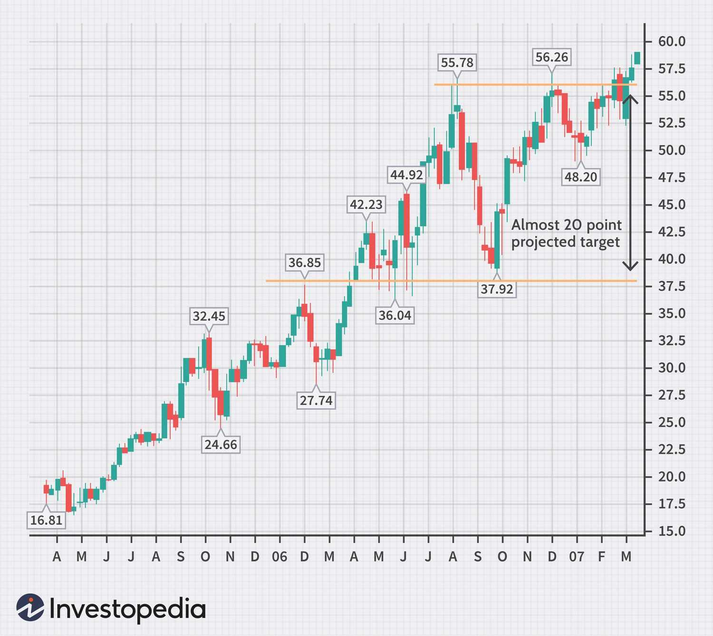

Algorithmic trading, commonly referred to as algo trading, is increasingly popular among both retail and institutional traders due to its efficiency and precision in executing trades. By automating the trading process, algorithms can quickly analyze market data and execute transactions without the interference of human emotions, which often lead to suboptimal trading decisions. This efficiency allows traders to implement complex strategies that would be difficult to manage manually. 

For beginners venturing into algo trading, choosing the right trading timeframe is a critical decision that greatly influences the performance of their strategies. The timeframe determines the data analyzed and the frequency of trade executions. With a myriad of options ranging from seconds to days, each timeframe offers distinct advantages and challenges that align with specific trading styles and risk tolerances. Therefore, understanding the impact of timeframe selection is essential for newcomers to optimize their strategies and enhance their trading performance. This article serves as a guide for beginners to understand and select the most suitable timeframes for their algorithmic trading pursuits.



## Table of Contents

## Understanding Algo Trading

Algorithmic trading, or algo trading, is the application of algorithms to automate trading activities, enabling rapid decision-making and prompt execution of trades. This method leverages predetermined instructions based on time, price, or volume to perform tasks that traditionally required human intervention. The primary goal of algo trading is to capitalize on the speed, precision, and efficiency of computer algorithms, mitigating the risks of human error and emotional bias.

### Key Components of an Algo Trading System

1. **Data Sources**: Accurate and timely data is essential for the success of any algo trading system. Traders rely on a variety of data points, including market prices, economic indicators, and historical patterns. Data feeds may come from various sources like exchanges, financial news platforms, and proprietary vendors. The quality and granularity of data significantly influence the effectiveness of the algorithm's strategy.

2. **The Algorithm**: At the core of algo trading is the algorithm itself, a set of mathematical instructions or rules designed to identify trading opportunities. Algorithms can vary from simple strategies like moving averages to more complex models using machine learning techniques. The choice of algorithm impacts the strategy's responsiveness and risk management capabilities.

3. **Execution Platform**: Once a trading opportunity is detected, the execution platform carries out the transaction. These platforms must be equipped with robust systems capable of managing large volumes of orders with minimal delay. High-frequency trading (HFT) platforms, for example, prioritize speed and are designed to execute orders in milliseconds.

### Benefits of Algo Trading

The primary advantage of algo trading is its speed, as algorithms can analyze and execute trades much faster than a human trader. This rapid execution reduces the time between identifying an opportunity and acting on it, potentially improving profitability. Additionally, algorithms can process vast amounts of information and simultaneously monitor numerous markets, which is impractical for human traders.

Another benefit is the elimination of emotional responses that often interfere with trading decisions. Algorithms follow predefined rules, maintaining consistency in executing trades according to the strategy's logic. This objectivity can be particularly valuable in volatile markets, where emotions like fear and greed can lead to poor decision-making.

### Example of a Simple Trading Algorithm

Consider a basic moving average crossover strategy, where a short-term moving average (SMA) is compared to a long-term moving average (LMA). The algorithm may be coded in Python as follows:

```python
import pandas as pd

def moving_average_crossover(data, short_window, long_window):
    signals = pd.DataFrame(index=data.index)
    signals['price'] = data['price']
    signals['short_mavg'] = data['price'].rolling(window=short_window, min_periods=1).mean()
    signals['long_mavg'] = data['price'].rolling(window=long_window, min_periods=1).mean()

    signals['signal'] = 0
    signals['signal'][short_window:] = np.where(signals['short_mavg'][short_window:] > signals['long_mavg'][short_window:], 1, 0)

    signals['positions'] = signals['signal'].diff()

    return signals
```

This simple algorithm generates buy signals when the short-term moving average crosses above the long-term moving average and sell signals when the crossover occurs in the opposite direction.

In conclusion, algo trading represents a paradigm shift in the field of trading, favoring speed, precision, and objectivity. By integrating data, algorithms, and execution platforms, traders can efficiently exploit market opportunities while minimizing human error and emotional biases.

## Importance of Choosing the Right Time Frame

The choice of trading timeframe plays a pivotal role in the performance and effectiveness of [algorithmic trading](/wiki/algorithmic-trading) strategies. It impacts the way trends are analyzed and trades are executed, ultimately influencing profitability. Different timeframes can offer distinct advantages and disadvantages depending on various factors such as market [volatility](/wiki/volatility-trading-strategies), trading objectives, and individual risk tolerance.

Timeframes in algo trading can range from seconds to days, each serving a distinct purpose. Shorter timeframes, like the 1-minute or 5-minute chart, allow traders to capitalize on minor price movements and quick opportunities. However, these timeframes can be susceptible to market noise and false signals, which might lead to increased trading costs and the potential for overtrading. This can pose significant challenges for beginners who may not yet have refined their analytical skills or risk management practices.

Conversely, longer timeframes, such as the 1-hour, 4-hour, or daily chart, provide broader perspectives on market trends, which can help in reducing the influence of noise and increase the chance of identifying significant price trends. These timeframes align well with beginners' requirements as they offer more time to make decisions and reduce the pressure of responding to rapid market changes. This approach supports effective risk management and may result in more stable trading outcomes.

It's crucial for beginners to select a timeframe that complements their trading style. A scalper, for example, may require a much shorter timeframe to benefit from swift trades, while a trend follower may prefer longer timeframes to capture larger price movements. Additionally, an understanding of personal risk tolerance is essential. Lower timeframes typically involve higher frequency trading, which might not suit all traders due to increased transaction costs and stress.

Selecting the appropriate timeframe also involves considering market volatility. High volatility environments may favor shorter timeframes if the trader aims to take advantage of rapid price movements. However, for those focused on strategic planning and minimizing risk exposure, longer timeframes might be preferred, allowing for a more considered evaluation of market conditions.

In conclusion, choosing the right trading timeframe is a fundamental aspect that can determine the success or failure of an algo trading strategy. Beginners are encouraged to align their timeframe choices with their overall trading strategy, risk management plans, and personal trading goals. This strategic alignment will aid in optimizing their trading performance and elevating their experience as they develop their skills in algorithmic trading.

## Popular Trading Timeframes

In algorithmic trading, selecting the appropriate trading timeframe is critical, as it significantly influences the performance of trading strategies. Common timeframes used in algo trading include 1-minute, 15-minute, 1-hour, and 4-hour charts, each offering distinct characteristics and benefits.

The **1-minute timeframe** is often favored by scalpers due to its responsiveness to small price movements. Scalping essentially involves making numerous trades over short periods to capitalize on minimal price changes. The 1-minute chart allows traders to quickly exploit these opportunities. However, this sensitivity comes with a downside: the increased potential for noise and false signals. Rapid market movements can lead to overreactive trading decisions, which might detract from overall profitability if not managed carefully.

For beginners in [day trading](/wiki/day-trading-spy), the **15-minute and 1-hour timeframes** offer a balance between reducing noise and observing trends. Unlike the 1-minute chart, these timeframes present a clearer picture of the market's larger movements, thus allowing traders to identify more substantial trends and reversals. The 15-minute chart provides sufficient granularity for short-term trades while minimizing the risk of noise. Similarly, the 1-hour chart further smooths price fluctuations, giving a more stable view of trend direction, making it favorable for new traders learning to identify entry and [exit](/wiki/exit-strategy) points effectively.

The **4-hour timeframe** is particularly valuable for analyzing broader market trends and managing risk. This timeframe reduces short-term price volatility, allowing traders to focus on significant movements and enduring trends. As such, it serves as a tool for those aiming to understand the bigger picture, thus supporting more informed decision-making. The extended view helps in identifying potential [breakout](/wiki/breakout-trading) points and resistance/support levels, which are crucial for planning strategic trades.

In summary, each timeframe offers unique advantages and limitations. The 1-minute chart caters to [scalping](/wiki/gamma-scalping) with high sensitivity to market movements, yet it can lead to false signals. The 15-minute and 1-hour charts strike a balance by reducing noise while highlighting trends, making them suitable for beginners in day trading. The 4-hour chart is ideal for those seeking a comprehensive market perspective, as it simplifies the identification of significant trends and optimizes risk management. Selecting the right timeframe is a key step in aligning trading strategies with individual risk tolerance and trading goals.

## Recommended Timeframes for Beginners

New algorithmic traders are typically recommended to begin with higher timeframes, such as 1-hour or 4-hour charts. These longer timeframes offer a more stable view of the market, allowing beginners to discern clear trends without being overwhelmed by the volatility often seen in shorter timeframes. This stability is crucial for mitigating risk and reducing the likelihood of making impulsive decisions.

Higher timeframes act as a buffer against the noise and random price fluctuations that characterize shorter intervals. By focusing on 1-hour or 4-hour charts, traders can observe significant market movements and patterns that develop over a longer period, providing a more accurate representation of market sentiment.

Moreover, using higher timeframes helps beginners develop patience, a vital trait for successful trading. Patience in trading means waiting for the right moment to enter or exit a trade based on solid analysis, rather than reacting hastily to minor price changes. This waiting game teaches new traders to restrain their impulses and to rely more on analytical skills than emotional responses.

Higher timeframes also aid in improving market analysis skills. By requiring traders to focus on significant market movements, they must learn to interpret overarching trends rather than focusing solely on transient fluctuations. This focus can lead to a deeper understanding of market dynamics and better decision-making over time.

Overall, starting with higher timeframes is advantageous for both risk management and skill development, providing a strong foundation upon which beginners can build more advanced trading strategies as they gain experience and confidence.

## Integrating Multiple Timeframes

Integrating multiple timeframes is an essential technique for traders seeking to deepen their market analysis and refine their entry and exit strategies. By using multiple timeframes, traders can gain a more comprehensive understanding of market conditions. This technique involves analyzing a financial instrument through different time intervals to identify broader trends and precise trading opportunities.

At the core of multiple timeframe analysis is the principle that markets move in fractals, meaning patterns repeat at various scales. By observing these patterns across different timeframes, traders can verify trends and avoid false signals. For instance, a trader might use a longer timeframe, such as a daily chart, to identify the primary trend and a shorter timeframe, such as an hourly chart, to pinpoint precise entry or exit points.

The practical application of multiple timeframes can be illustrated with the following process:

1. **Identify the Main Trend**: Start by analyzing a higher timeframe chart to determine the dominant trend direction. For long-term trends, weekly or monthly charts can be used. This helps establish a directional bias.

2. **Refine with Intermediate Timeframes**: Use an intermediate timeframe to look for signals that align with the main trend identified. For instance, if the daily chart indicates an uptrend, the 4-hour chart might be used next to look for bullish setups.

3. **Execute on Lower Timeframes**: Finally, a lower timeframe is utilized to execute trades. The hourly or even 15-minute charts can help traders spot the optimal entries or exits within the context of the broader trend.

Here's a basic example of how a trader might structure this in Python with sample pseudo-code:

```python
def analyze_multiple_timeframes(data, higher_tf, intermediate_tf, lower_tf):
    # Analyze the main trend using higher timeframe data
    main_trend = identify_trend(data, timeframe=higher_tf)

    # Use intermediate timeframe to refine entry signals
    refined_signals = identify_entry_signals(data, trend=main_trend, timeframe=intermediate_tf)

    # On the lower timeframe, execute the trade based on refined signals
    execute_trades(data, signals=refined_signals, timeframe=lower_tf)

def identify_trend(data, timeframe):
    # Implement trend identification logic
    pass

def identify_entry_signals(data, trend, timeframe):
    # Implement signal identification logic
    pass

def execute_trades(data, signals, timeframe):
    # Implement trade execution logic
    pass
```

Integrating multiple timeframes can significantly aid traders in avoiding misleading market signals and improve their decision-making capabilities. By gaining insights from different perspectives, traders enhance their ability to adapt their strategies to varying market conditions and improve their overall trading results. This approach fosters a more disciplined and structured trading process, with decisions made on a foundation of multi-layered analysis.

## Importance of Backtesting

Backtesting is a critical component of algorithmic trading, serving as a strategic assessment tool that utilizes historical data to evaluate how a trading strategy might perform under varying market conditions. This process involves simulating trades based on past data to predict the effectiveness of trading strategies before they are deployed in real-time markets. The core relevance of [backtesting](/wiki/backtesting) lies in its capacity to provide traders with insights into the potential performance of their strategies, helping to uncover weaknesses and refine execution approaches.

One of the primary benefits of backtesting is its ability to expose potential flaws that could lead to significant losses in live trading. By rigorously analyzing a strategy against historical data, traders can identify weaknesses or inefficiencies that need adjustments. This might involve tweaking algorithmic parameters, reassessing risk management protocols, or altering entry and exit criteria to optimize strategy performance.

To conduct a backtest, traders often utilize software platforms and coding environments such as Python to automate the process. Python's robust libraries, such as Pandas for data manipulation and NumPy for numerical computation, facilitate efficient backtest design and execution. A basic outline of a backtest in Python might involve the following steps:

```python
import pandas as pd

# Fetch historical data
data = pd.read_csv('historical_data.csv')

# Define the strategy (a simple moving average crossover strategy)
short_window = 40
long_window = 100

# Calculate short and long moving averages
data['short_mavg'] = data['Close'].rolling(window=short_window, min_periods=1).mean()
data['long_mavg'] = data['Close'].rolling(window=long_window, min_periods=1).mean()

# Generate trading signals
data['signal'] = 0.0
data['signal'][short_window:] = np.where(data['short_mavg'][short_window:] > data['long_mavg'][short_window:], 1.0, 0.0)
data['positions'] = data['signal'].diff()
```

In this example, a simple moving average crossover strategy is backtested. The code computes short and long-term moving averages to generate buy and sell signals, offering a glimpse into how the strategy might have performed historically.

By performing thorough backtesting, traders can determine the most effective timeframes for their strategies, choosing durations that align closely with identified trends and market nuances. Additionally, backtesting aids in calibrating the frequency of trades to balance between capturing opportunities and managing transaction costs.

Ultimately, backtesting not only refines strategy designs but also instills confidence in traders by reducing the uncertainty associated with algorithmic trading decisions. This comprehensive evaluation step is indispensable for building robust trading algorithms capable of navigating the complexities of financial markets effectively.

## Conclusion

Algorithmic trading, often referred to as algo trading, has become increasingly attractive to new traders, primarily due to its systematic approach and ability to eliminate emotional biases. Central to achieving success in algo trading is the selection of the appropriate trading timeframe. Timeframes dictate the strategy's effectiveness in analyzing trends and executing trades. For beginners, this choice is particularly crucial as it can substantially influence trading outcomes.

Experimenting with various timeframes allows traders to understand how different market conditions affect their strategies. By using backtesting, traders can simulate their strategies on historical data to assess performance across different timeframes. This practice helps in identifying the optimal timeframe that offers a balance between capturing trends and minimizing noise, leading to better-informed trading decisions.

Understanding how timeframes and trading strategies interact is fundamental to mastering algo trading. Traders must consider the characteristics of each timeframe and align them with their trading goals and risk tolerance. Through continuous evaluation and refinement of strategies, traders can develop a robust trading approach that navigates the complexities of the financial markets effectively.

In conclusion, selecting the right timeframe is a pivotal decision for beginners in algo trading. By conducting thorough backtesting and remaining adaptive in their strategy development, traders can enhance their ability to generate profitable trading outcomes. This understanding and adaptability are crucial as they embark on their algo trading journey.

## Frequently Asked Questions (FAQs)

What are the advantages of algo trading over manual trading?

Algorithmic trading offers several benefits over manual trading primarily due to its automation and precision. One of the key advantages is the ability to execute trades at much higher speeds than a human trader could achieve, as computers can process vast amounts of data and identify trading opportunities almost instantaneously. This speed allows for the capturing of fleeting market opportunities that might be missed by manual methods. Additionally, algo trading reduces human emotion from the decision-making process, minimizing biases and emotional reactions that could lead to poor trading decisions. Algorithms trade based on pre-defined criteria, ensuring consistency and discipline in trade execution. Furthermore, algo trading can handle multiple markets and instruments simultaneously, enhancing diversification and optimizing market exposure.

How do I know which timeframe is best suited to my trading strategy?

Selecting the most appropriate timeframe for a trading strategy involves assessing several factors. Traders should consider their specific trading goals, risk tolerance, and the nature of their strategy. For instance, strategies relying on quick price changes, such as scalping, generally align with shorter timeframes like the 1-minute chart due to the need for rapid responses and frequent trades. Conversely, strategies that focus on capturing larger market trends may benefit from longer timeframes, such as the 1-hour or 4-hour charts. Additionally, backtesting a strategy across different timeframes can provide insights into its performance under various market conditions, helping traders identify the timeframe that maximizes their strategy's effectiveness. It is also beneficial to consider the average volatility and [liquidity](/wiki/liquidity-risk-premium) of the asset class in question when choosing a timeframe.

Can I switch timeframes once I'm more experienced?

Yes, switching timeframes as you gain more experience is not only possible but often advisable. As traders become more familiar with market behaviors and their own strategies, they may find that alternative timeframes offer better alignment with their trading objectives or enhanced risk management. Transitioning to different timeframes enables traders to adapt to changing market conditions, refine their strategies, and explore new opportunities. This flexibility allows for continuous learning and evolution in trading practices. It’s crucial, however, to conduct thorough analysis and backtesting when transitioning to new timeframes to ensure that it augments rather than hinders overall trading performance. Experienced traders often integrate multiple timeframes to gain a broader market perspective and make more informed trading decisions.

## References & Further Reading

[1]: Bergstra, J., Bardenet, R., Bengio, Y., & Kégl, B. (2011). ["Algorithms for Hyper-Parameter Optimization."](https://papers.nips.cc/paper/4443-algorithms-for-hyper-parameter-optimization) Advances in Neural Information Processing Systems 24.

[2]: ["Advances in Financial Machine Learning"](https://www.amazon.com/Advances-Financial-Machine-Learning-Marcos/dp/1119482089) by Marcos Lopez de Prado

[3]: ["Evidence-Based Technical Analysis: Applying the Scientific Method and Statistical Inference to Trading Signals"](https://www.amazon.com/Evidence-Based-Technical-Analysis-Scientific-Statistical/dp/0470008741) by David Aronson

[4]: ["Machine Learning for Algorithmic Trading"](https://github.com/stefan-jansen/machine-learning-for-trading) by Stefan Jansen

[5]: ["Quantitative Trading: How to Build Your Own Algorithmic Trading Business"](https://books.google.com/books/about/Quantitative_Trading.html?id=j70yEAAAQBAJ) by Ernest P. Chan