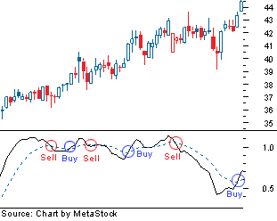

Stock market volatility is a critical concern for both investors and traders as it directly impacts the potential for financial gain or loss. Volatility represents the degree of variation in a trading price series over time, usually measured by the standard deviation of logarithmic returns. High volatility often signifies uncertainty and elevated risk, posing significant challenges to market participants. Investors, who typically adopt a long-term perspective, may find volatility unsettling as it can lead to unpredictable portfolio valuations. For traders, particularly those who engage in short-term strategies, volatility can present opportunities for profit while simultaneously increasing the risk of substantial losses.

Whipsaw stock movements are among the most prominent challenges associated with volatile markets. A whipsaw occurs when a stock's price suddenly shifts in one direction and almost immediately reverses, causing potential losses to traders who acted on the initial movement. For instance, an upward whipsaw might initially entice buying activity, only for a sudden decline to trigger sell-offs at a loss. Conversely, a downward whipsaw could encourage short selling, followed by a rapid price recovery that inflicts losses on those who bet against the stock.



Algorithmic trading has emerged as an influential tool in managing the unpredictability associated with volatile market conditions. Algorithms can process vast amounts of data at high speeds, allowing for rapid adjustments in trading strategies that can respond effectively to sudden market shifts. They execute trades based on predefined rules and models, which are updated continually to align with market dynamics. This technology offers potential advantages in mitigating the adverse effects of whipsaw movements by optimizing entry and exit points, thus minimizing losses. As such, algorithmic trading has become increasingly popular among institutional and individual traders seeking to navigate the complexities of modern financial markets.

## Table of Contents

## Understanding Whipsaw Stock Prices

Whipsaw is a term used in stock trading to describe a highly volatile market condition characterized by sharp, sudden price movements in opposite directions. This phenomenon can be particularly significant for traders as it often leads to quick reversals in market trends that can result in unexpected financial losses if not managed correctly.

There are two primary types of whipsaw patterns. The first type involves an upward price movement followed by a sharp decline. This scenario typically occurs when a stock exhibits a rally, prompting traders to buy on the expectation of continued growth, only for the price to plummet unexpectedly. The second type presents a downward movement followed by a rapid rise. Here, the stock initially experiences a drop, which may trigger sell-offs as traders anticipate further decline, but then recovers swiftly, reversing any potential losses.

These swift transitions are driven by various factors, such as sudden news announcements or changes in investor sentiment, that may not always be predictable. Traders caught in whipsaw situations can face significant losses. For example, those buying during a market rally might incur losses when the price falls sharply afterward. Similarly, traders selling during a downturn might miss out on substantial gains if the price rebounds unexpectedly.

To better understand whipsaw impacts, a hypothetical scenario can be simulated using a simple Python code snippet that models price movements:

```python
import numpy as np
import matplotlib.pyplot as plt

# Simulate stock price data with a whipsaw effect
np.random.seed(0)
initial_price = 100
time_steps = 100
# Simulate initial upward movement, then drop, then rise
price_changes = np.random.normal(0, 1, time_steps)
upward = np.linspace(0, 5, time_steps//3)
downward = np.linspace(0, -10, time_steps//3)
recovery = np.linspace(0, 7, time_steps//3)
price_changes[:time_steps//3] += upward
price_changes[time_steps//3:2*time_steps//3] += downward
price_changes[2*time_steps//3:] += recovery

prices = initial_price + np.cumsum(price_changes)

# Plot the simulated stock prices
plt.plot(prices)
plt.title("Simulated Whipsaw Stock Prices")
plt.xlabel("Time Steps")
plt.ylabel("Stock Price")
plt.grid(True)
plt.show()
```

In this simulated scenario, a stock initially increases in price, followed by a significant drop, and then recovers. Traders who make decisions solely based on the initial upward or downward trends might find themselves at a disadvantage, experiencing whipsaw losses. Understanding these movements and having strategies in place to mitigate these risks is crucial for minimizing financial setbacks in volatile market conditions.

## Factors Contributing to Market Volatility

Market [volatility](/wiki/volatility-trading-strategies) is influenced by various factors that make predicting stock prices challenging. Understanding these factors helps in anticipating potential market swings, particularly whipsaw patterns, where sharp price reversals occur. Several key elements contribute to such volatility.

### Macroeconomic Factors

**Inflation** is a primary macroeconomic indicator affecting market volatility. High inflation rates often lead to increased uncertainty, as they can erode purchasing power and lead to higher interest rates. This, in turn, affects corporate profits and stock prices, causing volatility. Investors may react unpredictably to inflation data, leading to sudden price swings.

**Geopolitical Tensions** also play a crucial role in market volatility. Events such as wars, political instability, or trade conflicts can disrupt markets, resulting in abrupt stock price movements. Geopolitical risks increase speculation and investor uncertainty, amplifying the odds of whipsaw price actions.

### Impact of Sudden News and Earnings Reports

**Sudden News** can dramatically influence stock prices. Information like changes in government policies, natural disasters, or unexpected economic data releases can lead to swift market reactions. The rapid dissemination of news through digital platforms can intensify these movements, contributing to market volatility.

**Earnings Reports** are another catalyst for volatility. Companies' quarterly earnings can exceed, meet, or fall short of market expectations, and this can lead to significant price adjustments. Analysts’ forecasts, guidance revisions, and CEO comments during earnings calls might also spur price oscillations, leading to potential whipsaw scenarios.

### Technical Indicators

Technical analysis provides tools to anticipate potential whipsaws through the evaluation of historical price patterns and trading [volume](/wiki/volume-trading-strategy). Indicators such as the **Relative Strength Index (RSI)** and **Moving Averages** are commonly used by traders to identify overbought or oversold conditions, which may suggest an impending reversal.

For instance, a sharp divergence between price movements and RSI levels can indicate a potential whipsaw. Similarly, when short-term moving averages cross long-term ones, it may signal a reversal, contributing to potential market volatility.

These factors collectively underscore the complexities of market volatility. While they provide essential insights, the unpredictable nature of market reactions to these stimuli makes managing such volatility a constant challenge for both traders and investors.

## Algorithmic Trading and Market Volatility

Algorithmic trading, often referred to as algo trading, utilizes computer programs and algorithms to execute financial market orders. These automated strategies are designed to follow a pre-defined set of rules and parameters, enabling high-speed and high-frequency trading that surpasses human capabilities. The growing popularity of [algorithmic trading](/wiki/algorithmic-trading) in financial markets stems from its ability to swiftly analyze market conditions, manage a large number of trades efficiently, and minimize human errors.

Central to algorithmic trading is the rapid and systematic processing of data, including historical price movements, market orders, and economic indicators. By leveraging advanced statistical models and [machine learning](/wiki/machine-learning) techniques, these algorithms can recognize trading opportunities and execute trades with precision. This is particularly beneficial in volatile markets, where rapid price fluctuations demand quick decision-making.

Algorithms manage trade execution amidst volatile stock prices through several mechanisms. They can be programmed to identify [arbitrage](/wiki/arbitrage) opportunities, execute trades based on [momentum](/wiki/momentum) strategies, or even apply mean reversion principles. During periods of whipsaw movements, where prices can change directions unexpectedly, algorithms are adept at adjusting their strategies in real-time to capitalize on short-lived market inefficiencies.

For instance, a common practice in algorithmic trading is the use of stop-loss orders, which automatically sell a security when it reaches a certain price threshold. This approach helps in managing risks by limiting potential losses during adverse market swings. Additionally, algorithms might use trailing stops, which adjust the stop-loss trigger as the price of a security moves favorably, locking in profits while protecting against reversals.

Moreover, algorithms can potentially mitigate losses during whipsaws by dynamically changing trading strategies based on incoming market data. For example, machine learning models can predict short-term volatility spikes and adjust position sizes accordingly. This adaptability is crucial in minimizing the impact of sudden market reversals, thus preserving capital.

An example of a simple algorithmic trading strategy to handle volatility might look like this in Python:

```python
import numpy as np

def trading_strategy(prices, stop_loss_pct=0.05, take_profit_pct=0.1):
    """
    Executes a basic strategy with stop-loss and take-profit mechanisms.
    """
    invested = False
    entry_price = 0
    portfolio_value = 10000  # Starting capital

    for price in prices:
        if not invested:
            # Enter a position
            entry_price = price
            invested = True

        elif invested:
            # Calculate stop-loss and take-profit thresholds
            stop_loss_price = entry_price * (1 - stop_loss_pct)
            take_profit_price = entry_price * (1 + take_profit_pct)

            # Exit position if conditions met
            if price <= stop_loss_price or price >= take_profit_price:
                portfolio_value += (price - entry_price)
                invested = False

    return portfolio_value
```

In this example, the algorithm checks whether the current price has reached a stop-loss or take-profit threshold, adjusting positions to safeguard the portfolio against excessive losses or to lock in gains.

Overall, algorithmic trading significantly enhances the ability of traders to manage volatile markets. By automating the decision-making process, it ensures that trades are executed efficiently and systematically. As market dynamics continue to evolve, the role of technology in trading will only become more critical, driving further innovation in algorithmic strategies.

## Strategies for Navigating Whipsaw Movements

Navigating whipsaw movements in the stock market requires a strategic approach tailored to different types of investors, such as long-term investors and short-term traders. For long-term investors, enduring market volatility involves maintaining a disciplined investment approach, focusing on diversification, and adhering to a long-term perspective. By distributing investments across various asset classes and geographic regions, investors can minimize the impact of localized market swings. A diversified portfolio reduces the risk associated with any single asset or market sector experiencing whipsaw effects. Moreover, investing consistently over time, rather than attempting to time the market, can mitigate the adverse impacts of temporary volatility.

For day traders and swing traders, capitalizing on price oscillations involves employing technical analysis and adopting agile trading strategies. Techniques such as momentum trading, where traders buy or sell based on the strength and direction of recent price trends, can be effective. Additionally, tools such as moving averages, Relative Strength Index (RSI), and Bollinger Bands provide insights into potential reversal points or continuation patterns. These indicators help traders make informed decisions about entering or exiting positions in response to sudden price changes typical of a whipsaw.

An important consideration in this context is the inherent risk of attempting to predict whipsaws. The unpredictable nature of these rapid, sharp price movements makes them difficult to foresee with consistent accuracy. Traders who speculate on the direction of short-term price movements without a solid strategy may face significant losses if their predictions are incorrect. To mitigate this risk, traders should employ strict risk management strategies, such as setting stop-loss orders to limit potential losses and avoid over-leveraging positions.

In summary, successful navigation of whipsaw movements involves a combination of strategic planning, disciplined execution, and a focus on diversification and risk management. This approach allows long-term investors to weather volatility with minimal disruption and equips traders with the tools needed to capitalize on potential profit opportunities while mitigating risks.

## Real World Examples and Case Studies

Stock market volatility is a phenomenon that has perplexed traders and investors for years. Among the various manifestations of this volatility, whipsaw events stand out due to their potential for causing significant financial losses or gains. This section explores some historical instances of whipsaw events, analyzes how certain traders successfully navigated these turbulent periods, and examines the adverse outcomes for those who were negatively impacted by unexpected market reversals.

### Historical Instances of Whipsaw Events

1. **The 1987 Black Monday**: On October 19, 1987, global stock markets experienced their largest single-day crash. The Dow Jones Industrial Average plunged by 22.6%, an occurrence that was unexpected and sudden. This whipsaw event was characterized by extreme volatility that caused panic among traders and investors.

2. **Dot-com Bubble Burst (2000-2002)**: As the internet rapidly expanded, tech stocks grew in a speculative bubble that eventually burst, leading to significant market swings. Stocks like Amazon and Cisco witnessed sharp climbs followed by swift declines, epitomizing severe whipsaw effects.

3. **Flash Crash of May 6, 2010**: In a matter of minutes, the U.S. stock markets plummeted, with the Dow Jones dropping about 1,000 points before quickly rebounding. This event caused a temporary whipsaw in stock prices, driven by a complex interplay of algorithmic trading and market liquidity issues.

***

### Effective Navigation by Successful Traders

Successful traders who managed these whipsaw events effectively often had two common strategies: diversification and risk management. For example, during the 2008 financial crisis, prominent investors like Warren Buffett avoided immediate panic selling and instead invested in undervalued companies, betting on their long-term recovery. 

Statistical models and sophisticated risk management techniques were also employed. Consider the use of Value at Risk (VaR), a statistical technique used to measure the potential loss in an investment portfolio over a specified period. Skilled traders adjusted their portfolios based on VaR estimates to limit exposure during volatile periods.

### Outcomes for Traders Hit by Market Reversals

Not all traders were as fortunate. Many retail investors suffered significant losses during events like the Flash Crash. These traders often lacked diversification and were exposed to high-risk assets without adequate hedging strategies. The failure to implement stop-loss orders further compounded their losses as they were unable to [exit](/wiki/exit-strategy) positions in time to avoid the impact of sharp reversals.

During the dot-com bubble burst, numerous tech investors faced huge losses due to speculative investments in unprofitable tech companies. Many believed the upward trend would continue indefinitely and were unprepared for the swift market correction.

### Conclusion

Overall, historical whipsaw events highlight the importance of sound trading strategies that include comprehensive risk management and diversification. While successful traders often adapt to whipsaw conditions by leveraging statistical and algorithmic tools, others may suffer due to inadequate preparation and reliance on speculative strategies. As such, awareness of potential market reversals and disciplined trading practices remain crucial in navigating the inherent unpredictability of financial markets.

## Conclusion

The phenomenon of whipsaw stock prices is deeply intertwined with market volatility, posing both challenges and opportunities for investors. Such unpredictable price swings can lead to substantial financial losses, as traders may make hasty decisions based on momentary fluctuations. However, understanding and navigating these movements can significantly impact investment outcomes.

Diversification emerges as a fundamental strategy to mitigate the risks associated with market volatility. By spreading investments across various asset classes, sectors, or geographic regions, investors can reduce the impact of a sudden downturn in any single investment on their overall portfolio. This not only cushions against losses but also positions investors to benefit from diverse market outcomes.

Disciplined trading approaches are equally crucial. This involves adherence to pre-determined trading plans and maintaining emotional control, especially during turbulent market conditions. Traders often rely on risk management techniques, such as stop-loss orders, to safeguard their investments from severe market reversals. Additionally, setting realistic profit and loss thresholds can help in maintaining discipline and optimizing returns in volatile markets.

The role of technology cannot be overstated in enhancing trading strategies amidst market volatility. Algorithmic trading has proven to be a game-changer, offering traders the ability to execute orders at speeds and accuracies unattainable by human traders. Algorithms can analyze vast amounts of data to identify trading opportunities and execute trades based on predefined criteria, thereby reducing the emotional biases that often lead to suboptimal trading decisions. Moreover, advancements in machine learning and [artificial intelligence](/wiki/ai-artificial-intelligence) continue to refine these systems, providing more sophisticated tools for navigating market complexities.

In summary, while whipsaw stock prices and market volatility present inherent challenges, they also offer opportunities for informed and strategic investors. Embracing diversification, maintaining disciplined trading approaches, and leveraging technological advancements play pivotal roles in effectively managing these market dynamics. By adopting these practices, traders and investors can better prepare for, and potentially thrive amidst, the uncertainties of the financial markets.

## References & Further Reading

[1]: Bergstra, J., Bardenet, R., Bengio, Y., & Kégl, B. (2011). ["Algorithms for Hyper-Parameter Optimization."](https://papers.nips.cc/paper/4443-algorithms-for-hyper-parameter-optimization) Advances in Neural Information Processing Systems 24.

[2]: ["Advances in Financial Machine Learning"](https://www.amazon.com/Advances-Financial-Machine-Learning-Marcos/dp/1119482089) by Marcos Lopez de Prado

[3]: ["Evidence-Based Technical Analysis: Applying the Scientific Method and Statistical Inference to Trading Signals"](https://www.amazon.com/Evidence-Based-Technical-Analysis-Scientific-Statistical/dp/0470008741) by David Aronson

[4]: ["Machine Learning for Algorithmic Trading"](https://github.com/stefan-jansen/machine-learning-for-trading) by Stefan Jansen

[5]: ["Quantitative Trading: How to Build Your Own Algorithmic Trading Business"](https://www.amazon.com/Quantitative-Trading-Build-Algorithmic-Business/dp/1119800064) by Ernest P. Chan