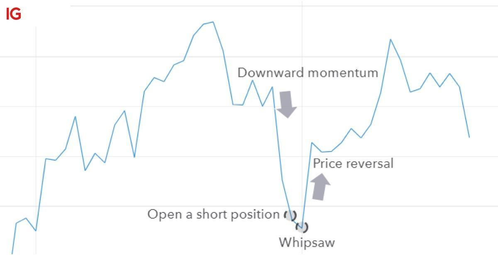

## Table of Contents

## What is the whipsaw effect in the context of stock prices?

The whipsaw effect in stock prices happens when the price of a stock goes up and down very quickly. It's like being jerked around by a whip. Investors see the price go up and think it's a good time to buy, but then it suddenly drops. Or they see it go down and think it's a good time to sell, but then it quickly goes back up. This can be confusing and frustrating for investors because it's hard to predict what will happen next.

This effect often happens during times when the market is very volatile, meaning prices are changing a lot. It can be caused by many things, like big news events or lots of people buying and selling at the same time. For investors, the whipsaw effect can lead to losses if they make decisions based on short-term price movements. It's important for investors to have a long-term plan and not react too quickly to these sudden changes in stock prices.

## How does the whipsaw effect impact short-term traders?

The whipsaw effect can be really tough on short-term traders. These traders try to make money by buying and selling stocks quickly, often within days or even hours. When the whipsaw effect happens, the stock price moves up and down a lot in a short time. This makes it hard for short-term traders to know when to buy or sell. They might buy a stock thinking it will go up, but then it suddenly drops, causing them to lose money. Or they might sell a stock thinking it will go down, but then it quickly goes back up, and they miss out on potential gains.

Because of the whipsaw effect, short-term traders can end up losing money if they make decisions based on these quick price changes. It can be stressful and confusing because the market seems unpredictable. To deal with this, some traders use stop-loss orders to limit their losses, but even these can be triggered by the whipsaw effect, leading to more losses. Overall, the whipsaw effect makes short-term trading riskier and more challenging, requiring traders to be very careful and have a solid strategy in place.

## Can you explain the causes of the whipsaw effect in stock markets?

The whipsaw effect in stock markets happens because of many reasons. One big reason is when there's a lot of news coming out that makes people unsure about what will happen next. For example, if there's news about a company doing really well or really badly, or if there's news about the economy, people might quickly buy or sell stocks. This can make the stock price go up and down a lot in a short time. Another reason is when a lot of people are trading at the same time. If many people are trying to buy or sell the same stock, it can cause the price to move a lot, creating the whipsaw effect.

Another cause of the whipsaw effect is when the market is very volatile. This means that the prices of stocks are changing a lot and it's hard to predict what will happen next. Sometimes, this volatility can be caused by things like big economic reports or unexpected events, like a natural disaster or a political change. These events can make people react quickly and change their minds about buying or selling stocks, which leads to the whipsaw effect. Overall, the whipsaw effect is caused by a mix of news, lots of trading, and high volatility in the market.

## What are some common indicators that a whipsaw effect might be occurring?

You might see a whipsaw effect happening when stock prices start moving up and down a lot in a short time. If you look at a stock chart and see the price going up quickly and then dropping just as fast, that's a sign. Another thing to watch for is when the stock price keeps breaking through important levels, like support or resistance, but then quickly goes back the other way. This back-and-forth movement can make it hard to know what the stock will do next.

Also, if there's a lot of news coming out about a company or the economy, and the stock price is reacting strongly to each piece of news, that can be a sign of a whipsaw effect. For example, if a company reports good earnings and the stock price jumps up, but then drops when another piece of news comes out, that's a whipsaw. High trading volume can also be a clue. When a lot of people are buying and selling the same stock at the same time, it can cause the price to move a lot, leading to the whipsaw effect.

## How can investors protect their portfolios from the whipsaw effect?

Investors can protect their portfolios from the whipsaw effect by having a long-term plan and sticking to it. Instead of trying to guess what the stock market will do next, they should focus on their goals for the future. This means not making quick decisions to buy or sell based on short-term price changes. By holding onto their investments for a longer time, investors can ride out the ups and downs that come with the whipsaw effect.

Another way to protect against the whipsaw effect is to diversify their portfolio. This means spreading their money across different types of investments, like stocks, bonds, and maybe even real estate. If one investment goes through a whipsaw effect, the others might stay more stable, which can help balance out the overall risk. Using stop-loss orders can also help, but investors need to set them carefully so they don't get triggered by normal market movements and cause unnecessary losses.

## What role do market volatility and economic reports play in causing the whipsaw effect?

Market volatility is a big reason why the whipsaw effect happens. When the market is volatile, it means that stock prices are changing a lot and it's hard to predict what will happen next. This can make people feel unsure and cause them to buy and sell stocks quickly. When a lot of people are doing this at the same time, it can make the stock price go up and down a lot in a short time, which is the whipsaw effect. So, when the market is very volatile, it's more likely that the whipsaw effect will happen.

Economic reports also play a big role in causing the whipsaw effect. When important economic reports come out, like reports about jobs or how the economy is doing, people might react quickly to the news. If the report is good, people might buy stocks and the price goes up. But if another report comes out that's not so good, people might sell their stocks and the price goes down. This quick back-and-forth reaction to economic news can cause the whipsaw effect. So, when there are a lot of economic reports coming out, it can make the stock market more likely to experience the whipsaw effect.

## How does the whipsaw effect differ from other market phenomena like bull and bear markets?

The whipsaw effect is different from bull and bear markets because it's about quick, up-and-down movements in stock prices, while bull and bear markets are about longer trends. In a bull market, stock prices go up over time because people feel good about the economy and want to buy stocks. In a bear market, stock prices go down over time because people feel worried and want to sell their stocks. The whipsaw effect, on the other hand, can happen in both bull and bear markets and is all about the short-term, unpredictable changes in stock prices.

The whipsaw effect can be confusing and frustrating for investors because it's hard to know what will happen next. It's like trying to guess which way a ball will bounce when it's thrown against a wall. Bull and bear markets, though, are more like a steady climb up a hill or a slide down a slope. You can see the trend and plan for it. The whipsaw effect is more about sudden, sharp movements that can make it hard to make good decisions about buying and selling stocks.

## What historical examples illustrate the whipsaw effect in stock prices?

One famous example of the whipsaw effect happened in the stock market during the "Flash Crash" of May 6, 2010. On that day, the Dow Jones Industrial Average dropped by about 1,000 points in just a few minutes, and then quickly bounced back. Many stocks saw their prices go up and down a lot in a very short time. This sudden and sharp movement in stock prices confused a lot of investors and traders. It showed how the whipsaw effect can happen when there's a lot of trading and the market is very volatile.

Another example of the whipsaw effect was seen during the early days of the COVID-19 pandemic in 2020. When the virus started spreading around the world, stock prices went up and down a lot because people were unsure about what would happen to the economy. One day, the stock market might go up because of good news about a vaccine, but the next day it might go down because of bad news about the number of cases. This back-and-forth movement made it hard for investors to know what to do, showing how economic news and uncertainty can lead to the whipsaw effect.

## How can technical analysis help in predicting and managing the whipsaw effect?

Technical analysis can help investors predict and manage the whipsaw effect by looking at stock charts and using different tools to see patterns. One way is by using moving averages, which smooth out price changes over time. If a stock price keeps crossing above and below a moving average quickly, it might be a sign that the whipsaw effect is happening. Another tool is the Relative Strength Index (RSI), which shows if a stock is overbought or oversold. If the RSI keeps moving between high and low levels quickly, it can also be a sign of the whipsaw effect. By watching these signs, investors can be more ready for the quick ups and downs in stock prices.

Once investors see signs of the whipsaw effect, they can use technical analysis to manage their investments better. For example, they might use stop-loss orders to limit their losses if the stock price suddenly drops. But they need to set these orders carefully so they don't get triggered by normal market movements. Another way is to wait for the stock price to break out of its whipsaw pattern before making a decision to buy or sell. By using technical analysis, investors can make more informed choices and not react too quickly to the short-term price changes that come with the whipsaw effect.

## What are the psychological impacts of the whipsaw effect on investors and traders?

The whipsaw effect can make investors and traders feel stressed and confused. When stock prices go up and down a lot in a short time, it's hard to know what to do. Investors might feel unsure and worried because they can't predict what will happen next. This can lead to quick decisions to buy or sell, which might not be the best choices. The constant back-and-forth movement of stock prices can make people feel like they are on a roller coaster, which is not a nice feeling.

Over time, the whipsaw effect can also make investors lose confidence in their investment plans. If they keep seeing their stock prices go up and down a lot, they might start to doubt their strategies. This can lead to second-guessing and changing plans too often, which can hurt their long-term goals. The whipsaw effect can make investing feel more like gambling, which can be scary and lead to emotional decisions instead of smart, thought-out ones.

## How do algorithmic trading and high-frequency trading contribute to the whipsaw effect?

Algorithmic trading and high-frequency trading can make the whipsaw effect happen more often. These types of trading use computers to buy and sell stocks very quickly, sometimes in just a few seconds. When a lot of these trades happen at the same time, it can make stock prices go up and down a lot. This is because the computers are all trying to make money by reacting to small changes in the market. If many computers are doing this at once, it can cause the stock price to move a lot in a short time, which is what the whipsaw effect is all about.

The quick trades from algorithmic and high-frequency trading can also make the market more volatile. When the market is volatile, it means that stock prices are changing a lot and it's hard to predict what will happen next. This can make people feel unsure and cause them to buy and sell stocks quickly, which adds to the whipsaw effect. So, these types of trading can make the stock market more unpredictable and lead to the quick ups and downs that investors and traders see during the whipsaw effect.

## What advanced strategies can expert traders use to capitalize on the whipsaw effect?

Expert traders can use a strategy called scalping to make money from the whipsaw effect. Scalping means buying and selling stocks very quickly to make small profits from the quick ups and downs in stock prices. When the whipsaw effect is happening, stock prices move a lot in a short time, which gives scalpers many chances to trade. They need to watch the market closely and use tools like charts and technical indicators to see when the stock price is about to go up or down. By making a lot of small trades, scalpers can add up their profits and make money even when the market is moving a lot.

Another strategy expert traders might use is called mean reversion. This strategy is based on the idea that stock prices will go back to their average after moving a lot. When the whipsaw effect is happening, stock prices might go up and down a lot, but they often come back to where they were before. Traders who use mean reversion look for times when the stock price has moved away from its average and then bet that it will come back. They might buy a stock when its price is low and sell it when it goes back up, or sell it when it's high and buy it back when it goes down. This can help them make money from the quick changes in stock prices during the whipsaw effect.

## References & Further Reading

[1]: Bergstra, J., Bardenet, R., Bengio, Y., & Kégl, B. (2011). ["Algorithms for Hyper-Parameter Optimization."](https://papers.nips.cc/paper/4443-algorithms-for-hyper-parameter-optimization) Advances in Neural Information Processing Systems 24.

[2]: ["Advances in Financial Machine Learning"](https://www.amazon.com/Advances-Financial-Machine-Learning-Marcos/dp/1119482089) by Marcos Lopez de Prado

[3]: ["Evidence-Based Technical Analysis: Applying the Scientific Method and Statistical Inference to Trading Signals"](https://www.amazon.com/Evidence-Based-Technical-Analysis-Scientific-Statistical/dp/0470008741) by David Aronson

[4]: ["Machine Learning for Algorithmic Trading"](https://github.com/stefan-jansen/machine-learning-for-trading) by Stefan Jansen

[5]: ["Quantitative Trading: How to Build Your Own Algorithmic Trading Business"](https://www.amazon.com/Quantitative-Trading-Build-Algorithmic-Business/dp/1119800064) by Ernest P. Chan